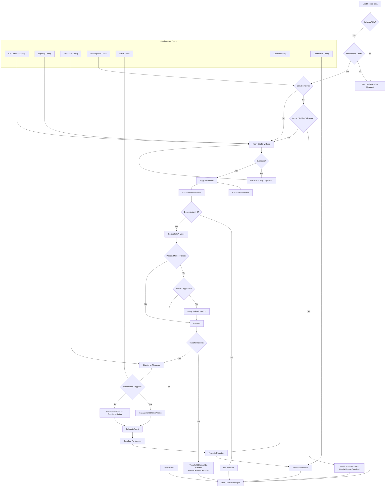

# Analytical Rules Specification

## Purpose

This document defines the implementation-ready analytical rules for the Sentinel360 Healthcare prototype KPI engine. It converts Farah's approved business rules into precise, testable processing instructions. Where a rule is configuration-driven, the structure is fixed and the parameter location is identified. No numerical thresholds, sample sizes, anomaly cut-offs or financial amounts are invented in this document.

---

## 2. Attendance-Status Classification Matrix

The following matrix defines how each source attendance status is treated for Staffing Level and Absenteeism calculations.

| Source Status | Staffing Availability Treatment | Absenteeism Treatment | Department Attribution | Requires Actual Hours | Configuration Required | Notes |
|---|---|---|---|---|---|---|
| Present | Count verified actual hours | Not absent | Scheduled department | Yes | No | Standard operational availability |
| Partial | Count verified actual hours worked | Absent for lost scheduled hours only if absence classification is eligible | Scheduled department | Yes | No | Partial-attendance weighting approved; contribution = actual / scheduled, capped at 1.0 |
| Reassigned | Count verified actual hours in destination department only | Not absent | Destination department (not original) | Yes | No | Remove contribution from original department for reassigned period |
| Late | Count verified actual hours after arrival | Not absent | Scheduled department | Yes | No | Count only actual verified working time after arrival |
| Leave | Do not count as available | Not absent (planned) | Scheduled department | No | No | Planned absence; show separately where useful |
| Absent | Do not count as available | Absent (if unplanned classification) | Scheduled department | No | No | Standard unplanned absence |
| Not Scheduled | Exclude entirely | Exclude entirely | N/A | No | No | Not in numerator or denominator |
| Training | Do not count as available unless on-the-job service-contributing | Not absent | Scheduled department | Yes | Yes — training classification | Off-the-job = unavailable staffing; on-the-job service-contributing may be configurable |
| Sick Leave | Do not count as available | Absent (unplanned) | Scheduled department | No | No | Unplanned operational absenteeism |
| Emergency Leave | Do not count as available | Absent (unplanned, pending stakeholder validation) | Scheduled department | No | Yes — pending B2 validation | Default counts as absent; hospital HR policy may override |
| Annual Leave | Do not count as available | Not absent (planned) | Scheduled department | No | No | Planned absence; excluded from absenteeism numerator |
| Unauthorised | Do not count as available | Absent (unplanned) | Scheduled department | No | No | Unplanned absenteeism; may trigger governance flag |
| Replacement | Count as available in working department | Not absent | Working department | Yes | No | Replacement coverage does not reduce absenteeism rate |
| **Missing / Unknown** | **Do not count as available** | **Do not count as absent** | **Unknown** | **No** | **Yes — completeness tolerance** | **Missing is not Present. Missing is not Absent. Missing remains Unknown until verified.** |

### Missing Attendance Rule

- Missing attendance status must remain `Unknown` or `Missing`.
- Do not impute `Present`.
- Do not impute `Absent`.
- Calculate data completeness percentage.
- Exclude unverified records from confirmed actual-hour totals.
- Lower confidence.
- Return `Data Quality Review Required` or `Insufficient Data` when the approved completeness tolerance is exceeded.
- The completeness tolerance remains configurable.

---

## 3. Absence-Category Classification Matrix

| Absence Category | Operational Absenteeism | Planned Absence | Governance Flag | Configuration Required | Notes |
|---|---|---|---|---|---|
| Sick Leave | Yes | No | No | No | Unplanned operational absenteeism |
| Emergency Leave | Yes (default) | No | No | Yes — pending B2 validation | Default counts as absent; subject to hospital HR policy alignment |
| Annual Leave | No | Yes | No | No | Planned; excluded from absenteeism numerator |
| Training (off-the-job) | No | No | No | No | Unavailable staffing but not absenteeism |
| Training (on-the-job service-contributing) | No | No | No | Yes — training classification | May be treated as available per hospital configuration |
| Unauthorised Absence | Yes | No | Yes | No | Unplanned; may trigger governance flag |
| Other Approved Absence | Per configuration | Per configuration | No | Yes | Hospital-specific policy |

---

## 4. Staffing Calculation Rules

### Official Method

Use staff-hour calculation as the official method.

```
Staffing Level (%) = (Sum of eligible actual available staff hours / Sum of approved required staff hours) * 100
```

### Eligible Actual Hours

Sum verified actual hours for records with status:
- Present
- Partial (actual hours worked)
- Reassigned (in destination department only)
- Late (actual hours after arrival)
- Replacement (in working department)

### Exclusions from Numerator

- Leave
- Absent
- Not Scheduled
- Training (unless configured as on-the-job service-contributing)
- Missing / Unknown

### Denominator

Sum approved required staff hours from `staffing_requirement` for the matched hospital, department, date, shift and staff role.

### Partial Attendance

```
Partial contribution = verified_actual_hours / approved_scheduled_hours
Cap partial contribution at 1.0 unless approved overtime rule applies.
```

### Reassigned Staff

1. Identify reassignment record.
2. Exclude from original department numerator for reassigned period.
3. Include in destination department numerator for reassigned period.
4. Retain reassignment traceability in output.

### Replacement Staff

1. Include replacement staff actual hours in working department numerator.
2. Do not adjust absenteeism numerator for replacement coverage.
3. Display replacement coverage separately.

### Staff-Count Fallback (Configurable Placeholder)

Permitted only when:
- Staff-hour data are unavailable.
- Headcount data are sufficiently complete (completeness threshold configurable).
- Fallback is explicitly enabled in configuration.

Label output: `Calculation method: Headcount fallback`.
Reduce confidence.
Do not silently mix hour-based and count-based results.

### Zero Required Hours

If required hours equal zero for all records, return `Not Available`.
Do not divide by zero.

---

## 5. Absenteeism Rules

### Official Formula

```
Staff Absenteeism Rate (%) = (Sum of scheduled hours classified as absence / Sum of eligible scheduled hours) * 100
```

### Absenteeism Numerator

Sum scheduled hours where attendance status is classified as operational absenteeism:
- Sick Leave
- Emergency Leave (default; pending stakeholder validation)
- Unauthorised Absence
- Other approved absence categories (per configuration)

### Absenteeism Denominator

Sum eligible scheduled hours from `staff_roster`.
Exclude cancelled shifts.

### Exclusions from Numerator

- Annual Leave (planned)
- Training (off-the-job or on-the-job service-contributing)
- Not Scheduled
- Reassigned
- Replacement
- Missing / Unknown

### Partial Absence

```
Lost scheduled hours = scheduled_hours - verified_actual_hours_worked
```

Include lost scheduled hours in the absenteeism numerator when the absence classification is eligible (e.g., Sick Leave, Unauthorised).

### Missing Attendance for Scheduled Shift

- Do not impute Present.
- Do not impute Absent.
- Flag record status as `Pending Review`.
- Calculate completeness.
- Reduce confidence.
- Apply configurable blocking tolerance.

### Replacement Coverage

Replacement staffing must not reduce the absenteeism KPI.
Display replacement coverage separately.

---

## 6. Bed-Occupancy Rules

### Official Denominator

Use operational beds as the official denominator.

Operational beds = beds physically available and staffed for patient care during the measurement period.

Do not use licensed beds as the default denominator.

### Official Formula

```
Bed Occupancy Rate (%) = (Sum of occupied bed-time / Sum of operational bed-time) * 100
```

### Temporarily Closed Beds

- Remove closed beds from operational-bed capacity for the affected period.
- Retain closure reason and duration.
- Do not retrospectively rewrite previous reporting periods.

### Reserved Beds

- Store reserved beds separately.
- Do not automatically classify all reserved beds as occupied.
- Hospital-specific configuration may define when a reserved bed is operationally committed.

### Occupied Beds Above Operational Beds

- Do not cap the calculated occupancy rate at 100%.
- Preserve the actual calculated ratio.
- Example: occupied = 108, operational = 100, rate = 108%.
- Calculate and display: overcapacity flag; beds above operational capacity; percentage points above operational capacity.

### Measurement Approach (Configurable Placeholder)

- Preferred future method: bed-time interval calculation.
- Prototype fallback: approved daily snapshot.
- The method used must be visible in output metadata.

### Missing Periods (Configurable Placeholder)

- Calculate using available valid intervals or days only when approved completeness tolerance is met.
- Display: available periods; expected periods; completeness percentage; confidence.
- Return `Insufficient Data` when completeness is below approved minimum.
- Do not invent the minimum percentage.

---

## 7. Waiting-Time Eligibility Rules

### Primary Service Stage

- Prototype primary KPI: arrival to consultation.
- Secondary contextual stages (shown as separate diagnostic metrics): arrival to triage; triage to consultation; registration to consultation; other approved stage-specific waits.
- Never combine different queue stages into one unclear average.

### Eligibility Criteria

- `arrival_datetime` and `service_start_datetime` must be valid timestamps.
- `service_start_datetime` must not be earlier than `arrival_datetime`.
- Encounter status must not be `Cancelled`.
- Queue record date must fall within the reporting period.

### Exclusions

- **Left Without Being Seen (LWBS):** Exclude from Average Patient Waiting Time KPI. No completed service-start timestamp exists. Calculate and display a separate LWBS indicator where data permit. Do not treat LWBS waiting time as zero.
- **Cancelled encounters:** Exclude. Do not assign zero waiting time.
- **Transferred patients:** Use approved originating-department service-stage logic only when valid timestamps exist. Do not invent a transfer-decision timestamp.
- **Extreme waiting times:** Flag for review. Do not automatically remove. Exclude only when confirmed invalid, with an audit reason. Review boundary remains configurable.

### Queue-Summary Fallback

Use weighted queue-summary data only when encounter-level timestamps are unavailable.

```
Weighted Average = Sum(average_wait_minutes * served_count) / Sum(served_count)
```

Label clearly: `Derived from queue-summary data`.
Reduce precision or confidence accordingly.

### Multiple Stages

- One official primary KPI stage.
- Additional stages shown as separate diagnostic metrics.

---

## 8. Complaint Eligibility Rules

### Numerator Inclusion

Count valid complaint records in the numerator regardless of resolution status (open, under review, resolved, closed).

### Period Attribution

Assign complaints to the reporting period using the complaint received date.
Do not use resolution date as the primary KPI attribution date.

### Exclusions from Numerator

- **Duplicate complaints:** Exclude confirmed duplicates. Retain duplicate records and resolution decisions in the audit trail. Duplicate-identification criteria remain configurable.
- **Rejected or invalid complaints:** Exclude only when formally classified as rejected, invalid, test or duplicate under an approved rule. Retain in audit records.
- **Test records:** Exclude.

### Social-Media Complaints

Two-stage approach:

1. **Unverified social-media signal:** Separate contextual signal, not part of the formal complaint-rate KPI.
2. **Validated and formally registered complaint:** Include in the formal complaint KPI using the complaint received or registration date, according to approved policy.

### Complaint Without Encounter Link

Allow inclusion when:
- The complaint is validated as hospital-related.
- Hospital and reporting period are known.
- Department is assigned or marked unknown.

Flag as unlinked.
Do not require encounter linkage for non-clinical service complaints.

---

## 9. Satisfaction Eligibility and Normalisation

### Normalisation Formula

For each valid response:

```
normalised_score = ((raw_score - scale_min) / (scale_max - scale_min)) * 100
```

Requirements:
- `scale_max > scale_min`
- `raw_score >= scale_min` and `raw_score <= scale_max`

### Aggregation

```
Weighted Patient Satisfaction Score (%) = Sum(normalised_score * response_weight) / Sum(response_weight)
```

Where equal weight applies, `response_weight = 1`.

### Response Weighting

- Use equal response weight by default.
- Retain data-model support for configurable response weights.
- Do not activate unequal weights unless formally approved.

### Eligibility Criteria

- Response status = `Valid`.
- Scale minimum and maximum available.
- Score falls within declared scale.
- Response weight > 0.

### Exclusions

- **Incomplete responses:** Do not hardcode a 50% completion rule. Store completion percentage. Include or exclude according to approved survey configuration.
- **Duplicate responses:** Do not automatically keep the latest. Use approved duplicate rule based on survey wave, encounter, anonymised respondent, submission timestamps and survey policy. Flag duplicates for review when uncertain.

### Low Response Volume

- Continue to show the calculated score when valid responses exist.
- Display: response count; response rate where denominator available; confidence level; low-volume warning.
- Do not invent a minimum response count.
- Show with `Low Confidence` label rather than suppressing.

---

## 10. Current-Status Rules

### Current KPI Status

Current status is based on:
- Current valid KPI value.
- Approved threshold.
- Effective configuration.
- Data eligibility.

### Approved Status Options

- Normal
- Watch
- Warning
- Critical
- Not Available
- Insufficient Data
- Data Quality Review Required

### Status Derivation

1. Evaluate data quality → may return `Data Quality Review Required`.
2. Evaluate input availability → may return `Not Available`.
3. Evaluate minimum data volume → may return `Insufficient Data`.
4. Load approved effective threshold.
5. If no approved threshold → status = `Not Available`; manual review required.
6. If threshold exists → classify numerical status based on performance direction.

---

## 11. Watch-Status Rules

Watch may apply when the current value is not yet in Warning or Critical but an approved rule detects emerging risk.

### Permitted Prototype Watch Rule Families

1. **Approaching warning boundary:** Value is within an approved tolerance of the warning boundary, moving in the adverse direction.
2. **Persistent adverse trend:** KPI has moved adversely for an approved number of consecutive periods.
3. **Unusual volatility:** Value has oscillated across an approved magnitude for an approved number of periods (only where the statistical method is valid).
4. **Low-confidence value close to boundary:** Value is near a boundary and data confidence is Low.

### Watch Requirements

- All Watch rules must be configuration-driven.
- All Watch rules must be traceable to a specific rule identifier.
- Watch must not be created from an invented numerical threshold.
- Watch thresholds, margins and period counts remain configurable.

---

## 12. Forecast-Risk Separation

- Forecast risk must be shown separately from current KPI status.
- Use labels such as: `7-Day Forecast Risk`, `30-Day Outlook`.
- Never change the current KPI status solely because of a forecast.
- Forecast status is contextual information, not an operational-status override.

---

## 13. Connected-Risk Separation

- Connected-domain risk must be displayed separately as contextual or systemic pressure.
- It must not overwrite the official individual KPI status.
- Connected risk may be used to elevate a KPI to Watch status through approved Watch rules, but it must not directly assign Warning or Critical.

---

## 14. Trend and Persistence Rules

### Trend Categories

- Improving
- Stable
- Worsening
- Volatile
- Not Available

### Performance-Direction Interpretation

**Higher Is Better (Staffing Level, Patient Satisfaction Score):**
- Upward movement → may be Improving.
- Downward movement → may be Worsening.

**Lower Is Better (Absenteeism, Bed Occupancy, Waiting Time, Complaint Rate):**
- Upward movement → may be Worsening.
- Downward movement → may be Improving.

Do not classify trend from numerical direction alone.

### Trend Method (Configurable Placeholder)

- Support previous-period comparison.
- Support rolling multi-period trend.
- Use rolling trend as preferred management interpretation when sufficient history exists.
- Do not hardcode window length.

### Stable Dead Band (Configurable Placeholder)

- Use KPI-specific tolerance.
- Do not invent tolerance values.
- Tolerance remains configurable.

### Streaks

Track:
- `consecutive_warning_periods`
- `consecutive_critical_periods`
- `consecutive_breach_periods` (Warning or Critical)
- `deterioration_streak`
- `improvement_streak`

The period unit must match the KPI reporting frequency.

---

## 15. Anomaly Rules

### Default Method (Approved with Conditions)

Use modified z-score based on Median Absolute Deviation (MAD) when:
- Sufficient history exists.
- Data variation exists.
- MAD is valid (not zero or near-zero).

### Fallback (Approved with Conditions)

Use Interquartile Range (IQR) only when:
- Sufficient data still exist.
- MAD is unsuitable.
- The configured fallback is enabled.

### Insufficient History (Approved with Modification)

Do not force an anomaly result from very short history.

Return `Not Available` when:
- Historical data are insufficient.
- Variation is zero.
- Required history quality is not met.

Minimum history remains configurable.

### Statistical Parameters (Configurable Placeholder)

Do not approve final modified-z or IQR thresholds in this step.
All statistical parameters remain configuration-driven.

### Anomaly Status Separation

- Anomaly remains a separate statistical flag.
- It must not automatically become Warning or Critical.
- Both threshold status and anomaly flag must be stored separately in the KPI output.

---

## 16. Data-Confidence Rules

### Framework

Use an explainable rule-based framework:
- High
- Medium
- Low
- Not Available

Do not use an opaque weighted score as the first prototype implementation.

### Factors

Consider:
1. Required source availability.
2. Schema validity.
3. Required-field completeness.
4. Denominator availability.
5. Eligible-record volume.
6. Unresolved duplicates.
7. Referential-integrity failures.
8. Historical sufficiency.
9. Late-arriving data.
10. Survey-response volume.
11. Forecast confidence.
12. Scenario-assumption confidence.

### Numerical Cut-Offs (Configurable Placeholder)

Do not hardcode suggested percentages or period counts as approved truth.
Store all tolerances in configuration.

### Confidence Explanations

Every confidence result must identify the factor or factors that caused the classification.

---

## 17. Missing-Data Rules

### General Missing-Data Treatment

| Scenario | Action | Status Returned |
|---|---|---|
| Required source dataset entirely missing | Block calculation | Not Available |
| Critical schema violation | Block calculation | Data Quality Review Required |
| Master-data misalignment (widespread) | Block calculation | Data Quality Review Required |
| Unresolvable duplicates | Block calculation | Data Quality Review Required |
| Missing attendance records | Exclude unverified; calculate completeness; lower confidence | Data Quality Review Required or Insufficient Data if tolerance exceeded |
| Missing denominator | Block calculation | Not Available |
| Insufficient eligible records | Block calculation | Insufficient Data |
| Minor data gap (< approved tolerance) | Allow calculation with disclosure | Normal / Watch / Warning / Critical (with reduced confidence) |
| Missing threshold | Show KPI value; withhold status | Not Available (threshold status); Manual Review Required |

### Staffing Level Missing Data

- Missing staffing requirement → `Not Available`.
- Incomplete attendance → calculate only when completeness meets approved minimum; otherwise `Data Quality Review Required`.
- Do not assume missing attendance means absence or presence.

### Absenteeism Missing Data

- Missing roster data → `Not Available`.
- Missing attendance for scheduled shift → flag `Pending Review`; do not assume absence.

### Bed Occupancy Missing Data

- Missing operational bed capacity → `Not Available`.
- Do not substitute licensed beds without approved fallback rule.
- Incomplete intervals → reduce confidence or trigger `Data Quality Review Required`.

### Waiting Time Missing Data

- Missing arrival or service-start timestamps → exclude record.
- Eligible encounter count below approved minimum → `Insufficient Data`.
- Disclose proportion of excluded encounters.

### Complaint Rate Missing Data

- Missing encounter volume → `Not Available`.
- Do not replace encounter denominator with survey responses.
- Disclose unresolved duplicate or rejected complaint records.

### Satisfaction Missing Data

- No valid eligible response → `Insufficient Data`.
- Valid response count below approved minimum → `Low Confidence`.
- Do not infer missing responses.
- Disclose survey-response volume alongside KPI.

---

## 18. Fallback Rules

| KPI | Fallback Method | Approval Required | Labelling | Confidence Impact |
|---|---|---|---|---|
| Staffing Level | Staff-count fallback (actual count / required count) | Explicitly enabled in configuration | "Calculation method: Headcount fallback" | Reduced |
| Bed Occupancy | Daily snapshot (if interval data unavailable) | Explicitly approved | Method visible in output metadata | Reduced or disclosed |
| Waiting Time | Weighted queue-summary average | Only when encounter-level unavailable | "Derived from queue-summary data" | Reduced precision |

### Fallback Principles

- Fallback is permitted only when the primary method cannot be applied.
- Fallback must be explicitly enabled or approved.
- Fallback must be clearly labelled in output.
- Fallback must reduce confidence or precision.
- Do not silently mix primary and fallback results without disclosure.

---

## 19. Audit Requirements

Every analytical rule application must be auditable:

| Audit Element | Requirement |
|---|---|
| Rule identifier | The specific rule or configuration record applied. |
| Source data reference | Source upload identifier and processing run identifier. |
| Eligibility counts | Count of eligible and excluded records. |
| Completeness percentage | Proportion of expected data that was available. |
| Fallback indicator | Whether a fallback method was used and which one. |
| Threshold reference | Threshold identifier, version and effective date. |
| Status reason | Structured explanation of why the status was assigned. |
| Confidence factors | Which factors influenced the confidence classification. |
| Timestamp | When the calculation was performed. |
| Calculation version | Version of the calculation logic used. |
| Modification log | Any changes to approved rules with old value, new value, reason, user and timestamp. |

---

## 20. Rules Pending Configuration

The following rules are approved in principle but require configuration values before activation:

| Rule Area | Pending Configuration | Location |
|---|---|---|
| Staff-count fallback | Completeness threshold for fallback eligibility | `kpi_definition_config` or dedicated fallback config |
| Missing attendance tolerance | Completeness tolerance for blocking calculation | `kpi_threshold_config` or data-quality config |
| Bed occupancy measurement | Preferred method (interval vs snapshot) | `kpi_definition_config` |
| Bed occupancy missing periods | Completeness minimum percentage | `kpi_threshold_config` |
| Survey incomplete responses | Completion inclusion threshold | `kpi_definition_config` or survey config |
| Survey low response volume | Minimum response count threshold | `kpi_threshold_config` |
| Trend window | Rolling window length | `kpi_definition_config` or trend config |
| Stable dead band | KPI-specific tolerance value | `kpi_threshold_config` |
| Anomaly minimum history | Minimum history record count | `anomaly_detection_config` |
| Anomaly statistical parameters | Modified-z and IQR thresholds | `anomaly_detection_config` |
| Data confidence cut-offs | Completeness, volume and quality tolerances | `kpi_threshold_config` or confidence config |
| Watch rule parameters | Margins, period counts, tolerances | `kpi_threshold_config` or watch-rule config |
| Boundary inclusivity | `>`, `>=`, `<`, `<=` per boundary | `kpi_threshold_config` |

---

## 21. Rules Pending Stakeholder Validation

The following rules require validation by identified stakeholders before final implementation:

| Rule ID | Rule Area | Stakeholder | Impact if Not Validated |
|---|---|---|---|
| B2 | Emergency Leave classification | HR / Hospital Management | Absenteeism numerator may misclassify planned emergency leave |
| C3 | Reserved beds classification | Operations / Bed Management | Occupancy denominator may include or exclude reserved beds inconsistently |
| D1 | Primary service stage | Clinical / Operations Lead | Official waiting-time KPI may not reflect the clinically relevant stage |
| D4 | Transferred patients | Clinical / Operations Lead | Department-level waiting time may be misattributed |
| E4 | Duplicate complaint criteria | Patient Experience Lead | Complaint numerator may overcount or undercount duplicates |
| K2 | Threshold approvers | Hospital Executive | Governance structure may not align with hospital authority matrix |

---

## 22. Analytical Pseudocode

The following pseudocode describes the conceptual end-to-end analytical processing flow. It is not executable code.

```
function process_kpi_calculation(kpi_code, hospital_id, department_id, period_start, period_end):

    # Step 1: Load and validate source data
    source_data = load_source_datasets(kpi_code, hospital_id, period_start, period_end)
    validation_result = validate_schema_and_relationships(source_data)

    if validation_result.has_critical_failures:
        return build_blocked_output(
            status = "Data Quality Review Required",
            reason = validation_result.critical_failures,
            confidence = "Not Available"
        )

    # Step 2: Calculate completeness
    completeness = calculate_data_completeness(source_data, kpi_code)
    if completeness.below_blocking_tolerance:
        return build_blocked_output(
            status = "Data Quality Review Required" or "Insufficient Data",
            reason = completeness.shortfall,
            confidence = "Low"
        )

    # Step 3: Apply eligibility and exclusions
    eligible_records = apply_eligibility_rules(source_data, kpi_code)
    eligible_records = remove_duplicates(eligible_records, kpi_code)
    eligible_records = apply_exclusions(eligible_records, kpi_code)

    # Step 4: Calculate numerator and denominator
    numerator = calculate_numerator(eligible_records, kpi_code)
    denominator = calculate_denominator(eligible_records, kpi_code)

    if denominator == 0 or denominator is null:
        return build_blocked_output(
            status = "Not Available",
            reason = "Denominator is zero or unavailable",
            confidence = "Not Available"
        )

    # Step 5: Calculate KPI value
    kpi_value = apply_formula(numerator, denominator, kpi_code)

    # Step 6: Apply fallback if needed and approved
    fallback_used = false
    if primary_method_failed and fallback_approved(kpi_code):
        kpi_value = apply_fallback(eligible_records, kpi_code)
        fallback_used = true

    # Step 7: Load threshold
    threshold = load_effective_threshold(kpi_code, hospital_id, department_id, period_end)

    if threshold is null:
        threshold_status = "Not Available"
        manual_review = true
        numerical_status = null
    else:
        numerical_status = classify_by_threshold(kpi_value, threshold, kpi_code)
        threshold_status = numerical_status
        manual_review = false

    # Step 8: Evaluate Watch rules
    watch_reason = evaluate_watch_rules(kpi_value, kpi_code, threshold, eligible_records)
    if watch_reason is not null and severity(numerical_status) < severity("Watch"):
        management_status = "Watch"
        status_reason = watch_reason
    else:
        management_status = numerical_status
        status_reason = build_status_reason(numerical_status, threshold)

    # Step 9: Calculate trend and persistence
    trend = calculate_trend_direction(kpi_code, hospital_id, department_id, kpi_value)
    persistence = calculate_persistence(kpi_code, hospital_id, department_id, numerical_status)

    # Step 10: Anomaly detection
    anomaly = detect_anomaly(kpi_code, hospital_id, department_id, kpi_value)

    # Step 11: Confidence assessment
    confidence = assess_data_confidence(source_data, eligible_records, completeness, kpi_code)
    confidence_factors = identify_confidence_factors(source_data, eligible_records, kpi_code)

    # Step 12: Build traceable output
    return build_kpi_observation(
        kpi_code = kpi_code,
        hospital_id = hospital_id,
        department_id = department_id,
        period_start = period_start,
        period_end = period_end,
        numerator = numerator,
        denominator = denominator,
        kpi_value = kpi_value,
        fallback_used = fallback_used,
        eligible_count = count(eligible_records),
        excluded_count = count(source_data) - count(eligible_records),
        completeness = completeness,
        threshold_status = threshold_status,
        management_status = management_status,
        status_reason = status_reason,
        trend = trend,
        persistence = persistence,
        anomaly = anomaly,
        confidence = confidence,
        confidence_factors = confidence_factors,
        manual_review = manual_review,
        threshold_version = threshold.version if threshold else null,
        calculation_version = current_calculation_version
    )
```

---

## 23. Mermaid Decision-Flow Diagram



### Diagram Description

The diagram shows the complete analytical decision flow from source data loading to traceable output generation. Key decision points include:

- **Schema and master-data validation:** Blocks calculation on critical failures.
- **Completeness assessment:** Returns `Insufficient Data` or `Data Quality Review Required` when below blocking tolerance.
- **Eligibility and exclusions:** Apply approved rules, resolve duplicates.
- **Denominator check:** Returns `Not Available` if denominator is zero or missing.
- **Fallback handling:** Apply fallback only if explicitly approved.
- **Threshold classification:** Returns `Not Available` with manual review if no approved threshold exists.
- **Watch evaluation:** May elevate status to Watch based on approved rules.
- **Trend, persistence, anomaly and confidence:** Attach contextual information.
- **Traceable output:** All paths converge to a fully documented KPI observation.

Configuration feeds supply rules for eligibility, thresholds, missing data, Watch rules, anomaly detection and confidence assessment.

---

## Document Control

| Property | Value |
|---|---|
| Document Version | 1.0 |
| Phase | Phase 1, Step 1G |
| Status | Approved Prototype Rules |
| Next Review | Phase 1, Step 1H or implementation review |
