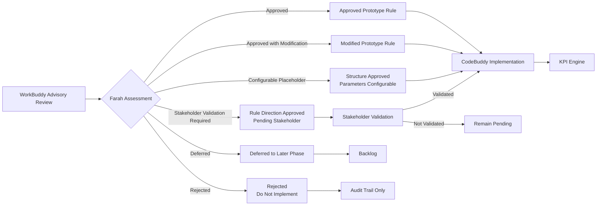

# Business Rules Approval Register

## Purpose

This document records Farah's official approved prototype business rules for Sentinel360 Healthcare. It converts the WorkBuddy advisory review into binding decisions for Phase 1 implementation. Where the WorkBuddy review conflicts with the approved product scope, this register documents the override and the rationale.

Every rule is assigned one of the following decision categories:

| Category | Meaning |
|---|---|
| Approved | Rule is approved for prototype implementation as stated. |
| Approved with Modification | Rule is approved with the documented changes. |
| Configurable Placeholder | Rule structure is approved, but numerical values or exact parameters remain configuration-driven and are not approved in this step. |
| Stakeholder Validation Required | Rule direction is approved, but final parameters or policy alignment require validation by the identified stakeholder. |
| Deferred | Rule is not required for the prototype and is deferred to a later phase. |
| Rejected | Rule or recommendation is rejected and must not be implemented. |

---

## Decision Authority

- **Product and Analytical Governance:** Farah
- **Advisory Review:** WorkBuddy (advisory only; not binding)
- **Implementation:** CodeBuddy
- **Visual Communication:** Miora
- **Final Business Authority:** Human hospital management

WorkBuddy recommendations are reviewed, challenged and either approved, modified or rejected by Farah. CodeBuddy implements only rules documented in this register.

### Decision-Authority Flow

---

## Summary of Approved Rules

| Rule Area | Approved | Approved with Modification | Configurable Placeholder | Stakeholder Validation Required | Rejected | Deferred |
|---|---|---|---|---|---|---|
| Staffing Level (A) | 3 | 1 | 1 | 0 | 1 | 0 |
| Absenteeism (B) | 6 | 1 | 0 | 1 | 0 | 0 |
| Bed Occupancy (C) | 2 | 1 | 2 | 1 | 0 | 0 |
| Waiting Time (D) | 4 | 0 | 0 | 2 | 0 | 0 |
| Complaint Rate (E) | 6 | 1 | 0 | 0 | 0 | 0 |
| Patient Satisfaction (F) | 2 | 2 | 2 | 0 | 0 | 0 |
| Status / Watch / Risk (G) | 4 | 2 | 0 | 0 | 0 | 0 |
| Trend and Persistence (H) | 3 | 0 | 2 | 0 | 0 | 0 |
| Anomaly Detection (I) | 0 | 2 | 1 | 0 | 0 | 0 |
| Data Confidence (J) | 2 | 0 | 1 | 0 | 0 | 0 |
| Threshold Governance (K) | 4 | 1 | 0 | 1 | 0 | 0 |
| Product Scope (L) | 5 | 0 | 0 | 0 | 0 | 0 |

---

## Detailed Rule Register

### A. Staffing Level

| Rule ID | Rule Area | WorkBuddy Recommendation | Farah Decision | Decision Status | Approved Prototype Rule | Configuration Level | Stakeholder Validation Required | Approval Owner | Development Priority | Implementation Notes |
|---|---|---|---|---|---|---|---|---|---|---|
| A1 | Available staffing statuses | Potentially count all recorded attendance as available unless explicitly marked absent | Approved with Modification | Approved with Modification | Count operational availability using actual verified working time. Potentially eligible: Present, Partial, Reassigned, Late. Present = verified actual hours; Partial = verified actual hours worked; Reassigned = count only in destination department; Late = count only actual verified hours after arrival; Leave = do not count; Absent = do not count; Not Scheduled = exclude; Training = do not count unless on-the-job service-contributing. | Hospital-specific mapping configurable | No | Farah | High | Source-system attendance mapping remains hospital-specific |
| A2 | Partial attendance | Not explicitly defined | Approved | Approved | Availability contribution = verified actual hours worked / approved scheduled hours. Cap at 1.0 unless approved overtime rule applies separately. | Partial weighting formula fixed; cap configurable | No | Farah | High | Do not use arbitrary half-day assumptions |
| A3 | Reassigned staff | Not explicitly defined | Approved | Approved | Count reassigned staff only in the department where work was actually performed. Remove contribution from original department for the reassigned period. Prevent double counting. Retain reassignment traceability. | Department attribution fixed | No | Farah | High | Traceability field required in output |
| A4 | Replacement staff | Not explicitly defined | Approved | Approved | Count replacement staff as available in the department where they actually work. Replacement coverage does not reduce underlying absenteeism rate. Staffing availability and absenteeism remain separate measures. | Replacement flag configurable | No | Farah | High | Display replacement coverage separately |
| A5 | Staff-count fallback | Use headcount when hours unavailable | Configurable Placeholder | Configurable Placeholder | Staff-hour calculation is official method. Permit staff-count fallback only when: staff-hour data unavailable; headcount data sufficiently complete; fallback explicitly enabled in configuration. Label output: "Calculation method: Headcount fallback". Reduce confidence. Do not silently mix hour-based and count-based results. | Fallback enablement configurable; completeness threshold configurable | No | Farah | Medium | Clear labelling and confidence reduction required |
| A6 | Missing attendance records | Assume missing means Present or Absent | Rejected | Rejected | Do not assume missing attendance means Present or Absent. Missing attendance status must remain Unknown or Missing. Calculate completeness; exclude unverified records from confirmed actual-hour totals; lower confidence; return Data Quality Review Required or Insufficient Data when approved tolerance is exceeded. Tolerance remains configurable. | Completeness tolerance configurable | No | Farah | High | This overrides WorkBuddy's recommendation |

### B. Absenteeism

| Rule ID | Rule Area | WorkBuddy Recommendation | Farah Decision | Decision Status | Approved Prototype Rule | Configuration Level | Stakeholder Validation Required | Approval Owner | Development Priority | Implementation Notes |
|---|---|---|---|---|---|---|---|---|---|---|
| B1 | Sick Leave | Count as absenteeism | Approved | Approved | Count as unplanned operational absenteeism. | Fixed classification | No | Farah | High | Standard unplanned absence |
| B2 | Emergency Leave | Count as absenteeism | Stakeholder Validation Required | Stakeholder Validation Required | Default prototype treatment: count as unplanned operational absenteeism. Final classification must align with hospital HR policy. | Classification configurable pending validation | Yes — HR / Hospital Management | Farah | Medium | Default counts as absent; hospital may override |
| B3 | Annual Leave | Count as absenteeism | Approved with Modification | Approved with Modification | Treat as planned absence. Exclude from official operational absenteeism numerator. Show separately as planned leave where useful. Annual leave may reduce available staffing, but is not an unplanned attendance failure. | Fixed classification | No | Farah | High | Separate planned leave indicator |
| B4 | Training | Count as absenteeism | Approved | Approved | Exclude from operational absenteeism. Treat off-the-job training as unavailable staffing. Allow on-the-job service-contributing training to be treated according to hospital-specific configuration. | Training classification configurable | No | Farah | Medium | Distinguish off-the-job vs on-the-job |
| B5 | Unauthorised Absence | Count as absenteeism | Approved | Approved | Count as unplanned absenteeism. Allow separate severity or governance flag. | Fixed classification | No | Farah | High | May trigger governance flag |
| B6 | Not Scheduled | Count as absenteeism | Approved | Approved | Exclude entirely from absenteeism. | Fixed classification | No | Farah | High | Not in numerator or denominator |
| B7 | Reassigned | Count as absenteeism | Approved | Approved | Exclude from absenteeism. Employee is working; department-level capacity must reflect destination department. | Fixed classification | No | Farah | High | Attribution follows actual work location |
| B8 | Partial absence | Not explicitly defined | Approved | Approved | Lost scheduled hours = scheduled hours minus verified actual hours worked. Include lost scheduled hours in absenteeism numerator when absence classification is eligible. | Fixed formula | No | Farah | High | Based on verified actual hours |
| B9 | Replacement coverage | Reduce absenteeism by replacement | Approved | Approved | Replacement staffing must not reduce the absenteeism KPI. Display replacement coverage separately. | Fixed rule | No | Farah | High | Absenteeism measures schedule failure, not coverage |
| B10 | Missing attendance | Impute Present or Absent | Approved with Modification | Approved with Modification | Do not impute Present or Absent. Use: Unknown status; completeness indicator; confidence reduction; configurable blocking tolerance. | Blocking tolerance configurable | No | Farah | High | Imputation rejected |

### C. Bed Occupancy

| Rule ID | Rule Area | WorkBuddy Recommendation | Farah Decision | Decision Status | Approved Prototype Rule | Configuration Level | Stakeholder Validation Required | Approval Owner | Development Priority | Implementation Notes |
|---|---|---|---|---|---|---|---|---|---|---|
| C1 | Denominator | Use operational beds | Approved | Approved | Use operational beds as the official denominator. Operational beds are beds physically available and staffed for patient care during the measurement period. Do not use licensed beds as the default denominator. | Fixed rule | No | Farah | High | Operational = available + staffed |
| C2 | Temporarily closed beds | Include in operational beds | Approved | Approved | Remove closed beds from operational-bed capacity for the affected period. Retain the reason and duration of closure. Do not retrospectively rewrite previous reporting periods. | Closure reason and duration retained | No | Farah | High | Period-specific adjustment |
| C3 | Reserved beds | Count as occupied | Stakeholder Validation Required | Stakeholder Validation Required | Store reserved beds separately. Do not automatically classify all reserved beds as occupied. Allow hospital-specific configuration defining when a reserved bed is considered operationally committed. | Reserved-bed classification configurable | Yes — Operations / Bed Management | Farah | Medium | Separate reserved-bed indicator |
| C4 | Occupied beds above operational beds | Cap occupancy at 100% | Approved with Modification | Approved with Modification | Do not cap the calculated occupancy rate at 100%. Preserve the actual calculated ratio. Example: occupied = 108, operational = 100, rate = 108%. Also calculate and display: overcapacity flag; beds above operational capacity; percentage points above operational capacity. | Fixed rule | No | Farah | High | This overrides WorkBuddy's cap recommendation |
| C5 | Measurement approach | Prefer daily snapshot | Configurable Placeholder | Configurable Placeholder | Preferred future method: bed-time interval calculation. Prototype fallback: approved daily snapshot. The method used must be visible in output metadata. | Method selection configurable | No | Farah | Medium | Label method in output |
| C6 | Missing periods | Interpolate or assume full capacity | Configurable Placeholder | Configurable Placeholder | Calculate using available valid intervals or days only when approved completeness tolerance is met. Display: available periods; expected periods; completeness percentage; confidence. Return Insufficient Data when completeness is below approved minimum. Do not invent the minimum percentage here. | Completeness minimum configurable | No | Farah | Medium | Interpolation rejected |

### D. Waiting Time

| Rule ID | Rule Area | WorkBuddy Recommendation | Farah Decision | Decision Status | Approved Prototype Rule | Configuration Level | Stakeholder Validation Required | Approval Owner | Development Priority | Implementation Notes |
|---|---|---|---|---|---|---|---|---|---|---|
| D1 | Primary service stage | Use first queue stage encountered | Approved with Stakeholder Validation Required | Approved with Stakeholder Validation Required | Prototype primary KPI: arrival to consultation. Secondary contextual stages may include: arrival to triage; triage to consultation; registration to consultation; other approved stage-specific waits. Never combine different queue stages into one unclear average. | Primary stage configurable pending validation | Yes — Clinical / Operations Lead | Farah | High | Arrival-to-consultation as default primary |
| D2 | Left Without Being Seen | Include as zero waiting time | Approved | Approved | Exclude from the Average Patient Waiting Time KPI because no completed service-start timestamp exists. Calculate and display a separate LWBS indicator where data permit. Do not treat LWBS waiting time as zero. | Fixed rule | No | Farah | High | LWBS is a separate metric |
| D3 | Cancelled encounters | Include as zero waiting time | Approved | Approved | Exclude from the waiting-time KPI. Do not assign zero waiting time. | Fixed rule | No | Farah | High | Excluded entirely |
| D4 | Transferred patients | Use transfer timestamp | Stakeholder Validation Required | Stakeholder Validation Required | Use the approved originating-department service-stage logic only when valid timestamps exist. Do not invent a transfer-decision timestamp. | Transfer attribution configurable pending validation | Yes — Clinical / Operations Lead | Farah | Medium | No invented timestamps |
| D5 | Extreme waiting times | Auto-remove outliers | Approved | Approved | Flag extreme values for review. Do not automatically remove them. Exclude only when confirmed invalid, with an audit reason. The review boundary remains configurable. | Outlier boundary configurable | No | Farah | High | Review before exclusion |
| D6 | Queue-summary fallback | Not supported | Approved | Approved | Use weighted queue-summary data only when encounter-level timestamps are unavailable. Label clearly: "Derived from queue-summary data". Reduce precision or confidence accordingly. | Fixed fallback rule | No | Farah | Medium | Weighted average only |
| D7 | Multiple stages | Combine all stages | Approved | Approved | One official primary KPI stage. Additional stages shown as separate diagnostic metrics. | Fixed rule | No | Farah | High | Primary stage must be unambiguous |

### E. Complaint Rate

| Rule ID | Rule Area | WorkBuddy Recommendation | Farah Decision | Decision Status | Approved Prototype Rule | Configuration Level | Stakeholder Validation Required | Approval Owner | Development Priority | Implementation Notes |
|---|---|---|---|---|---|---|---|---|---|---|
| E1 | Open and unresolved complaints | Exclude until resolved | Approved | Approved | Count valid complaints in the numerator regardless of whether they are open, under review, resolved or closed. | Fixed rule | No | Farah | High | Resolution status does not affect numerator |
| E2 | Reporting period | Use resolution date | Approved | Approved | Assign complaints to the period using complaint received date. Do not use resolution date as the primary KPI attribution date. | Fixed rule | No | Farah | High | Received date governs period |
| E3 | Resolved complaints | Exclude from numerator | Approved | Approved | A resolved complaint remains counted in the period it was received. | Fixed rule | No | Farah | High | Received-period retention |
| E4 | Duplicate complaints | Include all | Approved | Approved | Exclude confirmed duplicates from the KPI numerator. Retain duplicate records and resolution decisions in the audit trail. Duplicate-identification criteria remain configurable and require stakeholder validation. | Duplicate criteria configurable | Yes — Patient Experience Lead | Farah | High | Audit trail retains duplicates |
| E5 | Rejected or invalid complaints | Include all | Approved | Approved | Exclude only when formally classified as rejected, invalid, test or duplicate under an approved rule. Retain them in audit records. | Fixed rule | No | Farah | High | Audit trail retains exclusions |
| E6 | Social-media complaints | Exclude all | Approved with Modification | Approved with Modification | Do not automatically exclude all social-media complaints. Use two stages: (1) Unverified social-media signal = separate contextual signal, not part of formal complaint-rate KPI; (2) Validated and formally registered complaint = include in formal complaint KPI using complaint received or registration date, according to approved policy. | Registration policy configurable | No | Farah | Medium | Two-stage validation |
| E7 | Complaint without encounter link | Exclude | Approved | Approved | Allow inclusion when: complaint is validated as hospital-related; hospital and reporting period are known; department is assigned or marked unknown. Flag as unlinked. Do not require encounter linkage for non-clinical service complaints. | Fixed rule | No | Farah | High | Non-clinical complaints may lack encounter link |

### F. Patient Satisfaction

| Rule ID | Rule Area | WorkBuddy Recommendation | Farah Decision | Decision Status | Approved Prototype Rule | Configuration Level | Stakeholder Validation Required | Approval Owner | Development Priority | Implementation Notes |
|---|---|---|---|---|---|---|---|---|---|---|
| F1 | Mixed survey scales | Normalise to common scale | Approved | Approved | Normalise valid responses to a 0–100 scale: normalised_score = ((raw_score - scale_min) / (scale_max - scale_min)) * 100 | Fixed formula | No | Farah | High | Per-response normalisation |
| F2 | Response weighting | Use equal weight only | Approved with Modification | Approved with Modification | Use equal response weight by default. Retain support for approved configurable response weights. Do not defer the data-model capability. Do not activate unequal weights unless formally approved. | Weight configuration supported; default equal | No | Farah | Medium | Model supports weights; default is equal |
| F3 | Incomplete responses | Hardcode 50% completion rule | Configurable Placeholder | Configurable Placeholder | Do not hardcode a 50% completion rule. Store completion percentage. Include or exclude according to approved survey configuration. | Completion threshold configurable | No | Farah | Medium | Completion percentage stored |
| F4 | Duplicate responses | Keep latest automatically | Approved with Modification | Approved with Modification | Do not automatically keep the latest response in every case. Use an approved duplicate rule based on: survey wave; encounter; anonymised respondent; submission timestamps; survey policy. Flag duplicates for review when uncertain. | Duplicate rule configurable | No | Farah | Medium | Review when uncertain |
| F5 | Low response volume | Suppress or hide | Configurable Placeholder | Configurable Placeholder | Continue to show the calculated score when valid responses exist. Display: response count; response rate where denominator is available; confidence level; low-volume warning. Do not invent a minimum response count. | Minimum response threshold configurable | No | Farah | Medium | Show with warning |
| F6 | Low-confidence display | Suppress result | Approved | Approved | Show the KPI with a clear Low Confidence label rather than suppressing it. | Fixed rule | No | Farah | High | Transparency over suppression |

### G. Status, Watch, Forecast and Connected Risk

| Rule ID | Rule Area | WorkBuddy Recommendation | Farah Decision | Decision Status | Approved Prototype Rule | Configuration Level | Stakeholder Validation Required | Approval Owner | Development Priority | Implementation Notes |
|---|---|---|---|---|---|---|---|---|---|---|
| G1 | Current KPI status | Use simple status | Approved | Approved | Current status is based on: current valid KPI value; approved threshold; effective configuration; data eligibility. Status options: Normal, Watch, Warning, Critical, Not Available, Insufficient Data, Data Quality Review Required. | Threshold values configurable | No | Farah | High | Configuration-driven |
| G2 | Watch status | Use broad early warning | Approved with Modification | Approved with Modification | Watch may apply when current value is not yet in Warning or Critical but an approved rule detects emerging risk. Permitted prototype Watch rule families: approaching warning boundary; persistent adverse trend; unusual volatility where method is valid; low-confidence value close to a boundary. Watch thresholds, margins and period counts remain configurable. | Watch rules configurable | No | Farah | High | Rules must be traceable |
| G3 | Forecast risk | Change current status based on forecast | Approved | Approved | Forecast risk must be shown separately from current KPI status. Use labels such as: 7-Day Forecast Risk; 30-Day Outlook. Never change the current KPI status solely because of a forecast. | Fixed separation rule | No | Farah | High | Forecast is contextual, not current status |
| G4 | Connected risk | Override individual KPI status | Approved | Approved | Connected-domain risk must be displayed separately as contextual or systemic pressure. It must not overwrite the official individual KPI status. | Fixed separation rule | No | Farah | High | Contextual overlay only |
| G5 | Anomaly flag | Auto-escalate to Warning | Approved | Approved | Anomaly remains a separate statistical flag. It must not automatically become Warning or Critical. | Fixed separation rule | No | Farah | High | Separate storage |
| G6 | Status precedence | Simple severity ranking | Approved with Corrected Ordering | Approved with Corrected Ordering | Eligibility and data-quality states must be evaluated before numerical states. Logical sequence: (1) Data Quality Review Required, (2) Not Available, (3) Insufficient Data, (4) Critical, (5) Warning, (6) Watch, (7) Normal. Do not present this sequence as a simple low-to-high severity ranking because data-quality states are not operational-performance levels. | Fixed precedence | No | Farah | High | Data quality before numerical status |

### H. Trend and Persistence

| Rule ID | Rule Area | WorkBuddy Recommendation | Farah Decision | Decision Status | Approved Prototype Rule | Configuration Level | Stakeholder Validation Required | Approval Owner | Development Priority | Implementation Notes |
|---|---|---|---|---|---|---|---|---|---|---|
| H1 | Trend categories | Use raw direction only | Approved | Approved | Use: Improving, Stable, Worsening, Volatile, Not Available. | Fixed categories | No | Farah | High | Context-aware direction |
| H2 | Performance direction | Ignore direction | Approved | Approved | Interpret direction according to each KPI. For Higher Is Better: upward movement may be favourable. For Lower Is Better: upward movement may be adverse. Do not classify trend from numerical direction alone. | Fixed rule | No | Farah | High | KPI-specific interpretation |
| H3 | Trend method | Hardcode single-period comparison | Configurable Placeholder | Configurable Placeholder | Support: previous-period comparison; rolling multi-period trend. Use rolling trend as the preferred management interpretation when sufficient history exists. Do not hardcode the window length yet. | Window length configurable | No | Farah | Medium | Rolling trend preferred |
| H4 | Stable dead band | Hardcode fixed tolerance | Configurable Placeholder | Configurable Placeholder | Use KPI-specific tolerance. Do not invent tolerance values. | Tolerance configurable per KPI | No | Farah | Medium | Per-KPI dead band |
| H5 | Streaks | Not explicitly defined | Approved | Approved | Track: consecutive warning periods; consecutive critical periods; consecutive threshold-breach periods; deterioration streak; improvement streak. The period unit must match the KPI reporting frequency. | Fixed fields | No | Farah | Medium | Period unit matches reporting frequency |

### I. Anomaly Detection

| Rule ID | Rule Area | WorkBuddy Recommendation | Farah Decision | Decision Status | Approved Prototype Rule | Configuration Level | Stakeholder Validation Required | Approval Owner | Development Priority | Implementation Notes |
|---|---|---|---|---|---|---|---|---|---|---|
| I1 | Default method | Use standard z-score | Approved with Conditions | Approved with Conditions | Use modified z-score based on Median Absolute Deviation when: sufficient history exists; data variation exists; MAD is valid. | Fixed method with conditions | No | Farah | Medium | Conditions must be met |
| I2 | Fallback | Not defined | Approved with Conditions | Approved with Conditions | Use IQR only when: sufficient data still exist; MAD is unsuitable; the configured fallback is enabled. | Fallback enablement configurable | No | Farah | Medium | Conditional fallback |
| I3 | Insufficient history | Force anomaly result | Approved with Modification | Approved with Modification | Do not force an anomaly result from very short history. Return Not Available when: historical data are insufficient; variation is zero; required history quality is not met. Minimum history remains configurable. | Minimum history configurable | No | Farah | Medium | No forced results |
| I4 | Statistical parameters | Approve fixed thresholds | Configurable Placeholder | Configurable Placeholder | Do not approve final modified-z or IQR thresholds in this step. | Thresholds configurable | No | Farah | Low | Parameters remain open |

### J. Data Confidence

| Rule ID | Rule Area | WorkBuddy Recommendation | Farah Decision | Decision Status | Approved Prototype Rule | Configuration Level | Stakeholder Validation Required | Approval Owner | Development Priority | Implementation Notes |
|---|---|---|---|---|---|---|---|---|---|---|
| J1 | Framework | Use opaque weighted score | Approved | Approved | Use an explainable rule-based framework: High, Medium, Low, Not Available. Do not use an opaque weighted score as the first prototype implementation. | Fixed framework | No | Farah | High | Explainable over opaque |
| J2 | Factors | Use simplified factor list | Approved | Approved | Consider: required source availability; schema validity; required-field completeness; denominator availability; eligible-record volume; unresolved duplicates; referential-integrity failures; historical sufficiency; late-arriving data; survey-response volume; forecast confidence; scenario-assumption confidence. | Fixed factor list | No | Farah | High | Comprehensive factor set |
| J3 | Numerical cut-offs | Hardcode suggested percentages | Configurable Placeholder | Configurable Placeholder | Do not hardcode WorkBuddy's suggested percentages or period counts as approved truth. Store all tolerances in configuration. | All tolerances configurable | No | Farah | Medium | No hardcoded cut-offs |
| J4 | Confidence explanations | Return score only | Approved | Approved | Every confidence result must identify the factor or factors that caused the classification. | Fixed rule | No | Farah | High | Factor disclosure required |

### K. Threshold Governance

| Rule ID | Rule Area | WorkBuddy Recommendation | Farah Decision | Decision Status | Approved Prototype Rule | Configuration Level | Stakeholder Validation Required | Approval Owner | Development Priority | Implementation Notes |
|---|---|---|---|---|---|---|---|---|---|---|
| K1 | Threshold scope | Global only | Approved | Approved | Support: Global, Hospital, Department. Precedence: Department → Hospital → Global. | Fixed hierarchy | No | Farah | High | Three-level support |
| K2 | Threshold approvers | Single approver | Stakeholder Validation Required | Stakeholder Validation Required | Prototype governance structure: COO or authorised executive = operational thresholds; Medical Director = patient-safety-related operational thresholds; Nursing Director = staffing-related thresholds; Patient Experience Lead = complaint and satisfaction thresholds; Data or analytics owner = technical validation, not sole business approval. Final authority must remain configurable. | Approval roles configurable pending validation | Yes — Hospital Executive | Farah | High | Multi-role governance |
| K3 | Effective dates | Not required | Approved | Approved | Every threshold record must be effective-dated. Historical calculations must continue to reference the threshold version used at the time. Do not silently apply new thresholds to historical results. | Fixed rule | No | Farah | High | Effective dating mandatory |
| K4 | Versioning | Overwrite previous | Approved | Approved | Retain all threshold versions. Do not overwrite history. | Fixed rule | No | Farah | High | Immutable history |
| K5 | Boundary operators | Universal greater-than | Approved with Modification | Approved with Modification | Do not use one universal greater-than rule for all KPIs. Boundary logic must depend on performance direction. For Lower Is Better: value at or above an upper warning boundary may be Warning; value at or above an upper critical boundary may be Critical. For Higher Is Better: value at or below a lower warning boundary may be Warning; value at or below a lower critical boundary may be Critical. For Target Range: lower and upper boundaries must be evaluated separately. Inclusivity operators must be explicitly stored or unambiguously defined for each threshold configuration. | Inclusivity operators stored per threshold | No | Farah | High | Direction-aware logic |
| K6 | Missing threshold | Suppress KPI value | Approved | Approved | Show the valid KPI value when calculation is possible. Set: Threshold status = Not Available; Threshold configuration = Not Set; Manual review = Required. Do not assign Normal, Watch, Warning or Critical without an approved threshold. | Fixed rule | No | Farah | High | Value shown; status withheld |
| K7 | Threshold editing | Unrestricted editing | Approved | Approved | Prototype may include a restricted configuration page. Any change requires: old value; new value; effective date; reason; user or approver; timestamp; configuration version. | Fixed audit fields | No | Farah | Medium | Full change audit |

### L. Product-Scope Decisions

| Rule ID | Rule Area | WorkBuddy Recommendation | Farah Decision | Decision Status | Approved Prototype Rule | Configuration Level | Stakeholder Validation Required | Approval Owner | Development Priority | Implementation Notes |
|---|---|---|---|---|---|---|---|---|---|---|
| L1 | Financial impact | Defer to later phase | Approved — Retain in Prototype | Approved | Do not defer financial impact. Sentinel360 must support simplified, transparent management-planning estimates for: intervention cost; financial exposure if no action is taken; avoided loss; gross benefit; expected net benefit. All amounts must be: dynamically calculated; assumption-driven; configurable; clearly labelled as estimates; not presented as audited accounting values. Do not invent amounts in this step. | Assumptions configurable | No | Farah | High | This overrides WorkBuddy's defer recommendation |
| L2 | Action tracking | Defer to later phase | Approved — Retain in Prototype | Approved | The prototype must retain: recommendation; human approval, modification, rejection or deferment; assigned owner; target date; implementation status; update history. | Fixed structure | No | Farah | High | This overrides WorkBuddy's defer recommendation |
| L3 | Outcome review | Defer to later phase | Approved — Retain in Prototype | Approved | The prototype must support lightweight before-versus-after outcome review. Do not claim causality. Allow classifications: Improved, Partially Improved, No Material Change, Deteriorated, Insufficient Data, Action Not Implemented. | Fixed classifications | No | Farah | High | This overrides WorkBuddy's defer recommendation |
| L4 | Scenario scope | Restrict to one scenario | Approved with Incremental Implementation | Approved with Incremental Implementation | Temporary Staffing may be implemented first. The architecture must retain support for: Temporary Staffing; Extended Clinic Hours; Elective Admission Rescheduling; Temporary Capacity Restoration; Patient Redirection; Peak-Hour Communication Support; Monitor Only; Do Nothing; Combined Intervention. Do not restrict the product architecture to one scenario. | Scenario catalogue configurable | No | Farah | High | This overrides WorkBuddy's restriction recommendation |
| L5 | Multi-hospital support | Remove logical support | Approved — Retain Logical Support | Approved | The prototype may demonstrate one hospital initially. The data model and calculation interfaces must retain multi-hospital support. | Fixed logical support | No | Farah | High | This overrides WorkBuddy's removal recommendation |

---

## Rejected WorkBuddy Recommendations

The following WorkBuddy recommendations were explicitly rejected by Farah and must not be implemented:

| # | Rejected Recommendation | Rule ID | Override Rationale |
|---|---|---|---|
| 1 | Assume missing attendance records mean Present or Absent | A6 | Missing data must remain Unknown. Imputation would introduce false certainty into workforce calculations. |
| 2 | Cap occupancy rate at 100% | C4 | Actual overcapacity must be visible. Capping would hide operational pressure and overcommitment. |
| 3 | Defer financial impact to a later phase | L1 | Financial planning estimates are essential for management decision-making. Deferred financial visibility would undermine the product's decision-support purpose. |
| 4 | Defer action tracking to a later phase | L2 | Action tracking is core to the human-in-the-loop workflow. Without it, the system cannot close the recommendation-to-outcome loop. |
| 5 | Defer outcome review to a later phase | L3 | Outcome review validates whether interventions had any effect. Without it, the system cannot support continuous improvement. |
| 6 | Restrict architecture to one scenario | L4 | The architecture must support the full intervention catalogue even if only one is implemented first. Restriction would require later redesign. |
| 7 | Remove multi-hospital logical support | L5 | Multi-hospital support is a core design requirement. Removing it would require data-model redesign later. |

---

## Modified WorkBuddy Recommendations

The following WorkBuddy recommendations were approved with modification:

| # | Original Recommendation | Modified Rule | Rule ID | Modification Rationale |
|---|---|---|---|---|
| 1 | Count all recorded attendance as available unless explicitly marked absent | Count only verified actual working hours for eligible statuses; exclude Leave, Absent, Not Scheduled, Training (unless on-the-job) | A1 | Availability must reflect verified actual contribution, not just presence recording. |
| 2 | Count annual leave as absenteeism | Exclude annual leave from absenteeism numerator; treat as planned absence | B3 | Annual leave is planned and expected; including it would conflate planned workforce management with unplanned attendance failure. |
| 3 | Cap occupancy at 100% | Preserve calculated ratio even above 100%; display overcapacity flag separately | C4 | Overcapacity is a real operational state that management must see. |
| 4 | Use resolution date for complaint attribution | Use complaint received date for period attribution | E2 | Received date reflects when the service experience occurred; resolution date reflects administrative timing. |
| 5 | Exclude all social-media complaints | Two-stage approach: unverified signal separate; validated and registered complaints included | E6 | Social media may contain valid patient feedback that should not be automatically discarded. |
| 6 | Use equal weight only and defer weight capability | Use equal weight by default but retain data-model support for configurable weights | F2 | The data model must support future configurability even if not activated. |
| 7 | Keep latest response automatically for duplicates | Use approved duplicate rule based on wave, encounter, respondent, timestamps and policy | F4 | Automatic latest-keep may discard valid earlier responses or retain invalid duplicates. |
| 8 | Simple severity ranking for status precedence | Corrected ordering with explicit rationale that data-quality states are not performance levels | G6 | Data quality must be evaluated before numerical comparison; this is not a simple severity scale. |
| 9 | Universal greater-than boundary operator | Direction-aware boundary logic with explicit inclusivity operators per threshold | K5 | Performance direction (Higher Is Better vs Lower Is Better) fundamentally changes boundary logic. |

---

## Configurable Placeholders

The following rules are approved in structure but retain configurable parameters that must be populated through configuration before activation:

| Rule ID | Rule Area | Configurable Element | Default State |
|---|---|---|---|
| A5 | Staff-count fallback | Completeness threshold for fallback eligibility | Not set — requires configuration |
| A6 | Missing attendance records | Completeness tolerance for blocking calculation | Not set — requires configuration |
| C5 | Measurement approach | Preferred method (interval vs snapshot) | Daily snapshot approved as fallback |
| C6 | Missing periods | Completeness minimum percentage | Not set — requires configuration |
| F3 | Incomplete responses | Completion inclusion threshold | Not set — requires configuration |
| F5 | Low response volume | Minimum response count threshold | Not set — requires configuration |
| H3 | Trend method | Rolling window length | Not set — requires configuration |
| H4 | Stable dead band | KPI-specific tolerance value | Not set — requires configuration |
| I3 | Insufficient history | Minimum history record count | Not set — requires configuration |
| I4 | Statistical parameters | Modified-z and IQR thresholds | Not set — requires configuration |
| J3 | Numerical cut-offs | Completeness, volume and quality tolerances | Not set — requires configuration |

---

## Stakeholder-Validation Register

The following rules require validation by identified stakeholders before final implementation:

| Rule ID | Rule Area | Stakeholder | Validation Required | Blocking Impact |
|---|---|---|---|---|
| B2 | Emergency Leave classification | HR / Hospital Management | Confirm whether emergency leave counts as operational absenteeism | Medium — affects absenteeism numerator |
| C3 | Reserved beds classification | Operations / Bed Management | Define when a reserved bed is considered operationally committed | Medium — affects occupancy denominator |
| D1 | Primary service stage | Clinical / Operations Lead | Confirm that arrival-to-consultation is the primary KPI stage; approve secondary stages | High — defines the official waiting-time KPI |
| D4 | Transferred patients | Clinical / Operations Lead | Approve originating-department attribution logic for transfers | Medium — affects department-level waiting time |
| E4 | Duplicate complaint criteria | Patient Experience Lead | Approve duplicate-identification criteria and resolution workflow | Medium — affects complaint numerator |
| K2 | Threshold approvers | Hospital Executive | Confirm or modify the proposed governance structure and approval roles | High — defines who can approve thresholds |

---

## Deferred Items

No items are deferred in this step. All rules are either approved, approved with modification, designated as configurable placeholders, assigned for stakeholder validation or explicitly rejected.

---

## Scope Decisions

The following product-scope decisions are formally recorded:

| Decision | Status | Rationale |
|---|---|---|
| Financial impact remains in prototype | Approved | Essential for management decision-support. Estimates must be clearly labelled as planning estimates, not audited accounting values. |
| Action tracking remains in prototype | Approved | Core to the human-in-the-loop workflow. Must support approval, modification, rejection, deferment, assignment and status updates. |
| Outcome review remains in prototype | Approved | Required for before-versus-after evaluation. Must not claim causality. Supports continuous improvement. |
| Multiple intervention families retained in architecture | Approved | Architecture must support the full catalogue. Temporary Staffing may be implemented first as a demonstration. |
| Multi-hospital logical support retained | Approved | Data model and interfaces must support multiple hospitals even if prototype demonstrates one. |

---

## Sign-Off Checklist

| # | Checklist Item | Status |
|---|---|---|
| 1 | All rules from sections A through L are documented in the register | Complete |
| 2 | Every rule has a decision status assigned | Complete |
| 3 | Rejected WorkBuddy recommendations are clearly listed with rationale | Complete |
| 4 | Modified WorkBuddy recommendations are clearly listed with original and modified versions | Complete |
| 5 | Configurable placeholders are identified with their configurable elements | Complete |
| 6 | Stakeholder-validation items are listed with assigned stakeholders | Complete |
| 7 | Product-scope decisions (financial impact, action tracking, outcome review, scenario scope, multi-hospital) are confirmed retained | Complete |
| 8 | No threshold values were invented | Complete |
| 9 | No numerical parameters were hardcoded as approved | Complete |
| 10 | Missing attendance is not imputed as Present or Absent | Complete |
| 11 | Occupancy rate may exceed 100% without capping | Complete |

---

## Document Control

| Property | Value |
|---|---|
| Document Version | 1.0 |
| Phase | Phase 1, Step 1G |
| Status | Approved Prototype Rules |
| Next Review | Phase 1, Step 1H or stakeholder validation completion |
