# Configuration Implementation Guide

## Purpose

This document describes the machine-readable configuration templates created for Sentinel360 Healthcare. It specifies how the configuration files are structured, how they relate to each other, how they are loaded, versioned and governed, and how blank or pending values must be handled. The configuration files are designed to be loaded dynamically by Python modules without manual cleaning.

---

## Configuration-File Catalogue

| # | File Name | Records | Purpose | Parent Reference |
|---|---|---|---|---|
| 1 | `config/kpi_definition_config.csv` | 6 | Defines the six headline KPIs with business rules, calculation basis and eligibility | None |
| 2 | `config/kpi_threshold_config.csv` | 6 | Placeholder threshold records for each KPI at Global scope | `kpi_definition_config` via `kpi_id` |
| 3 | `config/attendance_status_mapping.csv` | 10 | Maps source attendance statuses to staffing and absenteeism treatments | None |
| 4 | `config/absence_category_mapping.csv` | 10 | Maps absence categories to operational absenteeism and planned absence flags | None |
| 5 | `config/watch_rule_config.csv` | 24 | Watch rule family placeholders for all six KPIs | `kpi_definition_config` via `kpi_id` |
| 6 | `config/trend_rule_config.csv` | 6 | Trend calculation rule placeholders for all six KPIs | `kpi_definition_config` via `kpi_id` |
| 7 | `config/anomaly_detection_config.csv` | 6 | Anomaly detection method placeholders for all six KPIs | `kpi_definition_config` via `kpi_id` |
| 8 | `config/data_confidence_config.csv` | 12 | Data confidence factor definitions | None |
| 9 | `config/forecast_config.csv` | 12 | Forecast configuration placeholders for 7-Day and 30-Day horizons per KPI | `kpi_definition_config` via `kpi_id` |
| 10 | `config/intervention_catalogue.csv` | 8 | Defines all approved intervention families | None |
| 11 | `config/scenario_assumption_config.csv` | 17 | Structural scenario assumptions without values | `intervention_catalogue` via `intervention_id` |
| 12 | `config/financial_assumption_config.csv` | 13 | Structural financial assumptions without monetary values | `intervention_catalogue` via `intervention_id` |
| 13 | `config/recommendation_rule_config.csv` | 8 | Recommendation rule family placeholders | `kpi_definition_config` via `applicable_kpi_id`; `intervention_catalogue` via `recommended_intervention_id` |
| 14 | `config/outcome_review_config.csv` | 8 | Outcome review configuration placeholders | `intervention_catalogue` via `intervention_id`; `kpi_definition_config` via `monitored_kpi_id` |
| 15 | `config/role_approval_config.csv` | 9 | Management role approval structure placeholders | None |

---

## Configuration Dependency Order

Configuration files must be loaded in the following order to ensure parent identifiers exist before child references:

```
1. kpi_definition_config.csv
2. attendance_status_mapping.csv
3. absence_category_mapping.csv
4. data_confidence_config.csv
5. intervention_catalogue.csv
6. kpi_threshold_config.csv
7. watch_rule_config.csv
8. trend_rule_config.csv
9. anomaly_detection_config.csv
10. forecast_config.csv
11. scenario_assumption_config.csv
12. financial_assumption_config.csv
13. recommendation_rule_config.csv
14. outcome_review_config.csv
15. role_approval_config.csv
```

### Dependency Rules

- `kpi_id` in child files must exist in `kpi_definition_config.csv`.
- `intervention_id` in child files must exist in `intervention_catalogue.csv`.
- `threshold_config_id` is self-contained within `kpi_threshold_config.csv`.
- `attendance_mapping_id` and `absence_mapping_id` are self-contained.
- Cross-file references are validated at load time, not at file-creation time.

---

## Identifier Conventions

| Prefix | File | Example |
|---|---|---|
| `kpi_` | KPI definitions | `kpi_001` |
| `thc_` | Threshold configurations | `thc_001` |
| `asm_` | Attendance status mappings | `asm_001` |
| `acm_` | Absence category mappings | `acm_001` |
| `wrc_` | Watch rule configurations | `wrc_001` |
| `trc_` | Trend rule configurations | `trc_001` |
| `adc_` | Anomaly detection configurations | `adc_001` |
| `dcc_` | Data confidence configurations | `dcc_001` |
| `fcc_` | Forecast configurations | `fcc_001` |
| `int_` | Intervention catalogue | `int_001` |
| `sac_` | Scenario assumption configurations | `sac_001` |
| `fac_` | Financial assumption configurations | `fac_001` |
| `rrc_` | Recommendation rule configurations | `rrc_001` |
| `orc_` | Outcome review configurations | `orc_001` |
| `rac_` | Role approval configurations | `rac_001` |

All identifiers use sequential numbering within their prefix domain. Identifiers are stable and must not be reused after retirement.

---

## Versioning

### Configuration Version Format

The initial configuration version is `v1.0-draft`.

Future versions follow semantic-style numbering:
- Major version: structural change or breaking modification
- Minor version: additive change or parameter update
- Suffix: draft, review, approved

### Version Application

- Every configuration record stores its `configuration_version`.
- When a configuration is updated, a new version identifier is assigned.
- Historical records retain their original version.
- The KPI engine reads the active configuration version at runtime.

---

## Effective-Date Handling

### Required Fields

| Field | Format | Purpose |
|---|---|---|
| `effective_start_date` | `YYYY-MM-DD` | Date from which the record is eligible for use. |
| `effective_end_date` | `YYYY-MM-DD` or blank | Date after which the record is no longer eligible. Blank means no expiry. |

### Rules

1. A record is eligible for use only when the reporting date is on or after `effective_start_date`.
2. A record is eligible for use only when `effective_end_date` is blank or the reporting date is on or before `effective_end_date`.
3. If multiple eligible records exist at the same specificity level, the most recent `effective_start_date` takes precedence.
4. Do not silently apply new effective dates to historical calculations.

---

## Approval Lifecycle

### States

| State | Meaning | Usable in Calculations |
|---|---|---|
| Draft | Record created but not yet reviewed. | No |
| Under Review | Record is under technical or business review. | No |
| Approved | Record has been approved by required authority. | No (must also be Effective) |
| Retired | Record is no longer active. | No |

### Effective State for Calculations

A record is usable in calculations only when:
- `approval_status = Approved`
- `active_flag = true`
- Reporting date falls within effective date range

### Transition Rules

- Draft → Under Review: Submitted for review.
- Under Review → Approved: Approved by required authority.
- Approved → Retired: Explicitly retired (new version supersedes).
- Any state → Rejected: Returned to Draft or discarded.

---

## Blank-Value Handling

### Critical Rule

**Blank numerical fields mean unresolved or unapproved. They must not automatically become zero.**

### Blank-Value Interpretation by Context

| Context | Blank Meaning | System Behaviour |
|---|---|---|
| Threshold boundaries | Not yet approved | Status classification returns `Not Available`; manual review required. |
| Minimum history periods | Not yet approved | Anomaly or trend calculation returns `Not Available`. |
| Tolerance values | Not yet approved | Watch rules or confidence classification remain disabled. |
| Financial values | Not yet approved | Financial impact calculation returns `Not Available` or is skipped. |
| Lead times | Not yet approved | Intervention feasibility remains undetermined. |
| Scenario assumptions | Not yet approved | Scenario simulation cannot produce numerical results. |
| Window periods | Not yet approved | Trend calculation uses fallback or returns `Not Available`. |
| Expenditure limits | Not yet approved | Approval workflow cannot enforce limits. |

### Loading Behaviour

- Python loaders must distinguish between blank (`""`) and zero (`"0"`).
- Blank values must be parsed as `null` or `None`, not `0`.
- Calculations encountering blank required values must return the appropriate unavailable status.

---

## Validation-Status Handling

### Values

| Value | Meaning |
|---|---|
| Approved | Rule or value is approved for use. |
| Pending Stakeholder Validation | Direction approved but final parameters require stakeholder sign-off. |
| Configurable Placeholder | Structure approved but numerical values remain configuration-driven. |
| Deferred | Not required for prototype; deferred to later phase. |

### Handling

- `Approved` records may be activated when `approval_status` also reaches `Approved`.
- `Pending Stakeholder Validation` records must not be activated until validation is complete.
- `Configurable Placeholder` records require population of numerical values before activation.
- `Deferred` records are retained for future phases but not used in prototype calculations.

---

## Configuration Loading Sequence

```
Step 1: Load kpi_definition_config
        Validate all six KPIs present
        Validate required columns

Step 2: Load master mappings (attendance, absence, confidence)
        Validate no duplicate identifiers

Step 3: Load intervention_catalogue
        Validate all intervention families present

Step 4: Load child configurations (threshold, watch, trend, anomaly, forecast)
        Validate kpi_id references exist in kpi_definition_config
        Validate effective dates

Step 5: Load scenario and financial assumptions
        Validate intervention_id references exist in intervention_catalogue

Step 6: Load recommendation and outcome rules
        Validate kpi_id and intervention_id references

Step 7: Load role approval config
        Validate role uniqueness

Step 8: Cross-reference validation
        Confirm every referenced identifier has a parent
        Flag orphaned references

Step 9: Activation check
        Confirm active records have Approved approval_status
        Confirm effective dates are valid
```

---

## Configuration Precedence

### Threshold Precedence

```
Department-specific threshold
→ Hospital-specific threshold
→ Global threshold
```

### Rule Precedence

When multiple rules apply to the same KPI:

1. Data-quality rules take precedence over numerical rules.
2. Threshold classification takes precedence over Watch rules.
3. Watch rules take precedence over trend-only evaluation.
4. Current status takes precedence over forecast risk.
5. Forecast risk takes precedence over connected-domain context.

---

## Change-Control Workflow

### Proposing a Change

1. Identify the configuration record to modify.
2. Create a new version with updated values.
3. Set `approval_status = Draft`.
4. Document the change reason.
5. Submit for review.

### Review Process

1. Technical review validates numerical consistency and referential integrity.
2. Business review validates operational appropriateness.
3. Approval authority signs off.

### Activation

1. Set `approval_status = Approved`.
2. Set `effective_start_date`.
3. Set `active_flag = true`.
4. Retire previous version if applicable.

### Audit Requirements

Every change must record:
- Old value
- New value
- Effective date
- Reason
- User or approver
- Timestamp
- Configuration version

---

## Audit Requirements

The configuration system must support the following audit queries:

1. What threshold was active for KPI X on date Y?
2. Who approved threshold version Z and when?
3. What was the previous value before change W?
4. Which configurations are pending stakeholder validation?
5. Which KPIs lack approved thresholds?
6. What is the complete change history for a given configuration record?

---

## Prototype UI Editability

The prototype may include a restricted configuration administration interface with the following constraints:

- Read-only view of all configuration records.
- Edit capability limited to authorised roles.
- Change proposal workflow (no direct production editing).
- Audit trail display for every record.
- Validation warnings for blank required fields.
- Blocking of activation for records with `Pending Stakeholder Validation` or `Draft` status.

---

## Production-Readiness Limitations

The current configuration templates have the following limitations for production use:

1. **No encryption:** Configuration files are plain CSV; production may require encrypted storage.
2. **No concurrent editing:** File-based storage does not support multi-user concurrent modification.
3. **No automated backup:** Manual version control is required; production should use database-backed versioning.
4. **Blank numerical values:** Many fields remain unresolved and require stakeholder approval.
5. **Pending stakeholder validation:** Several rules await hospital executive and clinical validation.
6. **No real-time notification:** Changes do not automatically trigger recalculation; production should support event-driven refresh.

---

## Configuration-Validation Checklist

| # | Checklist Item | Status |
|---|---|---|
| 1 | All 15 configuration files created | Complete |
| 2 | All files use UTF-8 CSV format with comma delimiters | Complete |
| 3 | All files include headers | Complete |
| 4 | All column names use snake_case | Complete |
| 5 | All identifiers follow approved prefix conventions | Complete |
| 6 | All parent identifiers exist in referenced files | Complete |
| 7 | All six KPIs exist in `kpi_definition_config` | Complete |
| 8 | All threshold placeholders exist for all six KPIs | Complete |
| 9 | All intervention families exist in `intervention_catalogue` | Complete |
| 10 | No unapproved numerical values are populated | Complete |
| 11 | Blank values are not replaced with zero | Complete |
| 12 | Approval statuses correctly reflect state | Complete |
| 13 | Validation statuses correctly reflect state | Complete |
| 14 | Effective dates are present | Complete |
| 15 | Configuration version is consistent | Complete |

---

## Mermaid Configuration Dependency Diagram

```mermaid
flowchart TD
    A[kpi_definition_config] --> B[kpi_threshold_config]
    A --> C[watch_rule_config]
    A --> D[trend_rule_config]
    A --> E[anomaly_detection_config]
    A --> F[forecast_config]
    A --> G[recommendation_rule_config]
    A --> H[outcome_review_config]

    I[intervention_catalogue] --> J[scenario_assumption_config]
    I --> K[financial_assumption_config]
    I --> G
    I --> H

    L[attendance_status_mapping]
    M[absence_category_mapping]
    N[data_confidence_config]
    O[role_approval_config]

    style A fill:#e1f5fe
    style I fill:#e1f5fe
    style L fill:#e1f5fe
    style M fill:#e1f5fe
    style N fill:#e1f5fe
    style O fill:#e1f5fe
```



### Diagram Description

- **Blue nodes** (`kpi_definition_config`, `intervention_catalogue`, `attendance_status_mapping`, `absence_category_mapping`, `data_confidence_config`, `role_approval_config`) are parent files with no external dependencies.
- **Child nodes** depend on parent identifiers and must be loaded after their parents.
- `kpi_definition_config` feeds threshold, watch, trend, anomaly, forecast, recommendation and outcome configurations.
- `intervention_catalogue` feeds scenario assumptions, financial assumptions, recommendation rules and outcome reviews.

---

## Document Control

| Property | Value |
|---|---|
| Document Version | 1.0 |
| Phase | Phase 1, Step 1H |
| Status | Draft |
| Configuration Version | v1.0-draft |
