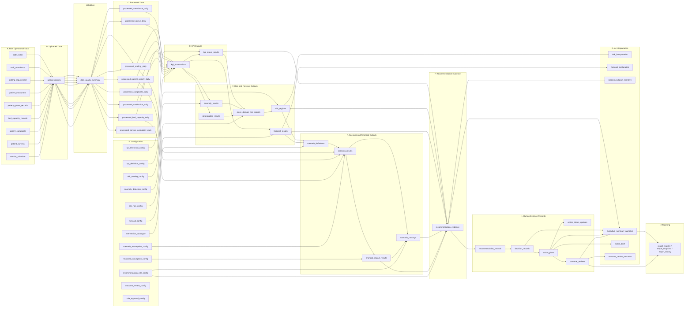

# Data Blueprint — Sentinel360 Healthcare

## 1. Purpose

This blueprint defines the complete high-level data architecture required for Sentinel360 Healthcare before field-level schemas and synthetic data are produced. It identifies what datasets are needed, why each exists, its source, its grain, its key business entities, its refresh frequency, its relationships to other datasets, its analytical consumers, its dashboard consumers and its data-layer classification. Detailed field-level data dictionaries will be created in **Phase 1 Step 1E**.

## 2. Data-Layer Overview

Sentinel360 uses ten logical data layers:

| Layer | Name | Purpose |
|---|---|---|
| A | Raw source data | Original hospital operational files before any transformation |
| B | Uploaded data | Files submitted through the application with metadata and registry |
| C | Processed and standardised data | Cleaned, validated, transformed datasets ready for analytics |
| D | Reference and master data | Stable descriptive data about hospitals, departments, roles and services |
| E | Configuration and assumptions | Approved rules, thresholds, methods, assumptions and catalogues |
| F | Analytical outputs | Dynamically calculated KPIs, detections, forecasts, scenarios and rankings |
| G | AI interpretation outputs | Narratives, explanations and summaries produced from structured evidence |
| H | Human decision and action records | Immutable management decisions, action plans, updates and outcome reviews |
| I | Reporting and export records | Generated reports, snapshots and export metadata |
| J | Audit and operational logs | Traceability, error and activity records for governance |

## 3. Core Business Entities

The following high-level business entities are required by the system:

- **Hospital** — the operational unit being monitored.
- **Department** — a clinical or operational department, ward or service area.
- **Ward or Service Area** — a physical or logical unit within a department.
- **Reporting Period** — the date or date range for which data are submitted and analysed.
- **Staff Member** — an anonymised individual employee record.
- **Staff Role** — the job category or qualification group of a staff member.
- **Shift** — a defined work period (e.g., morning, afternoon, night).
- **Attendance Event** — a record of planned versus actual attendance or absence.
- **Staffing Requirement** — the planned or required staff count by role, department and shift.
- **Patient Encounter** — a patient visit, admission or service contact.
- **Queue Event or Queue Summary** — a record of patient waiting time or queue volume.
- **Bed Capacity Record** — a record of available, occupied, blocked or out-of-service beds.
- **Complaint Record** — a patient or visitor complaint event or aggregated count.
- **Patient Survey Record** — an individual or aggregated patient satisfaction response.
- **KPI Definition** — the approved definition, direction and unit of a KPI.
- **KPI Observation** — a calculated KPI value for a specific hospital, department and period.
- **Warning Event** — a threshold breach or anomaly flag.
- **Risk Signal** — a connected or cross-domain risk finding.
- **Forecast Record** — a projected KPI value with confidence information.
- **Scenario Definition** — a named intervention scenario with its parameters.
- **Scenario Assumption** — an operational assumption applied to a scenario.
- **Scenario Result** — the calculated operational effect of a scenario.
- **Financial Assumption** — a cost, loss, benefit or valuation parameter.
- **Financial Result** — the calculated financial impact of a scenario.
- **Recommendation** — a structured, evidence-based proposed action.
- **Human Decision** — an approved, modified, rejected or deferred response to a recommendation.
- **Action Plan** — an approved intervention with owner, timeline and expected impact.
- **Action Status Update** — a progress or completion record for an action plan.
- **Outcome Review** — a later-period assessment of whether performance moved after an action.
- **Report Record** — a generated executive summary or management report.
- **Audit Event** — a log entry for data processing, decision or system activity.

Final field-level definitions are pending **Phase 1 Step 1E**.

## 4. Required Source Datasets

### A. hospital_master
- **Business purpose:** Identifies hospitals included in the system.
- **Source category:** Reference / master data.
- **Expected grain:** One record per hospital.
- **Primary business entities:** Hospital.
- **Typical refresh frequency:** Infrequent; updated when hospitals are added or removed.
- **Required or optional:** Required.
- **KPI or analytical function used:** All KPIs and analyses scoped by hospital.
- **Dashboard pages used:** Data Upload, Executive Overview, KPI Dashboard, Data & Validation.
- **Sensitivity level:** Low.
- **Prototype ingestion format:** CSV or XLSX.
- **Future production source:** Hospital directory or enterprise master data management.
- **Important quality risks:** Duplicate hospital identifiers; inconsistent naming.

### B. department_master
- **Business purpose:** Defines departments, wards or service areas and their hospital relationship.
- **Source category:** Reference / master data.
- **Expected grain:** One record per department or service area.
- **Primary business entities:** Department, Hospital.
- **Typical refresh frequency:** Infrequent; updated on organisational change.
- **Required or optional:** Required.
- **KPI or analytical function used:** All departmental KPIs and analyses.
- **Dashboard pages used:** Data Upload, Executive Overview, KPI Dashboard, Data & Validation.
- **Sensitivity level:** Low.
- **Prototype ingestion format:** CSV or XLSX.
- **Future production source:** Hospital directory or HR organisational structure.
- **Important quality risks:** Orphan departments without a valid hospital; duplicate department codes.

### C. staff_master
- **Business purpose:** Contains anonymised staff identity, role and organisational assignment.
- **Source category:** Reference / master data.
- **Expected grain:** One record per staff member.
- **Primary business entities:** Staff Member, Staff Role, Department.
- **Typical refresh frequency:** Monthly or on change.
- **Required or optional:** Required for workforce KPIs.
- **KPI or analytical function used:** Staffing Level, Staff Absenteeism Rate.
- **Dashboard pages used:** Data Upload, KPI Dashboard, Data & Validation.
- **Sensitivity level:** Medium; contains employment information.
- **Prototype ingestion format:** CSV or XLSX.
- **Future production source:** HR information system.
- **Important quality risks:** Missing role assignments; staff appearing in multiple departments without rules.

### D. staff_roster
- **Business purpose:** Contains planned staff assignment by date, shift, role and department.
- **Source category:** Raw operational data.
- **Expected grain:** One record per staff member per shift per date (or daily summary by role).
- **Primary business entities:** Staff Member, Shift, Staff Role, Department, Reporting Period.
- **Typical refresh frequency:** Daily or per roster cycle.
- **Required or optional:** Required for workforce KPIs.
- **KPI or analytical function used:** Staffing Level.
- **Dashboard pages used:** Data Upload, KPI Dashboard, Data & Validation.
- **Sensitivity level:** Medium.
- **Prototype ingestion format:** CSV or XLSX.
- **Future production source:** Workforce management or scheduling system.
- **Important quality risks:** Missing shifts; dates outside the reporting period; unmatched staff identifiers.

### E. staff_attendance
- **Business purpose:** Contains actual attendance or absence events.
- **Source category:** Raw operational data.
- **Expected grain:** One record per attendance event per staff member per date (or daily summary).
- **Primary business entities:** Staff Member, Attendance Event, Shift, Department, Reporting Period.
- **Typical refresh frequency:** Daily.
- **Required or optional:** Required for workforce KPIs.
- **KPI or analytical function used:** Staff Absenteeism Rate, Staffing Level.
- **Dashboard pages used:** Data Upload, KPI Dashboard, Data & Validation.
- **Sensitivity level:** Medium.
- **Prototype ingestion format:** CSV or XLSX.
- **Future production source:** Time and attendance or HR system.
- **Important quality risks:** Unmatched staff identifiers; invalid absence codes; missing dates.

### F. staffing_requirement
- **Business purpose:** Contains required staffing levels by department, date, shift and role.
- **Source category:** Raw operational data or reference data.
- **Expected grain:** One record per department per date per shift per role.
- **Primary business entities:** Staffing Requirement, Department, Shift, Staff Role, Reporting Period.
- **Typical refresh frequency:** Daily or per roster cycle.
- **Required or optional:** Required for Staffing Level calculation.
- **KPI or analytical function used:** Staffing Level.
- **Dashboard pages used:** Data Upload, KPI Dashboard, Data & Validation.
- **Sensitivity level:** Low.
- **Prototype ingestion format:** CSV or XLSX.
- **Future production source:** Workforce planning or scheduling system.
- **Important quality risks:** Missing requirements; inconsistent units (headcount vs. FTE); dates out of range.

### G. patient_encounters
- **Business purpose:** Contains patient activity volume required as denominators and demand signals.
- **Source category:** Raw operational data.
- **Expected grain:** One record per encounter or daily summary by department and service type.
- **Primary business entities:** Patient Encounter, Department, Reporting Period.
- **Typical refresh frequency:** Daily.
- **Required or optional:** Required for Bed Occupancy Rate and demand denominators.
- **KPI or analytical function used:** Bed Occupancy Rate, Average Patient Waiting Time, Patient Complaint Rate, Patient Satisfaction Score.
- **Dashboard pages used:** Data Upload, KPI Dashboard, Data & Validation.
- **Sensitivity level:** Medium; no clinical detail required.
- **Prototype ingestion format:** CSV or XLSX.
- **Future production source:** Patient administration or appointment system.
- **Important quality risks:** Duplicate encounter identifiers; invalid department mapping; missing dates.

### H. patient_queue_records
- **Business purpose:** Contains waiting-time and queue-volume information.
- **Source category:** Raw operational data.
- **Expected grain:** One record per queue event or daily summary by department and service.
- **Primary business entities:** Queue Event, Department, Reporting Period.
- **Typical refresh frequency:** Daily or per shift.
- **Required or optional:** Required for Average Patient Waiting Time.
- **KPI or analytical function used:** Average Patient Waiting Time.
- **Dashboard pages used:** Data Upload, KPI Dashboard, Data & Validation.
- **Sensitivity level:** Low.
- **Prototype ingestion format:** CSV or XLSX.
- **Future production source:** Queue management or patient flow system.
- **Important quality risks:** Negative or extreme wait times; unmatched department codes; missing timestamps.

### I. bed_capacity_records
- **Business purpose:** Contains available, occupied, unavailable and operational bed information.
- **Source category:** Raw operational data.
- **Expected grain:** One record per bed per day or daily summary by ward and department.
- **Primary business entities:** Bed Capacity Record, Ward or Service Area, Department, Reporting Period.
- **Typical refresh frequency:** Daily.
- **Required or optional:** Required for Bed Occupancy Rate.
- **KPI or analytical function used:** Bed Occupancy Rate.
- **Dashboard pages used:** Data Upload, KPI Dashboard, Data & Validation.
- **Sensitivity level:** Low.
- **Prototype ingestion format:** CSV or XLSX.
- **Future production source:** Bed management or patient administration system.
- **Important quality risks:** Counts exceeding physical capacity; negative occupancy; unmatched ward or department.

### J. patient_complaints
- **Business purpose:** Contains complaint events or aggregated complaint records.
- **Source category:** Raw operational data.
- **Expected grain:** One record per complaint event or daily aggregate by category and department.
- **Primary business entities:** Complaint Record, Department, Reporting Period.
- **Typical refresh frequency:** Daily.
- **Required or optional:** Required for Patient Complaint Rate.
- **KPI or analytical function used:** Patient Complaint Rate.
- **Dashboard pages used:** Data Upload, KPI Dashboard, Data & Validation.
- **Sensitivity level:** Medium.
- **Prototype ingestion format:** CSV or XLSX.
- **Future production source:** Patient experience or complaints management system.
- **Important quality risks:** Duplicate records; missing category; dates outside reporting period.

### K. patient_surveys
- **Business purpose:** Contains patient satisfaction responses or aggregated survey results.
- **Source category:** Raw operational data.
- **Expected grain:** One record per survey response or daily aggregate by department.
- **Primary business entities:** Patient Survey Record, Department, Reporting Period.
- **Typical refresh frequency:** Daily or per survey cycle.
- **Required or optional:** Required for Patient Satisfaction Score.
- **KPI or analytical function used:** Patient Satisfaction Score.
- **Dashboard pages used:** Data Upload, KPI Dashboard, Data & Validation.
- **Sensitivity level:** Low; anonymised.
- **Prototype ingestion format:** CSV or XLSX.
- **Future production source:** Patient experience or survey platform.
- **Important quality risks:** Invalid score ranges; missing department; small sample sizes.

### L. service_schedule
- **Business purpose:** Contains planned operating hours, clinic sessions or service availability needed for operational analysis and scenarios.
- **Source category:** Raw operational data or reference data.
- **Expected grain:** One record per department per date per session or shift.
- **Primary business entities:** Department, Reporting Period, Shift.
- **Typical refresh frequency:** Daily or per schedule cycle.
- **Required or optional:** Optional for baseline analysis; recommended for scenario simulation.
- **KPI or analytical function used:** Scenario generation and simulation.
- **Dashboard pages used:** Data Upload, Scenario Lab, Data & Validation.
- **Sensitivity level:** Low.
- **Prototype ingestion format:** CSV or XLSX.
- **Future production source:** Scheduling or service-management system.
- **Important quality risks:** Missing sessions; invalid time ranges; unmatched department.

## 5. Configuration and Assumption Datasets

### A. kpi_definition_config
- **Purpose:** Approved KPI definitions, direction of good performance, units and aggregation frequency.
- **Owner or approver:** Farah.
- **Versioning requirement:** Yes; every change creates a new version.
- **Effective date requirement:** Yes; definitions have valid-from and valid-to dates.
- **Downstream calculations affected:** All KPI calculations.
- **Change-control requirement:** Approved by Farah before activation.
- **Sensitivity:** Low.
- **Editable through prototype UI:** Viewable; editing restricted to configuration update workflow.

### B. kpi_threshold_config
- **Purpose:** Warning and critical boundaries by KPI and potentially by hospital or department.
- **Owner or approver:** Farah.
- **Versioning requirement:** Yes.
- **Effective date requirement:** Yes.
- **Downstream calculations affected:** Warning classification, anomaly detection, risk prioritisation.
- **Change-control requirement:** Approved by Farah.
- **Sensitivity:** Medium; affects alert frequency.
- **Editable through prototype UI:** Viewable; editing restricted.

### C. anomaly_detection_config
- **Purpose:** Approved anomaly-method settings.
- **Owner or approver:** Farah.
- **Versioning requirement:** Yes.
- **Effective date requirement:** Yes.
- **Downstream calculations affected:** Anomaly results.
- **Change-control requirement:** Approved by Farah.
- **Sensitivity:** Medium.
- **Editable through prototype UI:** Viewable; editing restricted.

### D. risk_rule_config
- **Purpose:** Approved cross-domain relationship rules.
- **Owner or approver:** Farah.
- **Versioning requirement:** Yes.
- **Effective date requirement:** Yes.
- **Downstream calculations affected:** Cross-domain risk signals.
- **Change-control requirement:** Approved by Farah.
- **Sensitivity:** Medium.
- **Editable through prototype UI:** Viewable; editing restricted.

### E. risk_scoring_config
- **Purpose:** Approved risk-prioritisation components and weights.
- **Owner or approver:** Farah.
- **Versioning requirement:** Yes.
- **Effective date requirement:** Yes.
- **Downstream calculations affected:** Risk register ranking.
- **Change-control requirement:** Approved by Farah.
- **Sensitivity:** Medium.
- **Editable through prototype UI:** Viewable; editing restricted.

### F. forecast_config
- **Purpose:** Approved forecast methods, history requirements, horizons and confidence rules.
- **Owner or approver:** Farah.
- **Versioning requirement:** Yes.
- **Effective date requirement:** Yes.
- **Downstream calculations affected:** Forecast results.
- **Change-control requirement:** Approved by Farah.
- **Sensitivity:** Medium.
- **Editable through prototype UI:** Viewable; editing restricted.

### G. intervention_catalogue
- **Purpose:** Approved management intervention options.
- **Owner or approver:** Farah.
- **Versioning requirement:** Yes.
- **Effective date requirement:** Yes.
- **Downstream calculations affected:** Scenario generation, recommendation evidence.
- **Change-control requirement:** Approved by Farah.
- **Sensitivity:** Low.
- **Editable through prototype UI:** Viewable; editing restricted.

### H. scenario_assumption_config
- **Purpose:** Operational assumptions used by scenario simulations.
- **Owner or approver:** Farah.
- **Versioning requirement:** Yes.
- **Effective date requirement:** Yes.
- **Downstream calculations affected:** Scenario results.
- **Change-control requirement:** Approved by Farah.
- **Sensitivity:** Medium.
- **Editable through prototype UI:** Yes; authorised users may adjust assumptions for planning purposes, but changes are versioned.

### I. financial_assumption_config
- **Purpose:** Cost, loss, benefit and valuation assumptions.
- **Owner or approver:** Farah.
- **Versioning requirement:** Yes.
- **Effective date requirement:** Yes.
- **Downstream calculations affected:** Financial impact results.
- **Change-control requirement:** Approved by Farah.
- **Sensitivity:** High; affects expenditure estimates.
- **Editable through prototype UI:** Yes; authorised users may adjust assumptions, but changes are versioned and flagged.

### J. recommendation_rule_config
- **Purpose:** Rules for mapping evidence and ranked scenarios into structured recommendations.
- **Owner or approver:** Farah.
- **Versioning requirement:** Yes.
- **Effective date requirement:** Yes.
- **Downstream calculations affected:** Recommendation evidence.
- **Change-control requirement:** Approved by Farah.
- **Sensitivity:** Medium.
- **Editable through prototype UI:** Viewable; editing restricted.

### K. outcome_review_config
- **Purpose:** Rules for comparison windows and outcome classification.
- **Owner or approver:** Farah.
- **Versioning requirement:** Yes.
- **Effective date requirement:** Yes.
- **Downstream calculations affected:** Outcome reviews.
- **Change-control requirement:** Approved by Farah.
- **Sensitivity:** Low.
- **Editable through prototype UI:** Viewable; editing restricted.

### L. role_approval_config
- **Purpose:** Which management roles may approve which intervention types.
- **Owner or approver:** Farah.
- **Versioning requirement:** Yes.
- **Effective date requirement:** Yes.
- **Downstream calculations affected:** Decision validation and workflow routing.
- **Change-control requirement:** Approved by Farah.
- **Sensitivity:** Medium.
- **Editable through prototype UI:** Viewable; editing restricted.

## 6. Processed Datasets

### A. processed_staffing_daily
- **Input datasets:** staff_roster, staff_attendance, staff_master, staffing_requirement.
- **Level of aggregation:** Daily by department, shift and role.
- **Processing purpose:** Align planned, required and actual staff counts for KPI calculation.
- **Downstream consumers:** KPI calculation, scenario simulation.
- **Traceability requirements:** Must retain upload identifier, source record counts and processing timestamp.

### B. processed_attendance_daily
- **Input datasets:** staff_attendance, staff_master.
- **Level of aggregation:** Daily by department and role.
- **Processing purpose:** Summarise attendance and absence for absenteeism calculation.
- **Downstream consumers:** KPI calculation.
- **Traceability requirements:** Must retain upload identifier and source record counts.

### C. processed_patient_activity_daily
- **Input datasets:** patient_encounters.
- **Level of aggregation:** Daily by department and encounter type.
- **Processing purpose:** Provide encounter volumes and demand signals.
- **Downstream consumers:** KPI calculation, scenario simulation.
- **Traceability requirements:** Must retain upload identifier and source record counts.

### D. processed_queue_daily
- **Input datasets:** patient_queue_records.
- **Level of aggregation:** Daily by department and service.
- **Processing purpose:** Summarise wait times and queue volumes.
- **Downstream consumers:** KPI calculation.
- **Traceability requirements:** Must retain upload identifier and source record counts.

### E. processed_bed_capacity_daily
- **Input datasets:** bed_capacity_records.
- **Level of aggregation:** Daily by ward and department.
- **Processing purpose:** Summarise available, occupied and out-of-service beds.
- **Downstream consumers:** KPI calculation, scenario simulation.
- **Traceability requirements:** Must retain upload identifier and source record counts.

### F. processed_complaints_daily
- **Input datasets:** patient_complaints.
- **Level of aggregation:** Daily by department and category.
- **Processing purpose:** Summarise complaint counts.
- **Downstream consumers:** KPI calculation.
- **Traceability requirements:** Must retain upload identifier and source record counts.

### G. processed_satisfaction_daily
- **Input datasets:** patient_surveys.
- **Level of aggregation:** Daily or survey-cycle by department.
- **Processing purpose:** Aggregate satisfaction scores and response counts.
- **Downstream consumers:** KPI calculation.
- **Traceability requirements:** Must retain upload identifier and source record counts.

### H. processed_service_availability_daily
- **Input datasets:** service_schedule.
- **Level of aggregation:** Daily by department and session.
- **Processing purpose:** Capture planned operating hours and capacity.
- **Downstream consumers:** Scenario simulation.
- **Traceability requirements:** Must retain upload identifier and source record counts.

### I. data_quality_summary
- **Input datasets:** All uploaded and processed datasets.
- **Level of aggregation:** One record per upload per dataset.
- **Processing purpose:** Record completeness, validity and issue counts.
- **Downstream consumers:** Data & Validation dashboard, executive summary.
- **Traceability requirements:** Must retain upload identifier and validation rule version.

### J. upload_registry
- **Input datasets:** User upload events.
- **Level of aggregation:** One record per uploaded file.
- **Processing purpose:** Track what was uploaded, when and by whom.
- **Downstream consumers:** All downstream processing and audit.
- **Traceability requirements:** Must be immutable after creation.

## 7. Analytical Output Datasets

### A. kpi_observations
- **Source inputs:** Processed daily datasets and kpi_definition_config.
- **Calculation ownership:** Python Analytics.
- **Grain:** Hospital, department, reporting period, KPI.
- **Update trigger:** New processed data or changed KPI definition.
- **Traceability requirements:** Must link to upload identifier, configuration version and calculation timestamp.
- **Dashboard consumers:** KPI Dashboard, Executive Overview, Risk & Alerts, Forecast, Scenario Lab.
- **Can be regenerated:** Yes.
- **Human editing allowed:** No.

### B. kpi_status_results
- **Source inputs:** kpi_observations and kpi_threshold_config.
- **Calculation ownership:** Python Analytics.
- **Grain:** Hospital, department, reporting period, KPI.
- **Update trigger:** New KPI observation or changed threshold.
- **Traceability requirements:** Must link to KPI observation and threshold version.
- **Dashboard consumers:** KPI Dashboard, Risk & Alerts, Executive Overview.
- **Can be regenerated:** Yes.
- **Human editing allowed:** No.

### C. anomaly_results
- **Source inputs:** kpi_observations and anomaly_detection_config.
- **Calculation ownership:** Python Analytics.
- **Grain:** Hospital, department, reporting period, KPI.
- **Update trigger:** New KPI observation or changed anomaly config.
- **Traceability requirements:** Must link to KPI observation and anomaly method version.
- **Dashboard consumers:** Risk & Alerts, KPI Dashboard.
- **Can be regenerated:** Yes.
- **Human editing allowed:** No.

### D. deterioration_results
- **Source inputs:** kpi_observations.
- **Calculation ownership:** Python Analytics.
- **Grain:** Hospital, department, reporting period, KPI.
- **Update trigger:** New KPI observation.
- **Traceability requirements:** Must link to KPI observation and trend method version.
- **Dashboard consumers:** Risk & Alerts, KPI Dashboard, Forecast.
- **Can be regenerated:** Yes.
- **Human editing allowed:** No.

### E. cross_domain_risk_signals
- **Source inputs:** kpi_observations, kpi_status_results, anomaly_results, deterioration_results, risk_rule_config.
- **Calculation ownership:** Python Analytics.
- **Grain:** Hospital, department, reporting period, risk signal.
- **Update trigger:** New detection outputs or changed risk rules.
- **Traceability requirements:** Must link to source KPI observations and risk rule version.
- **Dashboard consumers:** Risk & Alerts, Executive Overview, Scenario Lab.
- **Can be regenerated:** Yes.
- **Human editing allowed:** No.

### F. risk_register
- **Source inputs:** cross_domain_risk_signals and risk_scoring_config.
- **Calculation ownership:** Python Analytics.
- **Grain:** Hospital, department, reporting period, risk.
- **Update trigger:** New risk signals or changed scoring config.
- **Traceability requirements:** Must link to risk signals and scoring version.
- **Dashboard consumers:** Risk & Alerts, Executive Overview, Recommended Actions.
- **Can be regenerated:** Yes.
- **Human editing allowed:** No.

### G. forecast_results
- **Source inputs:** Historical kpi_observations and forecast_config.
- **Calculation ownership:** Python Analytics.
- **Grain:** Hospital, department, KPI, forecast horizon, forecast date.
- **Update trigger:** New KPI observation or changed forecast config.
- **Traceability requirements:** Must link to historical observations, forecast config version and method version.
- **Dashboard consumers:** Forecast, Executive Overview, Scenario Lab.
- **Can be regenerated:** Yes.
- **Human editing allowed:** No.

### H. scenario_definitions
- **Source inputs:** Current kpi_observations, risk_register, forecast_results, intervention_catalogue.
- **Calculation ownership:** Python Analytics.
- **Grain:** Hospital, department, reporting period, scenario.
- **Update trigger:** New analytical outputs or changed intervention catalogue.
- **Traceability requirements:** Must link to source observations and intervention catalogue version.
- **Dashboard consumers:** Scenario Lab.
- **Can be regenerated:** Yes.
- **Human editing allowed:** No.

### I. scenario_results
- **Source inputs:** scenario_definitions, processed datasets, scenario_assumption_config.
- **Calculation ownership:** Python Analytics.
- **Grain:** Hospital, department, reporting period, scenario, KPI.
- **Update trigger:** New scenario definition or changed assumptions.
- **Traceability requirements:** Must link to scenario definition and assumption-set version.
- **Dashboard consumers:** Scenario Lab, Recommended Actions.
- **Can be regenerated:** Yes.
- **Human editing allowed:** No.

### J. financial_impact_results
- **Source inputs:** scenario_results and financial_assumption_config.
- **Calculation ownership:** Python Analytics.
- **Grain:** Hospital, department, reporting period, scenario.
- **Update trigger:** New scenario result or changed financial assumptions.
- **Traceability requirements:** Must link to scenario results and financial assumption-set version.
- **Dashboard consumers:** Scenario Lab, Recommended Actions, Executive Overview.
- **Can be regenerated:** Yes.
- **Human editing allowed:** No.

### K. scenario_rankings
- **Source inputs:** scenario_results, financial_impact_results, recommendation_rule_config.
- **Calculation ownership:** Python Analytics.
- **Grain:** Hospital, department, reporting period, scenario.
- **Update trigger:** New scenario or financial results or changed ranking rules.
- **Traceability requirements:** Must link to source results and ranking rule version.
- **Dashboard consumers:** Scenario Lab, Recommended Actions.
- **Can be regenerated:** Yes.
- **Human editing allowed:** No.

### L. recommendation_evidence
- **Source inputs:** kpi_observations, kpi_status_results, risk_register, forecast_results, scenario_rankings, recommendation_rule_config.
- **Calculation ownership:** Python Analytics.
- **Grain:** Hospital, department, reporting period, recommendation.
- **Update trigger:** New analytical outputs or changed recommendation rules.
- **Traceability requirements:** Must link to all source outputs and recommendation rule version.
- **Dashboard consumers:** Recommended Actions, Executive Overview.
- **Can be regenerated:** Yes.
- **Human editing allowed:** No.

> **Important:** Human users must not directly edit calculated numerical outputs. Any perceived error must be resolved by correcting source data, configuration or calculation logic, not by overwriting outputs.

## 8. AI Interpretation Outputs

### A. risk_interpretation
- **Required structured numerical evidence:** risk_register, cross_domain_risk_signals, kpi_observations.
- **Permitted narrative function:** Explain connected risks in management language; describe reinforcing patterns.
- **Prohibited behaviour:** Invent risk scores; override Python prioritisation; claim causal proof.
- **Human-review requirement:** Narrative is displayed for human review but does not require separate approval before risk register is shown.
- **Traceability to source calculations:** Must reference specific KPI values, risk identifiers and rule version.

### B. forecast_explanation
- **Required structured numerical evidence:** forecast_results, kpi_observations, deterioration_results.
- **Permitted narrative function:** Explain forecast direction, uncertainty and confidence; highlight threshold-crossing risks.
- **Prohibited behaviour:** Invent forecast values; ignore confidence bands.
- **Human-review requirement:** Displayed for review; no separate approval required.
- **Traceability to source calculations:** Must reference forecast method, history length and confidence information.

### C. recommendation_narrative
- **Required structured numerical evidence:** recommendation_evidence, scenario_rankings, financial_impact_results.
- **Permitted narrative function:** Convert structured evidence into a readable recommendation with rationale.
- **Prohibited behaviour:** Invent figures; override scenario ranking; omit key assumptions.
- **Human-review requirement:** Must be reviewed by an authorised human before any action is approved.
- **Traceability to source calculations:** Must reference all supporting KPIs, forecasts, scenarios and assumption sets.

### D. executive_summary_narrative
- **Required structured numerical evidence:** All current-period KPIs, risks, forecasts, open decisions and actions.
- **Permitted narrative function:** Summarise operational status, key risks and open actions for leadership.
- **Prohibited behaviour:** Invent trends; omit unfavourable findings; claim causal proof.
- **Human-review requirement:** Displayed for review; no separate approval required.
- **Traceability to source calculations:** Must reference specific observation identifiers and report version.

### E. action_brief
- **Required structured numerical evidence:** Approved action plan, scenario results, financial impact.
- **Permitted narrative function:** Describe what the approved action entails, expected impact and key assumptions.
- **Prohibited behaviour:** Invent implementation details; change approved scope without decision record.
- **Human-review requirement:** Displayed to action owner; no separate approval required if action is already approved.
- **Traceability to source calculations:** Must reference decision identifier and action plan identifier.

### F. outcome_review_narrative
- **Required structured numerical evidence:** Outcome review record, before-and-after KPI observations.
- **Permitted narrative function:** Describe observed movement and association; explain limitations.
- **Prohibited behaviour:** Claim causal proof; ignore confounding factors.
- **Human-review requirement:** Displayed for human review and confirmation.
- **Traceability to source calculations:** Must reference original action, decision and later KPI observations.

> **Important:** AI narrative records must never become the numerical source of truth. The narrative is a communication layer built on top of Python-calculated evidence.

## 9. Human Decision and Action Datasets

### A. recommendation_records
- **Who creates the record:** System (Python + WorkBuddy) generates; human reviews.
- **Grain:** One record per recommendation per reporting period.
- **Relationship:** Links to recommendation_evidence, scenario_rankings and risk_register.
- **Mandatory audit information:** Recommendation identifier, generation timestamp, evidence version, scenario identifiers.
- **Can be edited:** No; a new recommendation is generated if evidence changes.
- **Status history:** Not applicable; the recommendation is a point-in-time output.
- **Dashboard pages supported:** Recommended Actions, Executive Overview.

### B. decision_records
- **Who creates the record:** Authorised human user.
- **Grain:** One record per human decision per recommendation.
- **Relationship:** Links to recommendation_record.
- **Mandatory audit information:** Decision identifier, decision maker, timestamp, decision type, reason, original recommendation identifier.
- **Can be edited:** No; corrections require a new decision record referencing the original.
- **Status history:** Immutable log.
- **Dashboard pages supported:** Recommended Actions, Action Tracking, Executive Overview.

### C. action_plans
- **Who creates the record:** Authorised human user after approval or modification.
- **Grain:** One record per approved action.
- **Relationship:** Links to decision_record and recommendation_record.
- **Mandatory audit information:** Action identifier, owner, target start date, target completion date, expected cost, expected benefit, approved scope.
- **Can be edited:** Scope, owner and dates may be modified through a recorded change process.
- **Status history:** All changes logged.
- **Dashboard pages supported:** Action Tracking, Recommended Actions.

### D. action_status_updates
- **Who creates the record:** Action owner or authorised user.
- **Grain:** One record per status update per action.
- **Relationship:** Links to action_plan.
- **Mandatory audit information:** Update timestamp, updater identity, status, notes.
- **Can be edited:** No; new updates supersede previous status.
- **Status history:** Full history retained.
- **Dashboard pages supported:** Action Tracking.

### E. implementation_evidence
- **Who creates the record:** Action owner or authorised user.
- **Grain:** One record per evidence submission per action.
- **Relationship:** Links to action_plan.
- **Mandatory audit information:** Submission timestamp, submitter, evidence description or file reference.
- **Can be edited:** No.
- **Status history:** Append-only.
- **Dashboard pages supported:** Action Tracking, Outcome Review.

### F. outcome_reviews
- **Who creates the record:** System calculates comparison; human reviews and confirms classification.
- **Grain:** One record per action per outcome review period.
- **Relationship:** Links to action_plan, original decision_record and later KPI observations.
- **Mandatory audit information:** Review identifier, reviewer, timestamp, outcome classification, reason, linked KPI observations.
- **Can be edited:** Classification may be corrected through a recorded update.
- **Status history:** All versions retained.
- **Dashboard pages supported:** Outcome Review, Executive Overview.

### G. approval_history
- **Who creates the record:** System on every approval or modification event.
- **Grain:** One record per approval event.
- **Relationship:** Links to decision_record and action_plan.
- **Mandatory audit information:** Approver, timestamp, approval type, scope approved.
- **Can be edited:** No.
- **Status history:** Immutable.
- **Dashboard pages supported:** Action Tracking, Recommended Actions.

### H. decision_comments
- **Who creates the record:** Any authorised user.
- **Grain:** One record per comment per decision or action.
- **Relationship:** Links to decision_record or action_plan.
- **Mandatory audit information:** Commenter, timestamp, comment text.
- **Can be edited:** No; new comments are appended.
- **Status history:** Append-only.
- **Dashboard pages supported:** Recommended Actions, Action Tracking.

## 10. Baseline versus Do Nothing Distinction

The following scenario states must be stored and communicated as separate concepts:

- **Baseline** — the latest observed or approved operational state before applying a future disruption or intervention. Baseline represents "where we are now" based on actual data.
- **Do Nothing** — the projected future state after the identified risk or disruption develops without management intervention. Do Nothing represents "what happens if we let the current trajectory continue."
- **Single Intervention** — the projected state after one approved intervention family is applied.
- **Combined Intervention** — the projected state after two or more compatible interventions are applied together.

**Why Baseline and Do Nothing must be stored separately:**

- Baseline is a factual starting point derived from observed data.
- Do Nothing is a forward projection that includes forecasted deterioration.
- Comparing Single or Combined Intervention against Baseline alone would understate the value of intervention if the baseline itself is deteriorating.
- Comparing against Do Nothing isolates the incremental benefit of taking action versus letting the situation worsen.
- Financial impact calculations require the Do Nothing projection to estimate avoided loss.

## 11. Reporting and Export Datasets

### report_registry
- **Purpose:** Catalogue of all generated reports with metadata.
- **Grain:** One record per generated report.
- **Contents:** Report identifier, type, generation timestamp, generator, reporting period, data version, configuration version.

### report_snapshot
- **Purpose:** Frozen capture of the data and narrative content used to produce a specific report.
- **Grain:** One record per report identifier.
- **Contents:** References to all KPI observations, risk records, decisions, actions and narratives included.

### export_history
- **Purpose:** Log of all file exports (CSV, PDF, XLSX).
- **Grain:** One record per export event.
- **Contents:** Export identifier, user, timestamp, format, file reference, report identifier.

### dashboard_snapshot
- **Purpose:** Optional frozen capture of dashboard state for reproducibility.
- **Grain:** One record per snapshot event.
- **Contents:** Snapshot timestamp, user, visible filters, referenced data versions.

### generated_file_metadata
- **Purpose:** Technical metadata for generated files.
- **Grain:** One record per file.
- **Contents:** File identifier, path or reference, checksum, size, creation timestamp.

**Report reproducibility requirements:**

Every report must preserve:

- Reporting period (date range)
- Data version (upload identifier or processing run)
- Configuration version (thresholds, rules, assumptions)
- Calculation version (Python module or method version)
- Recommendation version (if recommendations are included)
- Decision status (current state of linked decisions)
- Generation timestamp

## 12. Audit and Operational Logs

### upload_log
- **Purpose:** Record every file upload attempt, success or failure.

### validation_log
- **Purpose:** Record schema and quality validation results per upload.

### processing_log
- **Purpose:** Record data transformation and aggregation steps.

### model_run_log
- **Purpose:** Record analytical model executions (KPI, detection, forecast, scenario).

### interpretation_log
- **Purpose:** Record AI interpretation generation events.

### decision_audit_log
- **Purpose:** Record all human decision events with identity and timestamp.

### action_audit_log
- **Purpose:** Record all action status changes and updates.

### error_log
- **Purpose:** Record system errors, calculation failures and exceptions.

### user_activity_log
- **Purpose:** Record user logins, page views and exports (at prototype level, simplified).

The prototype may implement only a simplified subset of these logs, but the logical design must support full traceability. Log entries must be append-only and tamper-evident.

## 13. Dataset Catalogue Table

| Dataset Name | Data Layer | Dataset Type | Purpose | Grain | Primary Entities | Main Source | Refresh Frequency | Required or Optional | Main Consumer | Dashboard Pages | Numerical Source of Truth | Human Editable | Sensitivity | Prototype Format | Future Production Source |
|---|---|---|---|---|---|---|---|---|---|---|---|---|---|---|---|
| hospital_master | D | Reference | Identify hospitals | Hospital | Hospital | Manual / Directory | Infrequent | Required | All | Data Upload, Executive Overview, KPI Dashboard, Data & Validation | No | No | Low | CSV / XLSX | Hospital directory / MDM |
| department_master | D | Reference | Define departments | Department | Department, Hospital | Manual / Directory | Infrequent | Required | All | Data Upload, Executive Overview, KPI Dashboard, Data & Validation | No | No | Low | CSV / XLSX | Hospital directory / HR org |
| staff_master | D | Reference | Anonymised staff identity | Staff member | Staff Member, Staff Role, Department | HR extract | Monthly / on change | Required | Workforce KPIs | Data Upload, KPI Dashboard, Data & Validation | No | No | Medium | CSV / XLSX | HR information system |
| staff_roster | A | Raw | Planned staff assignment | Staff / shift / date | Staff Member, Shift, Role, Department | Workforce system | Daily / per cycle | Required | Staffing KPI | Data Upload, KPI Dashboard, Data & Validation | No | No | Medium | CSV / XLSX | Workforce management |
| staff_attendance | A | Raw | Actual attendance events | Event / staff / date | Staff Member, Attendance Event, Department | Time system | Daily | Required | Workforce KPI | Data Upload, KPI Dashboard, Data & Validation | No | No | Medium | CSV / XLSX | Time and attendance / HR |
| staffing_requirement | A | Raw | Required staff levels | Dept / date / shift / role | Staffing Requirement, Department | Workforce planning | Daily / per cycle | Required | Staffing KPI | Data Upload, KPI Dashboard, Data & Validation | No | No | Low | CSV / XLSX | Workforce planning |
| patient_encounters | A | Raw | Patient activity volume | Encounter / daily summary | Patient Encounter, Department | Patient admin | Daily | Required | Demand / capacity KPIs | Data Upload, KPI Dashboard, Data & Validation | No | No | Medium | CSV / XLSX | Patient administration |
| patient_queue_records | A | Raw | Waiting-time information | Queue event / daily summary | Queue Event, Department | Queue system | Daily / per shift | Required | Waiting-time KPI | Data Upload, KPI Dashboard, Data & Validation | No | No | Low | CSV / XLSX | Queue management |
| bed_capacity_records | A | Raw | Bed status information | Bed / day or daily summary | Bed Capacity Record, Ward, Department | Bed management | Daily | Required | Occupancy KPI | Data Upload, KPI Dashboard, Data & Validation | No | No | Low | CSV / XLSX | Bed management / PAS |
| patient_complaints | A | Raw | Complaint events | Event / daily aggregate | Complaint Record, Department | Complaints system | Daily | Required | Complaint KPI | Data Upload, KPI Dashboard, Data & Validation | No | No | Medium | CSV / XLSX | Patient experience system |
| patient_surveys | A | Raw | Satisfaction responses | Response / daily aggregate | Patient Survey Record, Department | Survey platform | Daily / per cycle | Required | Satisfaction KPI | Data Upload, KPI Dashboard, Data & Validation | No | No | Low | CSV / XLSX | Survey platform |
| service_schedule | A | Raw | Planned operating hours | Dept / date / session | Department, Shift | Scheduling system | Daily / per cycle | Optional | Scenario simulation | Data Upload, Scenario Lab, Data & Validation | No | No | Low | CSV / XLSX | Scheduling system |
| processed_staffing_daily | C | Processed | Aligned workforce data | Daily / dept / shift / role | Staff Member, Shift, Role, Department | Raw staffing data | Per upload | Required | KPI calc, scenarios | KPI Dashboard, Scenario Lab | No | No | Medium | CSV / XLSX / local | ETL pipeline |
| processed_attendance_daily | C | Processed | Summarised attendance | Daily / dept / role | Attendance Event, Department | Raw attendance | Per upload | Required | KPI calc | KPI Dashboard | No | No | Medium | CSV / XLSX / local | ETL pipeline |
| processed_patient_activity_daily | C | Processed | Summarised encounters | Daily / dept / type | Patient Encounter, Department | Raw encounters | Per upload | Required | KPI calc, scenarios | KPI Dashboard, Scenario Lab | No | No | Medium | CSV / XLSX / local | ETL pipeline |
| processed_queue_daily | C | Processed | Summarised queues | Daily / dept / service | Queue Event, Department | Raw queue data | Per upload | Required | KPI calc | KPI Dashboard | No | No | Low | CSV / XLSX / local | ETL pipeline |
| processed_bed_capacity_daily | C | Processed | Summarised bed data | Daily / ward / dept | Bed Capacity Record, Department | Raw bed data | Per upload | Required | KPI calc, scenarios | KPI Dashboard, Scenario Lab | No | No | Low | CSV / XLSX / local | ETL pipeline |
| processed_complaints_daily | C | Processed | Summarised complaints | Daily / dept / category | Complaint Record, Department | Raw complaints | Per upload | Required | KPI calc | KPI Dashboard | No | No | Medium | CSV / XLSX / local | ETL pipeline |
| processed_satisfaction_daily | C | Processed | Aggregated satisfaction | Daily / dept | Patient Survey Record, Department | Raw surveys | Per upload | Required | KPI calc | KPI Dashboard | No | No | Low | CSV / XLSX / local | ETL pipeline |
| processed_service_availability_daily | C | Processed | Service hours summary | Daily / dept / session | Department, Shift | Raw schedule | Per upload | Optional | Scenario simulation | Scenario Lab | No | No | Low | CSV / XLSX / local | ETL pipeline |
| data_quality_summary | C | Processed | Quality metrics per upload | Upload / dataset | Upload, Dataset | All raw data | Per upload | Required | Validation display | Data & Validation, Executive Overview | No | No | Low | CSV / XLSX / local | ETL pipeline |
| upload_registry | B | Uploaded | Upload tracking | File | Upload | User upload | Per upload | Required | All downstream | Data Upload, Data & Validation | No | No | Low | CSV / XLSX / local | Application layer |
| kpi_definition_config | E | Config | KPI definitions | KPI | KPI Definition | Manual / Approved | On change | Required | All KPI calc | All analytical pages | No | Restricted | Low | CSV / XLSX / local | Configuration management |
| kpi_threshold_config | E | Config | Warning boundaries | KPI / hospital / dept | KPI Definition | Manual / Approved | On change | Required | Status classification | KPI Dashboard, Risk & Alerts | No | Restricted | Medium | CSV / XLSX / local | Configuration management |
| anomaly_detection_config | E | Config | Anomaly method settings | Method / KPI | KPI Definition | Manual / Approved | On change | Required | Anomaly detection | Risk & Alerts | No | Restricted | Medium | CSV / XLSX / local | Configuration management |
| risk_rule_config | E | Config | Cross-domain risk rules | Rule | Risk Signal | Manual / Approved | On change | Required | Risk analysis | Risk & Alerts | No | Restricted | Medium | CSV / XLSX / local | Configuration management |
| risk_scoring_config | E | Config | Risk prioritisation weights | Component | Risk Signal | Manual / Approved | On change | Required | Risk ranking | Risk & Alerts | No | Restricted | Medium | CSV / XLSX / local | Configuration management |
| forecast_config | E | Config | Forecast method settings | Method / KPI | Forecast Record | Manual / Approved | On change | Required | Forecasting | Forecast | No | Restricted | Medium | CSV / XLSX / local | Configuration management |
| intervention_catalogue | E | Config | Approved interventions | Intervention | Scenario Definition | Manual / Approved | On change | Required | Scenario generation | Scenario Lab | No | Restricted | Low | CSV / XLSX / local | Configuration management |
| scenario_assumption_config | E | Config | Operational assumptions | Assumption / scenario | Scenario Assumption | Manual / Approved | On change | Required | Scenario simulation | Scenario Lab | No | Authorised users | Medium | CSV / XLSX / local | Configuration management |
| financial_assumption_config | E | Config | Financial parameters | Assumption / scenario | Financial Assumption | Manual / Approved | On change | Required | Financial calc | Scenario Lab | No | Authorised users | High | CSV / XLSX / local | Configuration management |
| recommendation_rule_config | E | Config | Recommendation mapping rules | Rule | Recommendation | Manual / Approved | On change | Required | Recommendation | Recommended Actions | No | Restricted | Medium | CSV / XLSX / local | Configuration management |
| outcome_review_config | E | Config | Outcome comparison rules | Rule | Outcome Review | Manual / Approved | On change | Required | Outcome review | Outcome Review | No | Restricted | Low | CSV / XLSX / local | Configuration management |
| role_approval_config | E | Config | Role-based approval rules | Role / intervention type | Human Decision | Manual / Approved | On change | Required | Decision validation | Recommended Actions, Action Tracking | No | Restricted | Medium | CSV / XLSX / local | Configuration management |
| kpi_observations | F | Analytical output | Calculated KPI values | Hospital / dept / period / KPI | KPI Observation, KPI Definition | Processed data + config | Per upload / config change | Required | All downstream | KPI Dashboard, Executive Overview, Risk & Alerts, Forecast, Scenario Lab | Yes | No | Low | CSV / XLSX / local | Analytical database |
| kpi_status_results | F | Analytical output | KPI classifications | Hospital / dept / period / KPI | KPI Observation, KPI Definition | KPI observations + thresholds | Per KPI change | Required | Risk, forecast, scenarios | KPI Dashboard, Risk & Alerts, Executive Overview | Yes | No | Low | CSV / XLSX / local | Analytical database |
| anomaly_results | F | Analytical output | Anomaly findings | Hospital / dept / period / KPI | KPI Observation | KPI observations + config | Per KPI change | Required | Risk analysis | Risk & Alerts, KPI Dashboard | Yes | No | Low | CSV / XLSX / local | Analytical database |
| deterioration_results | F | Analytical output | Trend persistence | Hospital / dept / period / KPI | KPI Observation | KPI observations | Per KPI change | Required | Risk, forecast | Risk & Alerts, KPI Dashboard, Forecast | Yes | No | Low | CSV / XLSX / local | Analytical database |
| cross_domain_risk_signals | F | Analytical output | Connected risks | Hospital / dept / period / signal | Risk Signal | Detections + risk rules | Per detection change | Required | Risk register | Risk & Alerts, Executive Overview, Scenario Lab | Yes | No | Low | CSV / XLSX / local | Analytical database |
| risk_register | F | Analytical output | Prioritised risks | Hospital / dept / period / risk | Risk Signal | Risk signals + scoring | Per risk change | Required | Recommendations | Risk & Alerts, Executive Overview, Recommended Actions | Yes | No | Low | CSV / XLSX / local | Analytical database |
| forecast_results | F | Analytical output | Forecast projections | Hospital / dept / KPI / horizon | Forecast Record | Historical KPIs + config | Per KPI change | Required | Scenario, summary | Forecast, Executive Overview, Scenario Lab | Yes | No | Low | CSV / XLSX / local | Analytical database |
| scenario_definitions | F | Analytical output | Scenario descriptions | Hospital / dept / period / scenario | Scenario Definition | Analytical outputs + catalogue | Per output change | Required | Simulation | Scenario Lab | Yes | No | Low | CSV / XLSX / local | Analytical database |
| scenario_results | F | Analytical output | Scenario operational effects | Hospital / dept / period / scenario / KPI | Scenario Result | Scenarios + assumptions | Per scenario change | Required | Ranking, finance | Scenario Lab, Recommended Actions | Yes | No | Low | CSV / XLSX / local | Analytical database |
| financial_impact_results | F | Analytical output | Scenario financial effects | Hospital / dept / period / scenario | Financial Result | Scenarios + financial assumptions | Per scenario change | Required | Ranking, summary | Scenario Lab, Recommended Actions, Executive Overview | Yes | No | Medium | CSV / XLSX / local | Analytical database |
| scenario_rankings | F | Analytical output | Ranked scenarios | Hospital / dept / period / scenario | Scenario Definition | Results + ranking rules | Per result change | Required | Recommendations | Scenario Lab, Recommended Actions | Yes | No | Low | CSV / XLSX / local | Analytical database |
| recommendation_evidence | F | Analytical output | Structured recommendation basis | Hospital / dept / period / recommendation | Recommendation | All analytical outputs | Per output change | Required | AI interpretation | Recommended Actions, Executive Overview | Yes | No | Low | CSV / XLSX / local | Analytical database |
| risk_interpretation | G | AI output | Risk explanation narrative | Hospital / dept / period / signal | Risk Signal | Risk register + evidence | Per risk change | Required | Human review | Risk & Alerts, Executive Overview | No | No | Low | Text / local | AI layer |
| forecast_explanation | G | AI output | Forecast narrative | Hospital / dept / KPI / horizon | Forecast Record | Forecast results + evidence | Per forecast change | Required | Human review | Forecast, Executive Overview | No | No | Low | Text / local | AI layer |
| recommendation_narrative | G | AI output | Recommendation text | Hospital / dept / period / recommendation | Recommendation | Evidence + ranking | Per recommendation | Required | Human review | Recommended Actions, Executive Overview | No | No | Low | Text / local | AI layer |
| executive_summary_narrative | G | AI output | Executive summary text | Hospital / period | Report Record | All current outputs | Per period | Required | Human review | Executive Overview, Summary of Report | No | No | Low | Text / local | AI layer |
| action_brief | G | AI output | Action description | Action | Action Plan | Action plan + scenarios | Per action | Required | Action owner | Action Tracking | No | No | Low | Text / local | AI layer |
| outcome_review_narrative | G | AI output | Outcome description | Action / review period | Outcome Review | Outcome review + KPIs | Per review | Required | Human review | Outcome Review | No | No | Low | Text / local | AI layer |
| recommendation_records | H | Human record | Formal recommendation | Hospital / dept / period / recommendation | Recommendation | System generation | Per recommendation | Required | Human decision | Recommended Actions, Executive Overview | No | No | Low | CSV / XLSX / local | Application database |
| decision_records | H | Human record | Human decision | Decision / recommendation | Human Decision | Human entry | Per decision | Required | Action tracking | Recommended Actions, Action Tracking, Executive Overview | No | No | Medium | CSV / XLSX / local | Application database |
| action_plans | H | Human record | Approved action | Action | Action Plan | Human entry | Per approval | Required | Tracking, review | Action Tracking, Recommended Actions | No | Authorised users | Medium | CSV / XLSX / local | Application database |
| action_status_updates | H | Human record | Status change | Update / action | Action Plan | Human entry | Per update | Required | Tracking | Action Tracking | No | Authorised users | Low | CSV / XLSX / local | Application database |
| implementation_evidence | H | Human record | Completion evidence | Evidence / action | Action Plan | Human entry | Per submission | Optional | Review | Action Tracking, Outcome Review | No | Authorised users | Low | CSV / XLSX / local | Application database |
| outcome_reviews | H | Human record | Outcome assessment | Review / action | Outcome Review | Human review | Per review | Required | Reporting | Outcome Review, Executive Overview | No | Authorised users | Medium | CSV / XLSX / local | Application database |
| approval_history | H | Human record | Approval events | Event / decision | Human Decision | System record | Per approval | Required | Audit | Action Tracking | No | No | Medium | CSV / XLSX / local | Application database |
| decision_comments | H | Human record | Decision discussion | Comment / decision | Human Decision | Human entry | Per comment | Optional | Collaboration | Recommended Actions, Action Tracking | No | Authorised users | Low | CSV / XLSX / local | Application database |
| report_registry | I | Report | Report catalogue | Report | Report Record | System record | Per generation | Required | Distribution | Report Downloads, Summary of Report | No | No | Low | CSV / XLSX / local | Application database |
| report_snapshot | I | Report | Report content snapshot | Report | Report Record | System record | Per generation | Required | Reproducibility | Report Downloads | No | No | Low | Text / local | Application database |
| export_history | I | Report | Export log | Export | Report Record | System record | Per export | Required | Audit | Report Downloads | No | No | Low | CSV / XLSX / local | Application database |
| dashboard_snapshot | I | Report | Dashboard state capture | Snapshot | Report Record | System record | Per snapshot | Optional | Reproducibility | All pages | No | No | Low | Text / local | Application database |
| generated_file_metadata | I | Report | File technical metadata | File | Report Record | System record | Per file | Required | Audit | Report Downloads | No | No | Low | CSV / XLSX / local | Application database |
| upload_log | J | Audit | Upload audit | Event | Upload | System record | Per event | Required | Audit | Data & Validation | No | No | Low | Text / local | Audit store |
| validation_log | J | Audit | Validation audit | Event / upload | Upload | System record | Per event | Required | Audit | Data & Validation | No | No | Low | Text / local | Audit store |
| processing_log | J | Audit | Processing audit | Event / run | Processing Run | System record | Per event | Required | Audit | Data & Validation | No | No | Low | Text / local | Audit store |
| model_run_log | J | Audit | Model execution audit | Event / run | Model Run | System record | Per event | Required | Audit | Data & Validation | No | No | Low | Text / local | Audit store |
| interpretation_log | J | Audit | AI generation audit | Event | Interpretation | System record | Per event | Required | Audit | Data & Validation | No | No | Low | Text / local | Audit store |
| decision_audit_log | J | Audit | Decision audit | Event / decision | Human Decision | System record | Per event | Required | Audit | Action Tracking | No | No | Medium | Text / local | Audit store |
| action_audit_log | J | Audit | Action audit | Event / action | Action Plan | System record | Per event | Required | Audit | Action Tracking | No | No | Medium | Text / local | Audit store |
| error_log | J | Audit | System errors | Error | System | System record | Per event | Required | Debugging | Data & Validation | No | No | Low | Text / local | Audit store |
| user_activity_log | J | Audit | User activity | Event / user | User | System record | Per event | Optional | Audit | All pages | No | No | Low | Text / local | Audit store |

## 14. Dataset-to-KPI Mapping

| KPI | Primary Source Datasets | Supporting Datasets | Required Denominator | Time Grain | Department-Level Support | Main Data Risks | Formula Status |
|---|---|---|---|---|---|---|---|
| Staffing Level | staff_roster, staff_attendance, staffing_requirement | staff_master | Required (planned vs. actual vs. required) | Daily | Yes | Missing shifts; unmatched staff IDs; inconsistent units | Pending Phase 1 Step 1F |
| Staff Absenteeism Rate | staff_attendance, staff_roster | staff_master, staffing_requirement | Required (scheduled staff count) | Daily | Yes | Unmatched staff IDs; invalid absence codes; missing roster | Pending Phase 1 Step 1F |
| Bed Occupancy Rate | bed_capacity_records | patient_encounters | Required (available beds) | Daily | Yes | Counts exceeding capacity; negative occupancy; unmatched ward | Pending Phase 1 Step 1F |
| Average Patient Waiting Time | patient_queue_records | patient_encounters | Required (queue volume or encounters) | Daily / per shift | Yes | Negative or extreme waits; unmatched department; missing timestamps | Pending Phase 1 Step 1F |
| Patient Complaint Rate | patient_complaints | patient_encounters | Required (encounter volume) | Daily | Yes | Duplicate complaints; missing category; unmatched department | Pending Phase 1 Step 1F |
| Patient Satisfaction Score | patient_surveys | patient_encounters | Required (response count or encounter volume) | Daily / per cycle | Yes | Invalid score ranges; small sample sizes; unmatched department | Pending Phase 1 Step 1F |

## 15. Dataset-to-Dashboard Mapping

| Dashboard Page | Primary Datasets | Supporting Datasets | Configuration Datasets | Human-Entered Datasets | Report/Export Datasets |
|---|---|---|---|---|---|
| Data Upload | All raw source datasets | upload_registry | — | — | upload_log, validation_log |
| Executive Overview | kpi_observations, kpi_status_results, risk_register, forecast_results | cross_domain_risk_signals, scenario_rankings, financial_impact_results | kpi_definition_config, kpi_threshold_config, forecast_config | decision_records, action_plans, action_status_updates | executive_summary_narrative, report_registry |
| KPI Dashboard | kpi_observations, kpi_status_results, anomaly_results, deterioration_results | processed datasets | kpi_definition_config, kpi_threshold_config, anomaly_detection_config | — | — |
| Risk & Alerts | risk_register, cross_domain_risk_signals, kpi_status_results, anomaly_results, deterioration_results | kpi_observations, forecast_results | risk_rule_config, risk_scoring_config, kpi_threshold_config, anomaly_detection_config | — | risk_interpretation |
| Forecast | forecast_results, kpi_observations, deterioration_results | historical kpi_observations | forecast_config, kpi_definition_config | — | forecast_explanation |
| Scenario Lab | scenario_definitions, scenario_results, financial_impact_results, scenario_rankings | kpi_observations, risk_register, forecast_results | intervention_catalogue, scenario_assumption_config, financial_assumption_config, recommendation_rule_config | — | — |
| Recommended Actions | recommendation_records, recommendation_evidence, scenario_rankings | risk_register, forecast_results, financial_impact_results | recommendation_rule_config, role_approval_config, intervention_catalogue | decision_records, decision_comments | recommendation_narrative |
| Action Tracking | action_plans, action_status_updates, implementation_evidence, approval_history | decision_records, recommendation_records | role_approval_config | action_plans, action_status_updates, implementation_evidence, decision_comments | action_brief |
| Outcome Review | outcome_reviews, kpi_observations | action_plans, decision_records | outcome_review_config, kpi_definition_config | outcome_reviews | outcome_review_narrative |
| Summary of Report | report_snapshot, executive_summary_narrative | all current-period outputs | all configuration | decision_records, action_plans, outcome_reviews | report_registry, report_snapshot |
| Data & Validation | upload_registry, data_quality_summary, all processed datasets | all raw source datasets | — | — | upload_log, validation_log, processing_log, error_log |
| Report Downloads | report_registry, export_history, generated_file_metadata | report_snapshot | — | — | export_history, generated_file_metadata |

## 16. Data Retention and Privacy Principles

- **No patient names required** for the prototype; all patient-level identifiers must be anonymised.
- **No clinical diagnosis details required**; the scope is operational, not clinical.
- **Anonymised encounter and staff identifiers** must be used where record-level linkage is necessary.
- **Minimum necessary data** — only data required for the approved scope are collected and retained.
- **Separation of uploaded and demo data** — synthetic demo datasets must be stored in a clearly separate location from user-uploaded data.
- **Controlled access to management decisions** — decision and action records contain sensitive operational judgements and must be accessible only to authorised users.
- **Restricted access to financial assumptions** — cost and benefit assumptions may influence expenditure discussions and must be visible only to authorised roles.
- **Version retention for auditability** — configuration, assumptions and outputs must be versioned so that historical reports remain reproducible.
- **No production security claim at prototype stage** — the prototype will use lightweight local storage and predefined roles; full security controls will be designed in a later phase.

## 17. Multi-Hospital and Time-Period Support

Every relevant dataset should support the following dimensions, even if the initial prototype focuses on a single hospital:

- **Hospital identifier** — to scope data to a specific operational unit.
- **Department or service-area identifier** — to enable departmental breakdowns.
- **Reporting date or period** — to align data to a specific analysis window.
- **Source-system identifier** — to trace data back to its originating system.
- **Data version** — to distinguish re-uploads or corrections.
- **Upload or run identifier** — to link outputs to the specific processing execution that produced them.

Exact field names are pending **Phase 1 Step 1E**.

## 18. High-Level Data Quality Framework

The following checks are expected at various stages of the data pipeline:

- **File availability** — required files are present before processing begins.
- **Schema validity** — column names, data types and required fields match expectation.
- **Required-field completeness** — critical fields have acceptable missingness rates.
- **Identifier uniqueness** — key identifiers such as staff ID, encounter ID or bed ID are unique within their scope.
- **Date validity** — dates are within plausible ranges and align with the reporting period.
- **Referential integrity** — department codes, staff IDs and hospital IDs exist in their respective master datasets.
- **Duplicate detection** — duplicate records are flagged and either removed or reported.
- **Logical range checks** — counts, percentages and scores are within physically possible bounds.
- **Consistency across datasets** — totals and subtotals align across related files (e.g., rostered staff vs. attendance).
- **Freshness** — data are current enough for the reporting period.
- **Denominator availability** — rates and averages have valid denominators.
- **Sufficient history** — forecasting and trend detection have enough historical observations.
- **Scenario-assumption completeness** — all required assumptions are present before simulation.
- **Financial-assumption completeness** — all cost, loss and benefit parameters are present before financial calculation.

## 19. Scope-Control Rules

The data blueprint must not expand into:

- Clinical diagnosis data
- Full electronic health records
- Medication records
- Detailed clinical notes
- Billing transaction systems
- Payroll systems
- Patient communication systems
- Automated staff rostering
- Autonomous operational execution

## 20. Unresolved Decisions

The following items are to be defined in later Phase 1 steps:

- Final field-level schemas and data dictionaries
- Primary and foreign keys
- Exact KPI formulas, numerators and denominators
- Threshold values and boundary definitions
- Risk rules, correlation logic and scoring weights
- Anomaly detection method and parameters
- Forecast method, model and history requirements
- Scenario simulation equations
- Financial impact equations
- Storage technology and database design
- Production integration methods and APIs
- Data retention duration and archival rules
- Role authentication and access control implementation

## 21. Data Blueprint Diagram

