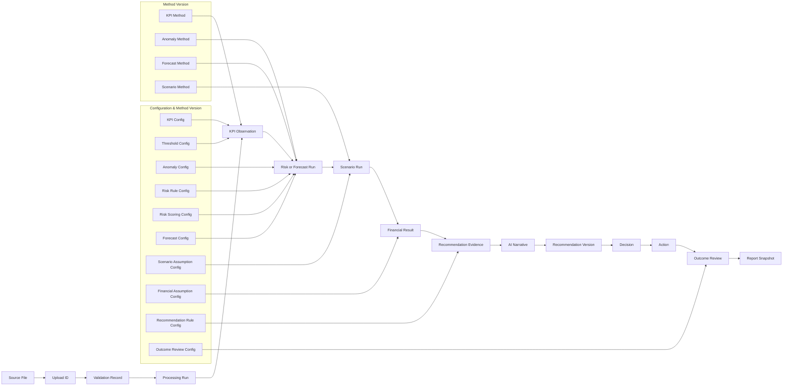

# Data Lineage Map — Sentinel360 Healthcare

## 1. Purpose

This document explains how information moves from source data through validation, processing, calculation, interpretation and human decision to dashboard display and reporting. Lineage ensures that every displayed result, recommendation and decision record can be traced back to its source data, configuration version, calculation method and analytical assumptions.

## 2. Lineage Principles

- **Source-to-output traceability** — every calculated output must reference the source dataset and upload that produced it.
- **Reproducibility** — the same inputs, configuration and method must produce the same outputs.
- **Immutable raw-data reference** — once uploaded, raw data must not be altered; corrections require a new upload.
- **Versioned configuration** — every rule, threshold and assumption set must carry a version identifier.
- **Method-version recording** — the analytical method used to produce a forecast, anomaly detection or scenario simulation must be recorded.
- **Separation of facts, assumptions, calculations, narratives and human decisions** — each layer must remain distinct and independently traceable.
- **No silent replacement of missing data** — missing values must be flagged, not imputed without record.
- **No hardcoded dashboard outcomes** — every displayed value must be dynamically calculated from source data and approved configuration.

## 3. Source-to-KPI Lineage

For each of the six headline KPIs, the high-level lineage is:

```
Source Dataset (raw file)
→ Upload Registration (upload identifier assigned)
→ Validation (schema and quality checks)
→ Processing (cleaning, aggregation, standardisation)
→ KPI Calculation (dynamic computation from processed data and KPI definition)
→ KPI Observation (stored calculated value with traceability metadata)
→ Status Classification (threshold comparison using approved boundaries)
→ Dashboard Display (KPI Dashboard, Executive Overview, Risk & Alerts)
```

Exact formulas, numerators and denominators are pending **Phase 1 Step 1F**.

## 4. KPI-to-Risk Lineage

```
KPI Observations
→ Warning Status (threshold classification)
→ Trend and Persistence (deterioration analysis)
→ Anomaly Results (statistical anomaly detection)
→ Cross-Domain Risk Signal (correlation across workforce, capacity, experience)
→ Risk Score or Priority (scoring and ranking using approved weights)
→ Executive Alert (Risk & Alerts page and Executive Overview)
```

## 5. KPI-to-Forecast Lineage

```
Historical KPI Observations
→ History Sufficiency Check (minimum observations required)
→ Forecast Method (approved model and parameters)
→ Forecast Result (projected values)
→ Confidence Information (intervals or bands)
→ Threshold-Crossing Assessment (will the forecast breach a limit?)
→ Forecast Page and Executive Summary
```

## 6. Risk-to-Scenario Lineage

```
Prioritised Risk (from risk_register)
→ Intervention Catalogue (approved intervention families)
→ Scenario Generation (Baseline, Do Nothing, Single Intervention, Combined Intervention)
→ Assumption Set (scenario and financial assumptions)
→ Simulation (operational projection)
→ Operational Impact (scenario_results)
→ Financial Impact (financial_impact_results)
→ Scenario Ranking (scenario_rankings)
→ Recommendation Evidence (recommendation_evidence)
```

## 7. Recommendation-to-Decision Lineage

```
Recommendation Evidence (structured calculated outputs)
→ AI-Assisted Narrative (WorkBuddy interpretation grounded in evidence)
→ Recommendation Record (formal system-generated recommendation)
→ Human Review (authorised user evaluates evidence and narrative)
→ Approve, Modify, Reject, Defer or Monitor (human decision)
→ Decision Record (immutable log of the decision)
→ Action Plan (if approved or modified)
```

## 8. Decision-to-Outcome Lineage

```
Approved or Modified Action (action_plan)
→ Owner Assignment (responsible individual)
→ Implementation Updates (action_status_updates)
→ Completion Evidence (implementation_evidence)
→ Later KPI Observation (new reporting period data)
→ Before-versus-After Comparison (outcome_review calculation)
→ Outcome Classification (Improved, Partially Improved, No Material Change, Deteriorated, Insufficient Data, Action Not Implemented)
→ Human Review (outcome reviewer confirms or adjusts classification)
→ Outcome Narrative (AI-assisted explanation of movement and limitations)
→ Closure (action closed with linked records)
```

## 9. Dashboard Lineage Table

| Dashboard Page | Displayed Information | Primary Source Dataset | Processed Dataset | Analytical Output | Configuration Dependency | Human-Entered Record | Refresh Trigger | Traceability Identifier Required |
|---|---|---|---|---|---|---|---|---|
| Data Upload | File list, upload status | Raw source datasets | upload_registry | — | — | — | New upload | Upload identifier |
| Executive Overview | KPI summary, risk count, open actions, forecast highlight | kpi_observations, risk_register, forecast_results | processed datasets | kpi_status_results, scenario_rankings | kpi_definition_config, kpi_threshold_config, forecast_config | decision_records, action_plans, action_status_updates | New upload or config change | Upload ID, config version |
| KPI Dashboard | KPI values, status, anomalies, trends | kpi_observations, anomaly_results, deterioration_results | processed datasets | kpi_status_results | kpi_definition_config, kpi_threshold_config, anomaly_detection_config | — | New upload or config change | Upload ID, config version |
| Risk & Alerts | Risk list, priority, cross-domain connections | risk_register, cross_domain_risk_signals | processed datasets | anomaly_results, deterioration_results | risk_rule_config, risk_scoring_config, kpi_threshold_config | — | New detection output | Upload ID, risk rule version |
| Forecast | Forecast values, confidence, trend | forecast_results | historical kpi_observations | forecast_results | forecast_config, kpi_definition_config | — | New KPI observation | Upload ID, forecast config version |
| Scenario Lab | Scenario definitions, operational effects, financial impact, ranking | scenario_definitions, scenario_results, financial_impact_results | processed datasets | scenario_rankings | intervention_catalogue, scenario_assumption_config, financial_assumption_config, recommendation_rule_config | — | New scenario run | Scenario ID, assumption-set ID |
| Recommended Actions | Recommendation evidence, narrative, decision options | recommendation_records, recommendation_evidence | — | scenario_rankings, financial_impact_results | recommendation_rule_config, role_approval_config, intervention_catalogue | decision_records, decision_comments | New recommendation | Recommendation ID, evidence version |
| Action Tracking | Action list, owner, status, timeline, evidence | action_plans, action_status_updates, implementation_evidence | — | — | role_approval_config | action_plans, action_status_updates, implementation_evidence, decision_comments | Status update | Action ID, decision ID |
| Outcome Review | Before-versus-after comparison, classification, narrative | outcome_reviews, kpi_observations | processed datasets | outcome review calculation | outcome_review_config, kpi_definition_config | outcome_reviews | New outcome review period | Outcome review ID, action ID |
| Summary of Report | Report content, executive narrative, key decisions | report_snapshot, executive_summary_narrative | all current-period outputs | all analytical outputs | all configuration | decision_records, action_plans, outcome_reviews | Report generation | Report ID, snapshot version |
| Data & Validation | Upload history, quality scores, validation issues, processing logs | upload_registry, data_quality_summary, all processed datasets | all raw source datasets | — | — | — | New upload or validation | Upload ID, validation record ID |
| Report Downloads | Report list, export history, file metadata | report_registry, export_history, generated_file_metadata | — | — | — | — | New generation or export | Report ID, export ID |

## 10. Numerical Truth Lineage

The lineage of numerical truth in Sentinel360 is:

- **Raw and processed data** provide factual inputs.
- **Configuration datasets** provide approved rules and assumptions.
- **Python Analytics** produces all numerical outputs from the above.
- **WorkBuddy** produces grounded narratives that communicate and interpret the calculated evidence.
- **Human management** produces decisions and implementation records.
- **Dashboard pages** display these outputs without inventing new values.

No narrative, dashboard or AI layer may override or replace a Python-calculated value with an independently generated estimate.

## 11. Lineage Identifiers

The following high-level identifiers are required to maintain traceability. Exact field names are pending **Phase 1 Step 1E**.

- **Hospital identifier** — scopes data to an operational unit.
- **Department identifier** — enables departmental breakdown.
- **Reporting period** — the date or date range of the analysis.
- **Upload identifier** — uniquely identifies a file upload event.
- **Processing-run identifier** — uniquely identifies a data transformation execution.
- **Configuration version** — identifies the set of rules and assumptions in effect.
- **Model or method version** — identifies the analytical method used.
- **Scenario identifier** — uniquely identifies a generated scenario.
- **Assumption-set identifier** — identifies the scenario or financial assumptions applied.
- **Recommendation identifier** — uniquely identifies a system-generated recommendation.
- **Decision identifier** — uniquely identifies a human decision record.
- **Action identifier** — uniquely identifies an approved action plan.
- **Outcome-review identifier** — uniquely identifies an outcome review.
- **Report identifier** — uniquely identifies a generated report.

## 12. Recalculation and Regeneration Rules

- **Changed raw data** must create a new processing run and new analytical outputs. Previous outputs must not be silently overwritten.
- **Changed configuration** must create a new calculation version. All downstream outputs must be regenerated or clearly labelled with the new version.
- **Previous outputs** must remain accessible for audit and reproducibility.
- **Reports** must point to the exact output versions used at the time of generation.
- **Human decisions** must remain linked to the specific recommendation version that was reviewed.
- **Later recalculation** must not alter the historical decision record. If a decision is revisited, a new decision record must be created.

## 13. Data-Lineage Failure Handling

| Failure | System Response |
|---|---|
| A source file is missing | Block processing; flag upload as incomplete; notify user |
| An upload identifier is unavailable | Reject downstream processing; require upload registration |
| A configuration version is missing | Flag outputs as low confidence; block scenario and financial calculation if critical config is missing |
| A numerical output cannot be regenerated | Flag the output as unverifiable; require manual review |
| An AI narrative does not match evidence | Flag for review; do not present until reconciled or approved |
| A decision references an outdated recommendation | Display version mismatch warning; require explicit re-review |
| Outcome data cannot be linked to the original action | Label outcome review as "Insufficient Data"; retain action record for manual reconciliation |

## 14. Lineage Audit Questions

The system must be able to answer the following questions:

- Which uploaded records produced this KPI?
- Which configuration version classified this KPI as critical?
- Which method produced this forecast?
- Which assumptions produced this scenario result?
- Which financial assumptions produced the net-benefit estimate?
- Which calculated evidence supported this recommendation?
- Who approved or modified it?
- Was the action implemented?
- What happened to the KPI afterward?
- Which report displayed the result?

## 15. Data-Lineage Diagram


