# Data Relationships — Sentinel360 Healthcare

## 1. Purpose

This document defines the logical relationships between source, reference and configuration datasets. It specifies primary keys, foreign keys, cardinality, time-validity rules, orphan handling and cross-dataset consistency requirements. These relationships ensure that analytical outputs remain traceable, consistent and reproducible.

## 2. Entity Relationship Overview

Sentinel360 datasets are organised into four logical groups:

- **Reference and master data** — stable descriptive data (hospitals, departments, roles, staff).
- **Raw operational data** — transactional or event-level records (roster, attendance, encounters, queues, beds, complaints, surveys, schedules).
- **Configuration data** — approved rules, thresholds, assumptions and catalogues.
- **Human decision records** — management decisions, actions and outcomes (defined at high level; detailed schemas pending later steps).

## 3. Primary-Key and Foreign-Key Table

| Dataset | Primary Key | Foreign Key | Referenced Dataset | Relationship | Required | Delete Behaviour | Validation Rule |
|---|---|---|---|---|---|---|---|
| hospital_master | hospital_id | — | — | — | Yes | — | Unique, non-blank |
| department_master | department_id | hospital_id | hospital_master | Many-to-One | Yes | Restrict | Must exist in hospital_master |
| department_master | department_id | parent_department_id | department_master | Self-referencing Optional | No | Restrict | If present, must exist in department_master |
| staff_role_master | staff_role_id | — | — | — | Yes | — | Unique, non-blank |
| staff_master | staff_id | hospital_id | hospital_master | Many-to-One | Yes | Restrict | Must exist in hospital_master |
| staff_master | staff_id | home_department_id | department_master | Many-to-One | Yes | Restrict | Must exist in department_master |
| staff_master | staff_id | staff_role_id | staff_role_master | Many-to-One | Yes | Restrict | Must exist in staff_role_master |
| staff_roster | roster_id | hospital_id | hospital_master | Many-to-One | Yes | Restrict | Must exist in hospital_master |
| staff_roster | roster_id | department_id | department_master | Many-to-One | Yes | Restrict | Must exist in department_master |
| staff_roster | roster_id | staff_id | staff_master | Many-to-One | Yes | Restrict | Must exist in staff_master |
| staff_roster | roster_id | staff_role_id | staff_role_master | Many-to-One | Yes | Restrict | Must exist in staff_role_master |
| staff_attendance | attendance_id | hospital_id | hospital_master | Many-to-One | Yes | Restrict | Must exist in hospital_master |
| staff_attendance | attendance_id | department_id | department_master | Many-to-One | Yes | Restrict | Must exist in department_master |
| staff_attendance | attendance_id | staff_id | staff_master | Many-to-One | Yes | Restrict | Must exist in staff_master |
| staff_attendance | attendance_id | staff_role_id | staff_role_master | Many-to-One | Yes | Restrict | Must exist in staff_role_master |
| staff_attendance | attendance_id | replacement_staff_id | staff_master | Many-to-One Optional | No | Restrict | If present, must exist in staff_master |
| staffing_requirement | staffing_requirement_id | hospital_id | hospital_master | Many-to-One | Yes | Restrict | Must exist in hospital_master |
| staffing_requirement | staffing_requirement_id | department_id | department_master | Many-to-One | Yes | Restrict | Must exist in department_master |
| staffing_requirement | staffing_requirement_id | staff_role_id | staff_role_master | Many-to-One | Yes | Restrict | Must exist in staff_role_master |
| patient_encounters | encounter_id | hospital_id | hospital_master | Many-to-One | Yes | Restrict | Must exist in hospital_master |
| patient_encounters | encounter_id | department_id | department_master | Many-to-One | Yes | Restrict | Must exist in department_master |
| patient_queue_records | queue_record_id | hospital_id | hospital_master | Many-to-One | Yes | Restrict | Must exist in hospital_master |
| patient_queue_records | queue_record_id | department_id | department_master | Many-to-One | Yes | Restrict | Must exist in department_master |
| bed_capacity_records | bed_record_id | hospital_id | hospital_master | Many-to-One | Yes | Restrict | Must exist in hospital_master |
| bed_capacity_records | bed_record_id | department_id | department_master | Many-to-One | Yes | Restrict | Must exist in department_master |
| patient_complaints | complaint_id | hospital_id | hospital_master | Many-to-One | Yes | Restrict | Must exist in hospital_master |
| patient_complaints | complaint_id | department_id | department_master | Many-to-One | Yes | Restrict | Must exist in department_master |
| patient_complaints | complaint_id | encounter_id | patient_encounters | Many-to-One Optional | No | Restrict | If present, must exist in patient_encounters |
| patient_surveys | survey_response_id | hospital_id | hospital_master | Many-to-One | Yes | Restrict | Must exist in hospital_master |
| patient_surveys | survey_response_id | department_id | department_master | Many-to-One | Yes | Restrict | Must exist in department_master |
| patient_surveys | survey_response_id | encounter_id | patient_encounters | Many-to-One Optional | No | Restrict | If present, must exist in patient_encounters |
| service_schedule | service_schedule_id | hospital_id | hospital_master | Many-to-One | Yes | Restrict | Must exist in hospital_master |
| service_schedule | service_schedule_id | department_id | department_master | Many-to-One | Yes | Restrict | Must exist in department_master |
| kpi_definition_config | kpi_id | — | — | — | Yes | — | Unique, non-blank |
| kpi_threshold_config | threshold_config_id | kpi_id | kpi_definition_config | Many-to-One | Yes | Restrict | Must exist in kpi_definition_config |
| kpi_threshold_config | threshold_config_id | hospital_id | hospital_master | Many-to-One Optional | No | Restrict | If present, must exist in hospital_master |
| kpi_threshold_config | threshold_config_id | department_id | department_master | Many-to-One Optional | No | Restrict | If present, must exist in department_master |
| anomaly_detection_config | anomaly_config_id | kpi_id | kpi_definition_config | Many-to-One | Yes | Restrict | Must exist in kpi_definition_config |
| risk_rule_config | risk_rule_id | source_kpi_id | kpi_definition_config | Many-to-One | Yes | Restrict | Must exist in kpi_definition_config |
| risk_rule_config | risk_rule_id | related_kpi_id | kpi_definition_config | Many-to-One | Yes | Restrict | Must exist in kpi_definition_config |
| forecast_config | forecast_config_id | kpi_id | kpi_definition_config | Many-to-One | Yes | Restrict | Must exist in kpi_definition_config |
| intervention_catalogue | intervention_id | applicable_kpi_id | kpi_definition_config | Many-to-One Optional | No | Restrict | If present, must exist in kpi_definition_config |
| scenario_assumption_config | scenario_assumption_id | intervention_id | intervention_catalogue | Many-to-One | Yes | Restrict | Must exist in intervention_catalogue |
| financial_assumption_config | financial_assumption_id | intervention_id | intervention_catalogue | Many-to-One | Yes | Restrict | Must exist in intervention_catalogue |
| recommendation_rule_config | recommendation_rule_id | applicable_kpi_id | kpi_definition_config | Many-to-One Optional | No | Restrict | If present, must exist in kpi_definition_config |
| recommendation_rule_config | recommendation_rule_id | recommended_intervention_id | intervention_catalogue | Many-to-One Optional | No | Restrict | If present, must exist in intervention_catalogue |
| outcome_review_config | outcome_config_id | intervention_id | intervention_catalogue | Many-to-One | Yes | Restrict | Must exist in intervention_catalogue |
| outcome_review_config | outcome_config_id | monitored_kpi_id | kpi_definition_config | Many-to-One | Yes | Restrict | Must exist in kpi_definition_config |
| role_approval_config | role_approval_id | — | — | — | Yes | — | Unique, non-blank |

## 4. Relationship Explanations

### hospital_master to department_master
Each department belongs to exactly one hospital. A hospital may have many departments. The relationship is **Many-to-One** from department_master to hospital_master.

### hospital_master to staff_master
Each staff member has a primary hospital. A hospital employs many staff. The relationship is **Many-to-One** from staff_master to hospital_master.

### department_master to staff_master
Each staff member has a home department. A department may have many staff members. The relationship is **Many-to-One** from staff_master to department_master.

### staff_role_master to staff_master
Each staff member has one role. A role may be held by many staff members. The relationship is **Many-to-One** from staff_master to staff_role_master.

### staff_master to staff_roster
Each roster entry references one staff member. A staff member may have many roster entries over time. The relationship is **Many-to-One** from staff_roster to staff_master.

### staff_master to staff_attendance
Each attendance record references one staff member. A staff member may have many attendance records. The relationship is **Many-to-One** from staff_attendance to staff_master. The optional replacement_staff_id creates a second **Many-to-One Optional** relationship to staff_master.

### department_master to staffing_requirement
Each staffing requirement references one department. A department may have many requirements over time and across shifts and roles. The relationship is **Many-to-One** from staffing_requirement to department_master.

### patient_encounters to patient_complaints
A complaint may optionally reference one encounter. An encounter may have many complaints. The relationship is **Many-to-One Optional** from patient_complaints to patient_encounters.

### patient_encounters to patient_surveys
A survey may optionally reference one encounter. An encounter may have many surveys. The relationship is **Many-to-One Optional** from patient_surveys to patient_encounters.

### hospital and department relationships across every operational dataset
Every operational dataset (staff_roster, staff_attendance, staffing_requirement, patient_encounters, patient_queue_records, bed_capacity_records, patient_complaints, patient_surveys, service_schedule) references hospital_master and department_master. This ensures that all operational data are scoped to a valid hospital and department.

### KPI definitions to thresholds
Each threshold configuration references one KPI definition. A KPI definition may have many threshold configurations (global, hospital-specific, department-specific). The relationship is **Many-to-One** from kpi_threshold_config to kpi_definition_config.

### KPI definitions to anomaly configuration
Each anomaly configuration references one KPI definition. A KPI may have one or more anomaly configurations over time. The relationship is **Many-to-One** from anomaly_detection_config to kpi_definition_config.

### KPI definitions to forecast configuration
Each forecast configuration references one KPI definition. A KPI may have multiple forecast configurations for different horizons or methods. The relationship is **Many-to-One** from forecast_config to kpi_definition_config.

### KPI definitions to risk rules
Each risk rule references two KPI definitions (source and related). A KPI definition may appear in many risk rules. The relationship is **Many-to-One** from risk_rule_config to kpi_definition_config for both source_kpi_id and related_kpi_id.

### Interventions to scenario assumptions
Each scenario assumption references one intervention. An intervention may have many scenario assumptions. The relationship is **Many-to-One** from scenario_assumption_config to intervention_catalogue.

### Interventions to financial assumptions
Each financial assumption references one intervention. An intervention may have many financial assumptions. The relationship is **Many-to-One** from financial_assumption_config to intervention_catalogue.

### Interventions to recommendation rules
A recommendation rule may optionally reference one intervention as the recommended action. An intervention may be referenced by many recommendation rules. The relationship is **Many-to-One Optional** from recommendation_rule_config to intervention_catalogue.

### Interventions to role approvals
Each role approval configuration references one intervention family. An intervention family may have many role approval records. The relationship is implicit via the intervention_family field in role_approval_config.

### Interventions to outcome-review configuration
Each outcome review configuration references one intervention. An intervention may have many outcome review configurations (one per monitored KPI). The relationship is **Many-to-One** from outcome_review_config to intervention_catalogue.

## 5. Cardinality Definitions

| Cardinality | Definition | Example in Sentinel360 |
|---|---|---|
| One-to-One | One record in dataset A relates to exactly one record in dataset B | Not currently used for source datasets |
| One-to-Many | One record in dataset A relates to many records in dataset B | One hospital has many departments |
| Many-to-One | Many records in dataset A relate to one record in dataset B | Many roster entries relate to one staff member |
| Optional One-to-Many | One record in dataset A may relate to many records in dataset B, but the relationship is not required | One encounter may have many complaints, but complaints can exist without an encounter |
| Self-Referencing | A record in a dataset relates to another record in the same dataset | department_master.parent_department_id |

## 6. Time-Valid Relationships

### hospital records
Hospital records carry effective_start_date and effective_end_date. Only one active record per hospital_id should be effective at any given date. Historical records are retained for audit.

### department records
Department records carry effective dates. A department may change hospital affiliation over time, but each effective-period record must reference a valid hospital_master record active during that period.

### staff role records
Role definitions carry effective dates. Historical role definitions are retained so that past roster and attendance records remain valid even if the role definition has changed.

### staff assignment
Staff master records carry effective dates for employment. Roster and attendance records must fall within the staff member's effective employment period, or be flagged for review.

### configuration records
All configuration datasets carry effective_start_date, effective_end_date, configuration_version, approval_status and active_flag. Only one Approved and active version of a given configuration should be effective for a given calculation date. Historical versions are retained for reproducibility.

### intervention assumptions
Scenario and financial assumptions carry effective dates and versions. When an assumption is updated, a new version is created rather than overwriting the previous version.

## 7. Orphan-Record Rules

| Orphan Condition | System Response | Status |
|---|---|---|
| unknown hospital_id | Reject record; flag in validation log | Rejected |
| unknown department_id | Reject record; flag in validation log | Rejected |
| unknown staff_id | Reject record; flag in validation log | Rejected |
| unknown staff_role_id | Reject record; flag in validation log | Rejected |
| missing encounter_id (where optional) | Accept record; set encounter linkage to null | Accepted with Documented Exception |
| unknown kpi_id in configuration | Reject configuration record; flag for review | Rejected |
| unknown intervention_id in configuration | Reject configuration record; flag for review | Rejected |
| expired configuration version | Do not use for new calculations; retain for historical report reproduction | Warning |

## 8. Cross-Dataset Consistency Rules

- **Staff hospital and department alignment** — roster and attendance hospital_id and department_id must align with the staff member's home_department_id and hospital_id in staff_master, or be flagged with a documented exception.
- **Roster and attendance date alignment** — roster and attendance dates should fall within the staff member's effective employment period.
- **Attendance reconciliation with roster** — attendance records for staff members with roster entries should be reconcilable; discrepancies flagged as warnings.
- **Queue and encounter period alignment** — queue records and encounter records for the same department and date should show consistent volume patterns; large discrepancies flagged.
- **Occupied beds alignment** — occupied_beds in bed_capacity_records should be consistent with inpatient encounter counts for the same department and date, within a documented tolerance.
- **Complaints and surveys optional encounter linkage** — complaints and surveys may reference encounters optionally; unlinked records are accepted but noted.
- **Configuration effective date coverage** — configuration records used for a calculation must have an effective period that covers the reporting period.
- **Approved active configuration only** — only configuration records with approval_status = "Approved" and active_flag = true may be used for official calculations.

## 9. Multi-Hospital Isolation

Records from one hospital must not be mixed with another hospital's calculations unless an explicitly approved group-level calculation is configured. Every operational dataset must include hospital_id. Every configuration dataset that supports hospital-specific values must scope to hospital_id where applicable. Cross-hospital aggregation requires explicit configuration and approval.

## 10. Grain Compatibility Rules

Valid aggregation paths in Sentinel360 include:

- **Shift to day** — roster and attendance shift-level records may be aggregated to daily totals.
- **Day to week** — daily processed datasets may be aggregated to weekly summaries.
- **Day to month** — daily processed datasets may be aggregated to monthly summaries.
- **Department to hospital** — department-level KPIs may be aggregated to hospital-level KPIs using approved aggregation rules.
- **Individual record to aggregate KPI** — individual encounter, queue or attendance records may be aggregated to KPI observations.
- **Scenario result to recommendation** — scenario results for multiple KPIs may be aggregated into a single recommendation evidence record.

Aggregations must use explicit, documented methods. No implicit averaging or summing without rule validation.

## 11. Relationship to Future Analytical Outputs

Source and configuration datasets will later feed the following analytical outputs (detailed schemas pending later steps):

- **Processed datasets** — raw operational data after validation, transformation and aggregation.
- **KPI observations** — calculated from processed datasets using kpi_definition_config.
- **Risk signals** — derived from KPI observations using risk_rule_config and risk_scoring_config.
- **Forecasts** — derived from historical KPI observations using forecast_config.
- **Scenario results** — derived from scenario definitions using scenario_assumption_config.
- **Financial results** — derived from scenario results using financial_assumption_config.
- **Recommendations** — derived from analytical outputs using recommendation_rule_config.
- **Decisions** — human decisions linked to recommendations.
- **Actions** — approved interventions linked to decisions.
- **Outcomes** — later-period reviews linked to actions and outcome_review_config.

## 12. Mermaid Entity Relationship Diagram

```mermaid
erDiagram
    hospital_master ||--o{ department_master : has
    department_master ||--o{ department_master : "parent of"
    hospital_master ||--o{ staff_master : employs
    department_master ||--o{ staff_master : "home department"
    staff_role_master ||--o{ staff_master : classifies
    staff_master ||--o{ staff_roster : "planned for"
    staff_master ||--o{ staff_attendance : "records"
    staff_master ||--o| staff_attendance : "replaces"
    department_master ||--o{ staffing_requirement : "requires"
    hospital_master ||--o{ patient_encounters : "hosts"
    department_master ||--o{ patient_encounters : "receives"
    hospital_master ||--o{ patient_queue_records : "hosts"
    department_master ||--o{ patient_queue_records : "queues"
    hospital_master ||--o{ bed_capacity_records : "has"
    department_master ||--o{ bed_capacity_records : "manages"
    hospital_master ||--o{ patient_complaints : "receives"
    department_master ||--o{ patient_complaints : "assigned to"
    patient_encounters ||--o| patient_complaints : "linked to"
    hospital_master ||--o{ patient_surveys : "receives"
    department_master ||--o{ patient_surveys : "assigned to"
    patient_encounters ||--o| patient_surveys : "linked to"
    hospital_master ||--o{ service_schedule : "plans"
    department_master ||--o{ service_schedule : "runs"

    kpi_definition_config ||--o{ kpi_threshold_config : "has thresholds"
    kpi_definition_config ||--o{ anomaly_detection_config : "has anomaly config"
    kpi_definition_config ||--o{ forecast_config : "has forecast config"
    kpi_definition_config ||--o{ risk_rule_config : "source of"
    kpi_definition_config ||--o{ risk_rule_config : "related to"
    intervention_catalogue ||--o{ scenario_assumption_config : "has assumptions"
    intervention_catalogue ||--o{ financial_assumption_config : "has assumptions"
    intervention_catalogue ||--o{ recommendation_rule_config : "recommended by"
    intervention_catalogue ||--o{ outcome_review_config : "monitored by"
    kpi_definition_config ||--o{ intervention_catalogue : "applies to"
    kpi_definition_config ||--o{ outcome_review_config : "monitored by"
    kpi_definition_config ||--o{ recommendation_rule_config : "triggers"
```

## 13. Relationship-Validation Checklist

The following checks must be performed during data validation and before analytical processing:

- [ ] **Unique primary keys** — every primary key value is unique within its dataset.
- [ ] **Valid foreign keys** — every foreign key value exists in the referenced dataset's primary key.
- [ ] **Date validity** — all date and datetime fields are valid ISO 8601 values.
- [ ] **Active master record** — referenced master records (hospital, department, staff, role) are active for the transaction date.
- [ ] **Approved configuration** — configuration records used for calculation have approval_status = "Approved" and active_flag = true.
- [ ] **Hospital consistency** — operational records reference a valid and active hospital.
- [ ] **Department consistency** — operational records reference a valid and active department within the referenced hospital.
- [ ] **Staff-role consistency** — roster and attendance records reference a valid and active staff_role_id.
- [ ] **Version validity** — configuration effective dates cover the reporting period.
- [ ] **No unexpected many-to-many joins** — relationships that should be Many-to-One do not produce cartesian products due to duplicate keys.
