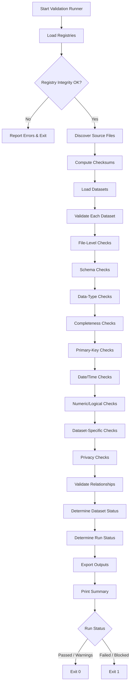

# Sentinel360 Healthcare — Data Validation Engine Specification

## 1. Purpose

Build a reusable, deterministic data-validation engine for Sentinel360 Healthcare that validates exported synthetic demo datasets, future uploaded datasets, and future transformed datasets before they enter analytical processing.

## 2. Scope

The engine validates 13 source datasets without modifying source data, calculating KPIs, assigning statuses, running forecasts, simulating scenarios, calculating financial impact, or generating recommendations.

## 3. Validation Architecture

```
┌─────────────────────────────────────────────────────────────┐
│                    Validation Runner                        │
│  (src/run_data_validation.py)                               │
│  - CLI entry point                                          │
│  - Loads registries, discovers files, runs engine           │
│  - Exports outputs, prints summary, returns exit code       │
└─────────────────────────────────────────────────────────────┘
                              │
                              ▼
┌─────────────────────────────────────────────────────────────┐
│                 Data Validation Engine                      │
│  (src/data_validation_engine.py)                            │
│  - File-level validation                                    │
│  - Schema validation                                        │
│  - Data-type validation                                     │
│  - Completeness validation                                  │
│  - Primary-key validation                                   │
│  - Foreign-key validation                                   │
│  - Date/timestamp validation                                │
│  - Numeric/logical validation                               │
│  - Dataset-specific validation                              │
│  - Privacy validation                                       │
│  - Configuration-readiness validation                       │
└─────────────────────────────────────────────────────────────┘
                              │
              ┌───────────────┼───────────────┐
              ▼               ▼               ▼
┌─────────────────┐ ┌─────────────────┐ ┌─────────────────┐
│  Config Loader  │ │  Typed Models   │ │  Output Writers │
│(validation_     │ │(validation_     │ │(run_data_       │
│ config_loader)  │ │ models)         │ │ validation)     │
└─────────────────┘ └─────────────────┘ └─────────────────┘
```

## 4. Input Datasets

1. `hospital_master.csv`
2. `department_master.csv`
3. `staff_role_master.csv`
4. `staff_master.csv`
5. `staff_roster.csv`
6. `staff_attendance.csv`
7. `staffing_requirement.csv`
8. `patient_encounters.csv`
9. `patient_queue_records.csv`
10. `bed_capacity_records.csv`
11. `patient_complaints.csv`
12. `patient_surveys.csv`
13. `service_schedule.csv`

## 5. Validation Registries

### 5.1 Schema Registry

Loaded by `validation_config_loader.load_dataset_schema_registry()`. Contains per-dataset:
- columns (all)
- required_columns
- optional_columns
- primary_key
- date_fields
- datetime_fields
- numeric_fields
- boolean_fields
- categorical_fields
- domain_values

### 5.2 Relationship Registry

Loaded by `validation_config_loader.load_relationship_registry()`. Defines parent-child foreign-key relationships with mandatory/optional flags.

### 5.3 Validation Rule Registry

Loaded by `validation_config_loader.load_validation_rule_registry()`. Contains rule metadata: test_id, dataset_name, field_name, issue_type, severity, blocks_processing, manual_override_allowed, description.

## 6. File-Level Validation

- Required file is present.
- File extension is CSV.
- File is readable (UTF-8).
- File is non-corrupt.
- File is not empty unless allowed.
- Unexpected source CSVs are reported.
- File size is captured.

A missing mandatory dataset blocks the validation run.

## 7. Schema Validation

- Required columns exist.
- Unexpected columns are reported (Warning unless prohibited identifier, then Critical).
- Duplicate column names are blocked.
- Column order is observed but does not block.
- Primary-key field exists.
- Required parent-reference fields exist.

## 8. Data-Type Validation

Validates parseability for strings, dates, datetimes, integers, numeric decimals, booleans, and categorical fields. Uses temporary parsed series in memory; does not overwrite source values.

## 9. Completeness Validation

Validates missing required values. Blank optional fields are not errors. Missing mandatory primary keys are Critical. Other missing required values follow the rule registry.

## 10. Primary-Key Validation

- Null primary keys
- Blank primary keys
- Duplicate primary keys
- Primary keys loaded as floating-point values
- Leading or trailing whitespace

Duplicate mandatory primary keys block the dataset.

## 11. Foreign-Key Validation

Validates all approved relationships. Optional null foreign keys are not treated as orphans. Populated invalid foreign keys are reported. Mandatory orphan references are Critical.

## 12. Date and Timestamp Validation

- Parseable dates and datetimes
- Effective start before effective end
- Employment start before end
- Service start not before arrival
- Service end not before service start
- Shift end after start
- Complaint received date valid
- Survey response date valid
- Overnight shifts are accepted (end clock time may be earlier)

## 13. Numeric and Logical Validation

- Non-negative values where required
- Scale maximum > scale minimum
- Survey score within declared scale
- Max wait >= average wait
- Served count <= arrivals count
- Logical timestamp ordering

## 14. Dataset-Specific Validation

### 14.1 Bed Capacity
- Operational beds should not normally exceed licensed beds
- Occupied beds above operational with exception metadata is accepted
- Occupied beds above operational without exception reason is detected
- All bed counts non-negative

### 14.2 Staffing and Attendance
- Roster records fall within employment dates
- Attendance staff exists
- Attendance aligns with roster where required
- Status values valid
- Missing attendance is not imputed
- Reassigned staff have valid destination department
- Replacement staff references valid
- Absent records should not show positive hours
- Not-scheduled records should not show positive hours

### 14.3 Patient Encounters and Queue
- Encounter IDs unique
- Timestamps valid and ordered
- Cancelled encounters have reason
- Left-before-service does not require service timestamps
- Served encounters require service timestamps
- Queue counts logically consistent

### 14.4 Complaints
- Complaint IDs unique
- Received date valid
- Status in approved domain
- Duplicate flag and original reference consistent
- Optional encounter link valid where populated

### 14.5 Surveys
- Survey IDs unique
- Response dates valid
- Score within declared scale
- Weight positive where supplied
- Response status valid
- Optional encounter reference valid

## 15. Privacy Validation

Detects prohibited or suspicious column names (case-insensitive):
- patient_name, staff_name, identity_card, ic_number, national_id, passport_number, address, telephone, phone_number, email, diagnosis, clinical_note, medical_record_number, next_of_kin

Prohibited direct-identifier fields are Critical and block processing.

Staff_master contains approved schema fields (email, phone_number, ic_number, address, staff_name) that are kept blank; these are excluded from the prohibited-field check.

## 16. Configuration-Readiness Validation

Checks that required configuration files exist:
- KPI definitions
- Attendance mapping
- Absence mapping
- Threshold placeholders
- Scenario assumptions
- Financial assumptions

Missing configuration files are reported as Warnings, not blocking, unless the next analytical process specifically requires approved thresholds.

## 17. Severity Framework

- **Information**: Observations for awareness
- **Warning**: Non-blocking; processing may continue
- **Error**: May block processing according to rule
- **Critical**: Normally blocks processing

## 18. Blocking Rules

- Missing mandatory dataset: blocks
- Missing required column: blocks
- Null/blank mandatory primary key: blocks
- Duplicate primary key: blocks
- Invalid mandatory foreign key: blocks
- Invalid data type on required field: blocks
- Prohibited identifier column: blocks
- Critical privacy issue: blocks and not overrideable

## 19. Dataset-Status Logic

```
if file missing or unreadable:
    Blocked
elif critical blocking issues exist:
    Blocked
elif error blocking issues exist:
    Rejected
elif review-required issues exist:
    Pending Review
elif warnings exist:
    Valid with Warnings
else:
    Valid
```

## 20. Run-Status Logic

```
if any mandatory dataset is Blocked:
    Blocked
elif any mandatory dataset is Rejected:
    Failed
elif warnings or pending-review items exist:
    Passed with Warnings
else:
    Passed
```

## 21. Manual Override Framework

Structure only; no automatic approval. Requires:
- issue ID
- reason
- requester
- approver
- approval role
- timestamp
- explicit processing decision
- audit reference

Critical privacy issues are not overrideable. Missing mandatory datasets are not normally overrideable. Duplicate mandatory primary keys are not automatically overrideable.

The default `manual_override_register.csv` contains headers only when no override exists.

## 22. Audit Requirements

Audit events recorded:
- Validation Started
- Registry Loaded
- Dataset Loaded
- Dataset Validation Completed
- Relationship Validation Completed
- Validation Completed
- Output Exported

## 23. Validation Outputs

1. `validation_run_manifest.json`
2. `dataset_validation_summary.csv`
3. `validation_issue_log.csv`
4. `record_validation_issue_log.csv`
5. `relationship_validation_summary.csv`
6. `manual_override_register.csv`
7. `validation_audit_log.csv`

## 24. Command-Line Usage

```bash
python src/run_data_validation.py \
  --input-dir data/demo \
  --source-type synthetic_demo \
  --output-dir outputs/logs \
  --collect-record-issues true \
  --max-record-examples 100
```

Exit codes:
- 0: Passed or Passed with Warnings
- non-zero: Failed or Blocked

## 25. Testing Approach

40 pytest tests covering:
- Module imports
- Registry integrity
- Clean data validation
- Blocking behavior
- Warning behavior
- Privacy detection
- Primary-key constraints
- Foreign-key constraints
- Date/timestamp ordering
- Numeric ranges
- Survey scales
- Complaint domains
- Attendance logic
- Bed-capacity exceptions
- Queue consistency
- Source-file immutability
- Output generation
- Audit events
- Reproducibility
- Record-level limits
- No analytical outputs

## 26. Known Limitations

- Validation does not prove the business meaning of source records.
- Manual overrides require explicit approval workflow outside this engine.
- Record-level examples are limited by a technical display limit, not a business threshold.
- Some data-dictionary field names differ from actual demo-export column names; these are noted as Pending Review.

## 27. Readiness Criteria for Step 2D

Step 2C is complete when:
- All 6 implementation/test/documentation files are created.
- All 7 validation output files are generated.
- All existing tests still pass.
- New Step 2C tests pass.
- Clean demo data produces no unresolved blocking issues.
- Expected operational conditions (e.g., occupancy above 100% with metadata) are not misclassified.
- Source data remain unchanged after validation.
- No KPI, forecast, risk, scenario, financial, or recommendation outputs are created.
- No Streamlit code is created.

## 28. Mermaid Validation Flow Diagram


