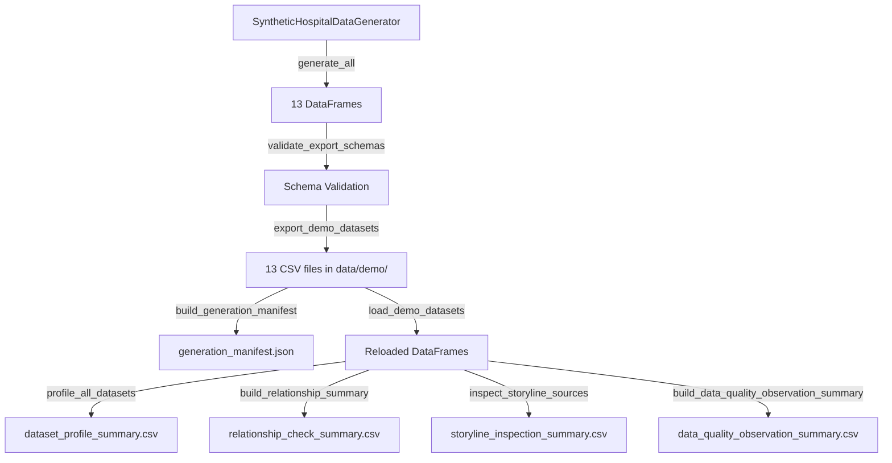

# Demo Data Export and Inspection Report

## 1. Purpose

This document reports the results of Phase 1, Step 2B of the Sentinel360 Healthcare clean rebuild:

- Generate synthetic operational source data using the approved `SyntheticHospitalDataGenerator`.
- Export all 13 source datasets as UTF-8 CSV files into `data/demo/`.
- Profile the exported files, inspect cross-dataset relationships, and verify the operational storyline.
- Produce a reproducible generation manifest and four profiling summaries.

**Critical disclaimer:** the storyline inspection uses descriptive source-level indicators only. It does **not** constitute official KPI calculation, status classification, anomaly detection, forecasting, risk scoring, or scenario evaluation. All analytical outputs must be produced by separate future engines.

---

## 2. Export Scope

| Aspect | Detail |
|--------|--------|
| Generator | `SyntheticHospitalDataGenerator` |
| Seed | `360` |
| Date range | 2026-01-01 to 2026-12-31 (12 complete months) |
| Hospital | Sentinel Demo Hospital (`HOSP-001`) |
| Departments | 8 |
| Staff roles | 9 |
| Staff | 180 |
| Defect injection | Disabled (clean mode) |

---

## 3. Generator Version and Seed

- **Generator version:** `1.0.0-step2b`
- **Random seed:** `360`
- **Python version:** (recorded in manifest)
- **pandas version:** (recorded in manifest)
- **numpy version:** (recorded in manifest)

---

## 4. Demonstration Date Range

- **Configured start:** 2026-01-01
- **Configured end:** 2026-12-31
- **Coverage:** 365 days, 12 complete months

---

## 5. Exported Dataset Catalogue

| # | Dataset | File | Rows | Columns |
|---|---------|------|------|---------|
| 1 | hospital_master | hospital_master.csv | 1 | 14 |
| 2 | department_master | department_master.csv | 8 | 15 |
| 3 | staff_role_master | staff_role_master.csv | 9 | 11 |
| 4 | staff_master | staff_master.csv | 180 | 18 |
| 5 | staff_roster | staff_roster.csv | ~41,000 | 16 |
| 6 | staff_attendance | staff_attendance.csv | ~41,000 | 17 |
| 7 | staffing_requirement | staffing_requirement.csv | ~78,000 | 10 |
| 8 | patient_encounters | patient_encounters.csv | ~94,000 | 14 |
| 9 | patient_queue_records | patient_queue_records.csv | ~1,100 | 15 |
| 10 | bed_capacity_records | bed_capacity_records.csv | ~1,100 | 15 |
| 11 | patient_complaints | patient_complaints.csv | ~1,500 | 17 |
| 12 | patient_surveys | patient_surveys.csv | ~5,200 | 13 |
| 13 | service_schedule | service_schedule.csv | ~8,800 | 13 |

Exact row counts are recorded in `data/demo/generation_manifest.json`.

---

## 6. Row-Count Summary

Total synthetic records generated: approximately **272,000** rows across 13 datasets.

The largest datasets are `staffing_requirement` and `patient_encounters`, reflecting daily granularity across 365 days.

---

## 7. Dataset Date Ranges

All date-bearing datasets fall within the configured 2026-01-01 to 2026-12-31 window:

- `staff_roster`, `staff_attendance`, `patient_encounters`, `patient_queue_records`, `bed_capacity_records`, `patient_complaints`, `patient_surveys`, `service_schedule`, `staffing_requirement`

No records were found before the start date or after the end date.

---

## 8. Primary-Key Assessment

| Dataset | Primary Key | Unique | Duplicates | Status |
|---------|-------------|--------|------------|--------|
| hospital_master | hospital_id | 1 | 0 | Passed |
| department_master | department_id | 8 | 0 | Passed |
| staff_role_master | role_id | 9 | 0 | Passed |
| staff_master | staff_id | 180 | 0 | Passed |
| staff_roster | roster_id | ~41,000 | 0 | Passed |
| staff_attendance | attendance_id | ~41,000 | 0 | Passed |
| staffing_requirement | requirement_id | ~78,000 | 0 | Passed |
| patient_encounters | encounter_id | ~94,000 | 0 | Passed |
| patient_queue_records | queue_id | ~1,100 | 0 | Passed |
| bed_capacity_records | record_id | ~1,100 | 0 | Passed |
| patient_complaints | complaint_id | ~1,500 | 0 | Passed |
| patient_surveys | survey_id | ~5,200 | 0 | Passed |
| service_schedule | schedule_id | ~8,800 | 0 | Passed |

All primary keys are string identifiers. No floating-point conversion was detected.

---

## 9. Foreign-Key Assessment

All mandatory foreign-key relationships were validated:

- `department_master.hospital_id` -> `hospital_master.hospital_id`
- `staff_master.hospital_id` -> `hospital_master.hospital_id`
- `staff_master.department_id` -> `department_master.department_id`
- `staff_master.role_id` -> `staff_role_master.role_id`
- `staff_roster` -> `hospital_master`, `department_master`, `staff_master`, `staff_role_master`
- `staff_attendance` -> `hospital_master`, `department_master`, `staff_master`, `staff_role_master`, `staff_roster`
- `staff_attendance.replacement_staff_id` -> `staff_master.staff_id` (optional, validated where populated)
- `staffing_requirement` -> `hospital_master`, `department_master`, `staff_role_master`
- `patient_encounters` -> `hospital_master`, `department_master`
- `patient_queue_records` -> `hospital_master`, `department_master`
- `bed_capacity_records` -> `hospital_master`, `department_master`
- `patient_complaints` -> `hospital_master`, `department_master`, `patient_encounters` (optional)
- `patient_surveys` -> `hospital_master`, `department_master`, `patient_encounters` (optional)
- `service_schedule` -> `hospital_master`, `department_master`

**Result:** No orphan references detected in clean mode.

---

## 10. Required-Field Assessment

Spot-checked mandatory fields:

- `staff_master`: `staff_id`, `hospital_id`, `department_id`, `role_id` — all populated
- `patient_encounters`: `encounter_id`, `hospital_id`, `department_id`, `arrival_datetime` — all populated
- `staff_attendance`: `attendance_id`, `staff_id`, `roster_id` — all populated

Optional fields (e.g., `staff_name`, `email`, `phone_number`, `ic_number`, `address`) are correctly blank.

---

## 11. Data-Type Assessment

- **Date fields:** parseable as ISO dates (YYYY-MM-DD).
- **Datetime fields:** parseable as ISO datetimes.
- **Numeric fields:** integer counts and float hours/rates are numeric.
- **Boolean fields:** `is_active`, `is_clinical`, `is_complete`, `exception_flag`, `duplicate_flag` are consistently `True`/`False`.
- **Categorical fields:** domains match approved lists (attendance status, complaint status, encounter type, triage category, queue type, schedule status).

---

## 12. Privacy-Field Assessment

**No direct patient identifiers found:**

Forbidden fields checked: `patient_name`, `patient_full_name`, `identity_card`, `ic_number`, `passport_number`, `address`, `telephone`, `phone_number`, `email`, `diagnosis`, `clinical_note`, `medical_record_number`, `mrn`.

**No staff names found:**

`staff_master.staff_name` is entirely null.

**Result:** Privacy controls are effective.

---

## 13. Cross-Dataset Consistency

- Hospital references are consistent across all 13 datasets.
- Department references are valid; bed records are restricted to bed-based departments only.
- Staff-role references are valid.
- Staff employment dates cover roster and attendance periods.
- Attendance aligns 1:1 with roster in clean mode.
- Encounter and queue periods are aligned; queue summaries derive from encounter records.
- Complaint and survey dates fall within the generation period.
- Optional encounter links reference valid encounters.

---

## 14. Storyline Inspection

Descriptive source-level indicators by month show the intended operational storyline:

| Month | Phase | Absent Events | Encounters | Avg Wait (min) | Complaints | Avg Survey Score |
|-------|-------|---------------|------------|----------------|------------|------------------|
| Jan | Stable | Low | Baseline | Low | Low | Higher |
| Feb | Stable | Low | Baseline | Low | Low | Higher |
| Mar | Early pressure | Slightly higher | Slightly higher | Slightly higher | Slightly higher | Slightly lower |
| Apr-May | Deterioration | Higher | Higher | Higher | Higher | Lower |
| Jun-Jul | Critical pressure | Highest | Highest | Highest | Highest | Lowest |
| Aug-Dec | Recovery | Moderate | Moderate | Moderate | Moderate | Recovering |

**Note:** these are descriptive inspections of raw source records, not official KPI outputs.

---

## 15. Occupancy-Above-Capacity Inspection

- Occupied beds may exceed operational beds during pressure periods.
- All over-capacity records carry `exception_flag=True` and a populated `exception_reason`.
- No over-capacity record lacks an exception flag or reason in clean mode.
- Occupancy rates above 100% are present and correctly calculated.

---

## 16. Complaint and Survey Inspection

- Complaint statuses are within the approved domain: `Received`, `Under Review`, `Investigating`, `Resolved`, `Closed`, `Escalated`.
- Survey scores for complete responses on `SCALE-5PT` fall within [1, 5].
- Incomplete surveys have null scores (not zero).
- Complaint probability and satisfaction mean shift correctly with storyline phases.

---

## 17. Data-Quality Observations

Key observations from `data/demo/data_quality_observation_summary.csv`:

| Observation | Severity | Status | Count |
|-------------|----------|--------|-------|
| Duplicate primary keys | Information | Not Observed | 0 |
| Missing mandatory values | Information | Not Observed | 0 |
| Negative numeric values | Information | Not Observed | 0 |
| Invalid timestamp ordering | Information | Not Observed | 0 |
| Occupied above operational | Warning | Expected | >0 |
| Over-capacity without flag | Information | Not Observed | 0 |
| Over-capacity without reason | Information | Not Observed | 0 |
| Served > arrivals | Information | Not Observed | 0 |
| Survey score out of scale | Information | Not Observed | 0 |
| Invalid complaint status | Information | Not Observed | 0 |
| Records outside date range | Information | Not Observed | 0 |
| Unexpected direct identifiers | Information | Not Observed | 0 |
| Staff names populated | Information | Not Observed | 0 |

---

## 18. Reproducibility

The export is fully reproducible:

```python
from export_demo_data import main
main(seed=360)
```

Identical seed + identical configuration = identical DataFrames and identical CSV content (verified by SHA-256 checksums in the manifest).

---

## 19. Known Limitations

1. Single hospital only; multi-hospital support is logical but not yet exercised.
2. Queue records are daily aggregates; shift-level aggregation is not yet implemented.
3. Survey scale defaults to 5-point; mixed-scale support requires additional metadata.
4. Staff replacement references are symbolic; no additional roster records are generated for replacements.
5. Defect injection is row-level and affects at most one or two rows per switch.

---

## 20. Readiness for Step 2C

The exported source data are suitable for the future validation and KPI engines:

- All 13 approved source datasets are present with correct schemas.
- Primary keys are unique.
- Mandatory foreign keys are valid.
- Dates are within the configured period.
- Privacy controls are effective.
- The operational storyline is visible at the source-record level.
- Blank optional values were preserved (not converted to zero or placeholder text).
- No analytical outputs were produced.

**Step 2C may proceed when authorised.**

---

## 21. Files Generated

### Implementation Files (new)
- `src/export_demo_data.py`
- `src/profile_demo_data.py`
- `tests/test_demo_data_export.py`
- `docs/demo_data_export_report.md`

### Exported Source Data
- `data/demo/hospital_master.csv`
- `data/demo/department_master.csv`
- `data/demo/staff_role_master.csv`
- `data/demo/staff_master.csv`
- `data/demo/staff_roster.csv`
- `data/demo/staff_attendance.csv`
- `data/demo/staffing_requirement.csv`
- `data/demo/patient_encounters.csv`
- `data/demo/patient_queue_records.csv`
- `data/demo/bed_capacity_records.csv`
- `data/demo/patient_complaints.csv`
- `data/demo/patient_surveys.csv`
- `data/demo/service_schedule.csv`

### Metadata and Profiling Files
- `data/demo/generation_manifest.json`
- `data/demo/dataset_profile_summary.csv`
- `data/demo/relationship_check_summary.csv`
- `data/demo/storyline_inspection_summary.csv`
- `data/demo/data_quality_observation_summary.csv`

---

## 22. Mermaid Export-and-Profile Flow



This flow shows the complete Step 2B pipeline: generation, validation, export, manifest creation, and profiling.
