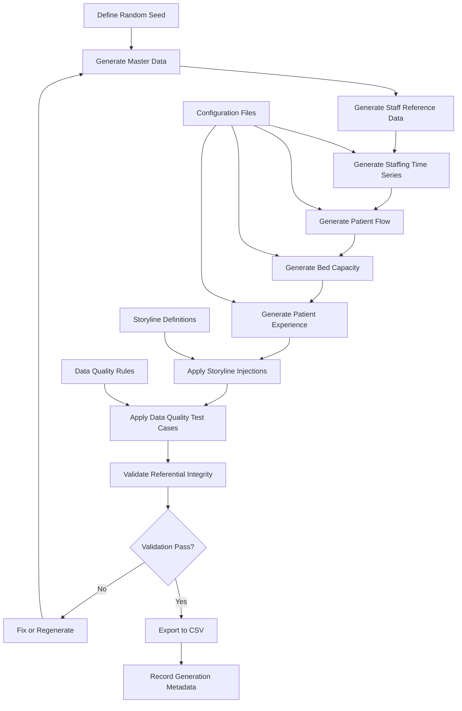

# Demo Data Generation Plan

## Purpose

This document defines the plan for generating synthetic demonstration data for the Sentinel360 Healthcare prototype. It specifies the data structure, record volumes, storyline requirements, test-case scenarios and generation order. No synthetic data is generated in this step. All data will be produced by a future Python script and must flow through the approved KPI engine to produce calculated outputs.

---

## Demo Objectives

1. Provide sufficient data to demonstrate all six headline KPIs.
2. Include periods of Normal, Watch, Warning and Critical status for each KPI.
3. Include cross-domain deterioration storylines to demonstrate connected-risk detection.
4. Include data-quality test cases (missing data, duplicates, outliers, integrity failures).
5. Support scenario simulation and intervention modelling.
6. Support action tracking and outcome review demonstrations.
7. Produce reproducible results through a controlled random seed.
8. Do not invent KPI results; all outputs must be calculated by the future Python engine.

---

## Data Period

| Property | Proposed Value | Approval Status |
|---|---|---|
| Start date | 2026-01-01 | Pending approval |
| End date | 2026-12-31 | Pending approval |
| Total period | 12 months | Pending approval |
| Primary reporting frequency | Monthly | Approved |
| Secondary frequency | Daily and weekly | Approved |

The 12-month period provides sufficient history for trend, persistence and anomaly calculations.

---

## Multi-Hospital Logical Support

The data model must retain multi-hospital support even though the initial demonstration may use a single hospital.

| Property | Value |
|---|---|
| Logical hospital count | Up to 3 |
| Initial demonstration hospital | 1 hospital |
| Hospital identifier format | `HOSP_001`, `HOSP_002`, `HOSP_003` |
| Multi-hospital demo | Deferred to later phase |

---

## Initial Demonstration Hospital Strategy

The initial demonstration will focus on one hospital with the following characteristics:

- Mid-sized general hospital.
- Multiple departments including Emergency, Inpatient Wards, Outpatient Clinics and Surgery.
- Mix of bed-based and non-bed-based service areas.
- Staff roles including doctors, nurses, allied health and administrative.

---

## Department Structure

| Department Code | Department Name | Service Type | Bed-Based |
|---|---|---|---|
| DEPT_ER | Emergency Department | Emergency | false |
| DEPT_MED | Medical Ward | Inpatient | true |
| DEPT_SURG | Surgical Ward | Inpatient | true |
| DEPT_OPD | Outpatient Clinics | Outpatient | false |
| DEPT_DIAG | Diagnostic Services | Diagnostic | false |
| DEPT_THEATRE | Operating Theatre | Surgical | false |

---

## Required Source Datasets

The synthetic data must populate the following source datasets defined in `docs/data_dictionary_source.md`:

1. `hospital_master`
2. `department_master`
3. `staff_role_master`
4. `staff_master`
5. `staff_roster`
6. `staff_attendance`
7. `staffing_requirement`
8. `patient_encounters`
9. `patient_queue_records`
10. `bed_capacity_records`
11. `patient_complaints`
12. `patient_surveys`
13. `service_schedule`

---

## Target Record Volumes (Pending Approval)

| Dataset | Proposed Volume | Notes |
|---|---|---|
| hospital_master | 1–3 | Demonstration hospitals |
| department_master | 6+ | Per hospital |
| staff_role_master | 8–12 | Role definitions |
| staff_master | 200–400 | Active staff per hospital |
| staff_roster | 50,000–100,000 | Daily roster entries for 12 months |
| staff_attendance | 50,000–100,000 | Matched to roster |
| staffing_requirement | 5,000–10,000 | Department-shift-role requirements |
| patient_encounters | 100,000–200,000 | 12-month encounter volume |
| patient_queue_records | 80,000–150,000 | Queue events |
| bed_capacity_records | 15,000–30,000 | Daily snapshots or intervals |
| patient_complaints | 500–1,500 | 12-month complaint volume |
| patient_surveys | 2,000–5,000 | Valid survey responses |
| service_schedule | 50–100 | Service definitions |

All volumes are indicative and pending approval. The generation script must make volumes configurable.

---

## Required Healthy, Warning and Critical Periods

Each KPI must demonstrate at least:

| Status | Minimum Periods | Purpose |
|---|---|---|
| Normal | 4+ | Establish baseline behaviour |
| Watch | 2+ | Demonstrate early-warning detection |
| Warning | 2+ | Demonstrate threshold breach |
| Critical | 1+ | Demonstrate escalation |
| Not Available / Insufficient Data | 1+ | Demonstrate data-quality handling |

The storyline must distribute these periods across the 12-month timeline, not cluster them artificially.

---

## Cross-Domain Deterioration Storyline

A connected deterioration storyline must be embedded in the data to demonstrate cross-KPI association detection:

### Storyline 1: Workforce Pressure

- Month 3–4: Rising absenteeism (Sick Leave, Unauthorised).
- Month 4–5: Falling staffing level.
- Month 5–6: Increasing waiting time (reduced service capacity).
- Month 6–7: Rising complaint rate.
- Month 7–8: Falling satisfaction score.

This demonstrates the workforce-to-operations-to-patient-experience chain.

### Storyline 2: Capacity Surge

- Month 8–9: Bed occupancy rises sharply (admission surge).
- Month 9–10: Waiting time increases (admission delays).
- Month 10–11: Complaint rate rises (overcrowding dissatisfaction).

This demonstrates the capacity-to-operations-to-patient-experience chain.

---

## Staffing-Pressure Storyline

A detailed staffing-pressure narrative:

- **Baseline (Months 1–2):** Normal staffing levels, low absenteeism.
- **Emerging pressure (Month 3):** Absenteeism rises slightly; staffing level dips to Watch.
- **Escalation (Month 4):** Flu season spike in Sick Leave; staffing level reaches Warning.
- **Critical (Month 5):** Multiple simultaneous absences; staffing level reaches Critical in one department.
- **Recovery (Month 6):** Temporary staffing deployed; absenteeism normalises; staffing level improves.
- **Residual (Month 7):** Satisfaction still recovering from earlier service delays.

---

## Capacity-Disruption Storyline

A capacity-disruption narrative:

- **Baseline (Months 1–3):** Normal occupancy, efficient bed turnover.
- **Disruption (Month 8):** Ward closure for maintenance; operational beds reduced.
- **Surge (Month 9):** Post-holiday admission surge; occupancy exceeds 100%.
- **Pressure (Month 10):** Occupancy remains high; waiting time for admission increases.
- **Mitigation (Month 11):** Elective rescheduling and temporary capacity restoration.
- **Recovery (Month 12):** Occupancy normalises; waiting time improves.

---

## Patient-Experience Storyline

A patient-experience narrative:

- **Baseline (Months 1–2):** Normal complaint rate, satisfactory satisfaction scores.
- **Deterioration (Months 5–6):** Long waiting times generate complaints about delays.
- **Peak (Month 7):** Complaint rate reaches Warning; satisfaction dips.
- **Response (Month 8):** Peak-hour communication support deployed.
- **Recovery (Months 9–10):** Complaint rate improves; satisfaction stabilises.
- **Sustained (Months 11–12):** Scores return to baseline.

---

## Scenario-Ready Events

The synthetic data must include events that support scenario simulation:

| Event | Timing | Scenario Trigger |
|---|---|---|
| Staff flu outbreak | Month 4 | Temporary Staffing |
| Ward maintenance closure | Month 8 | Temporary Capacity Restoration |
| Post-holiday surge | Month 9 | Elective Admission Rescheduling |
| Extended clinic trial | Month 6 | Extended Clinic Hours |
| Patient redirection trial | Month 10 | Patient Redirection |
| Communication support deployment | Month 8 | Peak-Hour Communication Support |

---

## Action and Outcome Storyline

The data must support demonstration of the action-tracking workflow:

1. **Month 4:** KPI engine detects Critical staffing level. Recommendation: Temporary Staffing.
2. **Month 4 (Week 2):** Management approves Temporary Staffing. Action assigned to Nursing Director.
3. **Month 5:** Temporary staff deployed. Implementation status: In Progress.
4. **Month 6:** Staffing level improves. Outcome review initiated.
5. **Month 6 (Week 4):** Outcome classification: Improved. Action closed.

---

## Data-Quality Test Cases

### Missing-Data Test Cases

| Test Case | Dataset | Condition | Expected Engine Behaviour |
|---|---|---|---|
| DQ-001 | staff_attendance | 10% random missing records | Completeness reduced; confidence lowered |
| DQ-002 | staffing_requirement | One department missing for one week | Department-level Not Available |
| DQ-003 | bed_capacity_records | One ward missing for three days | Gap disclosure; reduced confidence |
| DQ-004 | patient_queue_records | Missing service_start timestamps | Records excluded; excluded count disclosed |
| DQ-005 | patient_surveys | No responses for one month | Insufficient Data |

### Duplicate-Record Test Cases

| Test Case | Dataset | Condition | Expected Engine Behaviour |
|---|---|---|---|
| DQ-006 | staff_attendance | 1% duplicate records | Duplicates flagged; Data Quality Review Required if unresolvable |
| DQ-007 | patient_complaints | 2 duplicate complaints | Duplicates excluded; audit trail retained |
| DQ-008 | bed_capacity_records | Duplicate daily snapshot | Resolve before calculation |

### Outlier Test Cases

| Test Case | Dataset | Condition | Expected Engine Behaviour |
|---|---|---|---|
| DQ-009 | patient_queue_records | One record with 480-minute wait | Flagged as outlier; not silently removed |
| DQ-010 | bed_capacity_records | Occupied beds = 120, operational = 100 | Overcapacity flag; rate = 120% |
| DQ-011 | staff_attendance | One record with 36-hour shift | Flagged as extreme; excluded if confirmed invalid |

### Referential-Integrity Test Cases

| Test Case | Dataset | Condition | Expected Engine Behaviour |
|---|---|---|---|
| DQ-012 | staff_attendance | Staff ID not in staff_master | Referential integrity failure; record excluded |
| DQ-013 | patient_complaints | Department ID not in department_master | Referential integrity failure; record excluded |
| DQ-014 | bed_capacity_records | Department not bed-based | Excluded from occupancy calculation |

---

## Forecast-History Requirements

To support 7-Day and 30-Day forecast demonstrations:

- Minimum 6 months of continuous daily data.
- Preferably 12 months for seasonal pattern detection.
- No extended gaps exceeding 7 consecutive days in any source dataset.
- Historical data must include the deterioration and recovery storylines to demonstrate forecast trend capture.

---

## Synthetic-Data Privacy

| Rule | Requirement |
|---|---|
| No real patient data | All patient identifiers must be synthetic. |
| No real staff names | All staff names must be synthetic or anonymised. |
| No real contact information | No phone numbers, addresses or emails from real individuals. |
| No real medical records | All clinical data is fictional. |
| Anonymised identifiers | Use synthetic IDs (e.g., `PAT_00001`, `STF_00001`). |
| Consistent anonymisation | The same synthetic individual must have the same identifier throughout. |

---

## Reproducibility Through Random Seed

The data-generation script must accept a random seed parameter to ensure reproducibility.

| Property | Value |
|---|---|
| Default seed | `42` (pending approval) |
| Seed storage | Recorded in generation metadata |
| Same seed behaviour | Identical inputs and seed produce identical synthetic data |
| Seed change | Different seed produces different but structurally similar data |

---

## Data-Generation Acceptance Criteria

The synthetic data generation is accepted when:

1. All 13 source datasets are populated.
2. All six KPIs can be calculated from the data.
3. At least one Normal, Watch, Warning and Critical period exists per KPI.
4. Cross-domain deterioration storylines are detectable.
5. Data-quality test cases are present and handled correctly.
6. No hardcoded KPI results exist; all values are engine-calculated.
7. Reproducibility is demonstrated with a fixed seed.
8. Privacy rules are satisfied.
9. Multi-hospital identifiers are supported even if only one hospital is populated.
10. Generation volumes are configurable.

---

## Proposed Generation Order

```
1. Master data (hospital, department, staff_role, service_schedule)
2. Staff reference data (staff_master)
3. Time-series staffing data (staffing_requirement, staff_roster, staff_attendance)
4. Patient flow data (patient_encounters, patient_queue_records)
5. Capacity data (bed_capacity_records)
6. Experience data (patient_complaints, patient_surveys)
7. Validation and quality checks
8. Export to CSV
```

---

## Mermaid Demo-Data Generation Flow



### Diagram Description

- **Master data** is generated first to provide reference identifiers.
- **Staff and patient data** are generated with storyline injections to create the required status periods.
- **Data-quality test cases** are applied after baseline generation.
- **Validation** confirms referential integrity and logical consistency.
- **Configuration files** feed into generation parameters.
- **Generation metadata** records seed, volumes, timestamps and version.

---

## Document Control

| Property | Value |
|---|---|
| Document Version | 1.0 |
| Phase | Phase 1, Step 1H |
| Status | Draft |
| Next Step | Synthetic data generation (Phase 1 Step 2 or later) |
