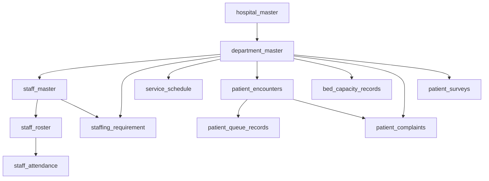
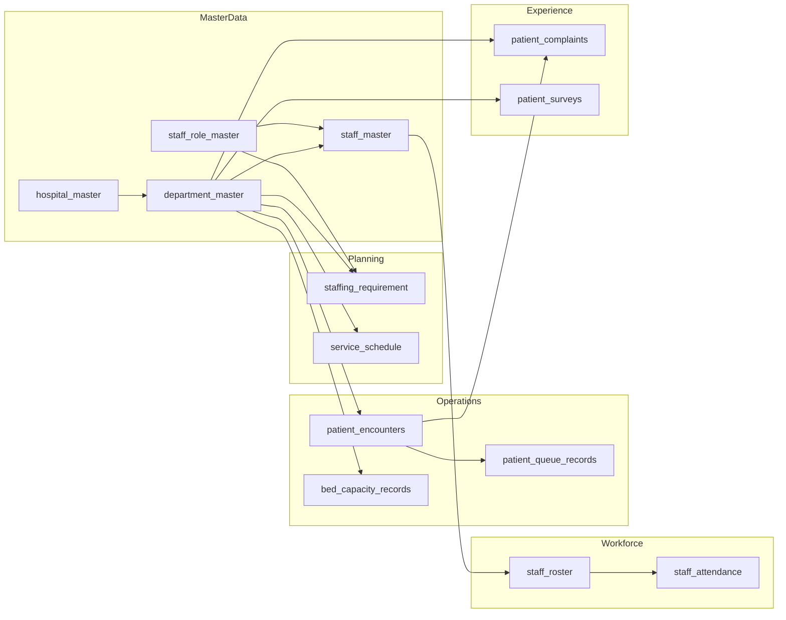

# Demo Data Generator Specification

## 1. Purpose

The `SyntheticHospitalDataGenerator` produces reproducible, record-level synthetic operational source data for the Sentinel360 Healthcare prototype. Its sole purpose is to create realistic raw inputs that future analytical engines will consume.

**Critical distinction:** this generator creates operational source records only. It does **not** create KPI results, status classifications, risk scores, forecasts, recommendations, scenario results, financial-impact results, dashboard summaries, human decisions, or action outcomes. All analytical outputs must be calculated dynamically by separate future engines.

Synthetic patterns do not represent real hospital performance. The fictional data are for prototype demonstration only.

---

## 2. Scope

### In Scope
- Deterministic generation of 13 approved source datasets.
- Configurable operational storylines that create underlying conditions for later analytical discovery.
- Cross-dataset referential integrity and realistic relationships.
- Optional defect-injection switches for future validation-engine testing.
- Privacy-safe anonymisation (no real names, identifiers, or contact details).

### Out of Scope
- KPI calculation, threshold application, or status assignment.
- Forecasting, anomaly detection, trend analysis, or recommendation logic.
- Financial modelling or scenario simulation.
- Database creation, ETL pipelines, or Streamlit page rendering.
- Direct CSV export (reserved for Step 2B).

---

## 3. Generated Datasets

| # | Dataset | Grain | Approx. Volume (Default) |
|---|---------|-------|--------------------------|
| 1 | `hospital_master` | One record per hospital | 1 |
| 2 | `department_master` | One record per department | 8 |
| 3 | `staff_role_master` | One record per role | 9 |
| 4 | `staff_master` | One record per staff member | 180 |
| 5 | `staffing_requirement` | Per date, dept, role, shift | ~72 / day |
| 6 | `service_schedule` | Per date, dept, shift | ~24 / day |
| 7 | `staff_roster` | Per staff, date, shift | ~47,000 / year |
| 8 | `staff_attendance` | Per roster record | ~47,000 / year |
| 9 | `patient_encounters` | Per encounter | ~220 / day |
| 10 | `patient_queue_records` | Per dept, day | ~8 / day |
| 11 | `bed_capacity_records` | Per bed-based dept, day | ~730 / year |
| 12 | `patient_complaints` | Per complaint event | ~3 / day |
| 13 | `patient_surveys` | Per survey response | ~15 / day |

Volumes are configurable and scale with `GeneratorConfig.volumes`.

---

## 4. Generator Architecture

```
┌─────────────────────────────────────────────────────────────┐
│              SyntheticHospitalDataGenerator                 │
│  seed → numpy.random.default_rng (deterministic)            │
│  config → GeneratorConfig (runtime mechanics)               │
├─────────────────────────────────────────────────────────────┤
│  generate_all()                                             │
│    ├── generate_hospital_master()                           │
│    ├── generate_department_master()                         │
│    ├── generate_staff_role_master()                         │
│    ├── generate_staff_master()                              │
│    ├── generate_staffing_requirement()                      │
│    ├── generate_service_schedule()                          │
│    ├── generate_staff_roster()                              │
│    ├── generate_staff_attendance()                          │
│    ├── generate_patient_encounters()                        │
│    ├── generate_patient_queue_records()                     │
│    ├── generate_bed_capacity_records()                      │
│    ├── generate_patient_complaints()                        │
│    ├── generate_patient_surveys()                           │
│    └── _run_self_checks()                                   │
├─────────────────────────────────────────────────────────────┤
│  export_to_csv(output_dir)   [not called automatically]     │
└─────────────────────────────────────────────────────────────┘
```

### Design Principles
- **Determinism:** identical seed + identical config = identical DataFrames.
- **Modularity:** each dataset has its own generation method; dependencies are explicit.
- **Resilience:** downstream generators handle missing parent values gracefully when defects are enabled.
- **Transparency:** every storyline adjustment is documented as a generation mechanic, not a business rule.

---

## 5. Configuration Structure

Configuration lives in `src/demo_generation_config.py` and is exposed through the `GeneratorConfig` dataclass.

### Categories

**A. Generation Mechanics**
- `seed` — deterministic random seed (default: 360).
- `start_date`, `end_date` — simulation period (default: 2026-01-01 to 2026-12-31).
- `hospital`, `departments`, `staff_roles` — master catalogues.
- `shifts` — shift definitions with start/end times and overnight handling.
- `storyline_phases` — operational phase definitions with multipliers.
- `volumes` — approximate record counts.
- `attendance_baseline` — base probability distribution for attendance statuses.
- `survey_scales` — supported survey scales.
- `defects` — Boolean switches for controlled defect injection.

**B. Business Configuration References**
- `CONFIG_DIR` — path to official `config/` CSV files.
- `BUSINESS_CONFIG_FILES` — mapping of business-rule file names.

**C. Future Analytical Rules**
- `FUTURE_ENGINE_RULES` — placeholder descriptions indicating where future engines will load thresholds and formulas.

### Constraints
No official KPI thresholds, approved financial assumptions, or analytical formulas are embedded in the Python configuration.

---

## 6. Reproducibility

1. **Seeded RNG:** every random choice flows from a single `numpy.random.Generator` instantiated with the user-supplied seed.
2. **Deterministic Timestamps:** all `record_created_datetime`, `record_updated_datetime`, and `created_at` fields use a fixed reference datetime (`2026-01-01 00:00:00`) rather than `datetime.now()`.
3. **Ordered Iteration:** generation loops iterate over sorted date ranges and stable catalogue lists.
4. **No Global State:** the generator never touches `numpy.random` global state.

To reproduce the exact same dataset:

```python
from demo_data_generator import SyntheticHospitalDataGenerator
gen = SyntheticHospitalDataGenerator(seed=360)
data = gen.generate_all()
```

---

## 7. Fictional Hospital Structure

- **Hospital ID:** `HOSP-001`
- **Name:** Sentinel Demo Hospital
- **Type:** General Hospital
- **Region:** Central Region
- **Country:** Demo Country
- **Licensed Beds:** 450
- **Status:** Active

The identifier scheme (`HOSP-001`) is chosen to support future multi-hospital expansion without collision.

---

## 8. Department Structure

| Department ID | Name | Type | Bed-Based | Queue | Staffing |
|---------------|------|------|-----------|-------|----------|
| DEPT-ED | Emergency Department | Clinical | No | Yes | Yes |
| DEPT-OPC | Outpatient Clinic | Clinical | No | Yes | Yes |
| DEPT-MED | Medical Ward | Clinical | Yes | No | Yes |
| DEPT-SURG | Surgical Ward | Clinical | Yes | No | Yes |
| DEPT-ICU | Intensive Care Unit | Clinical | Yes | No | Yes |
| DEPT-DIAG | Diagnostic Services | Clinical | No | Yes | Yes |
| DEPT-PEX | Patient Experience | Administrative | No | No | Yes |
| DEPT-ADM | Administration | Administrative | No | No | Yes |

Departments are filtered appropriately per dataset (e.g., bed records exclude non-bed-based departments).

---

## 9. Staff-Role Structure

| Role ID | Role Name | Category | Clinical |
|---------|-----------|----------|----------|
| ROLE-ED-PHY | Emergency Physician | Doctor | Yes |
| ROLE-MO | Medical Officer | Doctor | Yes |
| ROLE-RN | Registered Nurse | Nurse | Yes |
| ROLE-AMO | Assistant Medical Officer | Doctor | Yes |
| ROLE-PHARM | Pharmacist | Allied Health | Yes |
| ROLE-RAD | Radiographer | Allied Health | Yes |
| ROLE-HCA | Healthcare Assistant | Support | Yes |
| ROLE-REG | Registration Clerk | Administrative | No |
| ROLE-PEO | Patient Experience Officer | Administrative | No |

---

## 10. Shift Structure

| Shift Code | Name | Start | End | Hours | Overnight |
|------------|------|-------|-----|-------|-----------|
| MORNING | Morning Shift | 07:00 | 15:00 | 8.0 | No |
| EVENING | Evening Shift | 15:00 | 23:00 | 8.0 | No |
| NIGHT | Night Shift | 23:00 | 07:00 | 8.0 | Yes |

Overnight shifts are handled by adding one calendar day to the end datetime. All shift metadata is centralised in `SHIFT_DEFINITIONS`; no hardcoded shift logic is duplicated across generator methods.

---

## 11. Operational Storyline

The generator supports configurable operating phases. Each phase adjusts underlying event probabilities and volumes so that a future analytical engine can discover a connected deterioration storyline.

### Phase Definitions

| Phase | Months | Name | Absence Factor | Volume Factor | Wait Factor | Complaint Factor | Satisfaction Factor | Bed Demand Factor |
|-------|--------|------|----------------|---------------|-------------|------------------|---------------------|-------------------|
| P1 | 1-2 | Stable period | 1.0 | 1.0 | 1.0 | 1.0 | 1.00 | 1.0 |
| P2 | 3 | Early pressure | 1.3 | 1.1 | 1.15 | 1.2 | 0.98 | 1.05 |
| P3 | 4-5 | Deterioration | 1.8 | 1.25 | 1.4 | 1.6 | 0.92 | 1.15 |
| P4 | 6-7 | Critical pressure | 2.2 | 1.3 | 1.7 | 2.2 | 0.85 | 1.25 |
| P5 | 8-12 | Recovery | 1.4 | 1.15 | 1.25 | 1.4 | 0.94 | 1.1 |

### Intended Analytical Discovery Path

```
Healthy operating period (P1)
    → increasing absenteeism (P2-P4)
    → reduced available staffing
    → longer patient waiting time
    → higher service pressure
    → rising complaint volume
    → declining patient satisfaction
    → intervention / recovery (P5)
```

**Important:** the generator creates the underlying source events only. It does not generate the final KPI outcomes. The future KPI engine must calculate all movements from these raw records.

---

## 12. Dataset Dependencies



Generation order respects these dependencies: master data first, then dependent operational datasets.

---

## 13. Dataset-Specific Generation Logic

### hospital_master
Single fictional hospital with valid effective dates and source-system metadata.

### department_master
Eight departments linked to the hospital. Bed-based departments carry licensed bed counts. No orphan references.

### staff_role_master
Nine roles with staff categories, clinical flags, and effective dates.

### staff_master
Anonymised staff records (no names, emails, phone numbers, IC numbers, or addresses). Employment type, FTE, and validity period are generated per staff member.

### staffing_requirement
Approved required staff counts and hours by date, department, shift, and role. Counts are positive integers derived from department size and role category.

### service_schedule
Planned sessions per department and shift. During critical phases, occasional `Reduced` or `Cancelled` statuses appear with lower planned capacity.

### staff_roster
Planned assignments based on employment type work probability (Full-Time ~5/7, Part-Time ~3/7, Contract ~4/7). Respects employment start and end dates. No duplicate assignments in clean mode.

### staff_attendance
Actual attendance aligned 1:1 with roster records. Status probabilities are adjusted by storyline phase:
- Present probability decreases as absenteeism pressure rises.
- Absent, Late, and Partial probabilities increase proportionally.
- Actual hours are consistent with status (e.g., Partial = 25-60% of planned hours).
- Reassigned staff receive a replacement reference.
- Missing records appear only when the explicit defect switch is enabled.

### patient_encounters
Individual arrivals with arrival, service-start, and service-end timestamps. Triage category drives base wait time. Phase factors scale wait times and daily volume. Realistic hourly arrival distribution (peaks in morning and afternoon). Occasional `Cancelled` or `Left Before Service` statuses.

### patient_queue_records
Derived from encounter records by department and date. Computes arrivals, served, waiting counts, and wait-time statistics (average, median, maximum). This ensures queue summaries are consistent with underlying encounter data rather than independently invented.

### bed_capacity_records
Daily snapshots for bed-based departments only. Licensed, staffed, operational, occupied, unavailable, and reserved beds are generated. Occupied beds may exceed operational beds during pressure phases; when this occurs, `exception_flag=True` and `exception_reason` is populated in clean mode. No capping is applied.

### patient_complaints
Complaint events with channel, category, severity, and status. Complaint probability scales with storyline phase. Optional linkage to valid encounters. Formal complaints are modelled directly; social-media signals are not mixed in unless configured.

### patient_surveys
Anonymised survey responses on a 5-point Likert scale by default. Score distributions shift lower during pressure phases. Response weight and completeness flags are included. Incomplete responses have null scores.

---

## 14. Cross-Dataset Consistency

The generator maintains the following consistency rules:

- Hospital IDs in dependent datasets reference `hospital_master`.
- Department IDs reference `department_master`; bed records are restricted to bed-based departments.
- Staff role IDs reference `staff_role_master`.
- Staff IDs reference `staff_master`; roster and attendance respect employment validity periods.
- Attendance records align 1:1 with roster records (clean mode).
- Encounter and queue periods are aligned; queue records derive from encounters.
- Complaint and survey dates fall within the configured generation period.
- Optional complaint/survey encounter links reference valid encounters.
- Consistent `source_system` and generation-run metadata per approved schema.

No orphan foreign keys exist unless an explicit defect-injection switch is enabled.

---

## 15. Defect Injection

Optional defect-injection switches are provided for future validation-engine testing. Default: all disabled.

| Switch | Effect |
|--------|--------|
| `missing_required_values` | Nullifies a mandatory field (e.g., `employment_type`). |
| `duplicate_primary_keys` | Duplicates a primary key in `hospital_master` or `patient_complaints`. |
| `unknown_hospital_reference` | Replaces a hospital ID with a non-existent value. |
| `unknown_department_reference` | Replaces a department ID with a non-existent value. |
| `invalid_staff_role_reference` | Replaces a role ID with a non-existent value. |
| `attendance_without_roster` | Creates an attendance record with a non-existent roster ID. |
| `negative_values` | Injects a negative required-staff count. |
| `invalid_date_order` | Reverses start/end datetimes in roster or encounters. |
| `occupied_above_operational_no_reason` | Sets `exception_flag=False` when occupied > operational. |
| `invalid_survey_scale` | Sets a survey score outside the declared scale. |
| `invalid_complaint_status` | Sets an unrecognised complaint status string. |
| `stale_source_data` | Reserved for future stale-date injection. |
| `missing_configuration_reference` | Reserved for future missing-config injection. |

Self-checks skip the corresponding validation when a defect switch is active, allowing defective datasets to be generated without internal assertion failures.

---

## 16. Privacy Safeguards

- **No real names:** `staff_name`, `email`, `phone_number`, `ic_number`, and `address` are explicitly set to null.
- **Anonymised staff IDs:** synthetic tokens such as `STAFF-0001`.
- **Anonymised patient IDs:** synthetic tokens such as `PAT-0000000001`.
- **No clinical notes, diagnoses, or medical histories.**
- **No direct identifiers** in any generated dataset.

---

## 17. Known Limitations

1. **Single hospital:** the default configuration generates one hospital, but the identifier scheme supports multi-hospital expansion.
2. **Simplified queue derivation:** queue records are daily aggregates; hourly or shift-level aggregation is not yet implemented.
3. **No real-world seasonality:** month-level phase factors approximate seasonality but do not model real epidemiological curves.
4. **Fixed survey scale:** the default uses a 5-point scale; mixed-scale generation requires additional scale metadata configuration.
5. **Staff replacement is symbolic:** replacement references point to valid staff IDs but do not generate additional roster records for the replacement.
6. **Defect injection is row-level:** each switch affects at most one or two rows for demonstration; it does not produce large-scale corruption.

---

## 18. Testing Approach

Automated tests in `tests/test_demo_data_generator.py` cover:

1. Generator initialisation.
2. Deterministic output from identical seed and configuration.
3. Different output from a different seed.
4. All 13 datasets are returned.
5. Required columns exist per dataset.
6. Primary keys are unique (clean mode).
7. Foreign keys are valid (clean mode).
8. Date range is respected.
9. No direct patient identifiers exist.
10. No staff names or contact details exist.
11. Non-negative numeric fields where required.
12. Valid timestamp ordering (arrival ≤ service_start ≤ service_end).
13. Attendance-roster reconciliation (1:1 alignment).
14. Bed records restricted to valid bed-based departments.
15. Survey scores within declared scales.
16. Complaint statuses are valid domain values.
17. Clean mode produces no intentional data defects.
18. Defect mode produces the requested reproducible defect.
19. Occupancy source conditions may exceed operational capacity.
20. `generate_all()` does not write files automatically.

Tests use `pytest` and avoid asserting hardcoded KPI outputs.

---

## 19. Step 2B Export Plan

`generate_all()` returns a dictionary of pandas DataFrames. It does **not** write CSV files.

A separate method `export_to_csv(output_dir)` is provided for Step 2B. When called, it will write:

```
outputs/
├── hospital_master.csv
├── department_master.csv
├── staff_role_master.csv
├── staff_master.csv
├── staffing_requirement.csv
├── service_schedule.csv
├── staff_roster.csv
├── staff_attendance.csv
├── patient_encounters.csv
├── patient_queue_records.csv
├── bed_capacity_records.csv
├── patient_complaints.csv
└── patient_surveys.csv
```

Step 2B will instantiate the generator, call `generate_all()`, optionally apply additional transformations, and then invoke `export_to_csv()`.

---

## 20. Mermaid Generation Dependency Diagram



This diagram shows the logical generation order and cross-dataset dependencies. Arrows indicate "is referenced by" or "is derived from."
