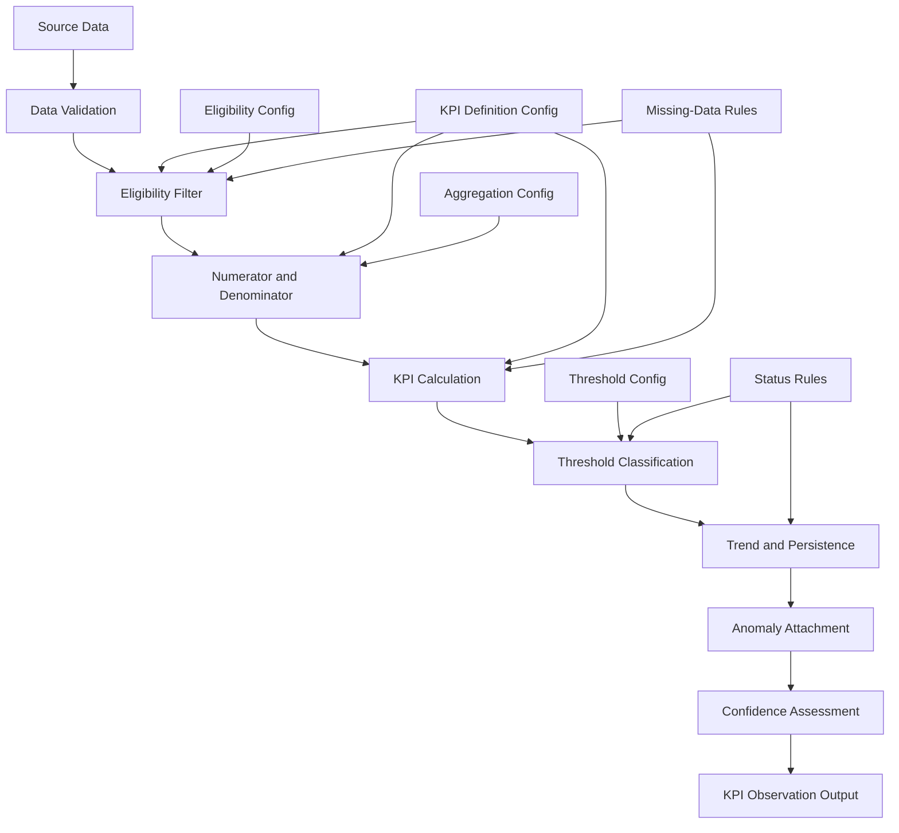

# KPI Calculation Specification

## Purpose

This document converts the approved KPI definitions into testable functional requirements for the future KPI engine. It specifies the required inputs, standard calculation context, output structure, processing sequence, edge-case handling, aggregation rules, validation tests and acceptance criteria. No code, data or threshold values are created in this step.

---

## 1. Required Inputs

### Source Datasets by KPI

| KPI Code | KPI Name | Required Source Datasets | Required Configuration |
|---|---|---|---|
| WF_STAFF_LEVEL | Staffing Level | `staffing_requirement`, `staff_attendance` | `kpi_definition_config`, `kpi_threshold_config`, staffing requirement values |
| WF_ABSENTEEISM | Staff Absenteeism Rate | `staff_roster`, `staff_attendance` | `kpi_definition_config`, `kpi_threshold_config`, roster values |
| OP_BED_OCCUPANCY | Bed Occupancy Rate | `bed_capacity_records` | `kpi_definition_config`, `kpi_threshold_config`, capacity values |
| OP_WAIT_TIME | Average Patient Waiting Time | `patient_queue_records`, `patient_encounters` | `kpi_definition_config`, `kpi_threshold_config`, timestamp validation |
| PX_COMPLAINT_RATE | Patient Complaint Rate | `patient_complaints`, `patient_encounters` | `kpi_definition_config`, `kpi_threshold_config`, complaint status mapping |
| PX_SATISFACTION | Patient Satisfaction Score | `patient_surveys` | `kpi_definition_config`, `kpi_threshold_config`, survey scale values |

### Supporting Datasets (All KPIs)

- `hospital_master`
- `department_master`
- `staff_master`
- `staff_role_master`
- `service_schedule`

---

## 2. Standard Calculation Context

Every KPI calculation must receive the following context parameters:

| Parameter | Description | Required |
|---|---|---|
| `hospital_id` | Hospital identifier for which the KPI is calculated. | Yes |
| `department_id` | Optional department identifier. If null, calculate at hospital level. | No |
| `reporting_period_start` | Start date of the reporting period (inclusive). | Yes |
| `reporting_period_end` | End date of the reporting period (inclusive). | Yes |
| `calculation_frequency` | Frequency of calculation (e.g., Daily, Weekly, Monthly). | Yes |
| `source_upload_id` | Identifier linking to the specific source data upload. | Yes |
| `processing_run_id` | Identifier for the processing run instance. | Yes |
| `configuration_version` | Version of the configuration dataset used. | Yes |
| `calculation_version` | Version of the calculation logic used. | Yes |

---

## 3. Standard KPI Output Structure

The future KPI observation dataset must contain the following logical fields:

| Field | Description |
|---|---|
| `kpi_observation_id` | Unique identifier for this KPI observation record. |
| `hospital_id` | Hospital identifier. |
| `department_id` | Department identifier (null for hospital-level observations). |
| `kpi_id` | Internal KPI identifier. |
| `kpi_code` | Standardised KPI code (e.g., `WF_STAFF_LEVEL`). |
| `reporting_period_start` | Start date of the reporting period. |
| `reporting_period_end` | End date of the reporting period. |
| `calculation_frequency` | Frequency of calculation. |
| `numerator_value` | Calculated numerator value. |
| `denominator_value` | Calculated denominator value. |
| `kpi_value` | Final calculated KPI value. |
| `unit` | Unit of measurement (Percent, Minutes, etc.). |
| `performance_direction` | Higher Is Better, Lower Is Better or Target Range. |
| `calculation_method` | Method used (e.g., hour-based, count-based, interval-based). |
| `fallback_method_used` | Indicator if a fallback method was applied. |
| `eligible_record_count` | Count of records included in the calculation. |
| `excluded_record_count` | Count of records excluded from the calculation. |
| `data_completeness_percentage` | Percentage of expected data that was available. |
| `calculation_eligibility_status` | Eligibility result (Eligible, Ineligible, Partial). |
| `calculation_status` | Calculation result (Success, Failed, Fallback Used). |
| `threshold_status` | Status from threshold classification (Normal, Watch, Warning, Critical, etc.). |
| `management_status` | Human-readable management summary. |
| `trend_direction` | Improving, Stable, Worsening, Volatile, Not Available. |
| `consecutive_breach_periods` | Count of consecutive periods in Warning or Critical. |
| `anomaly_flag` | True if flagged as anomalous, false otherwise. |
| `data_confidence` | High, Medium, Low, Not Available. |
| `source_upload_id` | Link to source data upload. |
| `processing_run_id` | Link to processing run. |
| `configuration_version` | Version of configuration used. |
| `calculation_version` | Version of calculation logic used. |
| `calculated_datetime` | Timestamp when the KPI was calculated. |
| `analytical_limitation` | Text describing any caveats or limitations. |

**Note:** This is a logical output structure. The actual dataset file is not created in this step.

---

## 4. Calculation Sequence

The standard KPI processing sequence is:

```
Load source data
→ Validate schema
→ Filter hospital and period
→ Validate master-data relationships
→ Apply eligibility rules
→ Remove or flag duplicates
→ Apply approved exclusions
→ Calculate numerator
→ Calculate denominator
→ Check denominator eligibility
→ Calculate KPI
→ Apply fallback only if approved
→ Assign threshold status
→ Calculate trend and persistence
→ Attach confidence and limitations
→ Write traceable output
```

### Sequence Description

1. **Load source data:** Retrieve required source datasets for the reporting period.
2. **Validate schema:** Confirm that required fields exist and have valid data types.
3. **Filter hospital and period:** Restrict records to the specified hospital and date range.
4. **Validate master-data relationships:** Confirm that foreign keys reference valid master records.
5. **Apply eligibility rules:** Filter records based on KPI-specific eligibility criteria.
6. **Remove or flag duplicates:** Resolve duplicate records according to approved deduplication rules.
7. **Apply approved exclusions:** Remove records that match exclusion criteria.
8. **Calculate numerator:** Aggregate eligible records to produce the numerator.
9. **Calculate denominator:** Aggregate eligible records to produce the denominator.
10. **Check denominator eligibility:** Verify denominator is greater than zero (or meets approved minimum).
11. **Calculate KPI:** Apply the approved formula.
12. **Apply fallback only if approved:** Use fallback method only if explicitly approved and documented.
13. **Assign threshold status:** Compare KPI value against approved thresholds using status logic.
14. **Calculate trend and persistence:** Evaluate trend direction and persistence metrics.
15. **Attach confidence and limitations:** Assess data confidence and record any limitations.
16. **Write traceable output:** Persist the KPI observation with full traceability fields.

---

## 5. KPI-Specific Processing Requirements

### 5.1 WF_STAFF_LEVEL: Staffing Level

**Required joins:**
- `staffing_requirement` joined to `department_master` on `department_id`
- `staff_attendance` joined to `staff_master` on `staff_id`
- `staff_attendance` joined to `staff_role_master` on `staff_role_id`
- Align by hospital, department, date, shift and staff role

**Required filters:**
- `staff_master.is_active = true`
- `staffing_requirement.required_hours > 0`
- Attendance date within reporting period
- Roster status not equal to Cancelled

**Numerator construction:**
Sum of `actual_hours` or equivalent from eligible attendance records where attendance status is classified as available per configuration.

**Denominator construction:**
Sum of `required_hours` from `staffing_requirement` for the matched hospital, department, date, shift and staff role.

**Aggregation:**
- Shift to day: sum of eligible actual hours / sum of required hours
- Day to period: sum of all eligible actual hours / sum of all required hours
- Department to hospital: total actual hours across departments / total required hours across departments

**Exclusions:**
- Cancelled roster assignments
- Inactive staff records
- Duplicate unresolved attendance records
- Records with missing required hours

**Fallback:**
Count-based calculation (actual staff count / required staff count) only if staff-hour data are unavailable and fallback is explicitly approved.

**Output validation:**
- Denominator must be greater than zero.
- Result must be between 0 and 100 (inclusive).
- Values outside this range indicate data error.

**Known edge cases:**
- Required staffing equals zero
- Partial attendance
- Reassigned staff
- Replacement staff
- Overlapping shifts
- Staff working across departments

---

### 5.2 WF_ABSENTEEISM: Staff Absenteeism Rate

**Required joins:**
- `staff_roster` joined to `staff_attendance` on staff, date, shift, department
- `staff_roster` joined to `staff_master` on `staff_id`
- `staff_roster` joined to `staff_role_master` on `staff_role_id`

**Required filters:**
- Roster status not equal to Cancelled
- Attendance date within reporting period
- Scheduled hours greater than zero

**Numerator construction:**
Sum of scheduled hours where attendance status is classified as absence per configuration.

**Denominator construction:**
Sum of eligible scheduled hours from `staff_roster`.

**Aggregation:**
- Shift to day: sum of absent scheduled hours / sum of eligible scheduled hours
- Day to period: sum of all absent scheduled hours / sum of all eligible scheduled hours
- Department to hospital: total absent hours / total scheduled hours

**Exclusions:**
- Cancelled shifts
- Unmatched absence records without corresponding scheduled shift
- Duplicate unresolved records

**Fallback:**
None defined. If roster data are unavailable, return `Not Available`.

**Output validation:**
- Denominator must be greater than zero.
- Result must be between 0 and 100 (inclusive).

**Known edge cases:**
- Scheduled leave
- Training
- Cancelled roster
- Partial absence
- Missing attendance record for scheduled shift
- Replacement staff

---

### 5.3 OP_BED_OCCUPANCY: Bed Occupancy Rate

**Required joins:**
- `bed_capacity_records` joined to `department_master` on `department_id`
- `bed_capacity_records` joined to `hospital_master` on `hospital_id`

**Required filters:**
- `department_master.service_type` includes bed-based services
- `operational_beds > 0`
- `occupied_beds >= 0`
- Record date within reporting period

**Numerator construction:**
Sum of occupied bed-time. For interval data: sum of occupied beds multiplied by interval duration. For snapshot data: sum of occupied beds at each snapshot.

**Denominator construction:**
Sum of operational bed-time. For interval data: sum of operational beds multiplied by interval duration. For snapshot data: sum of operational beds at each snapshot.

**Aggregation:**
- Interval to day: sum of occupied bed-time / sum of operational bed-time
- Day to period: sum of all occupied bed-time / sum of all operational bed-time
- Department to hospital: total occupied bed-time / total operational bed-time

**Exclusions:**
- Departments not classified as bed-based
- Records with `operational_beds = 0`
- Records with negative occupied beds
- Records with unresolved capacity exceptions

**Fallback:**
Daily snapshots may be used if interval data are unavailable and fallback is explicitly approved.

**Output validation:**
- Denominator must be greater than zero.
- Result must be between 0 and 100 (inclusive).
- Occupied beds must not exceed operational beds (flag if so).

**Known edge cases:**
- Zero operational beds
- Occupied beds above operational beds
- Temporary closure
- Interval gaps
- Duplicated snapshots
- Midnight-spanning intervals

---

### 5.4 OP_WAIT_TIME: Average Patient Waiting Time

**Required joins:**
- `patient_queue_records` joined to `patient_encounters` on `encounter_id`
- `patient_encounters` joined to `department_master` on `department_id`
- `patient_queue_records` joined to `service_schedule` on `service_id` (optional)

**Required filters:**
- `arrival_datetime` and `service_start_datetime` are valid timestamps
- `service_start_datetime >= arrival_datetime`
- Encounter status not equal to Cancelled
- Queue date within reporting period

**Numerator construction:**
Sum of waiting minutes: `service_start_datetime - arrival_datetime` in minutes, for each eligible record.

**Denominator construction:**
Count of eligible served patients.

**Aggregation:**
- Record level: `service_start_datetime - arrival_datetime`
- Queue type or encounter type: sum of waiting minutes / count of encounters
- Department level: sum of waiting minutes / count of encounters
- Hospital level: sum of all waiting minutes / count of all encounters

**Exclusions:**
- Cancelled encounters
- Records with invalid timestamps
- Records with negative waiting time
- Patients who left before service (pending approved rule)

**Fallback:**
Weighted average from queue-summary data: `sum(average_wait_minutes * served_count) / sum(served_count)` if encounter-level data are unavailable and fallback is approved.

**Output validation:**
- Denominator must be greater than zero.
- Waiting time must be non-negative.
- Extreme outliers must be flagged, not silently removed.

**Known edge cases:**
- Missing timestamps
- Negative waiting time
- Left before service
- Extreme waiting-time outlier
- Transferred patient
- Multiple queue stages

---

### 5.5 PX_COMPLAINT_RATE: Patient Complaint Rate

**Required joins:**
- `patient_complaints` joined to `patient_encounters` on `encounter_id` (optional)
- `patient_complaints` joined to `department_master` on `department_id`
- `patient_complaints` joined to `hospital_master` on `hospital_id`

**Required filters:**
- Complaint date within reporting period
- Complaint status is classified as valid per configuration
- Encounter date within reporting period (for denominator)

**Numerator construction:**
Count of valid complaint records for the hospital, department and period.

**Denominator construction:**
Count of eligible patient encounters for the same hospital, department and period.

**Aggregation:**
- Complaint level: count of valid complaints
- Encounter level: count of eligible encounters
- Department level: valid complaints / eligible encounters * 1,000
- Hospital level: total valid complaints / total eligible encounters * 1,000

**Exclusions:**
- Duplicate complaints
- Rejected or invalid complaints
- Test records
- Complaints outside reporting period

**Fallback:**
None defined. If encounter volume is unavailable, return `Not Available`.

**Output validation:**
- Denominator must be greater than zero.
- Result must be non-negative.

**Known edge cases:**
- Complaint without encounter link
- Duplicate complaint
- Reopened complaint
- Complaint submitted outside encounter month
- Zero encounters
- Social-media complaint

---

### 5.6 PX_SATISFACTION: Patient Satisfaction Score

**Required joins:**
- `patient_surveys` joined to `patient_encounters` on `encounter_id` (optional)
- `patient_surveys` joined to `department_master` on `department_id`
- `patient_surveys` joined to `hospital_master` on `hospital_id`

**Required filters:**
- Response status = `Valid`
- `scale_maximum > scale_minimum`
- `observed_score >= scale_minimum` and `observed_score <= scale_maximum`
- `response_weight > 0`
- Response date within reporting period

**Numerator construction:**
For each response: `normalised_score = ((observed_score - scale_minimum) / (scale_maximum - scale_minimum)) * 100`
Then: `sum(normalised_score * response_weight)`

**Denominator construction:**
`sum(response_weight)`

**Aggregation:**
- Response level: normalise individual score
- Department level: sum of weighted normalised scores / sum of weights
- Hospital level: sum of all weighted normalised scores / sum of all weights

**Exclusions:**
- Incomplete responses
- Duplicate responses
- Responses with invalid scale
- Responses with negative or zero weight
- Responses outside reporting period

**Fallback:**
None defined. If no valid responses exist, return `Insufficient Data`.

**Output validation:**
- Denominator (sum of weights) must be greater than zero.
- Normalised score must be between 0 and 100 (inclusive).
- `scale_maximum` must be greater than `scale_minimum`.

**Known edge cases:**
- Mixed survey scales
- Invalid scale (maximum <= minimum)
- Duplicate response
- Missing weight
- Very low response volume
- Department not supplied

---

## 6. Edge Cases

### Staffing Level Edge Cases

| Edge Case | Handling |
|---|---|
| Required staffing equals zero | Denominator is invalid. Return `Not Available`. Do not divide by zero. |
| Partial attendance | Do not finalise weighting in this step. Flag for configuration approval. |
| Reassigned staff | Eligibility mapping pending approval. Do not automatically count as available. |
| Replacement staff | Logic for counting replacement staff pending approval. |
| Overlapping shifts | Duplicate or overlapping records must be resolved before calculation. |
| Staff working across departments | Attribution to department must be based on the record, not assumed. |

### Absenteeism Edge Cases

| Edge Case | Handling |
|---|---|
| Scheduled leave | Do not automatically treat as absenteeism unless configuration explicitly approves. |
| Training | Do not automatically treat as absenteeism unless configuration explicitly approves. |
| Cancelled roster | Exclude from denominator. Do not count as absence. |
| Partial absence | Do not finalise weighting in this step. Flag for configuration approval. |
| Missing attendance record for scheduled shift | Flag `Pending Review`. Do not assume absence. |
| Replacement staff | Replacement staff coverage logic pending approval. |

### Bed Occupancy Edge Cases

| Edge Case | Handling |
|---|---|
| Zero operational beds | Denominator invalid. Return `Not Available`. |
| Occupied beds above operational beds | Flag as data error. Do not cap silently. |
| Temporary closure | Closure handling logic pending approval. |
| Interval gaps | Reduce confidence or trigger `Data Quality Review Required`. |
| Duplicated snapshots | Resolve duplicates before calculation. |
| Midnight-spanning intervals | Ensure interval attribution respects reporting-period boundaries. |

### Waiting Time Edge Cases

| Edge Case | Handling |
|---|---|
| Missing timestamps | Exclude record. Do not infer. |
| Negative waiting time | Exclude record. Flag as data error. |
| Left before service | Treatment pending approved rule. Currently exclude or flag. |
| Extreme waiting-time outlier | Flag but do not silently remove. Outlier threshold pending approval. |
| Transferred patient | Attribution to queue stage pending approval. |
| Multiple queue stages | Define official waiting stage pending approval. |

### Complaint Rate Edge Cases

| Edge Case | Handling |
|---|---|
| Complaint without encounter link | May still be counted if hospital, department and period are valid. |
| Duplicate complaint | Do not count twice. Resolution logic pending approval. |
| Reopened complaint | Treatment of reopened complaints pending approval. |
| Complaint submitted outside encounter month | Use complaint date for period attribution, not encounter date. |
| Zero encounters | Denominator invalid. Return `Not Available`. |
| Social-media complaint | Inclusion rules pending approval. |

### Satisfaction Edge Cases

| Edge Case | Handling |
|---|---|
| Mixed survey scales | Normalise each response individually before aggregation. |
| Invalid scale (max <= min) | Exclude response. Flag `Data Quality Review Required`. |
| Duplicate response | Exclude duplicate. Resolution logic pending approval. |
| Missing weight | If weight is missing, treat as 1 only if approved; otherwise exclude. |
| Very low response volume | Label `Low Confidence`. Minimum threshold pending approval. |
| Department not supplied | Attribution logic pending approval. |

---

## 7. Aggregation Rules

### Hierarchy

```
Record → Shift → Day → Reporting Period → Department → Hospital
```

### Rules

1. **Record to shift:** Aggregate individual records to shift level using the KPI-specific formula.
2. **Shift to day:** Aggregate shift-level results to day level using the KPI-specific formula.
3. **Day to month (reporting period):** Aggregate day-level results to the reporting period using the KPI-specific formula.
4. **Department to hospital:** Aggregate department-level results to hospital level using weighted aggregation.
5. **Weighted aggregation:** When combining departments, use the underlying numerator and denominator totals, not the department percentages.
6. **Denominator preservation:** The denominator must be preserved and reported at every aggregation level.
7. **No averaging of percentages:** Do not average department-level percentages to obtain a hospital-level percentage. Recalculate from total numerators and denominators.

### Examples

**Staffing Level (hospital level):**
```
Hospital Staffing Level = (Sum of actual hours across all departments) / (Sum of required hours across all departments) * 100
```
Not: average of department staffing percentages.

**Absenteeism Rate (hospital level):**
```
Hospital Absenteeism Rate = (Sum of absent hours across all departments) / (Sum of scheduled hours across all departments) * 100
```
Not: average of department absenteeism percentages.

**Bed Occupancy (hospital level):**
```
Hospital Bed Occupancy = (Sum of occupied bed-time across all departments) / (Sum of operational bed-time across all departments) * 100
```
Not: average of ward occupancy percentages.

---

## 8. Time-Period Rules

1. **Reporting-period boundaries:** All calculations must respect the explicit `reporting_period_start` and `reporting_period_end` boundaries.
2. **Source-event date:** Use the date appropriate to each KPI:
   - Staffing Level: attendance date
   - Absenteeism: roster date / attendance date
   - Bed Occupancy: capacity record date / interval timestamp
   - Waiting Time: arrival datetime
   - Complaint Rate: complaint date
   - Satisfaction: response date
3. **No future records:** Do not include records with dates after the reporting period end.
4. **Timezone consistency:** All timestamps must be interpreted in a consistent timezone (hospital timezone or UTC, pending approval).
5. **Late-arriving records:** Handle late-arriving records through a new processing version. Do not silently overwrite historical outputs.
6. **Historical outputs:** Once a KPI observation is written for a reporting period, it should not be overwritten. New source data should trigger a new calculation version.

---

## 9. Data-Quality Dependency

The following validation failures affect calculation as described:

| Failure Type | Impact on KPI |
|---|---|
| Critical schema violation (missing required field) | Block calculation. Return `Data Quality Review Required`. |
| Master-data misalignment (invalid foreign key) | Block calculation for affected records. Return `Data Quality Review Required` if widespread. |
| Unresolvable duplicate records | Block calculation. Return `Data Quality Review Required`. |
| Negative denominator value | Block calculation. Return `Data Quality Review Required`. |
| Minor data gap (< approved tolerance) | Allow calculation with reduced confidence. Disclose gap. |
| Moderate data gap (>= approved tolerance) | Return `Insufficient Data` or `Data Quality Review Required` depending on severity. |
| Outlier detected | Flag outlier. Do not silently remove. Allow calculation with disclosure. |
| Incomplete timestamp | Exclude record. Disclose exclusion proportion. |

Do not finalise tolerance percentages. These are pending approval.

---

## 10. Validation Tests

### Test Case Format

| Field | Description |
|---|---|
| Test ID | Unique identifier |
| KPI | Target KPI code |
| Scenario | Brief description of the test scenario |
| Input Condition | Specific input state |
| Expected Calculation Behaviour | How the engine should process the input |
| Expected Eligibility Status | Expected eligibility result |
| Expected Management Status Type | Expected management status |
| Expected Audit Evidence | What should be traceable in the output |

---

### WF_STAFF_LEVEL Tests

| Test ID | KPI | Scenario | Input Condition | Expected Calculation Behaviour | Expected Eligibility Status | Expected Management Status Type | Expected Audit Evidence |
|---|---|---|---|---|---|---|---|
| T-SL-001 | WF_STAFF_LEVEL | Normal calculation | Valid requirement and attendance data, all eligible | Calculate actual hours / required hours * 100 | Eligible | Normal or threshold-based | Numerator, denominator, eligible count, method |
| T-SL-002 | WF_STAFF_LEVEL | Missing requirement | No staffing requirement records for period | Block calculation | Ineligible | Not Available | Missing requirement disclosed |
| T-SL-003 | WF_STAFF_LEVEL | Zero required hours | Required hours = 0 for all records | Block calculation | Ineligible | Not Available | Zero denominator disclosed |
| T-SL-004 | WF_STAFF_LEVEL | Partial attendance | Some attendance marked Partial | Calculate with partial if approved; otherwise flag | Partial | Pending approval | Partial records disclosed |
| T-SL-005 | WF_STAFF_LEVEL | Reassigned staff | Staff marked Reassigned | Count as available only if approved; otherwise exclude | Partial | Pending approval | Reassigned records disclosed |
| T-SL-006 | WF_STAFF_LEVEL | Duplicate attendance | Duplicate attendance records | Flag for review | Ineligible | Data Quality Review Required | Duplicate records disclosed |
| T-SL-007 | WF_STAFF_LEVEL | Inactive staff | Staff with is_active = false | Exclude from calculation | Eligible | Normal or threshold-based | Excluded count disclosed |

### WF_ABSENTEEISM Tests

| Test ID | KPI | Scenario | Input Condition | Expected Calculation Behaviour | Expected Eligibility Status | Expected Management Status Type | Expected Audit Evidence |
|---|---|---|---|---|---|---|---|
| T-AB-001 | WF_ABSENTEEISM | Normal calculation | Valid roster and attendance, some absence | Calculate absent hours / scheduled hours * 100 | Eligible | Normal or threshold-based | Numerator, denominator, eligible count |
| T-AB-002 | WF_ABSENTEEISM | Missing roster | No roster records for period | Block calculation | Ineligible | Not Available | Missing roster disclosed |
| T-AB-003 | WF_ABSENTEEISM | Missing attendance for scheduled shift | Scheduled shift exists, no attendance record | Flag Pending Review | Partial | Pending Review | Missing attendance disclosed |
| T-AB-004 | WF_ABSENTEEISM | Cancelled shift | Roster status = Cancelled | Exclude from denominator | Eligible | Normal or threshold-based | Excluded count disclosed |
| T-AB-005 | WF_ABSENTEEISM | Scheduled leave | Attendance status = Annual Leave | Do not count as absent unless approved | Eligible | Normal or threshold-based | Leave records disclosed |
| T-AB-006 | WF_ABSENTEEISM | Training | Attendance status = Training | Do not count as absent unless approved | Eligible | Normal or threshold-based | Training records disclosed |
| T-AB-007 | WF_ABSENTEEISM | Zero scheduled hours | All scheduled hours = 0 | Block calculation | Ineligible | Not Available | Zero denominator disclosed |

### OP_BED_OCCUPANCY Tests

| Test ID | KPI | Scenario | Input Condition | Expected Calculation Behaviour | Expected Eligibility Status | Expected Management Status Type | Expected Audit Evidence |
|---|---|---|---|---|---|---|---|
| T-BO-001 | OP_BED_OCCUPANCY | Normal calculation | Valid capacity records, operational beds > 0 | Calculate occupied / operational * 100 | Eligible | Normal or threshold-based | Numerator, denominator, record count |
| T-BO-002 | OP_BED_OCCUPANCY | Missing capacity | No bed capacity records | Block calculation | Ineligible | Not Available | Missing data disclosed |
| T-BO-003 | OP_BED_OCCUPANCY | Zero operational beds | operational_beds = 0 | Block calculation | Ineligible | Not Available | Zero denominator disclosed |
| T-BO-004 | OP_BED_OCCUPANCY | Occupied > operational | occupied_beds > operational_beds | Flag data error, allow calculation with disclosure | Eligible | Data Quality Review Required | Excess occupancy disclosed |
| T-BO-005 | OP_BED_OCCUPANCY | Interval gap | Missing interval between records | Reduce confidence or flag review | Partial | Low Confidence or Data Quality Review Required | Gap disclosed |
| T-BO-006 | OP_BED_OCCUPANCY | Non-bed department | Department not bed-based | Exclude from calculation | Eligible | Normal or threshold-based | Excluded departments disclosed |
| T-BO-007 | OP_BED_OCCUPANCY | Duplicate snapshot | Same timestamp recorded twice | Resolve duplicates before calculation | Eligible | Normal or threshold-based | Duplicates disclosed |

### OP_WAIT_TIME Tests

| Test ID | KPI | Scenario | Input Condition | Expected Calculation Behaviour | Expected Eligibility Status | Expected Management Status Type | Expected Audit Evidence |
|---|---|---|---|---|---|---|---|
| T-WT-001 | OP_WAIT_TIME | Normal calculation | Valid arrival and service-start timestamps | Calculate average waiting minutes | Eligible | Normal or threshold-based | Numerator, denominator, encounter count |
| T-WT-002 | OP_WAIT_TIME | Missing timestamp | arrival_datetime or service_start_datetime is null | Exclude record | Partial | Normal or threshold-based | Excluded count disclosed |
| T-WT-003 | OP_WAIT_TIME | Negative waiting time | service_start < arrival | Exclude record, flag error | Partial | Data Quality Review Required | Negative records disclosed |
| T-WT-004 | OP_WAIT_TIME | Left before service | Patient left queue before service start | Exclude or flag per approved rule | Partial | Pending approval | Left-before-service count disclosed |
| T-WT-005 | OP_WAIT_TIME | Extreme outlier | Waiting time far exceeds typical range | Flag outlier, do not remove | Eligible | Normal or threshold-based | Outlier flagged |
| T-WT-006 | OP_WAIT_TIME | Cancelled encounter | encounter_status = Cancelled | Exclude from calculation | Eligible | Normal or threshold-based | Excluded count disclosed |
| T-WT-007 | OP_WAIT_TIME | Insufficient encounters | Eligible encounter count below approved minimum | Block calculation | Ineligible | Insufficient Data | Count disclosed |

### PX_COMPLAINT_RATE Tests

| Test ID | KPI | Scenario | Input Condition | Expected Calculation Behaviour | Expected Eligibility Status | Expected Management Status Type | Expected Audit Evidence |
|---|---|---|---|---|---|---|---|
| T-CR-001 | PX_COMPLAINT_RATE | Normal calculation | Valid complaints and encounters | Calculate complaints / encounters * 1000 | Eligible | Normal or threshold-based | Numerator, denominator, counts |
| T-CR-002 | PX_COMPLAINT_RATE | Missing encounters | No encounter records for period | Block calculation | Ineligible | Not Available | Missing denominator disclosed |
| T-CR-003 | PX_COMPLAINT_RATE | Zero encounters | Encounter count = 0 | Block calculation | Ineligible | Not Available | Zero denominator disclosed |
| T-CR-004 | PX_COMPLAINT_RATE | Duplicate complaint | Same complaint recorded twice | Do not count twice | Eligible | Normal or threshold-based | Duplicates disclosed |
| T-CR-005 | PX_COMPLAINT_RATE | Rejected complaint | complaint_status = Rejected | Exclude from numerator | Eligible | Normal or threshold-based | Rejected count disclosed |
| T-CR-006 | PX_COMPLAINT_RATE | Complaint without encounter | Valid complaint, no encounter link | Count if hospital, dept, period valid | Eligible | Normal or threshold-based | Unlinked count disclosed |
| T-CR-007 | PX_COMPLAINT_RATE | Test record | complaint_status = Test | Exclude from numerator | Eligible | Normal or threshold-based | Test count disclosed |

### PX_SATISFACTION Tests

| Test ID | KPI | Scenario | Input Condition | Expected Calculation Behaviour | Expected Eligibility Status | Expected Management Status Type | Expected Audit Evidence |
|---|---|---|---|---|---|---|---|
| T-SS-001 | PX_SATISFACTION | Normal calculation | Valid responses with scale and weight | Normalise and weight responses | Eligible | Normal or threshold-based | Normalised scores, weights, count |
| T-SS-002 | PX_SATISFACTION | No valid responses | All responses invalid or missing | Block calculation | Ineligible | Insufficient Data | Response count disclosed |
| T-SS-003 | PX_SATISFACTION | Very low volume | Valid responses below approved minimum | Calculate with Low Confidence | Eligible | Low Confidence | Response count disclosed |
| T-SS-004 | PX_SATISFACTION | Invalid scale | scale_maximum <= scale_minimum | Exclude response, flag error | Partial | Data Quality Review Required | Invalid scales disclosed |
| T-SS-005 | PX_SATISFACTION | Score out of range | observed_score > scale_maximum | Exclude response | Partial | Data Quality Review Required | Out-of-range scores disclosed |
| T-SS-006 | PX_SATISFACTION | Duplicate response | Same patient, same survey, same time | Exclude duplicate | Eligible | Normal or threshold-based | Duplicates disclosed |
| T-SS-007 | PX_SATISFACTION | Missing weight | response_weight is null | Exclude or default to 1 if approved | Partial | Pending approval | Missing weights disclosed |

---

## 11. Acceptance Criteria

The KPI specification is accepted when all of the following criteria are met:

1. **Explicit formulas:** Every KPI formula is explicit and unambiguous.
2. **Numerator and denominator defined:** Numerator and denominator are clearly defined for every KPI.
3. **Weighted aggregation defined:** Weighted hospital-level aggregation is defined for all applicable KPIs.
4. **No silent imputation:** Missing data are not silently imputed or assumed.
5. **Multi-level support:** Hospital and department calculations are supported where data permit.
6. **Full traceability:** All outputs include source upload, processing run, configuration version and calculation version.
7. **Configuration-driven status:** Status classification is driven by approved configuration, not hardcoded values.
8. **No hardcoded thresholds:** No numerical threshold is hardcoded in the specification.
9. **Reproducibility:** Identical inputs and configuration must reproduce identical results.
10. **Edge cases documented:** Known edge cases are documented with expected handling.
11. **Validation tests defined:** Test cases cover positive, negative and boundary scenarios for every KPI.
12. **Missing data handled:** Missing data return appropriate statuses (Not Available, Insufficient Data, Data Quality Review Required).

---

## 12. Unresolved Approval Items

The following items require approval in later steps before implementation:

1. **Exact eligible attendance-status mapping** for Staffing Level (which statuses count as available).
2. **Partial-attendance weighting** rules for Staffing Level.
3. **Absenteeism-category mapping** (which categories count as absenteeism).
4. **Fallback count-based staffing formula** approval criteria.
5. **Queue stage** used for official waiting-time KPI definition.
6. **Treatment of left-before-service encounters** for Waiting Time.
7. **Complaint eligibility statuses** (which statuses count as valid complaints).
8. **Survey minimum-response rule** for Satisfaction Score confidence.
9. **Final threshold values** for all six KPIs.
10. **Boundary inclusivity** rules (>, >=, <, <=) for each boundary.
11. **Watch rules** definitions and triggering conditions.
12. **Trend tolerance** values and window definitions.
13. **Anomaly detection method** and parameters.
14. **Confidence scoring** algorithm and thresholds.

---

## 13. Calculation-Flow Diagram



### Diagram Description

- **Source Data:** Raw uploaded datasets (`staffing_requirement`, `staff_attendance`, `staff_roster`, `bed_capacity_records`, `patient_queue_records`, `patient_encounters`, `patient_complaints`, `patient_surveys`).
- **Data Validation:** Schema validation, master-data relationship checks, data type verification.
- **Eligibility Filter:** Apply KPI-specific eligibility rules, remove or flag ineligible records.
- **Numerator and Denominator:** Construct numerator and denominator from eligible records.
- **KPI Calculation:** Apply the approved formula. Use fallback only if approved.
- **Threshold Classification:** Compare KPI value against approved thresholds using status logic.
- **Trend and Persistence:** Calculate trend direction and persistence metrics.
- **Anomaly Attachment:** Run anomaly detection and attach flag (separate from threshold status).
- **Confidence Assessment:** Evaluate data completeness, volume and quality to assign confidence.
- **KPI Observation Output:** Write the fully traceable KPI observation record.

**Configuration feeds:**
- `KPI Definition Config` feeds eligibility, numerator/denominator construction and calculation.
- `Eligibility Config` feeds the eligibility filter.
- `Threshold Config` feeds threshold classification.
- `Missing-Data Rules` feed eligibility and calculation.
- `Aggregation Config` feeds numerator and denominator construction.
- `Status Rules` feed threshold classification and trend/persistence calculation.

---

## Document Control

| Property | Value |
|---|---|
| Document Version | 1.0 |
| Phase | Phase 1, Step 1F |
| Status | Draft - Pending Approval |
| Next Review | Phase 1, Step 1G |
| Unresolved Items | All threshold values; attendance-status mapping; partial-attendance weighting; absenteeism-category mapping; fallback formulas; queue-stage definition; complaint eligibility; survey minimum-response rule; boundary inclusivity; Watch rules; trend tolerance; anomaly method; confidence scoring |
