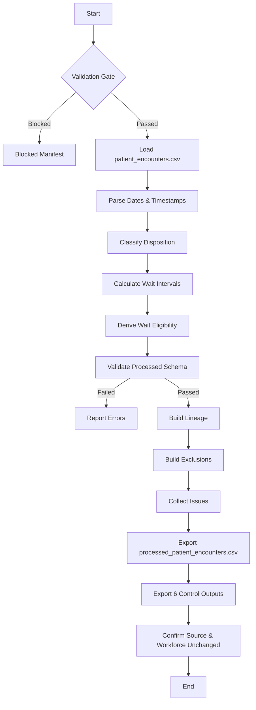

# Patient Encounter Transformation Specification

## Step 2D-3A — Sentinel360 Healthcare Phase 1

---

## 1. Purpose

Transform validated source `patient_encounters.csv` into `processed_patient_encounters.csv` per the approved Step 2D-1 processed schema. Preserve traceability, standardise temporal data, classify dispositions, prepare wait-interval fields, and establish eligibility flags for later analytical steps.

## 2. Scope

### In Scope
- Validation and processing gate enforcement.
- Source identifier preservation.
- Date and timestamp standardisation.
- Preparation-level wait-interval calculation.
- Disposition classification (cancelled, left-before-service, completed).
- Waiting-time eligibility flag preparation.
- Invalid vs analytically ineligible record distinction.
- Lineage, issue, exclusion and audit generation.
- Processed schema validation.

### Out of Scope
- Patient queue, bed capacity, service schedule and patient-flow-daily transformation.
- Average Patient Waiting Time KPI calculation.
- Bed Occupancy Rate KPI calculation.
- KPI status, trend, anomaly, risk, forecast, scenario, financial impact or recommendation generation.

## 3. Source and Target Datasets

| Aspect | Value |
|--------|-------|
| Source dataset | `data/demo/patient_encounters.csv` |
| Target dataset | `data/processed/processed_patient_encounters.csv` |
| Target grain | One row per encounter |
| Primary key | `encounter_id` |

## 4. Validation and Processing Gate

Before transformation, the runner reads:
- `outputs/logs/validation_run_manifest.json`
- `outputs/logs/dataset_validation_summary.csv`
- `outputs/logs/manual_override_register.csv`

Processing is allowed only when:
- `run_status` is `Passed` or `Passed with Warnings`.
- `processing_allowed_flag` is `true`.
- `patient_encounters` dataset status is `Valid` or covered by an approved override.

If blocked, a blocked manifest is created and the runner stops.

## 5. Target Grain and Primary Key

- **Grain:** One row per encounter.
- **Primary key:** `encounter_id`.
- All valid encounter IDs from the source are preserved exactly.

## 6. Approved Target Schema

The output follows the approved processed schema exactly.

Required fields:
- `encounter_id`
- `hospital_id`
- `department_id`
- `encounter_date`
- `reporting_date`
- `reporting_month`
- `encounter_type`
- `arrival_datetime`
- `triage_datetime`
- `consultation_start_datetime`
- `service_end_datetime`
- `disposition_status`
- `cancelled_flag`
- `left_before_service_flag`
- `completed_service_flag`
- `arrival_to_triage_minutes`
- `arrival_to_consultation_minutes`
- `triage_to_consultation_minutes`
- `consultation_to_service_end_minutes`
- `official_wait_stage_eligible_flag`
- `encounter_wait_eligible_flag`
- `exclusion_reason_code`
- `source_primary_key`
- `source_row_number`
- `processing_run_id`
- `validation_run_id`
- `transformation_version`
- `processed_datetime`

No unapproved fields are added.

## 7. Date Standardisation

- `encounter_date` is parsed from the source into a datetime date value.
- `reporting_date` is set equal to the parsed `encounter_date`.
- `reporting_month` is formatted as `YYYY-MM`.
- Unparseable dates result in `NaT` and an issue is recorded.

## 8. Timestamp Standardisation

Required timestamp fields:
- `arrival_datetime`
- `triage_datetime`
- `consultation_start_datetime`
- `service_end_datetime`

Rules:
- Parse valid timestamps using `pd.to_datetime` with `errors="coerce"`.
- Preserve missing timestamps as null (`NaT`).
- Do not infer or impute missing timestamps.
- Do not create fake timestamps.
- If a timestamp cannot be parsed, preserve the source value in issue evidence, set the processed value to null, and record an issue.

## 9. Timestamp-Order Validation

Expected chronological order:

```
arrival_datetime -> triage_datetime -> consultation_start_datetime -> service_end_datetime
```

However:
- Triage may be absent where not applicable.
- Consultation may be absent for cancelled or left-before-service encounters.
- Service end may be absent for encounters not completed.

Impossible order examples:
- Triage before arrival.
- Consultation before arrival.
- Service end before consultation.

For impossible order:
- Record an Error issue.
- Make affected interval fields null.
- Set `encounter_wait_eligible_flag` to `false`.
- Assign `INVALID_TIMESTAMP_ORDER` exclusion reason.
- Preserve the encounter as a source record.
- Do not silently correct timestamp order.

## 10. Cross-Midnight Handling

Valid events crossing midnight are supported natively by full datetime parsing. Intervals are calculated using complete datetime values, not time-of-day only. No special adjustment is required for same-encounter cross-midnight events.

## 11. Wait-Interval Preparation

Calculate only when both required timestamps are valid:

| Interval | Formula |
|----------|---------|
| `arrival_to_triage_minutes` | `triage_datetime - arrival_datetime` |
| `arrival_to_consultation_minutes` | `consultation_start_datetime - arrival_datetime` |
| `triage_to_consultation_minutes` | `consultation_start_datetime - triage_datetime` |
| `consultation_to_service_end_minutes` | `service_end_datetime - consultation_start_datetime` |

Rules:
- Calculate in minutes as float.
- Negative intervals are invalid; they are detected, recorded as issues, and set to null.
- Missing intervals remain null.
- Do not replace null with zero.
- Do not calculate the official Average Patient Waiting Time KPI.
- Do not aggregate encounter intervals in this step.

## 12. Disposition Classification

Derive three Boolean flags from the source `disposition_status` (mapped from `status`):

| Source Status (case-insensitive) | `cancelled_flag` | `left_before_service_flag` | `completed_service_flag` |
|----------------------------------|------------------|---------------------------|--------------------------|
| `cancelled`, `canceled` | `true` | `false` | `false` |
| `left before service`, `left before seen`, `lwbs`, `left` | `false` | `true` | `false` |
| `completed`, `discharged`, `admitted`, `transferred` | `false` | `false` | `true` |

If disposition is unmapped or unsupported:
- Preserve the source value.
- Record a Warning issue.
- Set `completed_service_flag` to `false`.
- Do not guess.

## 13. Cancelled Encounter Treatment

- Remain valid source business records.
- Preserve `cancelled_flag = true`.
- Must not be deleted.
- Normally are not eligible for consultation-based wait preparation.
- Receive `exclusion_reason_code = CANCELLED_ENCOUNTER`.
- Retain lineage.

## 14. Left-Before-Service Treatment

- Remain valid business events.
- Preserve `left_before_service_flag = true`.
- Do not create a consultation timestamp.
- Do not create an arrival-to-consultation interval when consultation did not occur.
- Preserve available earlier-stage intervals.
- Normally are not eligible for consultation-based waiting-time preparation.
- Receive `exclusion_reason_code = LEFT_BEFORE_SERVICE`.
- Retain lineage.

## 15. Completed Encounter Treatment

- Preserve `completed_service_flag = true`.
- May be eligible for later waiting-time calculation when required timestamps are valid.
- Remain ineligible when required timestamps are missing or invalid.
- Must not receive a fake interval.

## 16. Waiting-Time Eligibility

Do not calculate the official waiting-time KPI.

Prepare only:
- Interval fields.
- `official_wait_stage_eligible_flag`.
- `encounter_wait_eligible_flag`.
- `exclusion_reason_code`.

Eligibility rules:
- `encounter_wait_eligible_flag` is `true` only for completed encounters with valid `arrival_datetime` and `consultation_start_datetime`, no invalid timestamp order, and not cancelled or LWBS.
- `official_wait_stage_eligible_flag` is `true` only when the above holds and `triage_datetime` is also present.
- Cancelled and LWBS encounters are always ineligible.
- Encounters with invalid timestamp order are ineligible.

## 17. Invalid vs Analytically Ineligible Records

### Invalid Records
Examples:
- Impossible timestamp order.
- Orphan department reference.
- Missing encounter ID.

### Valid but Analytically Ineligible
Examples:
- Cancelled encounter.
- LWBS encounter without consultation.
- Completed encounter missing required official wait-stage timestamp.

Both types receive exclusion reason codes, but the distinction is preserved in issue severity and description.

## 18. Exclusion Reason Codes

| Code | Description |
|------|-------------|
| `CANCELLED_ENCOUNTER` | Encounter was cancelled. |
| `LEFT_BEFORE_SERVICE` | Patient left before service. |
| `MISSING_ARRIVAL_TIMESTAMP` | Missing arrival timestamp. |
| `MISSING_TRIAGE_TIMESTAMP` | Missing triage timestamp. |
| `MISSING_CONSULTATION_TIMESTAMP` | Missing consultation timestamp. |
| `MISSING_SERVICE_END_TIMESTAMP` | Missing service end timestamp. |
| `INVALID_TIMESTAMP_ORDER` | Timestamps are in impossible chronological order. |
| `UNPARSABLE_TIMESTAMP` | One or more timestamps could not be parsed. |
| `UNSUPPORTED_DISPOSITION_STATUS` | Disposition status not in approved mapping. |
| `FAILED_SOURCE_VALIDATION` | Source record failed validation. |
| `INVALID_DEPARTMENT_RELATIONSHIP` | Department reference invalid. |
| `PENDING_WAIT_STAGE_RULE` | Official wait-stage rule unresolved. |
| `OTHER` | Other exclusion reason. |

## 19. Lineage

Every processed encounter must have at least one lineage row containing:
- `processing_run_id`
- `lineage_id`
- `validation_run_id`
- `source_dataset_name`
- `source_file_name`
- `source_primary_key_field`
- `source_primary_key_value`
- `source_row_number`
- `processed_dataset_name`
- `processed_primary_key_field`
- `processed_primary_key_value`
- `transformation_rule_id`
- `transformation_description`
- `source_fields_used`
- `processed_fields_created`
- `exclusion_flag`
- `exclusion_reason_code`
- `transformation_version`
- `configuration_version`
- `processed_datetime`

The complete source record is not stored in the lineage file.

## 20. Issues and Severity

Severity levels:
- Information
- Warning
- Unsupported Disposition Status
- Error
- Critical

Issue types:
- Invalid Timestamp Order
- Unparsable Timestamp
- Missing Required Timestamp
- Unsupported Disposition Status
- Invalid Wait Interval
- Missing Official Wait-Stage Rule
- Source-to-Reference Mismatch
- Processed Schema Failure
- Other

Normal analytical ineligibility is not classified as Critical.

## 21. Audit Events

Audit events include:
- Processing Started
- Validation Gate Passed
- Source Dataset Loaded
- Encounter Transformation Started
- Timestamp Parsing Completed
- Disposition Classification Completed
- Wait Intervals Calculated
- Wait Eligibility Derived
- Processed Schema Validated
- Lineage Generated
- Exclusion Register Generated
- Outputs Exported
- Source Checksum Confirmed
- Workforce Outputs Confirmed Unchanged
- Processing Completed

## 22. Reproducibility

- Deterministic processing run IDs are generated per execution.
- Source checksums are computed before and after transformation.
- Transformation version is recorded in every output.
- Repeated execution on unchanged source produces identical business content (excluding per-run metadata).

## 23. Testing

Tests cover:
- Module imports and safe execution.
- Validation gate acceptance and rejection.
- Schema compliance.
- File creation control.
- Source immutability.
- Workforce output preservation.
- Identifier preservation and uniqueness.
- Date and timestamp parsing.
- Interval calculation and negative detection.
- Cross-midnight support.
- Disposition classification.
- Eligibility rules.
- Exclusion reason transparency.
- Lineage, issue, exclusion and audit generation.
- Prohibited field absence.

## 24. Known Limitations

- Wait-time KPI percentages are not calculated in this step.
- Official wait-stage eligibility may require clinical rule refinement for encounters without triage.
- The `datetime.utcnow()` deprecation warning is non-breaking and cosmetic.

## 25. Readiness for Step 2D-3B

Step 2D-3A prepares the encounter dataset for downstream use. Step 2D-3B will transform:
- `processed_patient_queue`
- `processed_bed_capacity`
- `processed_service_schedule`

Step 2D-3B will not calculate official KPI percentages, KPI status, trends, anomalies, risks, forecasts, scenarios, financial impact or recommendations.

## 26. Mermaid Encounter-Transformation Flow



---

**Note:** The encounter transformation prepares record-level inputs for later waiting-time calculation. It does not calculate the official Average Patient Waiting Time KPI, KPI status, trend, anomaly, risk, forecast, scenario, financial impact or recommendations.
