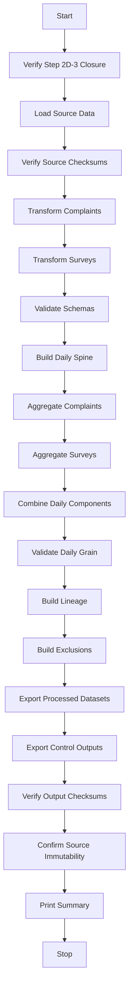

# Patient Experience Transformation Specification

## Step 2D-4

---

## 1. Purpose

Transform validated patient complaint and patient survey source datasets into controlled preparation-level processed datasets. This step preserves source records, standardises identifiers, parses dates safely, classifies preparation fields, and derives daily aggregates without calculating official KPI values.

## 2. Scope

- **In scope**: complaint transformation, survey transformation, daily aggregation, schema validation, business-key validation, lineage, exclusions, audit evidence.
- **Out of scope**: official Patient Complaint Rate, Patient Satisfaction Score KPI, KPI status, trends, anomalies, risks, forecasts, scenarios, financial impact, recommendations, action tracking, complaint-resolution workflow, customer-response workflow, Streamlit pages.

## 3. Source Datasets

| Dataset | File | Rows (demo) |
|---------|------|-------------|
| Patient complaints | `data/demo/patient_complaints.csv` | 1,465 |
| Patient surveys | `data/demo/patient_surveys.csv` | 5,244 |

Reference datasets used for validation:
- `data/processed/processed_hospital_master.csv`
- `data/processed/processed_department_master.csv`

## 4. Source-to-Processed Mappings

### Complaints

| Source Column | Processed Column | Notes |
|---------------|------------------|-------|
| `complaint_id` | `complaint_id` | Preserved exactly |
| `complaint_received_date` | `complaint_date` | Parsed to date; month and year extracted |
| `hospital_id` | `hospital_id` | Validated against hospital master |
| `department_id` | `department_id` | Validated against department master |
| `encounter_id` | `encounter_id` | Preserved if present |
| `complaint_channel` | `complaint_channel` | Preserved; supported-flag set |
| `complaint_category` | `complaint_category` | Preserved; supported-flag set |
| `severity` | `complaint_severity` | Preserved; supported-flag set |
| `description` | `complaint_text_present_flag` | Derived from presence of description |
| `status` | `complaint_status_source` | Preserved as source status |
| `resolution_date` | `resolution_date` | Parsed; validated against complaint date |

### Surveys

| Source Column | Processed Column | Notes |
|---------------|------------------|-------|
| `survey_id` | `survey_id` | Preserved exactly |
| `survey_date` | `survey_date` | Parsed to date; month and year extracted |
| `hospital_id` | `hospital_id` | Validated against hospital master |
| `department_id` | `department_id` | Validated against department master |
| `survey_type` | `survey_type` | Preserved; supported-flag set |
| `scale_id` | `satisfaction_scale_min`, `satisfaction_scale_max` | Derived from known scale mapping |
| `score_value` | `satisfaction_score_numeric`, `satisfaction_score_source` | Preserved; validated against scale |
| `response_weight` | `response_count` | Preserved; not replaced with one if missing |
| `is_complete` | `survey_response_present_flag` | Mapped to boolean |

## 5. Complaint Transformation Rules

1. Preserve complaint ID exactly.
2. Preserve complaint channel.
3. Preserve complaint category.
4. Preserve complaint severity.
5. Preserve unsupported values; do not force into "Other".
6. Do not infer resolution status from complaint age.
7. Do not calculate resolution performance.
8. Do not calculate complaint rate.
9. Do not classify complaint KPI status.
10. Invalid dates are logged as errors and may trigger exclusion.
11. Missing hospital or department references are logged.
12. Duplicate complaint IDs are detected and block processing.
13. Source records are never silently dropped.

## 6. Survey Transformation Rules

1. Preserve original score.
2. Do not overwrite source score.
3. Do not normalise scores unless the source scale is explicitly known.
4. Do not invent scale minimum or maximum.
5. Preserve response count.
6. Do not treat missing response count as one.
7. Do not calculate official satisfaction KPI.
8. Do not weight scores without an approved rule.
9. Do not assume each survey row represents one respondent.
10. Detect impossible scores against known scale.
11. Detect negative response counts.
12. Detect duplicate survey IDs.
13. Log missing hospital or department references.
14. Preserve unsupported survey channels and types.

## 7. Complaint-Category Handling

Supported categories observed in source:
- Facilities
- Waiting Time
- Staff Behaviour
- Communication
- Safety
- Billing
- Clinical Care
- Other

Unsupported categories are preserved and generate Information-level issues.

## 8. Complaint-Channel Handling

Supported channels observed in source:
- Formal Letter
- Third Party
- Online Portal
- Email
- Social Media
- Walk-In
- Phone

Unsupported channels are preserved and generate Information-level issues.

## 9. Severity Handling

Supported severities observed in source:
- Low
- Medium
- High
- Critical

Severity is preserved exactly. It is not inferred from text, keywords, or AI sentiment analysis.

## 10. Survey-Score Handling

Known scale observed in source:
- `SCALE-5PT`: minimum 1, maximum 5

Rules:
- Preserve source score.
- Record observed minimum and maximum from known scale mapping.
- Validate values against known scale.
- If scale is unknown: preserve score, mark as unresolved, do not normalise.
- If multiple scales exist: preserve each, generate Warning.
- Do not assume a 1-5 or 0-100 scale without evidence.

## 11. Response-Count Handling

- Map `response_weight` to `response_count`.
- Preserve nulls; do not replace with one.
- Detect negative values.

## 12. Reference Validation

Complaint and survey references are validated against:
- `processed_hospital_master.csv`
- `processed_department_master.csv`

Checks:
- Hospital exists.
- Department exists.
- No orphan references.
- Blank references are logged.
- Invalid references are not silently corrected.

## 13. Daily Aggregation Grain

One row per:
- `hospital_id`
- `department_id`
- `reporting_date`

Daily spine uses the union of valid complaint and survey dates by hospital and department.

## 14. Daily Identifier

Deterministic format:

```
PEX-{hospital_id}-{department_id}-{YYYYMMDD}
```

Example: `PEX-HOSP-001-DEPT-ED-20260101`

Validated for uniqueness, deterministic generation, and correct date formatting.

## 15. Eligibility Flags

### Complaint flags
- `complaint_record_valid_flag`: basic validation passes
- `complaint_count_eligible_flag`: valid and not excluded
- `complaint_daily_aggregation_eligible_flag`: valid date, hospital, department
- `complaint_category_supported_flag`
- `complaint_channel_supported_flag`
- `complaint_severity_supported_flag`

### Survey flags
- `survey_record_valid_flag`: basic validation passes
- `survey_aggregation_eligible_flag`: valid and not excluded
- `survey_score_eligible_flag`: valid score
- `survey_response_count_eligible_flag`: non-null non-negative response count
- `survey_type_supported_flag`
- `survey_channel_supported_flag`

## 16. Exclusion Rules

Records are not silently dropped. A record may be excluded from daily aggregation when:
- Required date is invalid.
- Required hospital ID is missing.
- Required department ID is missing.
- Hospital or department reference is invalid.
- Duplicate primary key cannot be resolved.
- Record cannot be assigned to a valid daily grain.

Exclusions are recorded explicitly in the exclusion register.

## 17. Issue-Severity Rules

| Severity | Examples |
|----------|----------|
| Information | Unsupported but preserved category/channel/type; blank optional text |
| Warning | Missing optional department; unknown score scale; mixed scales; missing severity; resolution date before complaint date |
| Error | Duplicate ID; invalid required date; negative response count; impossible score; missing required hospital; invalid reference |
| Critical | Missing required source file; required schema unavailable; output cannot be produced safely; source checksum failure |

## 18. Schema Definitions

Three schemas are registered in `src/processed_schema_registry.py`:
- `processed_patient_complaints`
- `processed_patient_surveys`
- `processed_patient_experience_daily`

## 19. Lineage Design

Record-level lineage is created for:
- Each processed complaint row
- Each processed survey row
- Each patient-experience daily row

Daily lineage identifies contributing complaint and survey records and supports:
- Complaints-only rows
- Surveys-only rows
- Combined rows
- 100% output-row lineage coverage

## 20. Relationship Validation

Relationship summary checks:
- Complaints to hospital reference
- Complaints to department reference
- Surveys to hospital reference
- Surveys to department reference
- Daily rows to complaints
- Daily rows to surveys
- Orphan counts
- Valid/invalid relationship counts

## 21. Source Immutability

Before and after processing:
- SHA-256 checksums are calculated for source files.
- Source files are confirmed unchanged.
- Prior processed datasets are confirmed unchanged.

## 22. Reproducibility

Repeated processing of the same source data produces identical business results (excluding timestamps and run IDs).

## 23. Known Limitations

- Survey channel is not present in the source dataset; `survey_channel` is null.
- Survey score normalisation is not applied because official scale rules are unresolved.
- All source response weights are 1.0 in the demo data.
- No encounter-linked surveys exist in the demo data.

## 24. Unresolved Business Rules

The following rules remain Pending Review:

- Official complaint-rate denominator
- Complaint inclusion and exclusion rules for official KPI
- Whether reopened complaints count once or multiple times
- Official complaint severity weighting
- Official complaint status treatment
- Official satisfaction-score scale
- Satisfaction-score normalisation method
- Satisfaction-score weighting by response count
- Minimum survey response threshold
- Handling of mixed survey scales
- Official KPI reporting grain
- Treatment of missing departments
- Treatment of anonymous surveys
- Relationship between survey responses and encounters

These unresolved rules do not block preparation-level processing.

## 25. Prohibited Analytical Outputs

Step 2D-4 explicitly does **not** calculate or output:
- Official Patient Complaint Rate
- Official Patient Satisfaction Score KPI
- KPI status
- Thresholds
- Trends
- Anomaly scores
- Risk scores
- Forecasts
- Scenarios
- Financial impact
- Recommendations
- Action tracking
- Complaint-resolution workflow
- Customer-response workflow
- Streamlit pages

## 26. Readiness for Next Step

Step 2D-4 prepares patient complaint and survey data. The preparation layer is ready for:

**Step 2D-5 — Final Processing Integration and Preparation-Layer Closure**

Step 2D-5 may consolidate workforce, patient-flow and patient-experience processed datasets; verify cross-domain references; verify combined lineage; verify all preparation-level schemas; and formally close the processing layer. Step 2D-5 must still not calculate official KPI values or KPI status.

## 27. Mermaid Processing Flow


