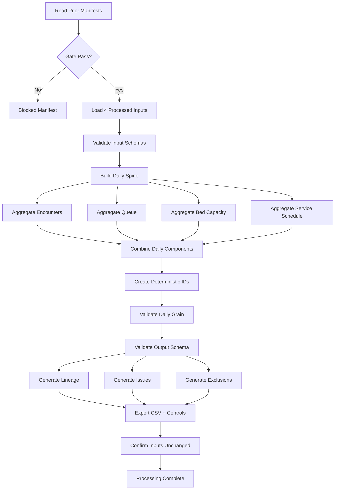

# Patient Flow Daily Specification

## Step 2D-3C

---

## 1. Purpose

Build `processed_patient_flow_daily.csv`, a daily-grain analytical preparation dataset that consolidates approved preparation-level fields from four validated processed inputs.

---

## 2. Scope

This step covers:
- Processing-gate enforcement
- Input validation
- Daily spine creation
- Domain-specific aggregation (encounter, queue, bed, service)
- Deterministic identifier generation
- Schema validation
- Lineage, issue, exclusion and audit logging

This step does **not** calculate official KPIs, KPI status, trends, anomalies, risks, forecasts, scenarios, financial impact or recommendations.

---

## 3. Input Datasets

| Dataset | File | Source Step |
|---------|------|-------------|
| processed_patient_encounters | `data/processed/processed_patient_encounters.csv` | 2D-3A |
| processed_patient_queue | `data/processed/processed_patient_queue.csv` | 2D-3B |
| processed_bed_capacity | `data/processed/processed_bed_capacity.csv` | 2D-3B |
| processed_service_schedule | `data/processed/processed_service_schedule.csv` | 2D-3B |

---

## 4. Output Dataset

| Dataset | File |
|---------|------|
| processed_patient_flow_daily | `data/processed/processed_patient_flow_daily.csv` |

---

## 5. Processing Gate

Before aggregation, verify:
- `patient_encounter_processing_run_manifest.json` exists and `run_status == success`
- `queue_capacity_schedule_processing_run_manifest.json` exists and `run_status == success`
- `processing_allowed_flag` is true where present
- All four processed input datasets exist
- Input checksums match prior run manifests

If blocked, create a blocked manifest and stop.

---

## 6. Target Grain

One row per:
- `hospital_id`
- `department_id`
- `reporting_date`

---

## 7. Daily Spine

Create from the **union** of valid `hospital_id`, `department_id`, `reporting_date` combinations found across all four inputs.

Rules:
- Preserve dates present in at least one valid input
- Do not generate arbitrary dates
- Do not silently remove dates with only one available domain
- `reporting_month` uses `YYYY-MM`

---

## 8. Deterministic Daily Identifier

Format:
```
PFD-{hospital_id}-{department_id}-{YYYYMMDD}
```

Example: `PFD-H1-D1-20240101`

No random UUIDs for the business key.

---

## 9. Encounter Aggregation

Aggregate `processed_patient_encounters` by daily grain.

| Field | Rule |
|-------|------|
| `encounter_count` | Count valid rows |
| `completed_encounter_count` | Count `completed_service_flag == true` |
| `cancelled_encounter_count` | Count `cancelled_flag == true` |
| `left_before_service_count` | Count `left_before_service_flag == true` |
| `official_wait_eligible_encounter_count` | Count `official_wait_stage_eligible_flag == true` |
| `total_arrival_to_consultation_minutes` | Sum only valid, eligible, non-negative values; preserve null when none exist |

---

## 10. Queue Aggregation

Aggregate `processed_patient_queue` by daily grain.

| Field | Rule |
|-------|------|
| `queue_arrivals_count` | Preserve summary or single-record value |
| `queue_served_count` | Preserve summary or single-record value |
| `queue_waiting_patient_count` | Preserve summary or single-record value |
| `queue_average_wait_minutes` | Preserve summary or single-record value |

---

## 11. Queue Double-Counting Protection

- Do not sum arrivals or served counts across stages when doing so would double-count patients.
- If a record is explicitly marked as an overall summary (`summary_source_flag == true`), prefer that summary.
- If multiple stages exist without a summary, set affected fields to null and log a Warning.

---

## 12. Queue Ambiguity Handling

When no approved non-duplicating aggregation rule exists:
- Set affected daily queue fields to null
- Record an Information or Warning issue
- Label the rule as Pending Review
- Do not invent a value

---

## 13. Bed-Capacity Selection

Aggregate or select `processed_bed_capacity` by daily grain.

If one valid record exists per grain, use it directly.

If multiple valid records exist:
- Record a Duplicate Capacity Snapshot issue
- Do not silently sum
- Leave affected daily bed fields null

---

## 14. Duplicate Bed-Snapshot Handling

- Detect duplicate snapshots per `hospital_id`, `department_id`, `reporting_date`
- Log a Warning issue
- Do not apply unapproved selection logic
- Set bed fields to null for that grain

---

## 15. No Occupancy Capping

- `occupied_beds` may exceed `operational_beds`
- Do not cap occupied beds
- Do not calculate Bed Occupancy Rate

---

## 16. Service-Schedule Aggregation

Aggregate `processed_service_schedule` by daily grain.

| Field | Rule |
|-------|------|
| `planned_service_session_count` | Count valid active planned sessions (exclude cancelled) |
| `cancelled_service_session_count` | Count `cancelled_session_flag == true` |
| `reduced_service_session_count` | Count `reduced_session_flag == true` |
| `extended_service_session_count` | Count `extended_session_flag == true` |

---

## 17. Cross-Midnight Handling

- Preserve cross-midnight sessions under their approved reporting date
- Do not duplicate overnight sessions across two dates
- The processed input from Step 2D-3B already assigns the correct reporting date

---

## 18. Null-Versus-Zero Rules

Count fields: use zero when a valid daily row exists but no qualifying records exist.

Measurement and interval fields: preserve null when no valid measurement exists.

Examples that should remain null when unavailable:
- `total_arrival_to_consultation_minutes`
- `queue_average_wait_minutes`
- `licensed_beds`
- `operational_beds`
- `occupied_beds`

---

## 19. Invalid vs Analytically Unavailable Values

- Invalid values (e.g., negative intervals) are excluded from aggregation
- Analytically unavailable values (e.g., no data for a domain on a date) remain null
- Do not convert all blanks to zero

---

## 20. Lineage

Every patient-flow daily row must have lineage.

Because daily rows combine multiple source records, create multiple lineage rows where required.

Lineage includes:
- `processing_run_id`
- `validation_run_id`
- `source_dataset_name`
- `source_primary_key` or aggregation group identifier
- `processed_dataset_name`
- `processed_primary_key_value`
- `transformation_rule_id`
- `source_fields_used`
- `processed_fields_created`
- `exclusion_flag`
- `exclusion_reason`
- `transformation_version`
- `processed_datetime`

Transformation rule IDs:
- `TR_PFD_DAILY_SPINE`
- `TR_PFD_ENCOUNTER_AGGREGATION`
- `TR_PFD_QUEUE_AGGREGATION`
- `TR_PFD_BED_SELECTION`
- `TR_PFD_SERVICE_AGGREGATION`
- `TR_CTRL_LINEAGE`
- `TR_CTRL_EXCLUSION`

---

## 21. Exclusions

Every excluded daily aggregation component must be traceable.

Possible exclusions:
- Invalid source processed record
- Unresolved ambiguous queue-stage aggregation
- Duplicate bed snapshots without approved selection logic
- Missing mandatory hospital or department key
- Invalid reporting date
- Failed processed schema

Create exclusion-register headers even when no exclusions exist.

---

## 22. Issues

Severity levels:
- Information
- Warning
- Error
- Critical

Issue types:
- Missing Processed Input
- Input Manifest Mismatch
- Input Schema Failure
- Ambiguous Queue Aggregation
- Queue Stage Double-Count Risk
- Missing Queue Summary Stage
- Duplicate Capacity Snapshot
- Missing Bed Snapshot
- Invalid Daily Grain
- Duplicate Daily Identifier
- Missing Domain Data
- Lineage Failure
- Processed Schema Failure
- Other

---

## 23. Audit Events

Audit events include:
- Processing Started
- Prior Manifests Verified
- Input Checksums Confirmed
- Input Schemas Validated
- Daily Spine Created
- Encounter Aggregation Completed
- Queue Aggregation Completed
- Bed Aggregation Completed
- Service Aggregation Completed
- Daily Components Combined
- Daily Grain Validated
- Processed Schema Validated
- Lineage Generated
- Exclusion Register Generated
- Output Exported
- Input Files Confirmed Unchanged
- Processing Completed

---

## 24. Reproducibility

- Deterministic daily identifiers
- Fixed transformation version
- Checksum verification before and after processing
- Same inputs produce identical business content

---

## 25. Testing

Tests cover:
- Safe imports and no automatic execution
- Manifest gate pass and block
- Checksum mismatch blocking
- Daily grain uniqueness
- Deterministic IDs
- Encounter aggregation
- Queue double-count protection
- Bed snapshot handling
- Service session aggregation
- Null-versus-zero rules
- Schema compliance
- Lineage coverage
- Input immutability
- Absence of forbidden fields

---

## 26. Known Limitations

- Queue aggregation relies on explicit `summary_source_flag`; ambiguous multi-stage groups are set to null.
- Duplicate bed snapshots are not resolved; fields are set to null.
- No weighted average for queue wait times is calculated.

---

## 27. Readiness for Step 2D-3D

Step 2D-3D will consolidate patient-flow processing controls, verify cross-step lineage and perform integration checks across:
- processed_patient_encounters
- processed_patient_queue
- processed_bed_capacity
- processed_service_schedule
- processed_patient_flow_daily

Step 2D-3D will not calculate official KPI percentages or KPI status.

---

## 28. Mermaid Daily-Build Flow


