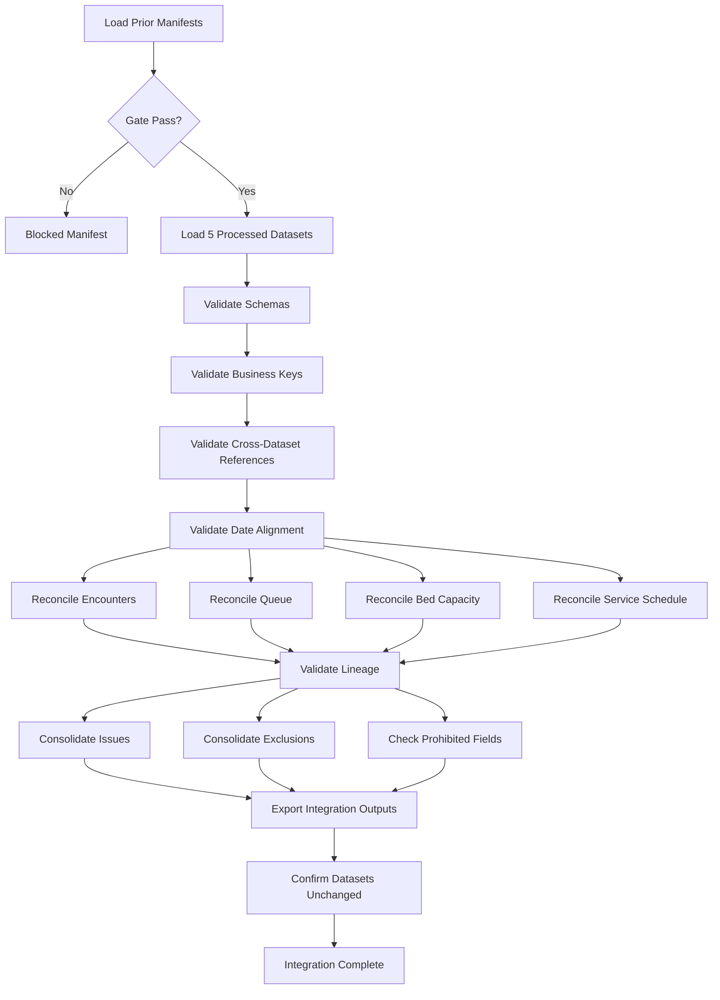

# Patient Flow Integration Specification

## Step 2D-3D

---

## 1. Purpose

Build the integration and assurance layer for the complete patient-flow processing chain. Verify all five processed datasets, cross-step lineage, reconciliation, and prohibited-field compliance.

---

## 2. Scope

This step covers:
- Integration gate enforcement
- Dataset presence and schema validation
- Business-key integrity
- Cross-dataset reference validation
- Date and month alignment
- Encounter-to-daily reconciliation
- Queue-to-daily reconciliation
- Bed-capacity-to-daily reconciliation
- Service-schedule-to-daily reconciliation
- Cross-step lineage validation
- Issue and exclusion consolidation
- Prohibited-field checks
- Integration reporting

This step does **not** calculate official KPIs, KPI status, trends, anomalies, risks, forecasts, scenarios, financial impact or recommendations.

---

## 3. Inputs

| Dataset | File | Source Step |
|---------|------|-------------|
| processed_patient_encounters | `data/processed/processed_patient_encounters.csv` | 2D-3A |
| processed_patient_queue | `data/processed/processed_patient_queue.csv` | 2D-3B |
| processed_bed_capacity | `data/processed/processed_bed_capacity.csv` | 2D-3B |
| processed_service_schedule | `data/processed/processed_service_schedule.csv` | 2D-3B |
| processed_patient_flow_daily | `data/processed/processed_patient_flow_daily.csv` | 2D-3C |

Prior manifests:
- `patient_encounter_processing_run_manifest.json`
- `queue_capacity_schedule_processing_run_manifest.json`
- `patient_flow_daily_processing_run_manifest.json`

---

## 4. Outputs

| File | Path |
|------|------|
| Integration manifest | `outputs/logs/patient_flow_integration_manifest.json` |
| Dataset summary | `outputs/logs/patient_flow_integration_dataset_summary.csv` |
| Check results | `outputs/logs/patient_flow_integration_check_results.csv` |
| Issue log | `outputs/logs/patient_flow_integration_issue_log.csv` |
| Lineage summary | `outputs/logs/patient_flow_integration_lineage_summary.csv` |
| Lineage gap log | `outputs/logs/patient_flow_integration_lineage_gap_log.csv` |
| Exclusion summary | `outputs/logs/patient_flow_integration_exclusion_summary.csv` |
| Audit log | `outputs/logs/patient_flow_integration_audit_log.csv` |
| Cross-step reconciliation | `outputs/logs/patient_flow_cross_step_reconciliation.csv` |

---

## 5. Integration Gate

The integration run may proceed only when:
1. All three prior processing manifests exist.
2. All three prior run statuses indicate successful completion.
3. All five processed datasets exist.
4. All five processed schemas pass validation.
5. Manifest checksums match the actual processed files.
6. No required prior processing output is missing.
7. No prior manifest indicates processing was blocked.

If blocked, create a blocked integration manifest and stop.

---

## 6. Dataset Presence Checks

For each of the five processed datasets, verify:
- File exists
- File is readable
- Expected schema exists
- Required fields exist
- Primary or business key exists
- Mandatory `hospital_id` exists
- Mandatory `department_id` exists
- `reporting_date` exists
- `processing_run_id` exists
- `validation_run_id` exists
- `transformation_version` exists
- `processed_datetime` exists

---

## 7. Schema Validation

Validate each dataset against its approved schema in the processed schema registry. Report mismatches without silently changing the schema.

---

## 8. Business-Key Validation

| Dataset | Key | Uniqueness |
|---------|-----|------------|
| processed_patient_encounters | encounter_id | Unique |
| processed_patient_queue | queue_record_id | Unique |
| processed_bed_capacity | bed_capacity_record_id | Unique |
| processed_service_schedule | service_schedule_id | Unique |
| processed_patient_flow_daily | patient_flow_daily_id | Unique |
| processed_patient_flow_daily | hospital_id + department_id + reporting_date | Unique |

---

## 9. Cross-Dataset References

- Hospital IDs consistent across all datasets
- Daily department combinations exist in at least one contributing dataset
- No orphan daily rows
- Processing run IDs match accepted prior manifests
- Validation run IDs consistent with prior evidence

---

## 10. Date Alignment

- `reporting_date` is parseable
- `reporting_month` equals `reporting_date` formatted as YYYY-MM
- Daily reporting dates match contributing source dates
- Cross-midnight sessions remain attributed to approved reporting date
- No arbitrary dates generated
- No daily record exists outside the union of processed input dates

---

## 11. Encounter Reconciliation

Compare daily encounter fields against processed encounter input:
- `encounter_count`
- `completed_encounter_count`
- `cancelled_encounter_count`
- `left_before_service_count`
- `official_wait_eligible_encounter_count`
- `total_arrival_to_consultation_minutes`

Rules:
- Counts must reconcile exactly
- Wait-minute totals must reconcile within tolerance
- Null remains null when no eligible values exist
- Negative or invalid intervals must not contribute

---

## 12. Queue Reconciliation

Verify daily queue preparation values against processed queue records:
- `queue_arrivals_count`
- `queue_served_count`
- `queue_waiting_patient_count`
- `queue_average_wait_minutes`

Rules:
- Confirm queue-stage records were not silently summed
- Verify summary-stage selection or approved aggregation path
- Ambiguous aggregation must be traceable
- Null daily values acceptable when no approved aggregation rule exists

---

## 13. Queue Ambiguity Rules

- Prefer explicit summary record where `summary_source_flag == True`
- Do not sum arrivals or served counts across stages when double-counting is possible
- If multiple stages exist without a summary, set affected fields to null
- Record a Warning issue and label as Pending Review

---

## 14. Bed-Capacity Reconciliation

Compare daily bed fields against processed bed-capacity inputs:
- `licensed_beds`
- `staffed_beds`
- `operational_beds`
- `occupied_beds`
- `unavailable_beds`
- `reserved_beds`
- `beds_above_operational_capacity`
- `overcapacity_flag`

Rules:
- Occupied beds must not be capped
- Occupied beds may exceed operational beds
- Duplicate snapshots must not be silently summed
- Daily values must match approved snapshot or selection rule

---

## 15. No-Capping Verification

- `occupied_beds` is preserved as-is from source
- No reduction applied when `occupied_beds > operational_beds`
- `beds_above_operational_capacity = max(occupied_beds - operational_beds, 0)`
- `overcapacity_flag = occupied_beds > operational_beds`

---

## 16. Service-Schedule Reconciliation

Compare daily service fields against processed schedule records:
- `planned_service_session_count`
- `cancelled_service_session_count`
- `reduced_service_session_count`
- `extended_service_session_count`

Rules:
- Active planned sessions exclude cancelled sessions
- Cancelled sessions remain traceable
- Reduced and extended flags are reconciled
- Cross-midnight sessions must not be counted twice

---

## 17. Cross-Step Lineage

Validate lineage from all five processed datasets:
- Every daily row must have at least one valid lineage record
- Lineage must show valid processed daily primary key reference
- Source dataset reference must be valid
- Transformation rule ID must be recognized
- Processing run ID and processed datetime must exist

---

## 18. Lineage-Gap Detection

Detect and report:
- Missing lineage for daily rows
- Broken lineage references (null or empty processed_primary_key_value)
- Duplicate lineage records
- Lineage pointing to nonexistent daily IDs

---

## 19. Issue Consolidation

Consolidate issues from all three prior steps. Preserve:
- Original processing_run_id
- Dataset name
- Record key
- Issue type and severity
- Message
- Detection datetime

Add integration-specific issues where required.

---

## 20. Exclusion Consolidation

Consolidate exclusion records from Steps 2D-3A, 2D-3B and 2D-3C. Preserve original exclusion evidence. Report by dataset, reason, processing run and status.

---

## 21. Audit Consolidation

Collect audit events from the integration run itself. Events include:
- Prior Manifests Verified
- Datasets Loaded
- Schemas Validated
- Business Keys Validated
- Cross-Dataset References Validated
- Date Alignment Validated
- Reconciliation Completed
- Lineage Validated
- Issues Consolidated
- Exclusions Consolidated
- Prohibited Fields Checked

---

## 22. Prohibited-Field Checks

Across all five processed datasets, confirm no unapproved fields exist for:
- Official KPI values
- KPI status
- Trend classification
- Anomaly score
- Risk score
- Forecast
- Scenario result
- Financial impact
- Recommendation
- Management decision
- Action tracking
- Outcome review

Approved preparation fields (counts, totals, flags, operational measures) are allowed.

---

## 23. Integration Status Rules

Allowed statuses:
- Passed
- Passed with Warnings
- Failed
- Blocked

Integration passes when no Error or Critical issues exist.

---

## 24. Reproducibility

- Deterministic checks
- Fixed integration version
- Checksum verification before and after processing
- Same inputs produce identical results

---

## 25. Testing

Tests cover:
- Safe imports and no automatic execution
- Manifest gate pass and block
- Checksum mismatch detection
- Dataset loading and schema validation
- Business key uniqueness
- Daily grain uniqueness
- Date alignment
- Orphan detection
- Encounter reconciliation
- Queue reconciliation and ambiguity
- Bed reconciliation and no-capping
- Service-schedule reconciliation
- Lineage coverage, gaps, broken references and duplicates
- Issue and exclusion consolidation
- Prohibited-field detection
- Integration output generation
- Input immutability
- Determinism
- Absence of forbidden outputs

---

## 26. Known Limitations

- Queue aggregation relies on explicit `summary_source_flag`; ambiguous multi-stage groups are set to null.
- Duplicate bed snapshots are not resolved; fields are set to null.
- No weighted average for queue wait times is calculated.
- `official_wait_stage_eligible_flag` is uniformly `False` in the current encounter data, so `total_arrival_to_consultation_minutes` remains null for all daily rows.

---

## 27. Readiness for Step 2D-3E

**Step 2D-3D is complete and accepted.**

Step 2D-3E will run cumulative regression testing, verify final patient-flow processing acceptance criteria and formally close Step 2D-3.

Step 2D-3E will not calculate official KPI values or KPI status.

---

## 28. Mermaid Integration Flow

