# Sentinel360 Healthcare — Processing Architecture

**Step:** 2D-1  
**Status:** Architecture and schema definition only. No data transformation performed.

---

## 1. Purpose

The processing layer transforms validated raw hospital data into clean, standardised analytical datasets. It sits between the validation engine and the analytics engines (KPI, status, trend, anomaly, risk, forecast, scenario).

The layer prepares data for analysis without:
- calculating official KPI values,
- assigning KPI status,
- calculating risk scores,
- running forecasts,
- simulating scenarios,
- calculating financial impact,
- generating recommendations.

---

## 2. Position in the Sentinel360 Pipeline

```
Source Data → Validation Engine → Processing Layer → Analytics Engines
                (Step 2C)          (Step 2D)          (Steps 2E+)
```

The processing layer accepts only validation-approved inputs and produces standardised processed datasets that downstream engines consume.

---

## 3. Processing Boundary

**In scope:**
- Schema standardisation
- Field derivation (e.g., normalised_score, wait intervals)
- Grain enforcement
- Exclusion flagging
- Lineage construction
- Configuration-driven mapping

**Out of scope:**
- KPI percentage or rate calculation
- Status assignment
- Trend detection
- Anomaly scoring
- Risk scoring
- Forecasting
- Scenario simulation
- Financial valuation
- Recommendation generation
- Streamlit UI code

---

## 4. Validation Gate

Processing is permitted only when the validation run reports:

- `run_status` = `Passed` or `Passed with Warnings`
- `processing_allowed_flag` = `true`

If validation reports `Failed`, `Blocked`, or `processing_allowed_flag = false`, the processing engine must stop.

Manual overrides may later allow controlled processing only when:
- the override is approved,
- the original issue remains visible,
- an audit reference exists.

Step 2D-1 defines this contract but does not automatically apply overrides.

---

## 5. Processing-Run Lifecycle

| Status | Meaning |
|--------|---------|
| Not Started | Run initialised but not executed |
| In Progress | Transformation actively running |
| Passed | All datasets processed without blocking issues |
| Passed with Warnings | Processed with non-blocking warnings |
| Failed | One or more datasets failed |
| Blocked | Validation gate or critical issue blocked the run |

---

## 6. Dataset Catalogue

### A. Reference and Master Datasets (Step 2D-2)
1. `processed_hospital_master`
2. `processed_department_master`
3. `processed_staff_role_master`
4. `processed_staff_master`

### B. Workforce Datasets (Step 2D-2)
5. `processed_staff_roster`
6. `processed_staff_attendance`
7. `processed_staffing_requirement`
8. `processed_workforce_daily`

### C. Patient Flow and Capacity Datasets (Step 2D-3)
9. `processed_patient_encounters`
10. `processed_patient_queue`
11. `processed_bed_capacity`
12. `processed_service_schedule`
13. `processed_patient_flow_daily`

### D. Patient Experience Datasets (Step 2D-4)
14. `processed_patient_complaints`
15. `processed_patient_surveys`
16. `processed_patient_experience_daily`

### E. Control and Lineage Datasets (Step 2D-5)
17. `processing_record_lineage`
18. `processing_exclusion_register`
19. `processing_run_summary`

---

## 7. Dataset Grains

| Dataset | Grain |
|---------|-------|
| processed_hospital_master | One row per valid effective-dated master record |
| processed_department_master | One row per valid effective-dated master record |
| processed_staff_role_master | One row per valid effective-dated master record |
| processed_staff_master | One row per valid effective-dated master record |
| processed_staff_roster | One row per staff, roster date, shift, department and assignment |
| processed_staff_attendance | One row per staff, attendance date, shift and actual assignment |
| processed_staffing_requirement | One row per hospital, department, date, shift and staff role |
| processed_workforce_daily | One row per hospital, department, reporting date and staff role |
| processed_patient_encounters | One row per encounter |
| processed_patient_queue | One row per hospital, department, queue date and queue stage |
| processed_bed_capacity | One row per hospital, department and reporting date |
| processed_service_schedule | One row per service session or approved source schedule record |
| processed_patient_flow_daily | One row per hospital, department and reporting date |
| processed_patient_complaints | One row per valid complaint event |
| processed_patient_surveys | One row per valid survey response |
| processed_patient_experience_daily | One row per hospital, department and reporting date |
| processing_record_lineage | One row per source-to-processed record relationship |
| processing_exclusion_register | One row per excluded source record and exclusion reason |
| processing_run_summary | One row per processed dataset per processing run |

Department-level data is not collapsed into hospital-only totals at the processing stage.

---

## 8. Transformation Domains

### Reference / Master
- `TR_REF_STANDARDISE_TEXT`
- `TR_REF_STANDARDISE_DATE`
- `TR_REF_EFFECTIVE_DATING`
- `TR_REF_ACTIVE_FLAG`

### Workforce
- `TR_WF_ROSTER_DATETIME`
- `TR_WF_OVERNIGHT_SHIFT`
- `TR_WF_ATTENDANCE_MAPPING`
- `TR_WF_ACTUAL_HOURS`
- `TR_WF_LOST_HOURS`
- `TR_WF_AVAILABILITY_CONTRIBUTION`
- `TR_WF_ABSENTEEISM_ELIGIBILITY`
- `TR_WF_DEPARTMENT_ATTRIBUTION`
- `TR_WF_REASSIGNMENT`
- `TR_WF_REPLACEMENT_REFERENCE`
- `TR_WF_MISSING_UNKNOWN`
- `TR_WF_DAILY_AGGREGATION`

### Patient Flow
- `TR_PF_TIMESTAMP_PARSE`
- `TR_PF_WAIT_INTERVALS`
- `TR_PF_WAIT_ELIGIBILITY`
- `TR_PF_QUEUE_STANDARDISATION`
- `TR_PF_BED_STANDARDISATION`
- `TR_PF_OVERCAPACITY`
- `TR_PF_SCHEDULE_STANDARDISATION`
- `TR_PF_DAILY_AGGREGATION`

### Patient Experience
- `TR_PX_COMPLAINT_ELIGIBILITY`
- `TR_PX_SOCIAL_SIGNAL_CLASSIFICATION`
- `TR_PX_DUPLICATE_CLASSIFICATION`
- `TR_PX_SURVEY_NORMALISATION`
- `TR_PX_SURVEY_ELIGIBILITY`
- `TR_PX_WEIGHT_STANDARDISATION`
- `TR_PX_DAILY_AGGREGATION`

### Control
- `TR_CTRL_LINEAGE`
- `TR_CTRL_EXCLUSION`
- `TR_CTRL_RUN_SUMMARY`

---

## 9. Configuration Loading

The processing layer loads:
- `config/attendance_status_mapping.csv`
- `config/absence_category_mapping.csv`
- configuration versions
- active effective-dated rules
- approved or draft status

Unresolved Draft rules remain clearly identified.

---

## 10. Source Preservation

The processing layer:
- preserves original source values,
- creates new standardised fields alongside source fields,
- does not silently overwrite source values,
- does not silently fill missing values.

---

## 11. Standardisation Principles

- Dates are parsed and stored in ISO format.
- Text is trimmed and normalised.
- Numerics are parsed but not rounded unless configured.
- Booleans are derived explicitly.
- Categorical values are mapped using approved domain lists.
- Missing attendance remains Unknown.
- Missing is not converted to Present or Absent.

---

## 12. Exclusion Handling

Every excluded record must have:
- source dataset,
- source primary key,
- exclusion reason code,
- exclusion description,
- transformation step,
- validation issue reference where relevant,
- reversible flag,
- processing run ID.

Valid but analytically ineligible records are distinguished from invalid records.

---

## 13. Lineage Handling

Every processed record must be traceable to:
- validation run ID,
- processing run ID,
- source dataset,
- source file,
- source primary key,
- source row number where available,
- transformation rule or rules,
- configuration version,
- transformation version,
- processing timestamp.

For aggregate datasets, lineage may be one processed aggregate linked to multiple source records.

---

## 14. Auditability

All processing events are auditable through:
- processing run manifest,
- dataset result records,
- lineage log,
- exclusion register,
- issue log.

---

## 15. Reproducibility

Given the same:
- source data,
- validation result,
- configuration version,
- transformation version,

the processing layer must produce identical processed datasets and identical lineage.

---

## 16. Error and Warning Handling

| Severity | Action |
|----------|--------|
| Information | Log only |
| Warning | Continue processing, flag record |
| Error | Continue processing, flag dataset, exclude record if configured |
| Critical | Block dataset processing |

---

## 17. Separation from KPI Calculation

The processing layer prepares the inputs required for KPI calculation but does not compute:
- staffing_level_percent
- absenteeism_rate_percent
- average_patient_waiting_time_kpi
- bed_occupancy_rate_kpi
- complaint_rate
- patient_satisfaction_score

These are computed by the downstream KPI engine in later steps.

---

## 18. Step 2D Implementation Sequence

| Step | Datasets |
|------|----------|
| 2D-2 | Reference/master + Workforce |
| 2D-3 | Patient flow + Capacity |
| 2D-4 | Patient experience |
| 2D-5 | Control + Lineage + Exclusion |

---

## 19. Testing Strategy

- Import safety tests
- Schema registry completeness tests
- Grain enforcement tests
- Field overlap tests
- Parent relationship tests
- Source reference tests
- Validation gate tests
- Configuration loader tests
- Boundary tests (no KPI fields, no risk fields, etc.)
- Template output existence tests

---

## 20. Known Limitations

- Transformation rules are defined but not yet executed.
- Actual dataframes are not created in Step 2D-1.
- Performance benchmarks are not yet measured.
- Parallel processing is not yet designed.

---

## 21. Readiness Criteria for Step 2D-2

Step 2D-2 may begin when:
- all 19 processed datasets are defined,
- all transformation rule IDs are reserved,
- the validation gate is implemented and tested,
- the schema registry passes validation,
- the configuration loader passes validation,
- all Step 2D-1 tests pass,
- all regression tests pass,
- no processed data files have been created,
- no existing files have been modified.

---

## 22. Mermaid Processing Architecture Diagram

```mermaid
flowchart LR
    subgraph Source["Validated Source Data"]
        A1[hospital_master]
        A2[department_master]
        A3[staff_role_master]
        A4[staff_master]
        A5[staff_roster]
        A6[staff_attendance]
        A7[staffing_requirement]
        A8[patient_encounters]
        A9[patient_queue_records]
        A10[bed_capacity_records]
        A11[patient_complaints]
        A12[patient_surveys]
        A13[service_schedule]
    end

    subgraph Gate["Validation Gate"]
        VG{run_status Passed?<br>processing_allowed true?}
    end

    subgraph Processing["Processing Layer (Step 2D)"]
        P1[Reference / Master]
        P2[Workforce]
        P3[Patient Flow / Capacity]
        P4[Patient Experience]
        P5[Control / Lineage]
    end

    subgraph Output["Processed Datasets"]
        O1[processed_hospital_master]
        O2[processed_department_master]
        O3[...]
        O4[processing_record_lineage]
        O5[processing_exclusion_register]
    end

    Source --> Gate
    Gate -->|Allowed| Processing
    Gate -->|Blocked| X[Stop]
    Processing --> Output
    Output --> KPI[KPI Engine<br>Future Step]
```


