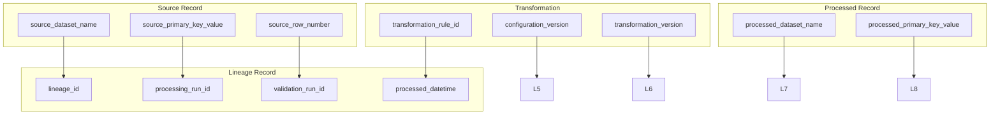

# Sentinel360 Healthcare — Processing Lineage Specification

**Step:** 2D-1  
**Scope:** Traceability, exclusion, and audit retention for the processing layer.

---

## 1. Purpose

The lineage system ensures every processed record can be traced back to its source, the transformation applied, and the configuration version in effect. It supports:
- regulatory audit,
- data-quality investigation,
- reproducibility,
- error root-cause analysis.

---

## 2. Source-to-Processed Traceability

Every processed record must be traceable to:
- validation run ID,
- processing run ID,
- source dataset name,
- source file name,
- source primary key field and value,
- source row number where available,
- transformation rule or rules applied,
- configuration version,
- transformation version,
- processing timestamp.

For aggregate datasets, one processed aggregate may link to multiple source records through multiple lineage rows.

---

## 3. Processing-Run Identifiers

| Identifier | Description | Example |
|------------|-------------|---------|
| processing_run_id | Unique identifier for a processing execution | `PROC-20260725-001` |
| validation_run_id | Reference to the validation run that approved input | `VAL-20260725-001` |
| transformation_version | Semantic version of transformation logic | `1.0.0` |
| configuration_version | Version of active configuration | `v1.0-draft` |

---

## 4. Validation-Run References

The lineage log stores `validation_run_id` to link processed records to the validation result that authorised their processing. This enables investigators to verify that the source data was validation-approved at the time of processing.

---

## 5. Record-Level Lineage

Record-level lineage applies to:
- reference/master datasets,
- workforce transactional datasets,
- patient encounter records,
- complaint records,
- survey response records.

Each source record that becomes one processed record generates one lineage row.

**Key fields:**
- `source_primary_key_value`
- `source_row_number`
- `processed_primary_key_value`
- `transformation_rule_id`
- `source_fields_used`
- `processed_fields_created`

---

## 6. Aggregate Lineage

Aggregate lineage applies to:
- `processed_workforce_daily`
- `processed_patient_flow_daily`
- `processed_patient_experience_daily`

For these datasets, one processed aggregate row links to multiple source records. The lineage system may store:
- one lineage row per source record contributing to the aggregate, or
- one lineage row per aggregate with a comma-separated list of source keys, or
- a separate aggregate-to-source mapping table.

Step 2D-1 defines the schema for individual lineage rows. Aggregate lineage strategy will be finalised during implementation.

---

## 7. Transformation-Rule References

Every lineage row must reference the transformation rule that created or modified the processed record. Reserved transformation rule IDs are defined in `src/processed_schema_registry.py`.

Examples:
- `TR_REF_STANDARDISE_TEXT`
- `TR_WF_ATTENDANCE_MAPPING`
- `TR_PF_WAIT_INTERVALS`
- `TR_PX_SURVEY_NORMALISATION`

---

## 8. Configuration-Version References

The lineage log stores:
- `configuration_version` — the version of configuration files active at processing time,
- `transformation_version` — the version of the transformation code.

This ensures that if configuration rules change, historical lineage remains traceable to the version in effect.

---

## 9. Source Checksum

The processing run summary stores a SHA-256 checksum of each source file. This checksum is recorded at the start of processing and used for reproducibility verification.

---

## 10. Processed Checksum

The processing run summary stores a SHA-256 checksum of each processed output file. This checksum is recorded after export and used to verify output integrity.

---

## 11. Exclusion Traceability

Every excluded record is stored in `processing_exclusion_register` with:
- source dataset and primary key,
- exclusion reason code,
- exclusion description,
- validation issue reference (if applicable),
- manual override reference (if applicable),
- transformation rule that caused exclusion,
- reversible flag.

Valid but analytically ineligible records are distinguished from invalid records through reason codes.

---

## 12. Manual Override Traceability

If a manual override allowed processing of a record that would otherwise be excluded, the lineage log must store:
- the override ID,
- the original exclusion reason,
- the fact that the record was processed under an override.

The original issue remains visible and auditable.

---

## 13. Audit Retention

All lineage and exclusion records must be retained for the life of the processed datasets they describe. Minimum retention aligns with organisational data-governance policy.

Audit events include:
- processing started,
- dataset loaded,
- transformation applied,
- record excluded,
- record included,
- lineage written,
- exclusion register updated,
- processing completed.

---

## 14. Lineage Output Schema

The lineage output schema is defined by `ProcessingLineageRecord` in `src/processing_models.py`.

CSV header:
```
processing_run_id,lineage_id,validation_run_id,source_dataset_name,source_file_name,
source_primary_key_field,source_primary_key_value,source_row_number,
processed_dataset_name,processed_primary_key_field,processed_primary_key_value,
transformation_rule_id,transformation_description,source_fields_used,processed_fields_created,
exclusion_flag,exclusion_reason_code,transformation_version,configuration_version,processed_datetime
```

---

## 15. Exclusion Output Schema

The exclusion output schema is defined by `ProcessingExclusionRecord` in `src/processing_models.py`.

CSV header:
```
processing_run_id,exclusion_id,source_dataset_name,source_primary_key_field,
source_primary_key_value,source_row_number,exclusion_reason_code,
exclusion_reason_description,validation_issue_id,manual_override_id,
exclusion_stage,excluded_by_rule,reversible_flag,created_datetime
```

---

## 16. Processing-Run Summary Schema

The run summary schema is defined by `ProcessingDatasetResult` in `src/processing_models.py`.

CSV header:
```
processing_run_id,validation_run_id,source_dataset_name,processed_dataset_name,
source_row_count,processed_row_count,excluded_row_count,transformed_field_count,
warning_count,error_count,dataset_status,output_file_name,transformation_version,
processed_datetime,processing_run_status,processing_allowed_flag,source_checksum,
processed_checksum,output_schema_version
```

---

## 17. Mermaid Lineage-Flow Diagram



---

## Summary

The lineage specification ensures full traceability from source to processed data. Every record, every transformation, and every exclusion is auditable. The system supports both record-level and aggregate lineage, with explicit references to validation runs, configuration versions, and transformation rules.
