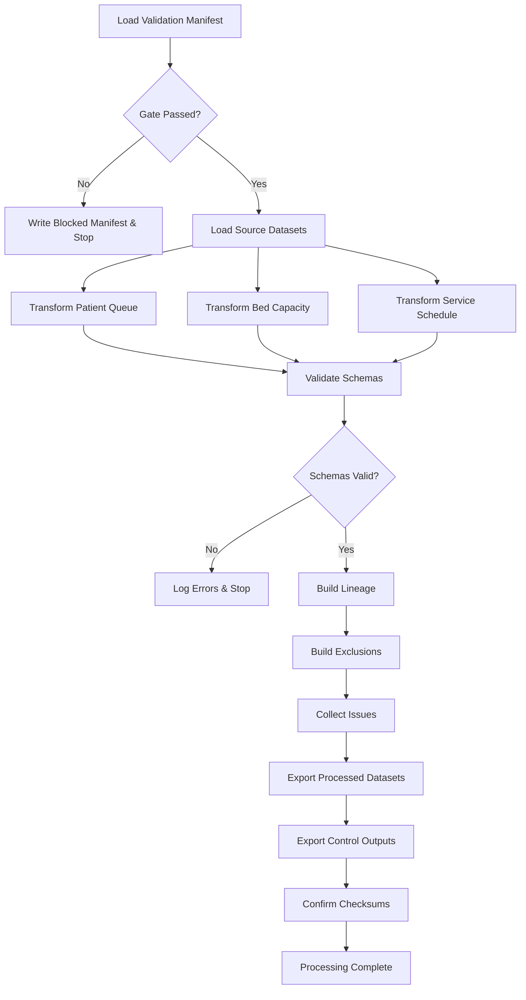

# Queue, Bed Capacity and Service Schedule Transformation Specification

**Step:** 2D-3B  
**Version:** 2D-3B-1.0.0  
**Date:** 2026-07-26

---

## 1. Purpose

This document specifies the transformation of three operational source datasets into their processed equivalents for the Sentinel360 Healthcare data pipeline:

- `patient_queue_records` → `processed_patient_queue`
- `bed_capacity_records` → `processed_bed_capacity`
- `service_schedule` → `processed_service_schedule`

The purpose is to standardise, validate and prepare these datasets for downstream patient-flow aggregation (Step 2D-3C) while preserving full traceability, auditability and reproducibility.

---

## 2. Scope

### In Scope
- Validation gate enforcement before any transformation.
- Source identifier preservation.
- Date, timestamp and operational field standardisation.
- Queue-stage detail preservation.
- Bed-capacity value preservation without capping.
- Overcapacity detection and flagging.
- Cancelled, reduced, extended and overnight service-session handling.
- Lineage, issue logging, exclusion registration and audit logging.
- Schema validation against the approved processed-schema registry.

### Out of Scope
- Patient encounter transformation (completed in Step 2D-3A).
- `processed_patient_flow_daily` creation (Step 2D-3C).
- Average Patient Waiting Time KPI calculation.
- Bed Occupancy Rate KPI calculation.
- KPI status, trend, anomaly, risk, forecast, scenario, financial impact or recommendation generation.
- Streamlit page creation.

---

## 3. Source Datasets

| Dataset | File | Primary Key |
|---------|------|-------------|
| patient_queue_records | `data/demo/patient_queue_records.csv` | `queue_record_id` |
| bed_capacity_records | `data/demo/bed_capacity_records.csv` | `bed_capacity_record_id` |
| service_schedule | `data/demo/service_schedule.csv` | `service_schedule_id` |

---

## 4. Target Datasets

| Dataset | File |
|---------|------|
| processed_patient_queue | `data/processed/processed_patient_queue.csv` |
| processed_bed_capacity | `data/processed/processed_bed_capacity.csv` |
| processed_service_schedule | `data/processed/processed_service_schedule.csv` |

---

## 5. Validation Gate

Before transformation, the runner reads:

- `outputs/logs/validation_run_manifest.json`
- `outputs/logs/dataset_validation_summary.csv`
- `outputs/logs/manual_override_register.csv`

Processing is allowed only when:

- `run_status` is `Passed` or `Passed with Warnings`.
- `processing_allowed_flag` is `true`.
- All three source datasets are `Valid` or valid under an approved override.

If processing is blocked, a blocked manifest is created, no successful processed datasets are written, and the exact blocking reason is reported.

---

## 6. Queue Transformation

### Rules
1. Preserve `queue_record_id`.
2. Preserve `hospital_id`.
3. Preserve `department_id`.
4. Parse `queue_date`.
5. Set `reporting_date` = `queue_date`.
6. Set `reporting_month` in `YYYY-MM` format.
7. Preserve `queue_stage`.
8. Preserve `arrivals_count`.
9. Preserve `served_count`.
10. Preserve `waiting_patient_count`.
11. Preserve `average_wait_minutes`.
12. Preserve `median_wait_minutes`.
13. Preserve `maximum_wait_minutes`.
14. Derive `summary_source_flag` only from approved source metadata.
15. Derive `encounter_derived_flag` only from approved source metadata.
16. Derive `valid_queue_record_flag`.
17. Add source and processing metadata.

### Transformation Rule IDs
- `TR_PF_QUEUE_STANDARDISATION`
- `TR_CTRL_LINEAGE`
- `TR_CTRL_EXCLUSION`

### Constraints
- Counts cannot be negative.
- Wait values cannot be negative.
- Blank values must remain null; do not replace with zero.
- Queue-stage detail must be preserved; do not aggregate stages.
- Do not infer encounter-derived status.
- Do not calculate an official waiting-time KPI.

---

## 7. Queue-Stage Preservation

Every distinct `queue_stage` value in the source is retained in the processed output. Unsupported stages are logged as informational issues but are not excluded, ensuring downstream rules can decide eligibility.

---

## 8. Queue Null and Count Handling

- Missing numeric values remain `NaN` (null).
- Negative counts trigger a `Warning`-level issue and mark the record as invalid.
- Records with negative counts are retained in the output with `valid_queue_record_flag = False` and logged in the exclusion register.

---

## 9. Bed-Capacity Transformation

### Rules
1. Preserve `bed_capacity_record_id`.
2. Preserve `hospital_id`.
3. Preserve `department_id`.
4. Parse `reporting_date`.
5. Set `reporting_month` in `YYYY-MM` format.
6. Preserve `licensed_beds`.
7. Preserve `staffed_beds`.
8. Preserve `operational_beds`.
9. Preserve `occupied_beds`.
10. Preserve `unavailable_beds`.
11. Preserve `reserved_beds`.
12. Calculate `beds_above_operational_capacity`.
13. Derive `overcapacity_flag`.
14. Preserve or derive `overcapacity_exception_flag` only from approved source evidence.
15. Preserve `overcapacity_reason`.
16. Derive `valid_bed_record_flag`.
17. Add source and processing metadata.

### Transformation Rule IDs
- `TR_PF_BED_STANDARDISATION`
- `TR_PF_OVERCAPACITY`
- `TR_CTRL_LINEAGE`
- `TR_CTRL_EXCLUSION`

---

## 10. Overcapacity Treatment

```
beds_above_operational_capacity = max(occupied_beds - operational_beds, 0)
overcapacity_flag = occupied_beds > operational_beds
```

- Overcapacity is a valid operational state, not automatically invalid data.
- Documented temporary-capacity arrangements remain traceable via `overcapacity_exception_flag` and `overcapacity_reason`.

---

## 11. No Occupancy Capping

**Critical approved rule:** Occupied beds and occupancy inputs are **never** capped at operational capacity or 100%. The original source values are preserved exactly where valid.

---

## 12. Service-Schedule Transformation

### Rules
1. Preserve `service_schedule_id`.
2. Preserve `hospital_id`.
3. Preserve `department_id`.
4. Parse `service_date`.
5. Set `reporting_date` = `service_date`.
6. Set `reporting_month` in `YYYY-MM` format.
7. Preserve `service_type`.
8. Parse `session_start_datetime`.
9. Parse `session_end_datetime`.
10. Handle valid cross-midnight sessions.
11. Calculate `planned_service_hours`.
12. Preserve `planned_capacity`.
13. Preserve `schedule_status`.
14. Derive `reduced_session_flag` only from approved source status.
15. Derive `cancelled_session_flag`.
16. Derive `extended_session_flag`.
17. Derive `valid_schedule_flag`.
18. Add source and processing metadata.

### Transformation Rule IDs
- `TR_PF_SCHEDULE_STANDARDISATION`
- `TR_CTRL_LINEAGE`
- `TR_CTRL_EXCLUSION`

---

## 13. Cross-Midnight Session Handling

Duration is calculated using full datetimes. Valid overnight sessions must end on the following calendar day and produce a positive duration. Negative duration is invalid and triggers exclusion.

---

## 14. Cancelled, Reduced and Extended Sessions

| Source `schedule_status` | `cancelled_session_flag` | `reduced_session_flag` | `extended_session_flag` |
|--------------------------|--------------------------|------------------------|-------------------------|
| cancelled | True | False | False |
| reduced | False | True | False |
| extended | False | False | True |
| (other) | False | False | False |

Cancelled sessions remain valid business records but are not active planned-service capacity.

---

## 15. Invalid versus Analytically Ineligible Records

| Category | Treatment |
|----------|-----------|
| Invalid (negative counts, missing keys, negative duration) | Retained in output with `valid_*_flag = False`, logged in exclusion register. |
| Analytically ineligible (cancelled session, unsupported queue stage, overcapacity with exception) | Retained in output, flagged transparently, not silently dropped. |

---

## 16. Lineage

Every processed business record has at least one lineage row containing:

- `processing_run_id`
- `validation_run_id`
- `source_dataset_name`
- `source_file_name`
- `source_primary_key_field`
- `source_primary_key_value`
- `source_row_number`
- `processed_dataset_name`
- `processed_primary_key_field`
- `processed_primary_key_value`
- `transformation_rule_id`
- `transformation_description`
- `source_fields_used`
- `processed_fields_created`
- `exclusion_flag`
- `exclusion_reason_code`
- `transformation_version`
- `configuration_version`
- `processed_datetime`

Full source rows are not stored in lineage.

---

## 17. Exclusions

Every excluded record is logged with:

- `processing_run_id`
- `exclusion_id`
- `source_dataset_name`
- `source_primary_key_field`
- `source_primary_key_value`
- `source_row_number`
- `exclusion_reason_code`
- `exclusion_reason_description`
- `exclusion_stage`
- `excluded_by_rule`

Exclusion reason codes include:

- `NEGATIVE_QUEUE_COUNT`
- `NEGATIVE_WAIT_VALUE`
- `MISSING_QUEUE_STAGE`
- `NEGATIVE_BED_COUNT`
- `INVALID_SERVICE_DURATION`
- `MISSING_SERVICE_TIMESTAMP`
- `MISSING_MANDATORY_KEY`

---

## 18. Issues and Severity

| Severity | Use |
|----------|-----|
| Information | Unsupported but non-blocking values (e.g. unsupported queue stage). |
| Warning | Data quality concerns that invalidate a record (e.g. negative count). |
| Error | Structural problems (e.g. missing mandatory timestamp). |
| Critical | Missing primary key or relationship. |

---

## 19. Audit Events

The audit log records:

- Processing Started
- Validation Gate Passed / Blocked
- Source Loaded (per dataset)
- Transformation Completed (per dataset)
- Schema Validated
- Lineage Generated
- Exclusion Register Generated
- Outputs Exported
- Source Checksums Confirmed
- Workforce Outputs Confirmed Unchanged
- Encounter Output Confirmed Unchanged
- Processing Completed

---

## 20. Reproducibility

- Deterministic SHA-256 source checksums are captured before transformation.
- `transformation_version` is fixed per step release.
- `processing_run_id` and `validation_run_id` link every output to a specific execution.
- Re-execution on unchanged inputs produces identical business content (excluding runtime metadata).

---

## 21. Testing

Tests are provided in `tests/test_queue_capacity_schedule_transformation.py` covering:

- Safe module import
- No automatic execution on import
- Validation gate pass and blocked cases
- Schema compliance for all three outputs
- ID preservation and uniqueness
- Date and datetime parsing
- Queue-stage preservation
- Negative value detection
- Null handling
- Overcapacity logic and no-capping rule
- Service duration and overnight sessions
- Cancelled, reduced and extended session classification
- Lineage coverage
- Control output generation
- Source, workforce and encounter checksum immutability
- Absence of prohibited analytical fields

---

## 22. Known Limitations

- Average Patient Waiting Time KPI is not calculated in this step.
- Bed Occupancy Rate KPI is not calculated in this step.
- Official wait-stage eligibility may require clinical rule refinement in a later step.
- `encounter_derived_flag` is not inferred if absent from source metadata.

---

## 23. Readiness for Step 2D-3C

Step 2D-3B is complete and the following processed datasets are ready for downstream use:

- `processed_patient_encounters` (from Step 2D-3A)
- `processed_patient_queue`
- `processed_bed_capacity`
- `processed_service_schedule`

Step 2D-3C will build `processed_patient_flow_daily` using approved preparation-level fields from the above datasets. It will not calculate official KPI percentages or KPI status.

---

## 24. Mermaid Transformation Flow


