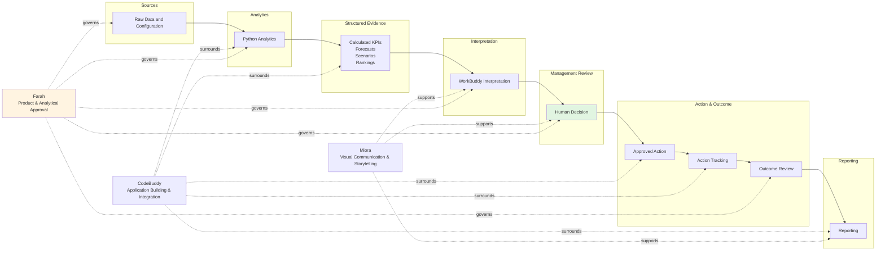

# Responsibility Architecture — Sentinel360 Healthcare

## 1. Purpose

Sentinel360 Healthcare combines deterministic analytics, AI-assisted interpretation, human decision authority and visual communication into a single decision-support system. Without clear responsibility boundaries, there is risk of invented values, unsafe autonomous actions and unclear ownership of outcomes. This document defines who or what is responsible for each activity, what they must produce and what they must not do.

## 2. Responsibility Layers

Sentinel360 is organised into five responsibility layers:

| Layer | Name | Core Role |
|---|---|---|
| A | Data and configuration layer | Stores raw, uploaded, processed and reference data; holds all configuration, rules and assumptions |
| B | Deterministic Python analytics layer | Validates, transforms, calculates, detects, forecasts, simulates, ranks and generates evidence |
| C | AI-assisted interpretation layer | Interprets calculated evidence, explains risks and produces grounded management narratives |
| D | Human management decision layer | Reviews evidence, approves or rejects, assigns ownership, executes actions and reviews outcomes |
| E | Application and visual communication layer | Builds the application, presents outputs and supports visual identity and storytelling |

## 3. Data and Configuration Layer

This layer is responsible for:

- **Raw operational data** — original hospital files before processing.
- **Uploaded data** — files submitted through the application with metadata.
- **Processed data** — cleaned, transformed datasets ready for analytics.
- **KPI configuration** — formulas, numerators, denominators and aggregation rules.
- **Risk rules** — thresholds, correlation logic and prioritisation weights.
- **Scenario assumptions** — operational parameters used to project intervention effects.
- **Financial assumptions** — cost rates, avoided-loss estimates and benefit parameters.
- **Intervention catalogue** — approved list of intervention families and definitions.
- **Decision and action records** — immutable logs of every human decision and action update.

All configuration must be versioned and auditable. No layer may silently alter configuration without recorded change.

## 4. Deterministic Python Analytics Layer

Python is responsible for all numerical and rule-based processing:

- Data validation
- Data transformation
- KPI calculation
- Threshold checks
- Anomaly detection
- Deterioration analysis
- Cross-domain risk analysis
- Forecasting (7-day and indicative 30-day)
- Scenario simulation
- Financial-impact calculation
- Scenario ranking
- Recommendation evidence generation
- Outcome comparison

Python outputs must be reproducible from the same inputs and configuration. If the same dataset and configuration are supplied, the same outputs must be produced.

## 5. WorkBuddy Responsibility

WorkBuddy is the AI-assisted interpretation layer. It is responsible for:

- Interpreting calculated evidence produced by Python.
- Explaining connected risks in management language.
- Generating executive summaries grounded in data.
- Producing recommendation narratives that reference specific KPIs, forecasts and scenario results.
- Generating action briefs for approved interventions.
- Explaining forecast uncertainty and confidence bands.
- Producing outcome-review narratives that describe association and movement, not causal proof.
- Identifying missing context or contradictions for human review.

WorkBuddy must not:

- Invent numbers, KPI values, forecasts, risk scores, scenario impacts or financial figures.
- Override Python results or silently change thresholds.
- Change scenario or financial assumptions without human approval.
- Approve actions or execute decisions.
- Claim causal proof where the system only shows association.
- Execute operational interventions.

## 6. CodeBuddy Responsibility

CodeBuddy is the engineering and integration layer. It is responsible for:

- Creating and maintaining the project structure.
- Writing and refactoring Python analytical modules.
- Building Streamlit pages and application components.
- Integrating modules into a cohesive application.
- Implementing upload and validation functions.
- Implementing scenario controls and assumption editors.
- Implementing exports and report generation.
- Debugging and testing.
- Deployment preparation.

CodeBuddy must follow the approved scope, data definitions and formulas. If a business rule is unclear or undefined, CodeBuddy must flag it for approval rather than invent a rule.

## 7. Miora Responsibility

Miora is the visual communication layer. It is responsible for:

- Visual identity and branding guidance.
- Information hierarchy and layout concepts.
- Process diagrams and architecture visuals.
- Storyboards for user journeys.
- Pitch materials and presentation assets.
- Demo-support graphics.

Miora must not determine KPI formulas, risk weights, financial assumptions or analytical methods. Visual assets must accurately represent the workflow and architecture without implying autonomy that the system does not possess.

## 8. Human Management Responsibility

Human management retains final decision authority. Humans are responsible for:

- Validating operational context (e.g. local events, staffing agreements, seasonal factors).
- Reviewing evidence, assumptions and recommendations.
- Approving, modifying, rejecting or deferring recommendations.
- Authorising expenditure attached to interventions.
- Assigning an action owner.
- Executing approved actions outside the system.
- Providing completion evidence where available.
- Reviewing outcomes and recording conclusions.
- Closing actions when appropriate.

## 9. Farah's Role

Farah is the product and analytical lead. She is responsible for:

- Product direction and scope control.
- Healthcare business logic definition.
- KPI definitions, numerators, denominators and aggregation rules.
- Data architecture approval.
- Risk-rule approval.
- Scenario assumptions approval.
- Financial-impact assumptions approval.
- WorkBuddy prompt design and review.
- Validation and verification of analytical outputs.
- Business testing and acceptance.
- Final acceptance before release or demonstration.

No other named individuals are assigned responsibilities in this document.

## 10. Responsibility Matrix

| Activity | Python Analytics | WorkBuddy | CodeBuddy | Miora | Human Management | Farah |
|---|---|---|---|---|---|---|
| Define product scope | C | I | I | I | C | A/R |
| Define datasets | C | I | I | I | C | A/R |
| Define KPI formulas | R | I | I | I | C | A |
| Validate uploaded data | R | I | I | I | I | C |
| Calculate KPIs | R | I | I | I | I | A |
| Detect warning status | R | I | I | I | I | A |
| Detect cross-domain risk | R | I | I | I | I | A |
| Produce forecast values | R | I | I | I | I | A |
| Explain forecast risk | C | R | I | I | I | A |
| Simulate scenarios | R | I | I | I | I | A |
| Calculate financial impact | R | I | I | I | I | A |
| Rank scenarios | R | I | I | I | I | A |
| Draft recommendation narrative | C | R | I | I | I | A |
| Approve recommendation | I | I | I | I | A/R | I |
| Modify recommendation | I | I | I | I | A/R | I |
| Reject recommendation | I | I | I | I | A/R | I |
| Assign action owner | I | I | I | I | A/R | I |
| Execute intervention | I | I | I | I | A/R | I |
| Track implementation | R | I | R | I | A/R | I |
| Review later outcomes | R | R | I | I | A/R | A |
| Generate executive summary | C | R | I | I | I | A |
| Design dashboard layout | I | I | C | R | I | A |
| Build Streamlit application | I | I | R | I | I | A |
| Test analytical logic | R | I | R | I | I | A |
| Validate business logic | C | C | I | I | C | A/R |
| Prepare final pitch materials | I | C | I | R | I | A |

**Legend:** R = Responsible | A = Accountable | C = Consulted | I = Informed

## 11. Numerical Truth Rule

> **Python is the numerical source of truth.**
>
> Configuration files are the approved rule and assumption source.
>
> WorkBuddy communicates and interprets the calculated evidence.
>
> Dashboard pages display outputs but do not independently invent or recalculate unapproved values.
>
> Human management remains the decision authority.

No layer may override a Python-calculated value with an AI-generated estimate. No narrative may present a figure that cannot be traced to a Python output and its underlying configuration.

## 12. Data-to-Decision Contract

| Layer | Required Input | Permitted Processing | Required Output | Prohibited Behaviour |
|---|---|---|---|---|
| **A. Data and configuration** | Raw files, user inputs, rule updates | Store, version, retrieve | Clean datasets, config versions, audit logs | Alter data without trace; delete decision records |
| **B. Python analytics** | Clean data, configuration, assumptions | Deterministic calculation, rule application, statistical modelling | KPIs, flags, forecasts, scenarios, rankings, evidence | Invent assumptions; present ungrounded estimates |
| **C. WorkBuddy interpretation** | Structured evidence from Python | Language generation, synthesis, explanation | Narratives, summaries, briefs, risk explanations | Invent numbers; override Python; approve actions |
| **D. Human management** | Recommendations, evidence, narratives | Judgement, context validation, approval | Decision record, action plan, outcome review | Delegate authority to the system; execute without logging |
| **E. CodeBuddy application** | Requirements, designs, data contracts | Coding, integration, testing, deployment | Application modules, pages, exports, reports | Invent business rules without flagging |
| **E. Miora visual** | Scope, workflow, outputs, brand | Visual design, layout, diagramming, storytelling | Identity, layouts, diagrams, pitch assets | Determine analytical formulas or risk weights |

## 13. Failure and Escalation Ownership

| Failure | Owner | Escalation Path |
|---|---|---|
| Data validation fails | CodeBuddy (fix) / Python (rule) | Farah — review rule and schema |
| KPI logic is unclear | Farah | Farah — define or approve formula |
| Forecast confidence is low | Python Analytics | Farah — review model and data history |
| Scenario assumptions are missing | Farah | Farah — approve assumption set |
| Financial assumptions are disputed | Farah | Farah — validate assumption basis |
| AI interpretation contradicts calculated evidence | WorkBuddy | Farah — correct prompt or narrative |
| Management rejects the recommendation | Human Management | Human Management — record reason and close or modify |
| Action implementation is delayed | Human Management (action owner) | Human Management — escalate to approver |
| Outcome data are unavailable | Python Analytics | Human Management — defer review until data available |

## 14. Governance Principles

- **Traceability** — Every output can be traced to its source data, configuration and processing version.
- **Reproducibility** — The same inputs and configuration produce the same outputs.
- **Explainability** — Analytical results and AI narratives can be explained in management language.
- **Human oversight** — Every consequential action requires a recorded human decision.
- **Scope control** — Features and rules are added only through approved scope change.
- **Assumption transparency** — Scenario and financial assumptions are visible and editable.
- **Version control** — Code, configuration and prompts are versioned.
- **Data minimisation** — Only data required for the approved scope are collected and retained.
- **Confidentiality** — Hospital operational data are handled with appropriate access controls.
- **No autonomous execution** — The system may recommend; it may not autonomously execute staffing, financial, clinical or operational actions.

## 15. Architecture Diagram

**Key:**

- Solid arrows represent the data-to-decision flow.
- Dotted lines represent support, integration and governance relationships.
- The Human Decision node is highlighted to show final authority.
- Farah is shown as the governing approval layer, not as a decision executor.
- CodeBuddy, WorkBuddy and Miora are supporting layers; none is the final decision authority.
