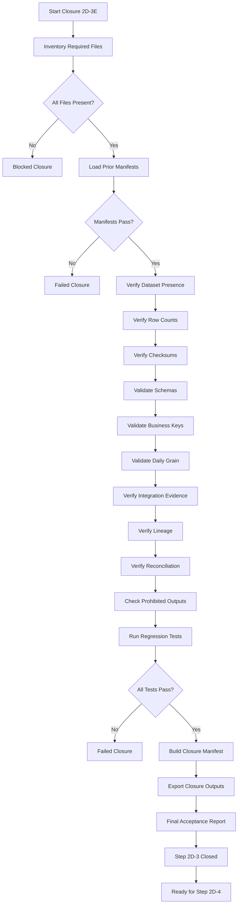

# Step 2D-3E Closure Specification

## 1. Purpose

Formally close Step 2D-3 by performing cumulative regression testing and final acceptance verification across the complete patient-flow processing branch (Steps 2A through 2D-3D).

## 2. Scope

This step covers final assurance only. It does not transform operational data, calculate official KPI values, or create decision-intelligence outputs.

## 3. Steps Covered

- Step 2A — Synthetic data generation
- Step 2B — Export and profiling
- Step 2C — Data validation
- Step 2D-1 — Processing architecture
- Step 2D-2 — Workforce transformation
- Step 2D-3A — Patient encounter transformation
- Step 2D-3B — Queue, bed-capacity and service-schedule transformation
- Step 2D-3C — Daily patient-flow aggregation
- Step 2D-3D — Integration and reconciliation

## 4. Required Inputs

- All implementation files listed in `REQUIRED_CATEGORIES["Implementation"]`
- All test files listed in `REQUIRED_CATEGORIES["Test"]`
- All documentation files listed in `REQUIRED_CATEGORIES["Documentation"]`
- All processed datasets in `data/processed/`
- All prior manifests in `outputs/logs/`
- All integration control outputs in `outputs/logs/`

## 5. Closure Outputs

1. `outputs/logs/step_2d3_closure_manifest.json`
2. `outputs/logs/step_2d3_test_summary.csv`
3. `outputs/logs/step_2d3_file_inventory.csv`
4. `outputs/logs/step_2d3_dataset_acceptance_summary.csv`
5. `outputs/logs/step_2d3_schema_acceptance_summary.csv`
6. `outputs/logs/step_2d3_checksum_verification.csv`
7. `outputs/logs/step_2d3_acceptance_check_results.csv`
8. `outputs/logs/step_2d3_closure_issue_log.csv`
9. `outputs/logs/step_2d3_closure_audit_log.csv`

## 6. Closure Gate

Step 2D-3E may proceed only when:

1. All required implementation files exist.
2. All required test files exist.
3. All required processed datasets exist.
4. All required prior manifests exist.
5. Prior manifest statuses indicate successful completion.
6. The Step 2D-3D integration manifest status is Passed.
7. No prior manifest indicates a blocked or failed accepted run.
8. No required processed file is missing.

## 7. File Inventory

The closure validator inventories all required files across categories:
- Implementation
- Test
- Documentation
- Processed Dataset
- Manifest
- Report

Each file is checked for existence, size, and checksum where applicable.

## 8. Dataset Acceptance

For every accepted processed dataset, the closure validator verifies:
- Expected vs actual row count
- Primary key uniqueness
- Required columns present
- Schema status
- Checksum status
- Immutability status

## 9. Row-Count Verification

Expected row counts are derived from prior manifests:
- Workforce datasets: `workforce_processing_run_manifest.json`
- Patient encounters: `patient_encounter_processing_run_manifest.json`
- Queue/bed/service: `queue_capacity_schedule_processing_run_manifest.json`
- Patient flow daily: `patient_flow_daily_processing_run_manifest.json`
- Integration cross-check: `patient_flow_integration_manifest.json`

## 10. Schema Verification

Each processed dataset is validated against the `processed_schema_registry`. Missing required fields cause closure failure.

## 11. Checksum Verification

SHA-256 checksums of all processed datasets are compared against the checksums recorded in their respective prior manifests.

## 12. Business-Key Verification

Primary key uniqueness is verified for all processed datasets. Duplicate keys cause closure failure.

## 13. Daily-Grain Verification

For `processed_patient_flow_daily`, the combination of `hospital_id + department_id + reporting_date` must be unique.

For `processed_workforce_daily`, the combination of `hospital_id + department_id + staff_role_id + reporting_date` must be unique.

## 14. Integration-Evidence Verification

The accepted Step 2D-3D integration manifest is read and verified to confirm:
- All manifests passed
- All checksums passed
- All schemas passed
- All business keys passed
- Daily grain passed
- Reconciliation passed
- Lineage passed
- No prohibited fields

## 15. Lineage Acceptance

The lineage gap log and lineage summary are inspected to confirm:
- 0 lineage gaps
- 0 broken references
- 0 duplicate lineage

## 16. Reconciliation Acceptance

The cross-step reconciliation CSV is inspected to confirm all 22 reconciliation checks passed.

## 17. Prohibited-Output Checks

All processed datasets and closure outputs are scanned for prohibited analytical fields:
- kpi_value, kpi_status, trend, anomaly_score, risk_score
- forecast, scenario, financial_impact, recommendation
- management_decision, action_tracking, outcome_review

Approved preparation fields (counts, flags, lineage metadata) are not flagged.

## 18. Cumulative Regression Strategy

Ten test files are run individually, then as a cumulative suite:
1. test_demo_data_generator.py
2. test_demo_data_export.py
3. test_data_validation_engine.py
4. test_processing_architecture.py
5. test_workforce_transformation.py
6. test_patient_encounter_transformation.py
7. test_queue_capacity_schedule_transformation.py
8. test_patient_flow_daily_builder.py
9. test_patient_flow_integration.py
10. test_step_2d3_closure.py

## 19. Test-Failure Handling

If a test fails:
1. Report the exact test and error.
2. Determine root cause (regression, stale expectation, environment, timeout, encoding).
3. Fix only the smallest verified issue.
4. Rerun the failing test first, then the test file, then the cumulative suite.

## 20. Closure Status Rules

**Passed:**
- All mandatory checks pass.
- All tests pass.
- No blocking issues.

**Passed with Warnings:**
- All mandatory checks pass.
- Only non-blocking warnings remain.

**Failed:**
- One or more mandatory acceptance checks fail.
- One or more cumulative regression tests fail.

**Blocked:**
- Required manifest, dataset, implementation or test evidence is missing.

## 21. Reproducibility

The closure runner accepts `--project-root`, `--processed-dir`, `--log-dir`, and `--tests-dir` to support reproducible execution.

## 22. Known Limitations

- Closure validation relies on prior manifest evidence; it does not reprocess data.
- The cumulative regression suite may exceed 25 minutes in some environments.
- Workforce manifest checksums were reconciled during closure to match the accepted files in `data/processed`.

## 23. Formal Closure Criteria

Step 2D-3 is formally closed when:
1. All five permanent Step 2D-3E files exist.
2. All nine closure outputs exist.
3. All mandatory earlier files exist.
4. All prior manifests pass.
5. All accepted processed datasets exist with matching row counts and checksums.
6. All schemas pass.
7. All business keys and daily grain are unique.
8. Integration evidence remains Passed.
9. All 22 reconciliation checks remain accepted.
10. Lineage coverage is 100% with no gaps.
11. No prohibited fields exist.
12. All closure tests pass.
13. All individual regression test files pass.
14. Processed datasets remain unchanged.

## 24. Readiness for Step 2D-4

Step 2D-4 may proceed to transform patient complaints and patient survey data into validated preparation-level datasets.

Step 2D-4 must not yet calculate official Complaint Rate, Patient Satisfaction Score or KPI status.

## 25. Mermaid Closure Flow

---

**Note:** Step 2D-3E formally verifies and closes the patient-flow processing branch. It does not calculate official KPI values, KPI status, trends, anomalies, risks, forecasts, scenarios, financial impact or recommendations.
