# System Workflow — Sentinel360 Healthcare

## 1. Purpose of the Workflow Document

This document defines how hospital operational data moves through Sentinel360 from ingestion to executive action and later outcome review. It establishes the sequence of stages, the responsible component at each stage, the validation required and the hand-off between deterministic analytics, AI-assisted interpretation and human decision-making.

## 2. End-to-End Workflow Overview

The complete workflow is:

```
Raw hospital data or uploaded files
→ Upload registration
→ Schema validation
→ Data-quality validation
→ Data transformation
→ KPI calculation
→ Warning and anomaly detection
→ Cross-domain risk analysis
→ Risk prioritisation
→ Short-term forecasting
→ Scenario generation
→ Scenario simulation
→ Financial-impact calculation
→ Scenario ranking
→ AI-assisted management interpretation
→ Recommended action
→ Human review
→ Approve, modify or reject
→ Owner assignment and target timeline
→ Action implementation
→ Status tracking
→ Later-period outcome review
→ Executive summary
→ Downloadable report
```

## 3. Workflow-Stage Table

| Stage Number | Stage Name | Purpose | Input | Main Processing | Responsible Layer | Output | Stored Record | Human Review Required | Downstream Consumer |
|---|---|---|---|---|---|---|---|---|---|
| 1 | Upload registration | Record that data have been submitted | Raw file(s) | Register filename, source, timestamp, user | Application | Upload receipt | Upload log | No | Schema validation |
| 2 | Schema validation | Confirm file structure matches expectation | Uploaded file | Check file type, naming, required columns, data types | Python Analytics | Pass / Fail report | Validation record | No | Data-quality validation or rejection |
| 3 | Data-quality validation | Confirm completeness and plausibility | Schema-valid data | Check for missing values, duplicates, invalid dates, out-of-range values | Python Analytics | Quality score and issue list | Quality record | No | Data transformation or rejection |
| 4 | Data transformation | Prepare clean data for analytics | Quality-approved data | Standardise formats, map fields, aggregate where required | Python Analytics | Cleaned dataset | Processed data record | No | KPI calculation |
| 5 | KPI calculation | Compute headline operational indicators | Cleaned dataset | Dynamically calculate all six KPIs from raw fields | Python Analytics | Current KPI values | KPI record | No | Warning detection |
| 6 | Warning and anomaly detection | Identify threshold breaches and unusual patterns | Current and recent KPI values | Threshold classification, anomaly detection, deterioration streak identification | Python Analytics | Warning flags, anomaly labels, streak alerts | Detection record | No | Cross-domain risk analysis |
| 7 | Cross-domain risk analysis | Find connected signals across workforce, capacity and experience | Warning flags and KPI set | Correlate signals across domains; identify reinforcing or compounding patterns | Python Analytics | Connected-risk list | Risk record | No | Risk prioritisation |
| 8 | Risk prioritisation | Rank risks by severity and operational impact | Connected-risk list | Score or order risks using transparent rules | Python Analytics | Prioritised risk register | Prioritised risk record | No | Forecasting |
| 9 | Short-term forecasting | Project near-term operational trajectories | Historical KPI series and current state | Calculate 7-day forecast and indicative 30-day outlook with confidence information | Python Analytics | Forecast values and confidence bands | Forecast record | No | Scenario generation |
| 10 | Scenario generation | Define intervention options for comparison | Current operational state, forecast and risk register | Identify relevant intervention families; generate Baseline, Do Nothing, Single Intervention and Combined Intervention scenarios | Python Analytics | Scenario definitions | Scenario record | No | Scenario simulation |
| 11 | Scenario simulation | Estimate operational effects of each scenario | Scenario definitions and current state | Apply operational assumptions to project scenario outcomes | Python Analytics | Simulated operational outcomes | Simulation record | No | Financial-impact calculation |
| 12 | Financial-impact calculation | Estimate cost, avoided loss and net benefit | Simulated outcomes and financial assumptions | Calculate intervention cost, avoided loss, gross benefit and expected net benefit | Python Analytics | Financial estimates per scenario | Financial record | No | Scenario ranking |
| 13 | Scenario ranking | Order scenarios by evidence and feasibility | Financial and operational results for all scenarios | Compare risk, cost, impact, feasibility and implementation time | Python Analytics | Ranked scenario list | Ranking record | No | AI-assisted interpretation |
| 14 | AI-assisted management interpretation | Convert structured evidence into readable management narrative | Ranked scenarios, risk register, forecast and KPI status | Generate explanation of connected risks, forecast uncertainty, trade-offs and recommendation rationale | AI Interpretation | Structured narrative and recommendation brief | Interpretation record | No | Human review |
| 15 | Recommended action | Present the best-supported option for human decision | Structured narrative and ranking | Package evidence, narrative, estimated impact and suggested action into a recommendation | AI Interpretation | Formal recommendation | Recommendation record | Yes | Human decision |
| 16 | Human review | Authorised user evaluates the recommendation | Formal recommendation | Review evidence, narrative, assumptions and feasibility | Human Management | Reviewed recommendation | Review event | Yes | Approve, modify or reject |
| 17 | Approve, modify or reject | Record the human decision | Reviewed recommendation | Select final disposition, capture reason and any modification | Human Management | Decision record | Decision log | Yes | Action assignment |
| 18 | Owner assignment and target timeline | Establish accountability and schedule | Approved or modified action | Assign owner, target start and completion dates, expected cost and benefit | Human Management | Action plan | Action record | Yes | Implementation |
| 19 | Action implementation | Execute the approved intervention | Action plan | Carry out the operational change | Human Management | Implementation evidence | Implementation update | Yes | Status tracking |
| 20 | Status tracking | Monitor progress against plan | Implementation updates | Update status, flag delays, record blockers | Application / Human | Current status | Tracking record | No | Outcome review |
| 21 | Later-period outcome review | Compare post-action performance with pre-action baseline | New KPI values and pre-action baseline | Compare before-versus-after movement; assess association | Python Analytics / AI Interpretation | Outcome assessment | Outcome record | Yes | Executive summary |
| 22 | Executive summary | Summarise status, risks, decisions and outcomes for leadership | All records from current period | Compile key metrics, open actions, recent decisions and trends | AI Interpretation | Executive summary document | Summary record | No | Downloadable report |
| 23 | Downloadable report | Produce a reproducible management report | Executive summary and supporting evidence | Format summary, tables and charts into a downloadable file | Application | Report file | Report record | No | Archive / Distribution |

## 4. Stage-by-Stage Detail

### 4.1 Upload Registration
- **Input:** Raw file(s) selected by user.
- **Processing:** System records filename, source, timestamp and uploading user.
- **Output:** Upload receipt with unique upload identifier.
- **Responsible component:** Application layer.
- **Validation:** File is readable and non-empty.
- **Failure:** Reject with message if file is unreadable or empty.
- **Control:** Automatic.

### 4.2 Schema Validation
- **Input:** Uploaded file.
- **Processing:** Validate file type, naming convention, required columns and data types against the expected schema for the reporting period.
- **Output:** Pass/fail report with specific discrepancies.
- **Responsible component:** Python Analytics.
- **Validation:** All required columns present; data types compatible.
- **Failure:** Block progression; report discrepancies to user for correction.
- **Control:** Automatic.

### 4.3 Data-Quality Validation
- **Input:** Schema-valid data.
- **Processing:** Check for missing values, duplicates, invalid dates and out-of-range values.
- **Output:** Quality score and issue list.
- **Responsible component:** Python Analytics.
- **Validation:** Missingness within acceptable limits; no critical fields blank.
- **Failure:** Flag issues; allow user to proceed with warnings if non-critical, or block if critical.
- **Control:** Automatic with human override for warnings.

### 4.4 Data Transformation
- **Input:** Quality-approved data.
- **Processing:** Standardise formats, map fields, aggregate where required.
- **Output:** Cleaned dataset ready for analytics.
- **Responsible component:** Python Analytics.
- **Validation:** Transformed data retain referential integrity.
- **Failure:** Block and log error if transformation rule fails.
- **Control:** Automatic.

### 4.5 KPI Calculation
- **Input:** Cleaned dataset.
- **Processing:** Dynamically calculate Staffing Level, Staff Absenteeism Rate, Bed Occupancy Rate, Average Patient Waiting Time, Patient Complaint Rate and Patient Satisfaction Score.
- **Output:** Current KPI values for the reporting period.
- **Responsible component:** Python Analytics.
- **Validation:** KPIs are reproducible from the same inputs.
- **Failure:** Flag missing KPI and continue with available metrics where possible.
- **Control:** Automatic.

### 4.6 Warning and Anomaly Detection
- **Input:** Current and recent KPI values.
- **Processing:** Threshold classification, anomaly detection, deterioration streak identification.
- **Output:** Warning flags, anomaly labels and streak alerts.
- **Responsible component:** Python Analytics.
- **Validation:** Detection rules are traceable to configuration.
- **Failure:** Log low-confidence status if history is insufficient.
- **Control:** Automatic.

### 4.7 Cross-Domain Risk Analysis
- **Input:** Warning flags and full KPI set.
- **Processing:** Correlate signals across workforce, capacity and patient-experience domains.
- **Output:** Connected-risk list with supporting evidence.
- **Responsible component:** Python Analytics.
- **Validation:** Risk links are grounded in calculated correlations or rules.
- **Failure:** Report risks as isolated if cross-domain analysis is inconclusive.
- **Control:** Automatic.

### 4.8 Risk Prioritisation
- **Input:** Connected-risk list.
- **Processing:** Rank risks by severity and operational impact using transparent rules.
- **Output:** Prioritised risk register.
- **Responsible component:** Python Analytics.
- **Validation:** Ranking method is documented and configurable.
- **Failure:** Present unranked list with note if ranking cannot be computed.
- **Control:** Automatic.

### 4.9 Short-Term Forecasting
- **Input:** Historical KPI series and current state.
- **Processing:** Calculate 7-day forecast and indicative 30-day outlook with confidence information.
- **Output:** Forecast values and confidence bands.
- **Responsible component:** Python Analytics.
- **Validation:** Forecast method and history length are recorded.
- **Failure:** Label as "Not Available" or "Low Confidence" if history is insufficient.
- **Control:** Automatic.

### 4.10 Scenario Generation
- **Input:** Current state, forecast and risk register.
- **Processing:** Identify relevant intervention families; generate Baseline, Do Nothing, Single Intervention and Combined Intervention scenarios.
- **Output:** Scenario definitions.
- **Responsible component:** Python Analytics.
- **Validation:** Scenarios are drawn from the approved intervention catalogue.
- **Failure:** Generate Baseline and Do Nothing only if no interventions are applicable.
- **Control:** Automatic.

### 4.11 Scenario Simulation
- **Input:** Scenario definitions and current state.
- **Processing:** Apply operational assumptions to project scenario outcomes.
- **Output:** Simulated operational outcomes per scenario.
- **Responsible component:** Python Analytics.
- **Validation:** Assumptions are visible and configurable.
- **Failure:** Flag missing assumptions and exclude affected scenarios.
- **Control:** Automatic.

### 4.12 Financial-Impact Calculation
- **Input:** Simulated outcomes and financial assumptions.
- **Processing:** Calculate intervention cost, avoided loss, gross benefit and expected net benefit.
- **Output:** Financial estimates per scenario.
- **Responsible component:** Python Analytics.
- **Validation:** Calculations are reproducible from assumptions.
- **Failure:** Flag as "Incomplete" if assumptions are missing.
- **Control:** Automatic.

### 4.13 Scenario Ranking
- **Input:** Financial and operational results for all scenarios.
- **Processing:** Compare risk, cost, impact, feasibility and implementation time.
- **Output:** Ranked scenario list.
- **Responsible component:** Python Analytics.
- **Validation:** Ranking logic is deterministic and documented.
- **Failure:** Present unranked comparison if ranking logic fails.
- **Control:** Automatic.

### 4.14 AI-Assisted Management Interpretation
- **Input:** Ranked scenarios, risk register, forecast and KPI status.
- **Processing:** Generate explanation of connected risks, forecast uncertainty, trade-offs and recommendation rationale.
- **Output:** Structured narrative and recommendation brief.
- **Responsible component:** AI Interpretation (WorkBuddy).
- **Validation:** Narrative must reference calculated evidence, not invent values.
- **Failure:** Flag for manual review if narrative contradicts evidence.
- **Control:** Automatic generation with human review required before action.

### 4.15 Recommended Action
- **Input:** Structured narrative and ranking.
- **Processing:** Package evidence, narrative, estimated impact and suggested action.
- **Output:** Formal recommendation.
- **Responsible component:** AI Interpretation (WorkBuddy).
- **Validation:** Recommendation is traceable to scenario ranking and KPI status.
- **Failure:** Do not present recommendation if evidence is weak; flag for review.
- **Control:** Automatic generation; human approval required.

### 4.16 Human Review
- **Input:** Formal recommendation.
- **Processing:** Authorised user reviews evidence, narrative, assumptions and feasibility.
- **Output:** Reviewed recommendation with notes.
- **Responsible component:** Human Management.
- **Validation:** User has appropriate role for the recommendation type.
- **Failure:** Escalate to appropriate approver if user lacks authority.
- **Control:** Human-controlled.

### 4.17 Approve, Modify or Reject
- **Input:** Reviewed recommendation.
- **Processing:** Select final disposition, capture reason and any modification.
- **Output:** Decision record.
- **Responsible component:** Human Management.
- **Validation:** Decision type and reason are mandatory fields.
- **Failure:** Block submission if required fields are missing.
- **Control:** Human-controlled.

### 4.18 Owner Assignment and Target Timeline
- **Input:** Approved or modified action.
- **Processing:** Assign owner, target start and completion dates, expected cost and benefit.
- **Output:** Action plan.
- **Responsible component:** Human Management.
- **Validation:** Owner and target dates are provided.
- **Failure:** Block if owner is unassigned or dates are invalid.
- **Control:** Human-controlled.

### 4.19 Action Implementation
- **Input:** Action plan.
- **Processing:** Carry out the operational change outside Sentinel360.
- **Output:** Implementation evidence.
- **Responsible component:** Human Management.
- **Validation:** Evidence of completion is recorded where available.
- **Failure:** Flag delay or blocker in tracking system.
- **Control:** Human-controlled.

### 4.20 Status Tracking
- **Input:** Implementation updates.
- **Processing:** Update status, flag delays, record blockers.
- **Output:** Current status.
- **Responsible component:** Application / Human Management.
- **Validation:** Status transitions follow allowed workflow.
- **Failure:** Flag overdue actions for review.
- **Control:** Automatic updates with human input.

### 4.21 Later-Period Outcome Review
- **Input:** New KPI values and pre-action baseline.
- **Processing:** Compare before-versus-after movement; assess association.
- **Output:** Outcome assessment.
- **Responsible component:** Python Analytics / AI Interpretation.
- **Validation:** Comparison uses the same KPI definitions and calculation rules.
- **Failure:** Label as "Insufficient Data" if post-action period is too short.
- **Control:** Automatic with human review of conclusion.

### 4.22 Executive Summary
- **Input:** All records from current period.
- **Processing:** Compile key metrics, open actions, recent decisions and trends.
- **Output:** Executive summary document.
- **Responsible component:** AI Interpretation (WorkBuddy).
- **Validation:** All claims are traceable to calculated outputs.
- **Failure:** Flag missing data in summary rather than invent content.
- **Control:** Automatic generation.

### 4.23 Downloadable Report
- **Input:** Executive summary and supporting evidence.
- **Processing:** Format summary, tables and charts into a downloadable file.
- **Output:** Report file.
- **Responsible component:** Application layer.
- **Validation:** Report is reproducible from stored records.
- **Failure:** Log error if generation fails.
- **Control:** Automatic.

## 5. Data Ingestion Workflow

The initial prototype workflow is:

1. An authorised user selects the hospital and reporting period.
2. The user uploads required CSV or XLSX files.
3. The system registers the upload with a timestamp and user identifier.
4. The system validates file type, naming, schema and required columns.
5. The system previews the data for user confirmation.
6. The system reports completeness and quality issues.
7. Invalid files are rejected or marked for correction.
8. Validated data are moved into the processed-data layer for analytics.

Detailed file schemas, column names and field-level validation rules are pending formal definition in **Phase 1 Step 2**.

## 6. Analytics Workflow

### 6.1 KPI Calculation
The following KPIs will be calculated dynamically from cleaned operational data:

- **Staffing Level** — workforce availability relative to demand.
- **Staff Absenteeism Rate** — proportion of scheduled staff unavailable.
- **Bed Occupancy Rate** — proportion of available beds in use.
- **Average Patient Waiting Time** — mean wait from arrival to service.
- **Patient Complaint Rate** — complaints per relevant patient volume.
- **Patient Satisfaction Score** — aggregated satisfaction measure.

Exact formulas, numerators, denominators and aggregation rules are pending formal definition in **Phase 1 Step 2**.

### 6.2 Detection and Forecasting
After KPI calculation, the analytics workflow continues with:

- **Threshold classification** — comparing each KPI against configurable limits.
- **Anomaly detection** — identifying statistically unusual values.
- **Deterioration streak** — detecting sustained negative movement.
- **Cross-domain signal identification** — finding reinforcing patterns across KPIs.
- **Risk prioritisation** — ordering identified risks by operational impact.
- **7-day forecast** — short-term operational projection.
- **Indicative 30-day outlook** — medium-term projection, explicitly labelled as lower-confidence than the 7-day forecast.

Specific thresholds, anomaly methods, risk weights and forecast models are pending formal definition in **Phase 1 Step 2**.

## 7. Scenario and Financial Workflow

The scenario workflow follows this sequence:

```
Current operational state
→ Identify relevant intervention options
→ Generate comparison scenarios
→ Calculate operational effects
→ Calculate intervention cost
→ Estimate avoided loss and gross benefit
→ Calculate expected net benefit
→ Compare risks, cost, impact and feasibility
→ Rank scenarios
→ Recommend the best-supported option
```

### 7.1 Scenario States
Each scenario comparison includes:

- **Baseline** — projected trajectory if current conditions continue unchanged.
- **Do Nothing** — explicit projection of taking no action, used to isolate the value of intervention.
- **Single Intervention** — one selected intervention family applied.
- **Combined Intervention** — two or more intervention families applied together.

### 7.2 Intervention Families
The initial intervention catalogue includes:

- Temporary staffing support
- Extended clinic hours
- Patient redirection
- Elective admission rescheduling
- Temporary capacity restoration
- Peak-hour communication support
- No immediate intervention

### 7.3 Nature of Estimates
Scenario and financial results are management-planning estimates based on configurable assumptions. They are not guaranteed outcomes. Financial estimates are not audited accounting values. All assumptions must be visible and editable by authorised users.

## 8. Recommendation Workflow

The recommendation must be grounded in:

- Current KPI status and trends
- Persistence of deterioration
- Connected-risk evidence
- Forecast risk and confidence
- Scenario performance comparison
- Financial impact estimate
- Feasibility assessment
- Implementation time estimate
- Data confidence level

Python produces the structured recommendation evidence and scenario ranking. WorkBuddy may convert this structured evidence into management interpretation, recommendation explanation, executive narrative and action brief. WorkBuddy must not invent numbers, override Python results or silently change assumptions.

## 9. Human Decision Workflow

Authorised users may respond to a recommendation in the following ways:

- **Approve** — accept the recommendation as presented.
- **Modify** — accept with changes to scope, owner, timeline or expected cost.
- **Reject** — decline the recommendation with a recorded reason.
- **Request more evidence** — pause the decision pending additional analysis.
- **Defer** — postpone the decision to a later review.
- **Monitor only** — take no action and continue observation.

For every decision, the system records:

- Decision ID
- Recommendation ID
- Decision maker
- Decision date and time
- Original recommendation
- Approved or modified action
- Reason
- Owner
- Target start date
- Target completion date
- Expected cost
- Expected benefit
- Status

Final database fields and storage schema are pending formal definition in a later Phase 1 step.

## 10. Action-Tracking Workflow

Actions progress through the following statuses:

```
Recommended
→ Under Review
→ Approved
→ Modified
→ Rejected
→ Assigned
→ In Progress
→ Completed
→ Outcome Review
→ Closed
```

Rejected or modified recommendations require a recorded reason. Overdue actions are flagged for escalation. Status transitions are logged with timestamps and responsible user.

## 11. Outcome-Review Workflow

Later reporting periods are compared with the pre-action baseline to assess movement. Possible review outcomes are:

- **Improved** — post-action KPIs show favourable movement.
- **Partially Improved** — some metrics improved, others unchanged.
- **No Material Change** — metrics remained within a defined band.
- **Deteriorated** — metrics moved unfavourably.
- **Insufficient Data** — post-action period is too short or incomplete.
- **Action Not Implemented** — the approved action was not executed.

Outcome review identifies before-versus-after movement and association. It does not claim formal causal proof, because operational environments contain multiple confounding factors.

## 12. Exception-Handling Workflow

| Exception | System Response | Status |
|---|---|---|
| Required files missing | Block ingestion; notify user | Blocked |
| Schemas do not match | Reject file; report discrepancies | Blocked |
| Dates are invalid | Flag records; reject if critical | Incomplete |
| Duplicate records exist | Flag duplicates; offer deduplication | Manual Review Required |
| Data are incomplete | Report missingness; allow proceed with warning if non-critical | Incomplete |
| A KPI cannot be calculated | Flag missing KPI; continue with available metrics | Not Available |
| Forecast history is insufficient | Label forecast as Low Confidence or Not Available | Low Confidence |
| Scenario assumptions are missing | Exclude scenario; flag missing assumption | Incomplete |
| Financial assumptions are missing | Exclude financial estimate; flag missing assumption | Incomplete |
| Recommendation evidence is weak | Do not present recommendation; flag for review | Low Confidence |
| An action has no owner | Block assignment; require owner | Blocked |
| A decision is overdue | Escalate to next authority; flag in tracking | Manual Review Required |
| Outcome data are unavailable | Label review as Insufficient Data | Not Available |

## 13. Auditability and Traceability

Every important output must be traceable to:

- Source dataset (upload identifier and file reference)
- Reporting period (date range)
- Calculation rule (formula version)
- Configuration version (thresholds, weights, parameters)
- Model or method version (forecast model, anomaly method)
- Scenario assumptions (assumption set identifier)
- Financial assumptions (assumption set identifier)
- Recommendation record (recommendation identifier)
- Human decision record (decision identifier)
- Later outcome record (outcome review identifier)

## 14. Human-in-the-Loop Safeguards

Sentinel360 must not autonomously:

- Deploy staff
- Change schedules
- Reschedule admissions
- Redirect patients
- Approve expenditure
- Make clinical decisions
- Contact patients
- Execute operational interventions

Every consequential action requires a recorded human decision with an identified approver.

## 15. Workflow Success Criteria

- A valid upload produces calculated KPIs.
- Data-quality failures are visible and understandable.
- Risk outputs are traceable to KPI evidence.
- Forecasts include confidence information.
- Scenario results change when assumptions change.
- Financial outputs are reproducible from assumptions.
- Recommendation evidence is visible and reviewable.
- Human decisions are recorded with reason and approver.
- Actions can be tracked through to completion or closure.
- Later results can be reviewed against pre-action baselines.
- An executive report can be generated from stored records.

## 16. Workflow Diagram

```mermaid
flowchart LR
    subgraph Data_Layer["Data Layer"]
        A[Raw Hospital Data / Uploaded Files]
        B[Upload Registration]
        C[Schema Validation]
        D[Data Quality Validation]
        E[Data Transformation]
    end

    subgraph Python_Analytics["Python Analytics Layer"]
        F[KPI Calculation]
        G[Warning & Anomaly Detection]
        H[Cross-Domain Risk Analysis]
        I[Risk Prioritisation]
        J[Short-Term Forecasting]
        K[Scenario Generation]
        L[Scenario Simulation]
        M[Financial-Impact Calculation]
        N[Scenario Ranking]
    end

    subgraph WorkBuddy_Layer["WorkBuddy Interpretation Layer"]
        O[AI-Assisted Management Interpretation]
        P[Recommended Action]
    end

    subgraph Human_Decision["Human Decision Layer"]
        Q[Human Review]
        R[Approve / Modify / Reject]
        S[Owner Assignment & Timeline]
    end

    subgraph Action_Outcome["Action & Outcome Layer"]
        T[Action Implementation]
        U[Status Tracking]
        V[Later-Period Outcome Review]
    end

    subgraph Reporting_Layer["Reporting Layer"]
        W[Executive Summary]
        X[Downloadable Report]
    end

    A --> B --> C --> D --> E --> F --> G --> H --> I --> J --> K --> L --> M --> N --> O --> P --> Q --> R --> S --> T --> U --> V --> W --> X
```


