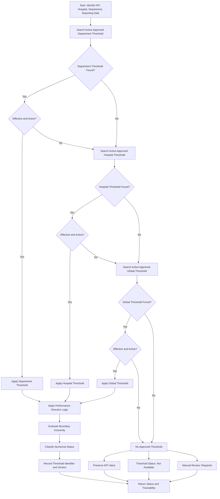

# Threshold Governance

## Purpose

This document defines the threshold and configuration-governance specification for Sentinel360 Healthcare. It establishes how KPI thresholds are scoped, approved, versioned, changed and audited. The goal is to ensure that every threshold used in status classification is traceable, reproducible and approved by the correct authority. No numerical threshold values are defined in this document.

---

## 2. Threshold Hierarchy

Sentinel360 supports a three-level threshold hierarchy with explicit precedence:

```
Department-specific threshold
→ Hospital-specific threshold
→ Global threshold
```

### Precedence Rules

1. If an active, approved department-specific threshold exists for the KPI, hospital, department and reporting date, it takes precedence.
2. If no department-specific threshold exists, use the active, approved hospital-specific threshold for the KPI, hospital and reporting date.
3. If no hospital-specific threshold exists, use the active, approved global threshold for the KPI and reporting date.
4. If no threshold exists at any level, the calculation proceeds but the threshold status is set to `Not Available` and manual review is required.

### Scope Definitions

| Level | Applies To | Override Authority |
|---|---|---|
| Global | All hospitals and departments | System administrator or data/analytics owner |
| Hospital-specific | One specific hospital | Hospital executive or designated approver |
| Department-specific | One specific department within one hospital | Department head or designated approver |

---

## 3. Threshold Scope

### Global Thresholds

- Provide default boundaries for all KPIs across all hospitals.
- Used when no hospital-specific or department-specific threshold exists.
- Must be approved before activation.
- Historical global thresholds are retained for reproducibility.

### Hospital-Specific Thresholds

- Override global thresholds for a specific hospital.
- Reflect hospital-specific operational context, patient mix or regulatory environment.
- Must be approved by the hospital executive or designated authority.
- Do not affect calculations for other hospitals.

### Department-Specific Thresholds

- Override both hospital-specific and global thresholds for a specific department.
- Reflect department-specific clinical or operational standards.
- Must be approved by the department head or designated authority.
- Do not affect calculations for other departments.

---

## 4. Performance-Direction Logic

Boundary logic must depend on the KPI's performance direction. A single universal comparison operator cannot apply to all KPIs.

### Lower Is Better

For KPIs where lower values indicate better performance (Staff Absenteeism Rate, Bed Occupancy Rate, Average Patient Waiting Time, Patient Complaint Rate):

- **Normal:** Value is at or below the approved acceptable boundary.
- **Warning:** Value is at or above the approved upper warning boundary.
- **Critical:** Value is at or above the approved upper critical boundary.

The warning boundary is positioned between the acceptable boundary and the critical boundary.

### Higher Is Better

For KPIs where higher values indicate better performance (Staffing Level, Patient Satisfaction Score):

- **Normal:** Value is at or above the approved acceptable boundary.
- **Warning:** Value is at or below the approved lower warning boundary.
- **Critical:** Value is at or below the approved lower critical boundary.

The warning boundary is positioned between the critical boundary and the acceptable boundary.

### Target Range

For KPIs where an approved target range defines acceptable performance (e.g., Bed Occupancy Rate if an approved range is later defined):

- **Normal:** Value is within the approved lower and upper acceptable boundaries.
- **Warning:** Value is at or below the lower warning boundary, or at or above the upper warning boundary.
- **Critical:** Value is at or below the lower critical boundary, or at or above the upper critical boundary.

Both lower and upper boundaries must be evaluated separately.

---

## 5. Boundary Inclusivity

For every threshold boundary, the exact comparison operator must be explicitly stored or unambiguously defined. Do not make an undocumented assumption.

### Required Operator Definitions

Each boundary configuration must specify:

| Operator | Meaning | Example |
|---|---|---|
| `>` | Greater than | Value > boundary |
| `>=` | Greater than or equal to | Value >= boundary |
| `<` | Less than | Value < boundary |
| `<=` | Less than or equal to | Value <= boundary |

### Application by Performance Direction

**Lower Is Better — Warning Boundary:**
- If operator is `>=`: values equal to the warning boundary trigger Warning.
- If operator is `>`: values must exceed the warning boundary to trigger Warning.

**Higher Is Better — Warning Boundary:**
- If operator is `<=`: values equal to the warning boundary trigger Warning.
- If operator is `<`: values must be below the warning boundary to trigger Warning.

**Target Range — Lower Warning Boundary:**
- If operator is `<=`: values equal to the lower warning boundary trigger Warning.
- If operator is `<`: values must be below the lower warning boundary to trigger Warning.

**Target Range — Upper Warning Boundary:**
- If operator is `>=`: values equal to the upper warning boundary trigger Warning.
- If operator is `>`: values must exceed the upper warning boundary to trigger Warning.

The exact inclusivity setting for each KPI, each boundary and each scope level must be stored in `kpi_threshold_config`.

---

## 6. Effective Dating

Every threshold record must be effective-dated to ensure that historical calculations reference the correct threshold version.

### Required Fields

| Field | Purpose |
|---|---|
| `effective_date` | Date from which this threshold record becomes eligible for use. |
| `expiry_date` | Optional date after which this threshold record is no longer eligible. Null means no expiry. |
| `is_active` | Boolean indicating whether the record is active. |
| `approval_status` | Status in the configuration lifecycle (Draft, Under Review, Approved, Effective, Retired). |

### Effective-Dating Rules

1. A threshold record is eligible for use only when:
   - `is_active = true`
   - `approval_status = Approved` or `Effective`
   - The reporting date is on or after `effective_date`
   - The reporting date is on or before `expiry_date` (if `expiry_date` is not null)

2. If multiple eligible records exist at the same specificity level, the most recent `effective_date` takes precedence.

3. Do not silently apply new thresholds to historical results.

4. Historical calculations must continue to reference the threshold version used at the time of calculation.

---

## 7. Versioning

All threshold versions must be retained. Do not overwrite history.

### Versioning Principles

1. Every threshold record has a unique version identifier.
2. When a threshold is modified, a new version is created; the old version remains.
3. Historical KPI observations reference the specific threshold version used in their calculation.
4. The threshold version is stored in the KPI output for full traceability.

### Version Metadata

| Field | Purpose |
|---|---|
| `threshold_version_id` | Unique identifier for this threshold version. |
| `previous_version_id` | Reference to the prior version (null for first version). |
| `created_datetime` | When this version was created. |
| `created_by` | User or system that created this version. |
| `approval_datetime` | When this version was approved. |
| `approved_by` | User or role that approved this version. |

---

## 8. Approval Roles

The following governance structure is proposed for the prototype. Final authority must remain configurable.

| Role | Scope | Authority |
|---|---|---|
| COO or Authorised Executive | Operational thresholds (Bed Occupancy, Waiting Time) | Business approval |
| Medical Director | Patient-safety-related operational thresholds | Business approval |
| Nursing Director | Staffing-related thresholds (Staffing Level, Absenteeism) | Business approval |
| Patient Experience Lead | Complaint and satisfaction thresholds | Business approval |
| Data or Analytics Owner | Technical validation, configuration integrity | Technical validation only; not sole business approval |

### Approval Principles

1. Business thresholds require business authority approval.
2. Technical validation ensures the threshold is numerically valid and consistent.
3. No single role may approve all thresholds without oversight.
4. Approval roles are configurable and may be adapted to hospital governance structures.

---

## 9. Change-Control Process

Any change to an approved threshold must follow the documented change-control process.

### Required Change Elements

For every threshold modification, the following must be recorded:

| Element | Description |
|---|---|
| Old value | The previous threshold value or version. |
| New value | The updated threshold value. |
| Effective date | When the new value becomes active. |
| Reason | Business or operational justification for the change. |
| User or approver | The individual who requested or approved the change. |
| Timestamp | Date and time of the change record. |
| Configuration version | The new version identifier assigned. |

### Change Workflow

1. **Request:** A user proposes a threshold change with justification.
2. **Technical review:** Data/analytics owner validates numerical consistency.
3. **Business approval:** Appropriate authority approves or rejects the change.
4. **Effective dating:** The approved change is assigned an `effective_date`.
5. **Versioning:** A new threshold version is created.
6. **Notification:** Relevant stakeholders are informed of the change.
7. **Audit:** The change is recorded in the audit log.

---

## 10. Audit Record

Every threshold-related action must be recorded in an audit trail.

### Audit Trail Requirements

| Action | Required Audit Fields |
|---|---|
| Threshold created | version_id, kpi_code, scope, values, effective_date, created_by, created_datetime |
| Threshold approved | version_id, approved_by, approval_datetime, approval_reason |
| Threshold modified | version_id, old_value, new_value, effective_date, reason, user, timestamp |
| Threshold retired | version_id, retired_by, retired_datetime, retirement_reason |
| Threshold applied | version_id, kpi_observation_id, calculation_datetime |

---

## 11. Historical Reproducibility

Historical KPI calculations must be reproducible using the same inputs and configuration.

### Reproducibility Requirements

1. Every KPI observation records the exact threshold version used.
2. Every KPI observation records the source upload identifier.
3. Every KPI observation records the processing run identifier.
4. Every KPI observation records the calculation version.
5. If a threshold is later modified, historical observations must not change.
6. To recalculate historical results with new thresholds, a new processing run must be initiated.

---

## 12. Missing-Threshold Handling

If an approved threshold is unavailable for a KPI at the required level:

1. Calculate the KPI value if the underlying data are valid and eligible.
2. Set the threshold status to `Not Available`.
3. Set the threshold configuration indicator to `Not Set`.
4. Mark `Manual Review Required`.
5. Do not assign `Normal`, `Watch`, `Warning` or `Critical`.

This ensures that:
- A valid KPI value is still available for manual review.
- The absence of a threshold is clearly disclosed.
- No default or invented threshold is silently applied.

---

## 13. Prototype Administration Page Requirements

The prototype may include a restricted configuration administration page with the following requirements:

### Access Control

- Restricted to authorised users only.
- Role-based access aligned with approval roles.
- Audit log of all page access.

### Functionality

- View current active thresholds by KPI, hospital and department.
- View threshold version history.
- Propose new threshold values with justification.
- View pending approval requests.
- View audit trail of threshold changes.

### Restrictions

- Direct editing of active thresholds without approval workflow is prohibited.
- No threshold value may be changed without recording old value, new value, reason, user and timestamp.
- Historical observations must not be overwritten.

---

## 14. Stakeholder-Validation Requirements

The following threshold-governance items require stakeholder validation:

| Item | Stakeholder | Validation Required |
|---|---|---|
| Approval role assignments | Hospital Executive | Confirm or modify the proposed governance structure and approval roles |
| Department-specific threshold authority | Department Heads | Confirm who may approve department-level thresholds |
| Emergency threshold override | Hospital Executive | Define if and when emergency threshold override is permitted |

---

## 15. Configuration Approval Lifecycle

Threshold configurations must pass through an approval lifecycle before becoming effective.

### Lifecycle States

```
Draft
→ Under Review
→ Approved
→ Effective
→ Retired
```

### State Definitions

| State | Meaning |
|---|---|
| **Draft** | The threshold record has been created but is not yet ready for review. |
| **Under Review** | The threshold record is under technical and business review. |
| **Approved** | The threshold record has been approved by the required authority. |
| **Effective** | The threshold record is active and eligible for use (on or after `effective_date`). |
| **Retired** | The threshold record is no longer active. Historical calculations referencing this version remain valid. |

### Transition Rules

1. **Draft → Under Review:** Submitted by creator for review.
2. **Under Review → Approved:** Approved by required authority.
3. **Approved → Effective:** Reaches `effective_date` while `is_active = true`.
4. **Effective → Retired:** `expiry_date` reached, or explicitly retired by authority.
5. **Any → Rejected:** May be rejected during Under Review and returned to Draft.

Only records in `Effective` state may be used in KPI status classification.

---

## 16. Mermaid Threshold-Selection Flow



### Diagram Description

The threshold-selection flow follows the approved precedence hierarchy:

1. **Department search:** Look for an active, approved, effective department-specific threshold.
2. **Hospital search:** If no department threshold, look for an active, approved, effective hospital-specific threshold.
3. **Global search:** If no hospital threshold, look for an active, approved, effective global threshold.
4. **Missing threshold:** If no threshold exists at any level, preserve the KPI value but set threshold status to `Not Available` and require manual review.
5. **Performance-direction logic:** Apply the boundary logic appropriate to the KPI's performance direction (Lower Is Better, Higher Is Better, or Target Range).
6. **Boundary inclusivity:** Apply the explicitly stored comparison operator for each boundary.
7. **Classification:** Assign the numerical status (Normal, Watch, Warning, Critical).
8. **Traceability:** Record the threshold identifier, version and configuration version in the output.

---

## Document Control

| Property | Value |
|---|---|
| Document Version | 1.0 |
| Phase | Phase 1, Step 1G |
| Status | Approved Prototype Rules |
| Next Review | Phase 1, Step 1H or stakeholder validation completion |
