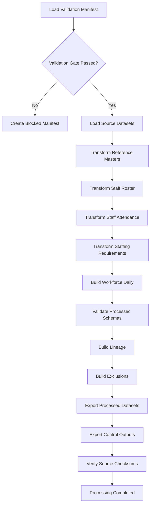

# Workforce Transformation Specification

## Step 2D-2 — Sentinel360 Healthcare

---

## 1. Purpose

This document specifies the validated source-to-processed transformation for the reference and workforce domains in Sentinel360 Healthcare.

The workforce processing layer prepares analytical components for later KPI calculation. It does **not** calculate:

- Staffing Level percentage
- Staff Absenteeism Rate percentage
- KPI status (Normal, Watch, Warning, Critical)
- Risk scores
- Forecast values
- Scenario outputs
- Financial impact
- Recommendations

---

## 2. Scope

### In Scope

- hospital_master
- department_master
- staff_role_master
- staff_master
- staff_roster
- staff_attendance
- staffing_requirement

### Out of Scope

- patient_encounters
- patient_queue_records
- bed_capacity_records
- service_schedule
- patient_complaints
- patient_surveys

---

## 3. Input Datasets

All inputs are validated demo datasets located in `data/demo/`.

| Dataset | Source File | Grain |
|---------|-------------|-------|
| Hospital Master | hospital_master.csv | One row per hospital |
| Department Master | department_master.csv | One row per department |
| Staff Role Master | staff_role_master.csv | One row per role |
| Staff Master | staff_master.csv | One row per staff member |
| Staff Roster | staff_roster.csv | One row per roster assignment |
| Staff Attendance | staff_attendance.csv | One row per attendance record |
| Staffing Requirement | staffing_requirement.csv | One row per requirement |

---

## 4. Output Datasets

### Processed Datasets

| Dataset | Output File | Grain |
|---------|-------------|-------|
| processed_hospital_master | data/processed/processed_hospital_master.csv | One row per hospital |
| processed_department_master | data/processed/processed_department_master.csv | One row per department |
| processed_staff_role_master | data/processed/processed_staff_role_master.csv | One row per role |
| processed_staff_master | data/processed/processed_staff_master.csv | One row per staff member |
| processed_staff_roster | data/processed/processed_staff_roster.csv | One row per roster assignment |
| processed_staff_attendance | data/processed/processed_staff_attendance.csv | One row per attendance record |
| processed_staffing_requirement | data/processed/processed_staffing_requirement.csv | One row per requirement |
| processed_workforce_daily | data/processed/processed_workforce_daily.csv | One row per hospital + department + role + date |

### Control Outputs

| Output | File |
|--------|------|
| Run Manifest | outputs/logs/workforce_processing_run_manifest.json |
| Dataset Summary | outputs/logs/workforce_processing_dataset_summary.csv |
| Issue Log | outputs/logs/workforce_processing_issue_log.csv |
| Lineage Log | outputs/logs/workforce_processing_lineage.csv |
| Exclusion Register | outputs/logs/workforce_processing_exclusion_register.csv |
| Audit Log | outputs/logs/workforce_processing_audit_log.csv |

---

## 5. Validation Gate

Before transformation, the runner reads:

- `outputs/logs/validation_run_manifest.json`
- `outputs/logs/dataset_validation_summary.csv`
- `outputs/logs/manual_override_register.csv`

Processing is allowed only when:

- validation `run_status` is "Passed" or "Passed with Warnings"
- `processing_allowed_flag` is true
- all required workforce datasets are "Valid" or valid under an approved override

If processing is blocked, a blocked manifest is created and no processed datasets are exported.

---

## 6. Reference Transformations

### Hospital Master

- Preserve `hospital_id`
- Standardise `hospital_name` and `hospital_type`
- Derive `active_flag` from source status
- Parse `effective_start_date` and `effective_end_date`
- Preserve `source_system` and `source_record_version`

Rule IDs: TR_REF_STANDARDISE_TEXT, TR_REF_STANDARDISE_DATE, TR_REF_EFFECTIVE_DATING, TR_REF_ACTIVE_FLAG, TR_CTRL_LINEAGE

### Department Master

- Preserve `department_id`, `hospital_id`
- Standardise `department_name` and `department_type`
- Preserve `parent_department_id`
- Derive `bed_based_flag`, `queue_based_flag`, `patient_experience_flag`
- Derive `active_flag`
- Parse effective dates

### Staff Role Master

- Preserve `staff_role_id`
- Standardise `staff_role_name`
- Preserve `staff_category`
- Preserve `clinical_role_flag` and `patient_facing_flag`
- Derive `active_flag`
- Parse effective dates

### Staff Master

- Preserve `staff_id`, `hospital_id`, `home_department_id`, `staff_role_id`
- Derive `staff_category` from `staff_role_master` when approved
- Preserve `employment_type` and `fte_value`
- Parse `employment_start_date` and `employment_end_date`
- Derive `active_flag`

If source and role-derived categories conflict, keep the source value and log a Warning.

---

## 7. Roster Transformation

- Preserve `roster_record_id`, `staff_id`, `hospital_id`, `department_id`, `staff_role_id`
- Parse `roster_date`
- Set `reporting_date` = `roster_date`
- Set `reporting_month` = YYYY-MM
- Preserve `shift_code`
- Build `planned_start_datetime` and `planned_end_datetime`
- Calculate `planned_hours`
- Preserve `assignment_status`
- Derive `cancelled_flag` and `valid_assignment_flag`

Rule IDs: TR_WF_ROSTER_DATETIME, TR_WF_OVERNIGHT_SHIFT, TR_WF_DEPARTMENT_ATTRIBUTION, TR_WF_REASSIGNMENT

---

## 8. Overnight Shift Handling

If a shift crosses midnight (e.g., Night shift 22:00-06:00), `planned_end_datetime` is set to the following calendar day.

`planned_hours` is calculated using full datetime arithmetic and is always non-negative.

---

## 9. Attendance Transformation

- Preserve `attendance_record_id`, `roster_record_id`, `staff_id`, `hospital_id`
- Derive `actual_department_id` from source or home department
- Parse `attendance_date`
- Set `reporting_date` and `reporting_month`
- Map `attendance_status` from configuration
- Map `absence_category` from configuration
- Match `scheduled_hours` from roster
- Preserve or calculate `actual_hours_worked`
- Calculate `lost_scheduled_hours`
- Calculate `availability_contribution`
- Derive `absenteeism_eligible_flag` and `absenteeism_hours`
- Derive `planned_absence_flag`
- Preserve `replacement_staff_id`
- Derive `reassigned_flag`
- Derive `missing_attendance_flag`, `unknown_attendance_flag`, `valid_attendance_flag`

Rule IDs: TR_WF_ATTENDANCE_MAPPING, TR_WF_ABSENCE_MAPPING, TR_WF_DEPARTMENT_ATTRIBUTION

---

## 10. Attendance Status Mapping

Source: `config/attendance_status_mapping.csv`

The mapping determines:

- `staffing_availability_treatment` — how the status affects availability
- `absenteeism_treatment` — whether the status counts as absent
- `missing_record_flag` — whether the status indicates a missing record

If a source status has no approved mapping:

- `processing_status` = "Pending Review"
- `valid_attendance_flag` = false
- Log a Warning

---

## 11. Absence Category Mapping

Source: `config/absence_category_mapping.csv`

The mapping determines:

- `operational_absenteeism_flag`
- `planned_absence_flag`
- `staffing_unavailable_flag`

If the source has no `absence_category` column, categories are derived from attendance status where applicable (e.g., "Leave" -> "Annual Leave", "Training" -> "Training").

---

## 12. Missing and Unknown Attendance

**Critical business rule:**

- Missing attendance is **not** Present
- Missing attendance is **not** Absent
- Missing attendance remains **Unknown** until verified
- Do not impute missing attendance

Missing attendance is detected via:

- Blank source status
- Source status marked with `missing_record_flag = true` in mapping

---

## 13. Planned Leave Treatment

Planned leave (e.g., Annual Leave) is kept separate from operational absenteeism.

- `planned_absence_flag` = true
- `absenteeism_eligible_flag` = false
- `absenteeism_hours` = 0

---

## 14. Partial Attendance Treatment

Partial attendance (e.g., Partial status) has:

- `availability_contribution` = actual hours worked (positive)
- `absenteeism_eligible_flag` = true (if unplanned)
- `lost_scheduled_hours` = scheduled - actual (non-negative)

---

## 15. Availability Preparation

`availability_contribution` is a preparation value, not the Staffing Level KPI.

It represents:

- Full availability — actual hours worked
- Partial availability — actual hours worked
- Zero availability — 0.0
- Unknown or excluded — null

If the configured value is blank, leave `availability_contribution` null and mark the record "Pending Review".

---

## 16. Absenteeism Hours Preparation

`absenteeism_hours` is derived from:

- `scheduled_hours`
- `attendance_status`
- `absence_category` mapping
- `absenteeism_eligible_flag`

Planned leave is **not** counted as operational absenteeism.
Unknown attendance is **not** counted as absent.

---

## 17. Department Attribution

For attendance preparation:

- Use `actual_department_id` when the staff member was validly reassigned
- Otherwise use the home department
- Preserve `home_department_id` separately
- Log invalid reassignment references

---

## 18. Reassignment Treatment

If `actual_department_id` differs from `home_department_id`:

- `reassigned_flag` = true
- Use `actual_department_id` for workforce daily aggregation
- Log invalid reassignment references

---

## 19. Replacement Staff Treatment

If `replacement_staff_id` is populated:

- Confirm the staff ID exists in `processed_staff_master`
- Preserve the reference
- Do not duplicate the replacement staff's hours automatically
- Log an issue if no corresponding assignment evidence exists

---

## 20. Staffing Requirement Transformation

- Preserve `staffing_requirement_id`, `hospital_id`, `department_id`, `staff_role_id`
- Parse `requirement_date`
- Set `reporting_date` and `reporting_month`
- Preserve `shift_code`, `required_staff_count`, `required_staff_hours`
- Preserve `requirement_status`
- Derive `valid_requirement_flag`

Do not calculate Staffing Level percentage.
Do not replace blank required hours with zero.

---

## 21. Workforce Daily Grain

One row per:

- `hospital_id`
- `department_id`
- `staff_role_id`
- `reporting_date`

---

## 22. Workforce Daily Aggregation

| Field | Aggregation Rule |
|-------|-----------------|
| `rostered_staff_count` | Distinct valid staff assignments (exclude cancelled) |
| `rostered_hours` | Sum of valid `planned_hours` |
| `required_staff_count` | Sum of valid `required_staff_count` |
| `required_staff_hours` | Sum of valid `required_staff_hours` (preserve null) |
| `verified_available_staff_count` | Distinct staff with positive `availability_contribution` |
| `verified_available_hours` | Sum of `availability_contribution` |
| `absent_event_count` | Count of operational absence records |
| `absent_hours` | Sum of `absenteeism_hours` |
| `planned_leave_event_count` | Count of planned leave records |
| `planned_leave_hours` | Sum of `lost_scheduled_hours` for planned leave |
| `partial_attendance_event_count` | Count of partial attendance records |
| `late_attendance_event_count` | Count of late attendance records |
| `reassigned_in_count` | Count of reassigned-in records |
| `reassigned_out_count` | Count of reassigned-out records |
| `replacement_staff_count` | Distinct valid replacement references |
| `missing_attendance_count` | Count of missing attendance records |
| `unknown_attendance_count` | Count of unknown attendance records |
| `eligible_record_count` | Records eligible for future KPI calculation |
| `excluded_record_count` | Records excluded from analytical preparation |
| `data_completeness_count` | Auditable count of eligible + excluded |

---

## 23. Lineage

Every processed record has at least one lineage row.

Aggregate workforce daily rows may have multiple lineage rows.

Lineage includes:

- `processing_run_id`
- `source_dataset_name`
- `source_primary_key_value`
- `processed_dataset_name`
- `processed_primary_key_value`
- `transformation_rule_id`

---

## 24. Exclusions

Possible exclusions:

- Source record failed validation
- Invalid mandatory relationship
- Missing mandatory processed field
- Unsupported source status
- Unresolved mapping required for analytical eligibility
- Invalid roster duration
- Invalid attendance duration
- Invalid reassignment
- Duplicate assignment

Every excluded record is recorded in the exclusion register.

---

## 25. Issues and Warnings

Severity levels:

- Information
- Warning
- Error
- Critical

Issue types:

- Unmapped Status
- Missing Configuration
- Source-to-Reference Mismatch
- Invalid Roster Duration
- Invalid Attendance Duration
- Missing Roster Match
- Invalid Reassignment
- Invalid Replacement Reference
- Conflicting Staff Category
- Missing Required Preparation Value
- Processed Schema Failure
- Other

---

## 26. Reproducibility

- Deterministic processing run IDs
- Deterministic workforce daily IDs (SHA-256 hash of grain)
- Source checksums verified before and after processing
- Transformation version tracked
- Configuration version tracked

---

## 27. Testing

Tests are in `tests/test_workforce_transformation.py`.

Coverage includes:

- Module import safety
- Validation gate acceptance/rejection
- Schema validation for all 8 processed datasets
- Source file integrity
- Processed file creation
- ID preservation
- Date and boolean correctness
- Overnight shift handling
- Attendance status mapping
- Absence category mapping
- Missing/Unknown attendance rules
- Partial attendance behavior
- Planned leave separation
- Hours calculations
- Replacement staff validation
- Reassignment detection
- Workforce daily grain uniqueness
- Deterministic ID generation
- Prohibited field absence
- Control output generation
- Source checksum consistency
- No personal identifiers

---

## 28. Known Limitations

- Workforce daily aggregation does not calculate KPI percentages
- Some source datasets lack `absence_category`; derivation from status is approximate
- `replacement_staff_id` is null in demo data; replacement logic is validated structurally
- Effective dates with unparseable values result in nulls (logged as schema warnings)

---

## 29. Readiness for Step 2D-3

Step 2D-2 prepares the following for Step 2D-3:

- Validated processed workforce datasets
- Daily workforce preparation totals
- Attendance and absence classification
- Department attribution
- Reassignment and replacement tracking
- Lineage and exclusion registers

Step 2D-3 may proceed to calculate:

- Staffing Level percentage
- Staff Absenteeism Rate percentage
- KPI status classification

---

## 30. Mermaid Workforce Processing Flow

